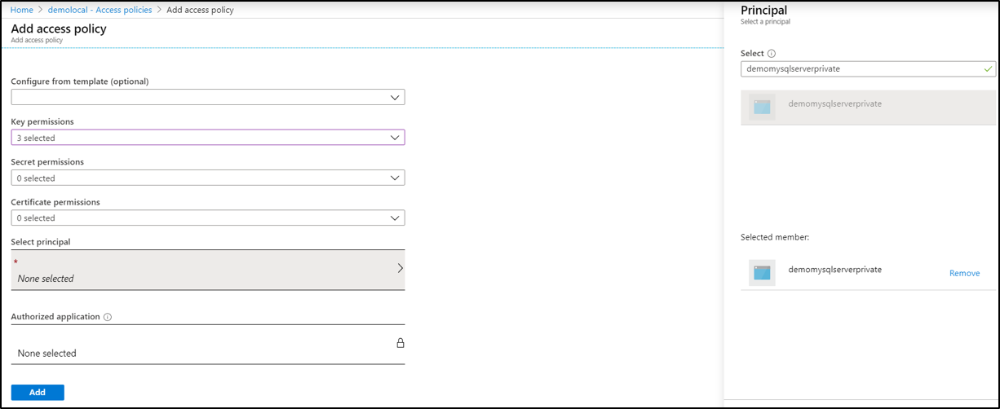

# Data Encryption for Azure Database for PostgreSQL Single server using Portal

In this article, you will learn how to setup and manage use the Azure portal to setup Data encryption for your Azure Database for PostgreSQL Single server.

## Prerequisites for PowerShell

* You must have an Azure subscription and be an administrator on that subscription.
* You must have Azure PowerShell installed and running.
* Create an Azure Key Vault and Key to use for customer managed key.
    * Instruction for using a hardware security model (HSM) and Key Vault 
* The Key vault must have the following property to used as a customers managed key
    * [Soft Delete](https://docs.microsoft.com/en-us/azure/key-vault/key-vault-ovw-soft-delete)

        ```azurecli-interactive
            az resource update --id $(az keyvault show --name \ <key_valut_name> -test -o tsv | awk '{print $1}') --set \ properties.enableSoftDelete=true
        ```
    
    * [Purge protected](https://docs.microsoft.com/en-us/azure/key-vault/key-vault-ovw-soft-delete#purge-protection)

        ```azurecli-interactive
        az keyvault update --name <key_valut_name> --resource-group <resource_group_name>  --enable-purge-protection true
        ```
* The key must have the following attributes to be used for customer managed key.
    * No expiration date
    * Not disabled
    * Able to perform get, wrap key, unwrap key operations

## Setting the right permissions for key operations

1. On the Azure Key Vault, select the **Access Policies** and, **Add Access Policy** 


2. Select the **Key Permissions** (**Get**, **Wrap**, **Unwrap**) and the **Pincipal** which is the name of the PostgreSQL server.



3. **Save** the settings.

## Setting Data encryption for Azure Database for PostgreSQL Single server

1. On the **Azure Database for PostgreSQL**, select the **Data Encryption** to set the customer managed key setup.


2. You can either select a **Key Vault** and **Key** pair or pass a **Key identifier**.


3. **Save** the settings.