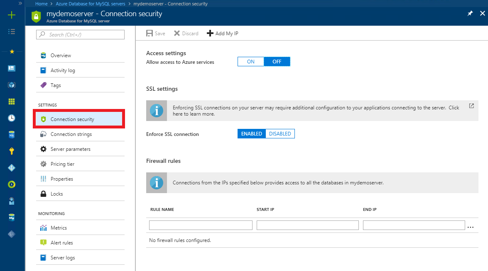
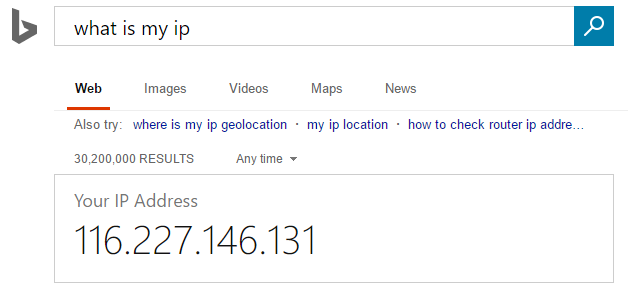
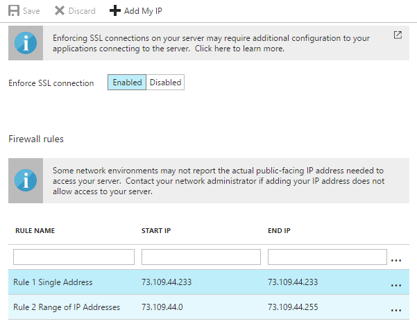

# Create and manage Azure Database for MySQL firewall rules using the Azure portal
Server-level firewall rules enable administrators to access an Azure Database for MySQL Server from a specified IP address or range of IP addresses. 

## Create a server-level firewall rule in the Azure portal

1. On the MySQL server blade, under Settings heading, click **Connection Security** to open the Connection Security blade for the Azure Database for MySQL.

   

2. Click **Add My IP** on the toolbar to create a rule with the IP address of your computer, as perceived by the Azure system.

   

3. Verify your IP address before saving the configuration. In some situations, the IP address observed by Azure portal differs from the IP address used when accessing the internet and Azure servers. Therefore, you may need to change the Start IP and End IP to make the rule function as expected.

   Use a search engine or other online tool to check your own IP address (for example, search "what is my IP address").

   

4. Add additional address ranges. In the rules for the Azure Database for MySQL firewall, you can specify a single IP address, or a range of addresses. If you want to limit the rule to one single IP address, type the same address in the field for Start IP and End IP. Opening the firewall enables administrators and users to access any database on the MySQL server to which they have valid credentials.

   

5. Click **Save** on the toolbar to save this server-level firewall rule. Wait for the confirmation that the update to the firewall rules was successful.

   

## Manage existing server-level firewall rules through the Azure portal
Repeat the steps to manage the firewall rules.
* To add the current computer, click **+ Add My IP**.
* To add additional IP addresses, type in the **RULE NAME**, **START IP**, and **END IP**.
* To modify an existing rule, click any of the fields in the rule and modify.
* To delete an existing rule, click the ellipsis […] and click **Delete**.
* Click **Save** to save the changes.

## Next steps
- For help in connecting to an Azure Database for MySQL server, see [Connection libraries for Azure Database for MySQL](./concepts-connection-libraries.md)
