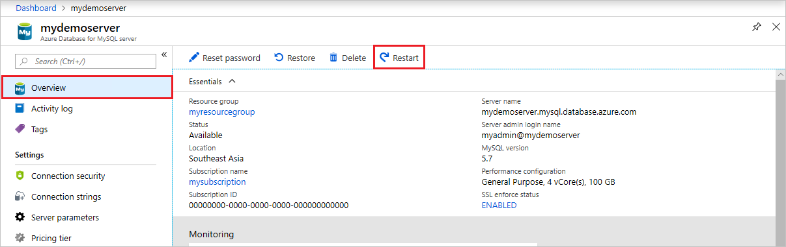
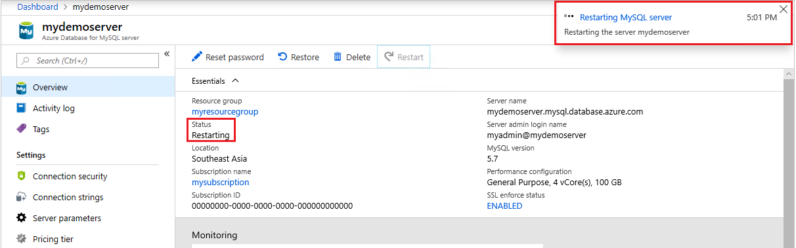

# Restart Azure Database for MySQL server using Azure portal
This topic describes how you can restart an Azure Database for MySQL server. You may need to restart your server for maintenance reasons, which causes a short outage as the server performs the operation.

The server restart will be blocked if the service is busy. For example, the service may be processing a previously requested operation such as scaling vCores.

The time required to complete a restart depends on the MySQL recovery process. To decrease the restart time, we recommend you minimize the amount of activity occurring on the server prior to the restart.

## Prerequisites
To complete this how-to guide, you need:
- An [Azure Database for MySQL server](quickstart-create-mysql-server-database-using-azure-portal.md)

## Perform server restart

The following steps restart the MySQL server:

1. In the Azure portal, select your Azure Database for MySQL server.

2. In the toolbar of the server's **Overview** page, click **Restart**.

   

3. Click **Yes** to confirm restarting the server.

   

4. Observe that the server status changes to "Restarting".

   

5. Confirm server restart is successful.

   

## Next steps

[Quickstart: Create Azure Database for MySQL server using Azure portal](./quickstart-create-mysql-server-database-using-azure-portal.md)
