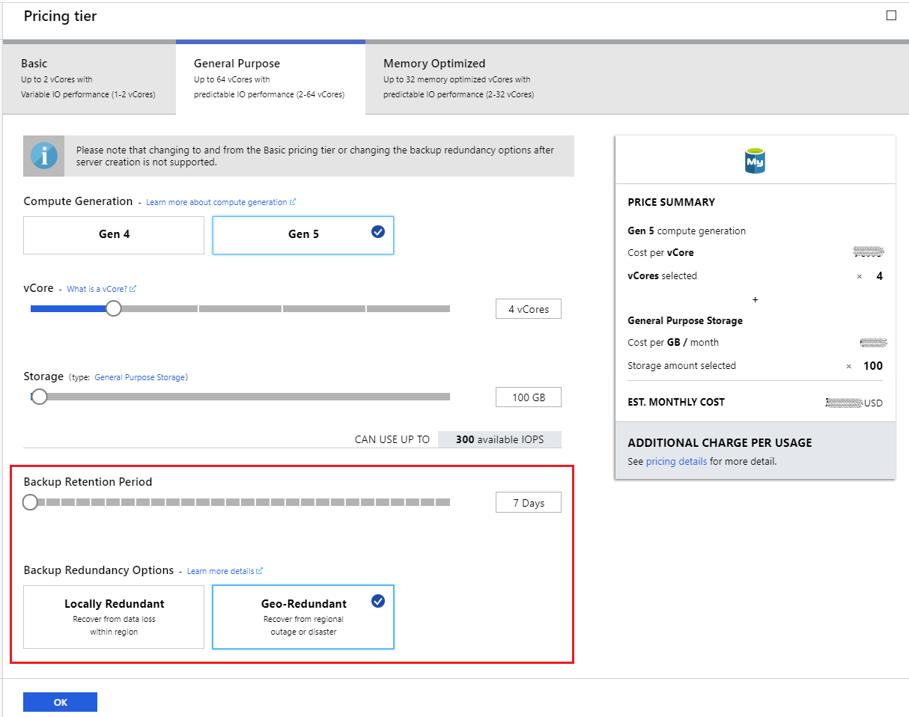
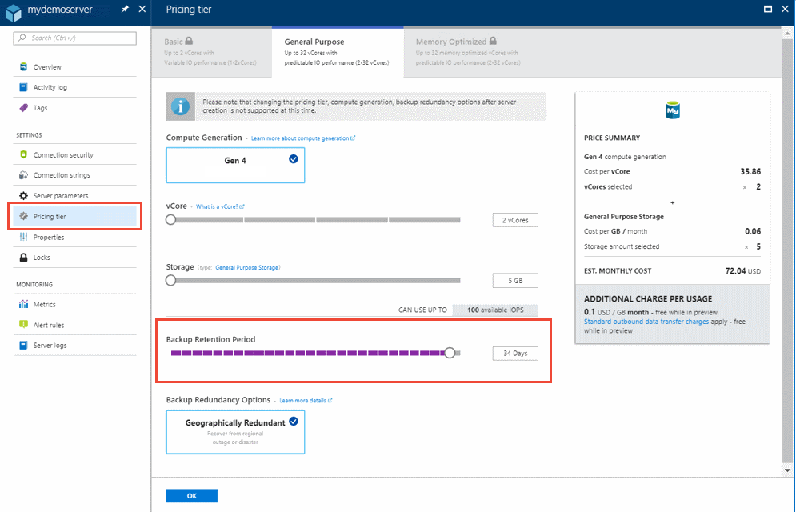
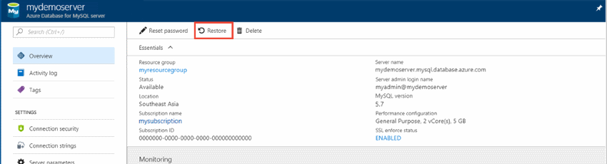
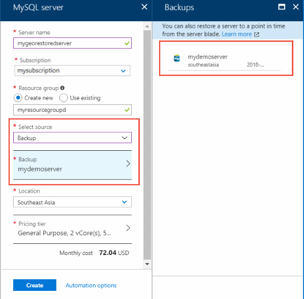

# How to backup and restore a server in Azure Database for MySQL using the Azure portal

## Backup happens automatically
Azure Database for MySQL servers are backed up periodically to enable Restore features. Using this feature you may restore the server and all its databases to an earlier point-in-time, on a new server.

## Prerequisites
To complete this how-to guide, you need:
- An [Azure Database for MySQL server and database](quickstart-create-mysql-server-database-using-azure-portal.md)

## Set backup configuration

You make the choice between configuring your server for either locally redundant backups or geographically redundant backups at server creation, in the **Pricing Tier** window.

> [!NOTE]
> After a server is created, the kind of redundancy it has, geographically redundant vs locally redundant, can't be switched.
>

While creating a server through the Azure portal, the **Pricing Tier** window is where you select either **Locally Redundant** or **Geographically Redundant** backups for your server. This window is also where you select the **Backup Retention Period** - how long (in number of days) you want the server backups stored for.

   

For more information about setting these values during create, see the [Azure Database for MySQL server quickstart](quickstart-create-mysql-server-database-using-azure-portal.md).

The backup retention period can be changed on a server through the following steps:
1. Sign into the [Azure portal](https://portal.azure.com/).
2. Select your Azure Database for MySQL server. This action opens the **Overview** page.
3. Select **Pricing Tier** from the menu, under **SETTINGS**. Using the slider you can change the **Backup Retention Period** to your preference between 7 and 35 days.
In the screenshot below it has been increased to 34 days.

4. Click **OK** to confirm the change.

The backup retention period governs how far back in time a point-in-time restore can be retrieved, since it's based on backups available. Point-in-time restore is described further in the following section. 

## Point-in-time restore
Azure Database for MySQL allows you to restore the server back to a point-in-time and into to a new copy of the server. You can use this new server to recover your data, or have your client applications point to this new server.

For example, if a table was accidentally dropped at noon today, you could restore to the time just before noon and retrieve the missing table and data from that new copy of the server. Point-in-time restore is at the server level, not at the database level.

The following steps restore the sample server to a point-in-time:
1. In the Azure portal, select your Azure Database for MySQL server. 

2. In the toolbar of the server's **Overview** page, select **Restore**.

   

3. Fill out the Restore form with the required information:

   
   - **Restore point**: Select the point-in-time you want to restore to.
   - **Target server**: Provide a name for the new server.
   - **Location**: You cannot select the region. By default it is same as the source server.
   - **Pricing tier**: You cannot change these parameters when doing a point-in-time restore. It is same as the source server. 

4. Click **OK** to restore the server to restore to a point-in-time. 

5. Once the restore finishes, locate the new server that is created to verify the data was restored as expected.

The new server created by point-in-time restore has the same server admin login name and password that was valid for the existing server at the point-in-time chose. You can change the password from the new server's **Overview** page.

The new server created during a restore does not have the VNet service endpoints that existed on the original server. These rules need to be set up separately for this new server. Firewall rules from the original server are restored.

## Geo restore
If you configured your server for geographically redundant backups, a new server can be created from the backup of that existing server. This new server can be created in any region that Azure Database for MySQL is available.  

1. Select the **Create a resource** button (+) in the upper-left corner of the portal. Select **Databases** > **Azure Database for MySQL**.

   

2. In the form's **Select Source** dropdown, choose **Backup**. This action loads a list of servers that have geo redundant backups enabled. Select one of these backups to be the source of your new server.
   

   > [!NOTE]
   > When a server is first created it may not be immediately available for geo restore. It may take a few hours for the necessary metadata to be populated.
   >

3. Fill out the rest of the form with your preferences. You can select any **Location**. After selecting the location, you can select **Pricing Tier**. By default the parameters for the existing server you are restoring from are displayed. You can click **OK** without making any changes to inherit those settings. Or you can change **Compute Generation** (if available in the region you have chosen), number of **vCores**, **Backup Retention Period**, and **Backup Redundancy Option**. Changing **Pricing Tier** (Basic, General Purpose, or Memory Optimized) or **Storage** size during restore is not supported.

The new server created by geo restore has the same server admin login name and password that was valid for the existing server at the time the restore was initiated. The password can be changed from the new server's **Overview** page.

The new server created during a restore does not have the VNet service endpoints that existed on the original server. These rules need to be set up separately for this new server. Firewall rules from the original server are restored.

## Next steps
- Learn more about the service's [backups](concepts-backup.md)
- Learn about [replicas](concepts-read-replicas.md)
- Learn more about [business continuity](concepts-business-continuity.md) options
