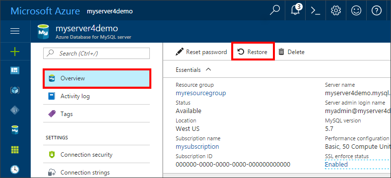
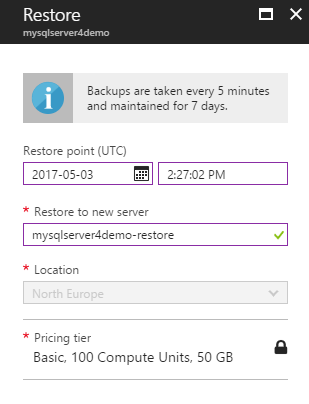

# How To Backup and Restore a server in Azure Database for MySQL using the Azure portal

## Backup happens Automatically
When using Azure Database for MySQL, the database service automatically makes a backup of the service every 5 minutes. 

The backups are available for 7 days when using Basic Tier, and 35 days when using Standard Tier. For more information, see [Azure Database for MySQL service tiers](concepts-service-tiers.md)

Using this automatic backup feature you may restore the server and all its databases into a new server to an earlier point-in-time.

## Restore in the Azure portal
Azure Database for MySQL allows you to restore the server back to a point in time and into to a new copy of the server. You can use this new server to recover your data. 

For example, if a table was accidentally dropped at noon today, you could restore to the time just before noon and retrieve the missing table and data from that new copy of the server.

The following steps restore the sample server to a point in time:

1. Sign into the [Azure portal](https://portal.azure.com/)

2. Locate your Azure Database for MySQL server. In the left pane, select **All resources**, then select your server from the list.

3.	On the top of the server overview blade, click **Restore** on the toolbar. The Restore blade opens.

4. Fill out the Restore form with the required information:

- **Restore point (UTC)**: Using the Date picker and time picker, select a point-in-time to restore to. The time specified is in UTC format, so you likely need to convert the local time into UTC.
- **Restore to new server**: Provide a new server name to restore the existing server into.
- **Location**: The region choice automatically populates with the source server region, and cannot be changed.
- **Pricing tier**: The pricing tier choice automatically populates with the same pricing tier as the source server, and cannot be changed here. 

5. Click **OK** to restore the server to restore to a point in time. 

6. After the restore finishes, locate the new server that was created to verify the databases were restored as expected.

## Next steps
- [Connection libraries for Azure Database for MySQL](concepts-connection-libraries.md)