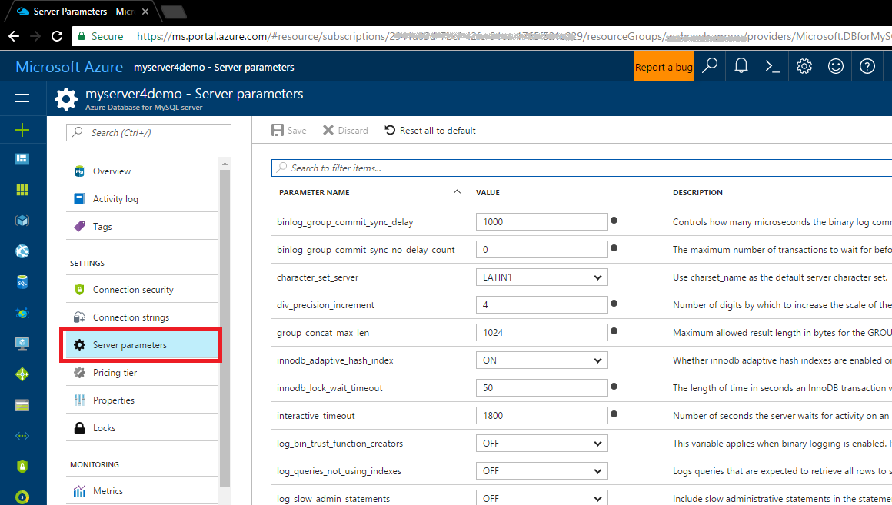

# How to configure server parameters in Azure Database for MySQL using the Azure portal

Azure Database for MySQL supports configuration of some server parameters. This article describes how to configure these parameters using the Azure portal, and lists the supported parameters, the default values, and the range of valid values. Not all server parameters can be adjusted; only the ones listed here are supported.

## Navigate to Server Parameters blade on Azure portal

Login to the Azure portal, then click on your MySQL server name. Under the **SETTINGS** section, click **Server parameters** to open the Server parameters blade for the Azure Database for MySQL.

## List of configurable server parameters

The following table lists the currently supported server parameters. The parameters can be configured according to your application requirements.

|Parameter Name|Default Value|Range|Description|
|---|---|---|---|
|binlog_group_commit_sync_delay|1000|0, 11-1000000|Controls how many microseconds the binary log commit waits before synchronizing the binary log file to disk.|
|binlog_group_commit_sync_no_delay_count|0|0-1000000|The maximum number of transactions to wait for before aborting the current delay as specified by binlog-group-commit-sync-delay.|
|character_set_server|LATIN1|BIG5, UTF8MB4, etc.|Use charset_name as the default server character set.|
|div_precision_increment|4|0-30|Number of digits by which to increase the scale of the result of division operations.|
|group_concat_max_len|1024|4-16777216|Maximum allowed result length in bytes for the GROUP_CONCAT().|
|innodb_adaptive_hash_index|ON|ON, OFF|Whether innodb adaptive hash indexes are enabled or disabled.|
|innodb_lock_wait_timeout|50|1-3600|The length of time in seconds an InnoDB transaction waits for a row lock before giving up.|
|interactive_timeout|1800|10-1800|Number of seconds the server waits for activity on an interactive connection before closing it.|
|log_bin_trust_function_creators|OFF|ON, OFF|This variable applies when binary logging is enabled. It controls whether stored function creators can be trusted not to create stored functions that will cause unsafe events to be written to the binary log.|
|log_queries_not_using_indexes|OFF|ON, OFF|Logs queries that are expected to retrieve all rows to slow query log.|
|log_slow_admin_statements|OFF|ON, OFF|Include slow administrative statements in the statements written to the slow query log.|
|log_throttle_queries_not_using_indexes|0|0-4294967295|Limits the number of such queries per minute that can be written to the slow query log.|
|long_query_time|10|1-1E+100|If a query takes longer than this many seconds, the server increments the Slow_queries status variable.|
|max_allowed_packet|536870912|1024-1073741824|The maximum size of one packet or any generated/intermediate string, or any parameter sent by the mysql_stmt_send_long_data() C API function.|
|min_examined_row_limit|0|0-18446744073709551615|Can be used to cause queries which examine fewer than the stated number of rows not to be logged.|
|server_id|3293747068|1000-4294967295|The server ID, used in replication to give each master and slave a unique identity.|
|slave_net_timeout|60|30-3600|The number of seconds to wait for more data from the master before the slave considers the connection broken, aborts the read, and tries to reconnect.|
|slow_query_log|OFF|ON, OFF|Enable or disable the slow query log.|
|sql_mode|0 selected|ALLOW_INVALID_DATES, IGNORE_SPACE, etc.|The current server SQL mode.|
|time_zone|SYSTEM|e.g.: +08:00; -10:59|The server time zone.|
|wait_timeout|120|60-240|The number of seconds the server waits for activity on a noninteractive connection before closing it.|

## Next steps
- [Connection libraries for Azure Database for MySQL](concepts-connection-libraries.md)
