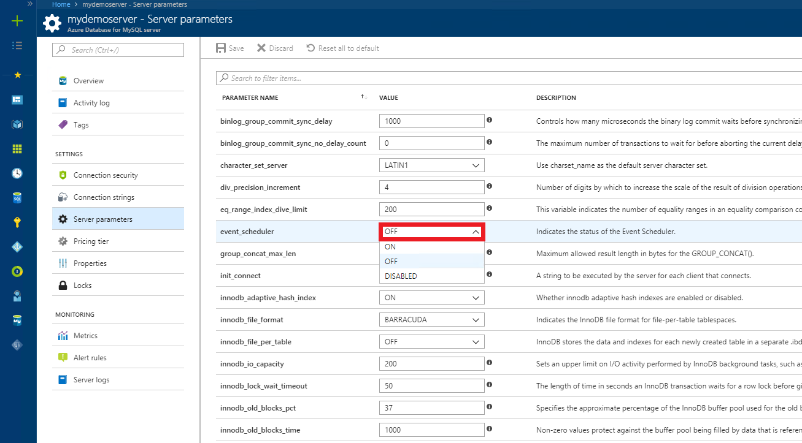
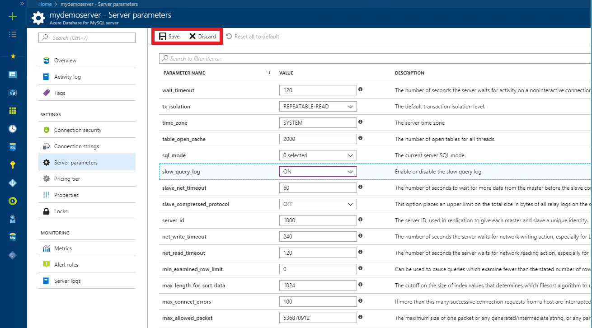

# How to configure server parameters in Azure Database for MySQL by using the Azure portal

Azure Database for MySQL supports configuration of some server parameters. This article describes how to configure these parameters by using the Azure portal. Not all server parameters can be adjusted.

## Navigate to Server Parameters on Azure portal

1. Sign in to the Azure portal, then locate your Azure Database for MySQL server.
2. Under the **SETTINGS** section, click **Server parameters** to open the server parameters page for the Azure Database for MySQL server.

3. Locate any settings you need to adjust. Review the **Description** column to understand the purpose and allowed values.

4. Click  **Save** to save your changes.

5. If you have saved new values for the parameters, you can always revert everything back to the default values by selecting **Reset all to default**.


## Working with the time zone parameter

### Populating the time zone tables

The time zone tables on your server can be populated by calling the `mysql.az_load_timezone` stored procedure from a tool like the MySQL command line or MySQL Workbench.

> [!NOTE]
> If you are running the `mysql.az_load_timezone` command from MySQL Workbench, you may need to turn off safe update mode first using `SET SQL_SAFE_UPDATES=0;`.

```sql
CALL mysql.az_load_timezone();
```

> [!IMPORTANT]
> You should restart the server to ensure the time zone tables are properly populated. To restart the server, use the [Azure portal](howto-restart-server-portal.md) or [CLI](howto-restart-server-cli.md).

To view available time zone values, run the following command:

```sql
SELECT name FROM mysql.time_zone_name;
```

### Setting the global level time zone

The global level time zone can be set from the **Server parameters** page in the Azure portal. The below sets the global time zone to the value "US/Pacific".


### Setting the session level time zone

The session level time zone can be set by running the `SET time_zone` command from a tool like the MySQL command line or MySQL Workbench. The example below sets the time zone to the **US/Pacific** time zone.

```sql
SET time_zone = 'US/Pacific';
```

Refer to the MySQL documentation for [Date and Time Functions](https://dev.mysql.com/doc/refman/5.7/en/date-and-time-functions.html#function_convert-tz).

## Next steps

- [Connection libraries for Azure Database for MySQL](concepts-connection-libraries.md).
