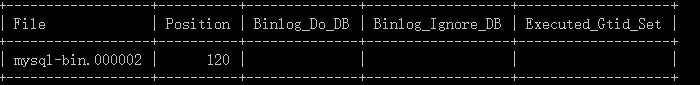

# Getting Started with Azure Database for MySQL Data Sync
In this topic, you will learn how to set up Azure Database for MySQL Data Sync by configuring primary and replica servers and link them for synchronization.

This article assumes that you have at least some prior experience with MySQL Server and Database.

For an overview of Azure Database for MySQL Data Sync, see [Sync data concept](./concepts-sync-data.md).

## Step 1 – Create a New MySQL Server for Data Sync

### Create a new MySQL server
Create a new MySQL server - replica.mysql.database.azure.com. Please refer to [Create an Azure Database for MySQL server by using the Azure portal](./quickstart-create-mysql-server-database-using-azure-portal.md) for server creation. This server will be the "replica (slave)" server in Data Sync.

### Create same user accounts and corresponding privileges
Since user accounts will not be replicated from primary server to replica server, please manually create all accounts and corresponding privileges on this newly created MySQL server.

## Step 2 – Config Primary Server

### Primary server settings
MySQL Data Sync requires parameter *lower_case_table_names* to be consistent between the primary and replica servers. This parameter is 1 in default on Azure Database for MySQL. Assume the server name is companya.com.

```sql
SET GLOBAL lower_case_table_names = 1;
```

### Set the primary server to read-only mode and restart
Before starts to dump database out, we need to lock the server during dumping. Please evaluate the impact to your business and schedule the maintenance window in off-peak time.

```sql
FLUSH TABLES WITH READ LOCK;
SET GLOBAL read_only = ON;
```

### Get binary log file name and offset 
Run the "show master status" command to ascertain the current binary log file name and offset.

```sql
show master status;
```

The results should be like below:



## Step 3 – Dump and Restore Database

### Dump all databases from primary server
You can use mysqldump to dump databases from your primary – the existing server. For details, please refer to [Dump & Restore](./concepts-migrate-dump-restore.md).

Please note there is not necessary to dump MySQL library and test library.

### Set primary server to read/write mode
Once the database has been dumpped, change the primary MySQL server setting back to read/write mode.

```sql
SET GLOBAL read_only = OFF;
UNLOCK TABLES;
```

Create a new account and set up permission for Sync Data use:

```sql
CREATE USER 'syncuser'@'%' IDENTIFIED BY 'yourpassword';
GRANT REPLICATION SLAVE ON *.* TO ' syncuser'@'%';
```

### Restore dump file to new server created in step 1
Please refer to [Dump & Restore](./concepts-migrate-dump-restore.md) about how to restore a dump file to a MySQL server.

Note if the dump file is very large, please upload it to virtual machine on Azure, and then restore it into the MySQL server from the virtual machine.

## Step 4 – Link Primary and Replica Server to start Data Sync

### Set primary server
All Data Sync functions are done by store procedures. You can find all procedures at MySQL Sync Data Store Procedures.

To link two servers and start to sync data, you need to log on to your target replica server (replica.mysql.database.azure.com in this case), then set the external instance as primary server by using *mysql.az_replication_change_primary* procedure. The primary binary log file name and offset are the results we got in Step 2.

```sql
CALL mysql.az_replication_change_primary('primary.companya.com', 'syncuser', 'yourpassowrd', 3306, 'mysql-bin.000002', 120);
```

### Start to sync data
Call Store procedure *mysql.az_replication_start* to start the data sync (replica).

```sql
CALL mysql.az_replication_start();
```

### Check sync status
Call show slave status command on replica server to see replication status.

```sql
show slave status ();
```

If state of *SLAVE_IO_Running* and *Slave_SQL_Running* are "yes", that means the replication works well.

Congratulations! You have created a replication between primary and replica server.

## Other Store Procedures

### Stop Data Sync

```sql
CALL mysql.az_replication_stop ();
```

### Remove Data Sync
Call this procedure to remove the relationship between primary and replica server.

```sql
CALL mysql.az_replication_remove_primary ();
```

## Next steps
For more info about MySQL Database and Data Sync, please refer to:

- MySQL Data Sync Concept
- [Azure Database for MySQL Overview](./overview.md)
- MySQL Sync Data Store Procedures