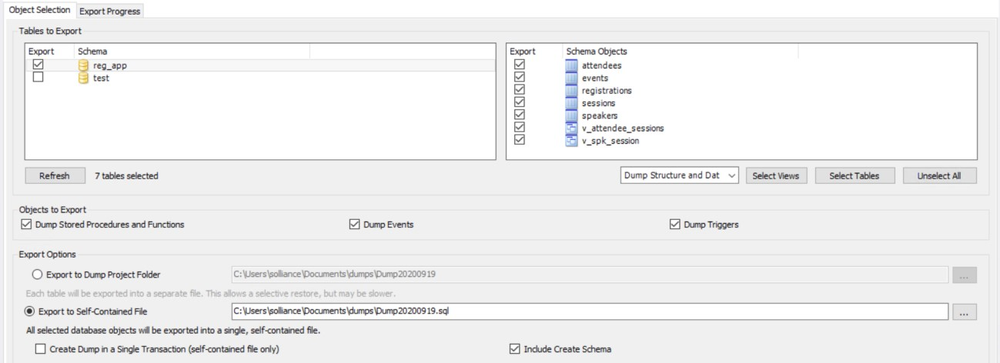

## Migrating MySQL on-premises to Azure Database for MySQL

Technical white paper

**Published:** October 2020

**Applies to:** Azure Database for MySQL

Copyright

The information contained in this document represents the current view of Microsoft Corporation on the issues discussed as of the date of publication. This content was developed prior to the product or service’ release and as such, we cannot guarantee that all details included herein will be exactly as what is found in the shipping product. Because Microsoft must respond to changing market conditions, it should not be interpreted to be a commitment on the part of Microsoft, and Microsoft cannot guarantee the accuracy of any information presented after the date of publication. The information represents the product or service at the time this document was shared and should be used for planning purposes only.

This white paper is for informational purposes only. MICROSOFT MAKES NO WARRANTIES, EXPRESS, IMPLIED, OR STATUTORY, AS TO THE INFORMATION IN THIS DOCUMENT.

Complying with all applicable copyright laws is the responsibility of the user. Without limiting the rights under copyright, no part of this document may be reproduced, stored in, or introduced into a retrieval system, or transmitted in any form or by any means (electronic, mechanical, photocopying, recording, or otherwise), or for any purpose, without the express written permission of Microsoft Corporation.

Microsoft may have patents, patent applications, trademarks, copyrights, or other intellectual property rights covering subject matter in this document. Except as expressly provided in any written license agreement from Microsoft, the furnishing of this document does not give you any license to these patents, trademarks, copyrights, or other intellectual property. Information subject to change at any time without prior notice.

Microsoft, Active Directory, Azure, Bing, Excel, Power BI, SharePoint, Silverlight, SQL Server, Visual Studio, Windows, and Windows Server are trademarks of the Microsoft group of companies.

All other trademarks are property of their respective owners.

© 2020 Microsoft Corporation. All rights reserved.

Migrating MySQL On-Premises to Azure Database for MySQL Guide v1.1 – October 2020 2

## Introduction

### Please note: This migration guide is maintained in GitHub. To find the latest version of the guide and the other related assets, please go to: [https://github.com/Azure/azuremysql/tree/master/MigrationGuide ](https://github.com/Azure/azure-mysql/tree/master/MigrationGuide)

This migration guide is designed to provide snackable and actionable information for MySQL customers and software integrators seeking to migrate MySQL workloads to [Azure Database for MySQL.](/azure/mysql/overview) This guide will give applicable knowledge that will apply to a majority of cases and provide guidance that will lead the successful planning and execution of a MySQL migration to Azure.

The process of moving existing databases and MySQL workloads into the cloud can present challenges with respect to the workload functionality and the connectivity of existing applications. The information presented throughout this guide offers helpful links and recommendations focusing on a successful migration and ensure workloads and applications continue operating as originally intended.

The information provided will center on a customer journey using the Microsoft [Cloud Adoption Framework](/azure/cloud-adoption-framework/get-started/) to perform assessment, migration, and post-optimization activities for an Azure Database for MySQL environment.

### MySQL

MySQL has a rich history in the open source community and has become very popular with corporations around the world for use in websites and other business critical applications. This guide will assist administrators who have been asked to scope, plan, and execute the migration. Administrators that are new to MySQL can also review the [MySQL Documentation](https://dev.mysql.com/doc/) for deeper information of the internal workings on MySQL. Additionally, this guide will also link to several reference articles through each of the sections to point you to helpful information and tutorials.

### Azure Database for MySQL

[Azure Database for MySQL](/azure/mysql/overview) is a Platform as a Service (PaaS) offering by Microsoft, where the MySQL environment is fully managed. In this fully managed environment, the operating system and software updates are automatically applied, as well as the implementation of high availability and protection of the data.

In addition to the PaaS offering, it is still possible to run MySQL in Azure VMs. Reference the [Choose the right MySQL Server option in Azure](/azure/mysql/select-right-deployment-type) article for more information on deciding what deployment type is most appropriate for the target data workload.

Comparison of MySQL environments.

This guide will focus entirely on migrating the on-premises MySQL workloads to the Platform as a Service Azure Database for MySQL offering due to its various advantages over Infrastructure as a Service (IaaS) such as scale-up and scale-out, pay-as-you-go, high availability, security and manageability features.

## Representative Use Case

### Overview

The following use case is based on a real-world customer scenario of an enterprise who migrated their MySQL workload to Azure Database for MySQL.

World Wide Importers (WWI) is a San Francisco, California-based manufacturer and wholesale distributor of novelty goods. They began operations in 2002 and developed an effective business-to-business (B2B) model, selling the items they produce directly to retail customers throughout the United States. Its customers include specialty stores, supermarkets, computing stores, tourist attraction shops, and some individuals. This B2B model enables a streamlined distribution system of their products, allowing them to reduce costs and offer more competitive pricing on the items they manufacture. They also sell to other wholesalers via a network of agents who promote their products on WWI’s behalf.

Before launching into new areas, WWI wants to ensure its IT infrastructure can handle the expected growth. WWI currently hosts all its IT infrastructure on-premises at its corporate headquarters and believes moving these resources to the cloud enables future growth. They have tasked their CIO with overseeing the migration of their customer portal and the associated data workloads to the cloud.

WWI would like to continue to take advantage of the many advanced capabilities available in the cloud, and they are interested in migrating their databases and associated workloads into Azure. They want to do this quickly and without having to make any changes to their applications or databases. Initially, they plan on migrating their java-based customer portal web application and the associated MySQL databases and workloads to the cloud.

#### Migration Goals

The primary goals for migrating their databases and associated SQL workloads to the cloud include:

  - Improve their overall security posture with data at rest and in-transit.

  - Enhance the high availability and disaster recovery (HA/DR) capabilities.

  - Position the organization to leverage cloud-native capabilities and technologies such as point in time restore.

  - Take advantage of administrative and performance optimizations features of Azure Database for MySQL.

  - Create a scalable platform that they can use to expand their business into more geographic regions.

  - Allow for enhanced compliance with various legal requirements where PII information is stored.

WWI used the [Cloud Adoption Framework (CAF)](/azure/cloud-adoption-framework/) to educate their team on following best practices guidelines for cloud migration. Using CAF as a higher-level migration guide, WWI customized their migration into three main stages. Within each stage, they defined activities that needed to be addressed to ensure a successful lift and shift cloud migration.

These stages include:

<table>
<thead>
<tr class="header">
<th><blockquote>

<strong>Stage </strong>

</blockquote></th>
<th><strong>Name </strong></th>
<th><strong>Activities </strong></th>
</tr>
</thead>
<tbody>
<tr class="odd">
<td><blockquote>

<strong>1 </strong>

</blockquote></td>
<td>Premigration</td>
<td>
Assessment, Planning, Migration Method Evaluation, Application

Implications, Test Plans, Performance Baselines
</td>
</tr>
<tr class="even">
<td><blockquote>

<strong>2 </strong>

</blockquote></td>
<td>Migration</td>
<td>Execute Migration, Execute Test Plans</td>
</tr>
<tr class="odd">
<td><blockquote>

<strong>3 </strong>

</blockquote></td>
<td>Postmigration</td>
<td>
Business Continuity, Disaster Recovery, Management, Security, Performance

Optimization, Platform modernization
</td>
</tr>
</tbody>
</table>

WWI has several instances of MySQL running with varying versions ranging from 5.5 to 5.7. They would like to move their instances to the latest version as soon as possible but would like to ensure that their applications will still work if they move to the newer versions. They are comfortable with moving to the same version in the cloud and upgrading afterwards, but if they can accomplish two tasks at once, they would prefer that path.

They would also like to ensure that their data workloads are safe and available across multiple geographic regions in case of failure and are looking at the available configuration options.

WWI wants to start off with a simple application for the first migration, and then move to more businesscritical applications in a later phase. This will provide the team with the knowledge and experience they need to prepare and plan for those future migrations.

## Assessment

Before jumping right into migrating a MySQL workload, there is a fair amount of due diligence that must be performed. This includes analyzing the data, hosting environment and application workloads to validate the Azure Landing zone is properly configured and prepared to host the soon to be migrated workloads.

### Limitations

Azure Database for MySQL is a fully supported version of the MySQL community edition running as a platform as a service. However, there are [some limitations](/azure/mysql/concepts-limits) to become familiar with when doing an initial assessment.

The most important of which include:

  - Storage engine support for InnoDB and Memory only

  - Limited Privilege support (DBA, SUPER, DEFINER)

  - Disabled data manipulation statements (SELECT ... INTO OUTFILE, LOAD DATA INFILE)

  - Automatic major database migration (5.6 to 5.7, 5.7 to 8.0)

  - When using [MySQL Server User-Defined Functions (UDFs),](https://dev.mysql.com/doc/refman/5.7/en/server-udfs.html) the only viable hosting option is Azure Hosted VMs, as there is no capability to upload the so or dll component to Azure Database for MySQL.

Many of the other items are simply operational aspects that administrators should become familiar with as part of the operational data workload lifecycle management. This guide will explore many of these operational aspects in the Post Migration Management section.

### MySQL Versions

MySQL has a rich history starting in 1995. Since then, it has since evolved into a widely used database management system. Azure Database for MySQL started with the support of MySQL version 5.6 and has continued to 5.7 and recently 8.0. For the latest on Azure Database for MySQL version support, reference [Supported Azure Database for MySQL server versions.](/azure/mysql/concepts-supported-versions) In the Post Migration Management section, we will review how upgrades (such as 5.7.20 to 5.7.21) are applied to the MySQL instances in Azure.

> **Note:** The jump from 5.x to 8.0 was, in large part, due to the Oracle acquisition of MySQL. To read more about MySQL history, navigate to the [MySQL wiki page. ](https://en.wikipedia.org/wiki/MySQL)

Knowing the source MySQL version is important. The applications using the system may be using database objects and features that are specific to that version. Migrating a database to a lower version could cause compatibility issues and loss of functionality. It is also recommended the data and application instance are fully tested before migrating to a newer version as features introduced could break your application.

Examples that may influence the migration path and version:

  - 5.6 : TIMESTAMP column for correct storage of milliseconds and full-text search

  - 5.7 : Support for native JSON data type

  - 8.0 : Support for NoSQL Document Store, atomic and crash safe DDL and JSON table functions

> **Note:** MySQL 5.6 will lose general support in February of 2021. MySQL workloads will need to migrate to MySQL version of 5.7 or greater.

To check the MySQL server version:

SHOW VARIABLES **LIKE** "%version%";

#### Database storage engines

Azure Database for MySQL only supports [InnoDB](https://dev.mysql.com/doc/refman/8.0/en/innodb-storage-engine.html) and [Memory](https://dev.mysql.com/doc/refman/8.0/en/memory-storage-engine.html) database storage engines. Other storage engines, like [MyISAM,](https://dev.mysql.com/doc/refman/8.0/en/myisam-storage-engine.html) will need to be migrated to a supported storage engine. The difference between the MyISAM and InnoDB are the operational features and performance output. The higher-level tables and schema structure typically will not change between the engines, but the index and table column types may change for storage and performance reasons. Although InnoDB is known to have large data file sizes, these storage details are managed by the Azure Database for MySQL service.

##### Migrating from MyISAM to InnoDB

The MyISAM database and tables will need to be converted to InnoDB tables. After conversion, applications should be tested for compatibility and performance. In most cases, testing requires recreating the table and changing the target storage engine via DDL statements. It is unlikely this change will need to be performed during migration as it will occur during the schema creation in the Azure target. For more details, review the [converting tables  developers documentation](https://dev.mysql.com/doc/refman/5.6/en/converting-tables-to-innodb.html) on the MySQL website.

To find useful table information, use this query:

<table>
<tbody>
<tr class="odd">
<td>
<strong>SELECT</strong> tab.table_schema, tab.table_name, tab.engine <strong>as</strong> engine_type, tab.auto_increment, tab.table_rows, tab.create_time, tab.update_time, tco.constraint_type

<strong>FROM</strong> information_schema.<strong>tables</strong> tab

<strong>LEFT</strong> <strong>JOIN</strong> information_schema.table_constraints tco

<strong>ON</strong> (tab.table_schema <strong>=</strong> tco.table_schema

<strong>AND</strong> tab.table_name <strong>=</strong> tco.table_name

) <strong>WHERE</strong>

tab.table_schema <strong>NOT</strong> <strong>IN</strong> ('mysql', 'information_schema', 'performance_ schema', 'sys')

<strong>AND</strong> tab.table_type <strong>=</strong> 'BASE TABLE';
</td>
</tr>
</tbody>
</table>

> **Note:** Running query against INFORMATION\_SCHEMA across multiple databases might impact performance. Run during low usage periods.

To convert a table from MyISAM to InnoDB, run the following:

**ALTER** **TABLE** {table\_name} ENGINE**=**InnoDB;

> **Note:** This conversion approach will cause the table to lock, and all applications will wait until the operation is complete. The table locking will make the database appear offline for a short period of time.

Alternatively, the table can be created with the same structure, but with a different storage engine. Once created, copy the rows into the new table:

**INSERT** **INTO** {table\_name} **SELECT** **\*** **FROM** {myisam\_table} **ORDER** **BY** {primary\_key\_c olumns}

> **Note:** For this approach to be successful, the original table would need to be deleted, then the new table renamed. This task will cause a short downtime period.

#### Database data and objects

Data is one component of database migration. The database supporting objects need to be migrated and validated to ensure the applications will continue to run reliably.

Here is a list of items you should inventory before and after the migration:

  - Tables (schema)

  - Primary keys, foreign keys

  - Indexes

  - Functions

  - Procedures

  - Triggers

  - Views

#### User Defined Functions

MySQL allows for the usage of functions that call external code. Unfortunately, data workloads using User Defined Functions (UDFs) with external code cannot be migrated to Azure Database for MySQL. The required MySQL function's backing so or dll code cannot be uploaded to the Azure server.

Run the following query to find any UDFs that may be installed:

**SELECT** **\*** **FROM** mysql.func;

### Source Systems

The amount of migration preparation can vary depending on the source system and its location. In addition to the database objects, consider how to get the data from the source system to the target system. Migrating data can become challenging when there are firewalls and other networking components in between the source and target.

Additionally, moving data over the Internet can be slower than using dedicated circuits to Azure. When moving many gigabytes, terabytes, and petabytes of data, consider setting up an [ExpressRoute](/azure/expressroute/expressroute-introduction) connection between the source network and the Azure network.

If ExpressRoute is already present, it is likely that connection is being used by other applications.

Performing a migration over an existing route can cause strain on the network throughput and potentially cause a considerable performance hit for both the migration and other applications using the network.

Lastly, disk space must be evaluated. When exporting a very large database, consider the size of the data. Ensure the system where the tool is running, and ultimately the export location, has enough disk space to perform the export operation.

#### Cloud Providers

Migrating databases from cloud services providers such as Amazon Web Services (AWS) may require an extra networking configuration steps in order to access the cloud hosted MySQL instances. Migration tools, like Data Migration Services, require access from outside IP ranges and may be otherwise blocked.

#### On-premises

Like cloud providers, if the MySQL data workload is behind firewalls or other network security layers, a path will need to be created between the on-premises instance and Azure Database for MySQL.

### Tools

Many tools and methods can be used to assess the MySQL data workloads and environments. Each tool will provide a different set of assessment and migration features and functionality. As part of this guide, we will review the most commonly used tools for assessing MySQL data workloads.

#### Azure Migrate

Although [Azure Migrate](/azure/migrate/migrate-services-overview) does not support migrating MySQL database workloads directly, it can be used when administrators are unsure of what users and applications are consuming the data, whether hosted in a virtual or hardware-based machine. [Dependency analysis](/azure/migrate/concepts-dependency-visualization) can be accomplished by installing and running the monitoring agent on the machine hosting the MySQL workload. The agent will gather the information over a set period of time, such as a month. The dependency data can be analyzed to find unknown connections being made to the database. The connection data can help identify application owners that need to be notified of the pending migration.

In addition to the dependency analysis of applications and user connectivity data, Azure Migrate can also be used to analyze the [Hyper-V, VMWare, or physical servers](/azure/migrate/migrate-appliance-architecture) to provide utilization patterns of the database workloads to help suggest the proper target environment.

#### Telgraf for Linux

Linux workloads can utilize the [Microsoft Monitoring Agent (MMA)](/azure/azure-monitor/platform/agent-linux) to gather data on your virtual and physical machines. Additionally, consider using the [Telegraf agent](/azure/azure-monitor/platform/collect-custom-metrics-linux-telegraf) and its wide array of plugins to gather your performance metrics.

#### Service Tiers

Equipped with the assessment information (CPU, memory, storage, etc.), the migration user’s next choice is to decide which Azure Database for MySQL [pricing tier](/azure/mysql/concepts-pricing-tiers) to start with.

There are currently three tiers:

  - **Basic** : Workloads requiring light compute and I/O performance.

  - **General Purpose** : Most business workloads requiring balanced compute and memory with scalable I/O throughput.

  - **Memory Optimized** : High performance database workloads requiring in-memory performance for faster transaction processing and higher concurrency.

The tier decision can be influenced by the RTO and RPO requirements of the data workload. When the data workload requires over 4TB of storage, an extra step is required. Review and select [a region that supports](/azure/mysql/concepts-pricing-tiers#storage) up to 16TB of storage.

> **Note:** Contact the MySQL team (AskAzureDBforMySQL@service.microsoft.com) for regions that do not support your storage requirements.

Typically, the decision making will focus on the storage and IOPS, or Input/output Operations Per Second, needs. The target system will always need at least as much storage as in the source system. Additionally, since IOPS are allocated 3/GB, it is important to match up the IOPs needs to the final storage size.

<table>
<thead>
<tr class="header">
<th><blockquote>

<strong>Factors </strong>

</blockquote></th>
<th><strong>Tier </strong></th>
</tr>
</thead>
<tbody>
<tr class="odd">
<td><blockquote>

<strong>Basic </strong>

</blockquote></td>
<td>Development machine, no need for high performance with less than 1TB storage</td>
</tr>
<tr class="even">
<td><blockquote>

<strong>General </strong>

<strong>Purpose </strong>

</blockquote></td>
<td>
Needs for IOPS more than what basic tier can provide, but for storage less than

16TB, and less than 4GB of memory
</td>
</tr>
<tr class="odd">
<td><blockquote>

<strong>Memory </strong>

<strong>Optimized </strong>

</blockquote></td>
<td>
Data workloads that utilize high memory or high cache and buffer related server configuration such as high concurrency innodb_buffer_pool_instances, large

BLOB sizes, systems with many slaves for replication
</td>
</tr>
</tbody>
</table>

#### Costs

After evaluating the entire WWI MySQL data workloads, WWI determined they would need at least 4

VCores and 20GB of memory and at least a 100GB of storage space with an IOP capacity of 450 IOPS.

Because of the 450 IOPS requirement, they will need to allocate at least 150GB of storage due to [Azure Database for MySQLs IOPs allocation method.](/azure/mysql/concepts-pricing-tiers#storage) Additionally, they will require at least up to 100% of your provisioned server storage as backup storage and one read replica. They do not anticipate an outbound egress of more than 5GB/month.

Using the [Azure Database for MySQL pricing calculator,](https://azure.microsoft.com/en-us/pricing/details/mysql/) WWI was able to determine the costs for the Azure Database for MySQL instance. As of 9/2020, the total costs of ownership (TCO) is displayed in the following table for the WWI Conference Database:

<table>
<thead>
<tr class="header">
<th><blockquote>

<strong>Resource </strong>

</blockquote></th>
<th><strong>Description </strong></th>
<th><blockquote>

<strong>Quantity </strong>

</blockquote></th>
<th><strong>Cost </strong></th>
</tr>
</thead>
<tbody>
<tr class="odd">
<td><blockquote>

<strong>Compute </strong>

<strong>(General </strong>

<strong>Purpose) </strong>

</blockquote></td>
<td>4 vcores, 20GB</td>
<td><blockquote>

1 @ $0.351/hr

</blockquote></td>
<td>$3074.76 / yr</td>
</tr>
<tr class="even">
<td><blockquote>

<strong>Storage </strong>

</blockquote></td>
<td>5GB</td>
<td><blockquote>

12 x 150 @ $0.115

</blockquote></td>
<td>$207 / yr</td>
</tr>
<tr class="odd">
<td><blockquote>

<strong>Backup </strong>

</blockquote></td>
<td>Up to 100% of provisioned storage</td>
<td><blockquote>

No additional cost up to 100% of provisioned server storage

</blockquote></td>
<td>$0.00 / yr</td>
</tr>
<tr class="even">
<td><blockquote>

<strong>Read Replica </strong>

</blockquote></td>
<td>1 second region replica</td>
<td><blockquote>

compute + storage

</blockquote></td>
<td>$3281.76 / yr</td>
</tr>
<tr class="odd">
<td><blockquote>

<strong>Network </strong>

</blockquote></td>
<td>&lt; 5GB/month egress</td>
<td><blockquote>

Free

</blockquote></td>
<td></td>
</tr>
<tr class="even">
<td><blockquote>

<strong>Total </strong>

</blockquote></td>
<td></td>
<td></td>
<td>$6563.52 / yr</td>
</tr>
</tbody>
</table>

After reviewing the initial costs, WWI’s CIO confirmed they will be on Azure for a period much longer than 3 years. They made the decision to use 3-year [reserve instances](/azure/mysql/concept-reserved-pricing) to save an extra \~$4K/yr:

<table>
<thead>
<tr class="header">
<th><blockquote>

<strong>Resource </strong>

</blockquote></th>
<th><strong>Description </strong></th>
<th><strong>Quantity </strong></th>
<th><strong>Cost </strong></th>
</tr>
</thead>
<tbody>
<tr class="odd">
<td><blockquote>

<strong>Compute </strong>

<strong>(General </strong>

<strong>Purpose) </strong>

</blockquote></td>
<td>4 vcores</td>
<td>1 @ $0.1375/hr</td>
<td>$1204.5 / yr</td>
</tr>
<tr class="even">
<td><blockquote>

<strong>Storage </strong>

</blockquote></td>
<td>5GB</td>
<td>12 x 150 @ $0.115</td>
<td>$207 / yr</td>
</tr>
<tr class="odd">
<td><blockquote>

<strong>Backup </strong>

</blockquote></td>
<td>Up to 100% of provisioned storage</td>
<td>No additional cost up to 100 % of provisioned server storage</td>
<td>$0.00 / yr</td>
</tr>
<tr class="even">
<td><blockquote>

<strong>Network </strong>

</blockquote></td>
<td>&lt; 5GB/month egress</td>
<td>Free</td>
<td></td>
</tr>
<tr class="odd">
<td><blockquote>

<strong>Read Replica </strong>

</blockquote></td>
<td>1 second region replica</td>
<td>compute + storage</td>
<td>$1411.5 / yr</td>
</tr>
<tr class="even">
<td><blockquote>

<strong>Total </strong>

</blockquote></td>
<td></td>
<td></td>
<td>$2823 / yr</td>
</tr>
</tbody>
</table>

As the table above shows, backups, network egress, and any read replicas must be considered in the total cost of ownership (TCO). As more databases are added, the storage and network traffic generated would be the only extra cost-based factor to consider.

> **Note:** The estimates above do not include any [ExpressRoute,](/azure/expressroute/expressroute-introduction) [Azure App Gateway,](/azure/application-gateway/overview) [Azure Load Balancer](/azure/load-balancer/load-balancer-overview) or [App Service](/azure/app-service/overview) costs for the application layers.
>
> The above pricing can change at any time and will vary based on region.

#### Application Implications

When moving to Azure Database for MySQL, the conversion to secure sockets layer (SSL) based communication is likely to be one of the biggest changes for your applications. SSL is enabled by default in Azure Database for MySQL and it is likely the on-premises application and data workload is not set up to connect to MySQL using SSL. When enabled, SSL usage will add some additional processing overhead and should be monitored.

> **Note** Although SSL is enabled by default, you do have the option to disable it.

Follow the activities in [Configure SSL connectivity in your application to securely connect to Azure Database for MySQL](/azure/mysql/howto-configure-ssl) to reconfigure the application to support this strong authentication path.

Lastly, modify the server name in the application connection strings or switch the DNS to point to the new Azure Database for MySQL server.

### WWI Scenario

WWI started the assessment by gathering information about their MySQL data estate. They were able to compile the following:

<table>
<thead>
<tr class="header">
<th><blockquote>

<strong>Name </strong>

</blockquote></th>
<th><strong>Source </strong></th>
<th><strong>Db Engine </strong></th>
<th><strong>Size </strong></th>
<th><strong>IOPS </strong></th>
<th><strong>Version </strong></th>
<th><strong>Owner </strong></th>
<th><strong>Downtime </strong></th>
</tr>
</thead>
<tbody>
<tr class="odd">
<td><blockquote>

<strong>WwwDB </strong>

</blockquote></td>
<td>AWS (PaaS)</td>
<td>InnoDB</td>
<td>1GB</td>
<td>150</td>
<td>5.7</td>
<td>Marketing Dept</td>
<td>1 hr</td>
</tr>
<tr class="even">
<td><blockquote>

<strong>BlogDB </strong>

</blockquote></td>
<td>AWS (Paas)</td>
<td>InnoDB</td>
<td>1GB</td>
<td>100</td>
<td>5.7</td>
<td>Marketing Dept</td>
<td>4 hrs</td>
</tr>
<tr class="odd">
<td><blockquote>

<strong>ConferenceDB </strong>

</blockquote></td>
<td>On-premises</td>
<td>InnoDB</td>
<td>5GB</td>
<td>50</td>
<td>5.5</td>
<td>Sales Dept</td>
<td>4 hrs</td>
</tr>
<tr class="even">
<td><blockquote>

<strong>CustomerDB </strong>

</blockquote></td>
<td>On-premises</td>
<td>MyISAM</td>
<td>10GB</td>
<td>75</td>
<td>5.5</td>
<td>Sales Dept</td>
<td>2 hrs</td>
</tr>
<tr class="odd">
<td><blockquote>

<strong>SalesDB </strong>

</blockquote></td>
<td>On-premises</td>
<td>InnoDB</td>
<td>20GB</td>
<td>75</td>
<td>5.5</td>
<td>Sales Dept</td>
<td>1 hr</td>
</tr>
</tbody>
</table>

Each database owner was contacted to determine the acceptable downtime period. The planning and migration method selected was based on the acceptable database downtime.

For the first phase, WWI focused solely on the ConferenceDB database. The team needed the migration experience to assist in the proceeding data workload migrations. The ConferenceDB database was selected because of the simple database structure and the large acceptable downtime. Once the database was migrated, the team focused on migrating the application into the secure Azure landing zone.

### Assessment Checklist

  - Test the workload runs successfully on the target system.

  - Ensure the right networking components are in place for the migration.

  - Understand the data workload resource requirements.

  - Estimate the total costs.

  - Understand the downtime requirements.

  - Be prepared to make application changes.

## Planning

### Landing Zone

An [Azure Landing zone](/azure/cloud-adoption-framework/ready/landing-zone/) is the target environment defined as the final resting place of a cloud migration project. In most projects, the landing zone should be scripted via ARM templates for its initial setup.

Finally, it should be customized with PowerShell or the Azure Portal to fit the workloads needs.

Since WWI is based in San Francisco, all resources for the Azure landing zone were created in the US West 2 region. The following resources were created to support the migration:

  - [Azure Database for MySQL ](/azure/mysql/quickstart-create-mysql-server-database-using-azure-portal)

  - [Azure Database Migration Service (DMS) ](/azure/dms/quickstart-create-data-migration-service-portal)

  - [Express Route ](/azure/expressroute/expressroute-introduction)

  - [Azure Virtual Network](/azure/virtual-network/quick-create-portal) with [hub and spoke design](/azure/architecture/reference-architectures/hybrid-networking/hub-spoke) with corresponding [virtual network peerings](/azure/virtual-network/virtual-network-peering-overview) establish.

  - [App Service ](/azure/app-service/overview)

  - [Application Gateway ](/azure/load-balancer/quickstart-load-balancer-standard-internal-portal?tabs=option-1-create-internal-load-balancer-standard)

  - [Private endpoints](/azure/private-link/private-endpoint-overview) for the App Services and MySQL instance

> **Note:** As part of this guide, two ARM templates (one with private endpoints, one without) were provided in order to deploy a potential Azure landing zone for a MySQL migration project. The private endpoints ARM template provides a more secure and production like scenario. Additional manual Azure landing zone configuration may be necessary, depending on the requirements.

### Networking

Getting data from the source system to Azure Database for MySQL in a fast and optimal way is a vital component to consider in a migration project. Small unreliable connections may require administrators to restart the migration several times until a successful result is achieved. Restarting migrations due to network issues can lead to wasted effort.

Take the time to understand and evaluate the network connectivity between the source, tool, and destination environments. In some cases, it may be appropriate to upgrade the internet connectivity or configure an ExpressRoute connection from the on-premises environment to Azure. Once on-premises to Azure connectivity has been created, the next step is to validate that the selected migration tool can connect from the source to the destination.

The migration tool location will determine the network connectivity requirements. As shown in the table below, the selected migration tool must be able to connect to both the on-premises machine and to Azure. Azure should be configured to only accept network traffic from the migration tool location.

<table>
<thead>
<tr class="header">
<th><blockquote>

<strong>Migration Tool </strong>

</blockquote></th>
<th><strong>Type </strong></th>
<th><strong>Location </strong></th>
<th>
<strong>Inbound Network </strong>

<strong>Requirements </strong>
</th>
<th>
<strong>Outbound Network </strong>

<strong>Requirements </strong>
</th>
</tr>
</thead>
<tbody>
<tr class="odd">
<td><blockquote>

<strong>Database Migration </strong>

<strong>Service (DMS) </strong>

</blockquote></td>
<td>Online or Offline</td>
<td>
Azure or

Hybrid
</td>
<td>Allow 3306 from external IP</td>
<td>A path to connect to the Azure MySQL database instance</td>
</tr>
<tr class="even">
<td><blockquote>

<strong>Import/Export (MySQL Workbench, mysqldump) </strong>

</blockquote></td>
<td>Offline</td>
<td>
On-

premises
</td>
<td>Allow 3306 from internal IP</td>
<td>A path to connect to the Azure MySQL database instance</td>
</tr>
<tr class="odd">
<td><blockquote>

<strong>Import/Export (MySQL Workbench, mysqldump) </strong>

</blockquote></td>
<td>Offline</td>
<td>Azure VM</td>
<td>Allow 3306 from external IP</td>
<td>A path to connect to the Azure MySQL database instance</td>
</tr>
<tr class="even">
<td><blockquote>

<strong>mydumper/myloader </strong>

</blockquote></td>
<td>Offline</td>
<td>
On-

premises
</td>
<td>Allow 3306 from internal IP</td>
<td>A path to connect to the Azure MySQL database instance</td>
</tr>
<tr class="odd">
<td><blockquote>

<strong>mydumper/myloader </strong>

</blockquote></td>
<td>Offline</td>
<td>Azure VM</td>
<td>Allow 3306 from external IP</td>
<td>A path to connect to the Azure MySQL database instance</td>
</tr>
<tr class="even">
<td><blockquote>

<strong>binlog </strong>

</blockquote></td>
<td>Online</td>
<td>
On-

premises
</td>
<td>Allow 3306 from external IP or private IP via Private endpoints</td>
<td>A path for each replication server to the master</td>
</tr>
</tbody>
</table>

Other networking considerations include:

  - DMS located in a VNET will be assigned a [dynamic public IP](/azure/dms/faq#setup) to the service. At creation time, you will be able to place the service inside a virtual network that has connectivity vi[a ExpressRoute](/azure/expressroute/expressroute-introduction) or over [a site to site VPN. ](/azure/vpn-gateway/vpn-gateway-howto-site-to-site-resource-manager-portal)

  - DMS can be configured in a [hybrid-mode w](/azure/dms/quickstart-create-data-migration-service-hybrid-portal)ith a worker installed on-premises to proxy the data to DMS.

  - When using an Azure Virtual Machine to run the migration tools, assign it a public IP address and then only allow it to connect to the on-premises MySQL instance.

  - Outbound firewalls must ensure outbound connectivity to Azure Database for MySQL. The MySQL gateway IP addresses are available on th[e Connectivity Architecture in Azure Database for MySQL](/azure/mysql/concepts-connectivity-architecture#azure-database-for-mysql-gateway-ip-addresses) page.

### SSL/TLS Connectivity

In addition to the application implications of migrating to SSL based communication, the SSL/TLS connection types are also something that needs to be considered. After creating the Azure Database for MySQL database, review the SSL settings, and read the [SSL/TLS connectivity in Azure Database for MySQL](/azure/mysql/concepts-ssl-connection-security) article to understand how the TLS settings can affect the security posture.

> **Note:** Pay attention to the disclaimer on the page. Enforcement of TLS version will not be enabled by default. Once TLS is enabled, the only way to disable it is to re-enable SSL.

### WWI Scenario

WWI’s cloud team has created the necessary Azure landing zone resources in a specific resource group for the Azure Database for MySQL. Additional resources will be included to support the applications. To create the landing zone, WWI decided to script the setup and deployment using ARM templates. By using ARM templates, they would be able to quickly tear down and re-setup the environment, if needed.

As part of the ARM template, all connections between virtual networks will be configured with peering in a hub and spoke architecture. The database and application will be placed into separate virtual networks. An Azure App Gateway will be placed in front of the app service to allow the app service to be isolated from the Internet. The Azure App Service will connect to the Azure Database for MySQL using a private endpoint.

WWI originally wanted to test an online migration, but the required network setup for DMS to connect to their on-premises environment made this infeasible. WWI chose to do an offline migration instead. The MySQL Workbench tool was used to export the on-premises data and then was used to import the data into the Azure Database for MySQL instance.

### Planning Checklist

  - Prepare the Azure landing zone. Consider using ARM template deployment in case the environment must be torn down and rebuilt quickly.

  - Verify the networking setup. Verification should include: connectivity, bandwidth, latency and firewall configurations.

  - Determine if you are going to use the online or offline data migration strategy.

  - Decide on the SSL certificate strategy.

## Migration Methods

Getting the data from the source to target will require using tools or features of MySQL to accomplish the migration.

It is important to complete the entire assessment and planning stages before starting the next stages. The decisions and data collected are migration path and tool selection dependencies.

We explore the following commonly used tools in this section:

  - MySQL Workbench

  - mysqldump

  - mydumper and myloader

  - Data-in replication (binlog)

### MySQL Workbench

[MySQL Workbench](https://www.mysql.com/products/workbench/) provides a rich GUI experience that allows developers and administrators to design, develop, and manage their MySQL instances.

The latest version of the MySQL Workbench provides sophisticated [object migration capabilities](https://www.mysql.com/products/workbench/migrate/) when moving a database from a source to target.

#### Data Import and Export

MySQL Workbench provides a wizard-based UI to do full or partial export and import of tables and database objects. For an example of how to use the MySQL Workbench, see [Migrate your MySQL database using import and export. ](/azure/mysql/concepts-migrate-import-export)

### Dump and restore (mysqldump)

mysqldump is typically provided as part of the MySQL installation. It is a [client utility](https://dev.mysql.com/doc/refman/5.7/en/mysqldump.html) that can be run to create logical backups that equate to a set of SQL statements that can be replayed to rebuild the database to a point in time. mysqldump is not intended as a fast or scalable solution for backing up or migrating very large amounts of data. Executing a large set of SQL insert statements can perform poorly due to the disk I/O required to update indexes. However, when combined with other tools that require the original schema, mysqldump is a great tool for generating the database and table schemas. The schemas can create the target landing zone environment.

The mysqldump utility provides useful features during the data migration phase. Performance considerations need to be evaluated before running the utility. See [Performance considerations.](/azure/mysql/concepts-migrate-dump-restore#performance-considerations)

### mydumper and myloader

Environments with large databases requiring fast migration should use [mydumper and myloader.](https://github.com/maxbube/mydumper) These tools are written in C++ and utilize multi-threaded techniques to send the data as fast as possible to the target MySQL instance. mydumper and myloader take advantage of parallelism and can speed up the migration by a factor of 10x or more.

The tools’ binary releases available for public download have been compiled for Linux. To run these tools on Windows, the open source projects would need to be recompiled. Compiling source code and creating releases is not a trivial task for most users.

### Data-in replication (binlog)

Similar to other database management systems, MySQL provides for a log replication feature called [binlog replication.](https://dev.mysql.com/doc/refman/5.7/en/binlog-replication-configuration-overview.html) The binlog replication feature helps with data migration and the creation of read replicas.

Utilize binlog replication to [migrate your data  to Azure Database for MySQL](/azure/mysql/concepts-data-in-replication) in an online scenario. The data replication will help to reduce the downtime required to make the final target data changes.

In order to use the binlog replication feature there are some setup [requirements:](/azure/mysql/howto-data-in-replication#link-master-and-replica-servers-to-start-data-in-replication)

  - Then master server is recommended to use the MySQL InnoDB engine. If you are using a storage engine other than InnoDB, you will need to migrate those tables to InnoDB.

  - Migration users must have permissions to configure binary logging and create new users on the master server.

  - If the master server has SSL enabled, ensure the SSL CA certificate provided for the domain has been included in the mysql.az\_replication\_change\_master stored procedure. Refer to the following [examples](/azure/mysql/howto-data-in-replication#link-master-and-replica-servers-to-start-data-in-replication) and the master\_ssl\_ca parameter.

  - Ensure the master server’s IP address has been added to the Azure Database for MySQL replica server’s firewall rules. Update firewall rules using the Azure portal or Azure CLI.

  - Ensure the machine hosting the master server allows both inbound and outbound traffic on port 3306.

  - Ensure the master server has an accessible IP address (public or private) from the source to the targets.

To perform a migration using replication, review [How to configure Azure Database for MySQL Data-in Replication](/azure/mysql/howto-data-in-replication#link-master-and-replica-servers-to-start-data-in-replication) for details.

The binlog replication method has high CPU and extra storage requirements. Migration users should test the load placed on the source system during online migrations and determine if it is acceptable.

### Azure Data Migration Service (DMS)

The [Azure Database Migration Services (DMS)](https://azure.microsoft.com/en-us/services/database-migration/) is an Azure cloud-based tool that allows administrators to keep track of the various settings for migration and reuse them if necessary. DMS works by creating migration projects with settings that point to various sources and destinations. It supports both online and offline migrations, with the [online option](/azure/mysql/howto-migrate-online) allowing for significantly minimized downtime. Additionally, it supports [on-premises data workloads](/azure/dms/tutorial-mysql-azure-mysql-online) and cloud-based workloads such as [Amazon Relational Database Service (RDS) MySQL. ](/azure/dms/tutorial-rds-mysql-server-azure-db-for-mysql-online)

Although the DMS service is an online tool, it does rely on the binlog replication feature of MySQL to complete its tasks. Currently, DMS partially automates the offline migration process. DMS requires the generation and application of the matching schema in the target Azure Database for MySQL instance. Schemas can be exported using the mysqldump client utility.

### Fastest/Minimum Downtime Migration

There are plenty of paths for migrating the data. Deciding which path to take is a function of the migration team’s skill set, and the amount of downtime the database and application owners are willing to accept. Some tools support multi-threaded parallel data migration approaches while other tools were designed for simple migrations of table data only.

The fastest and most complete path is to use binlog replication (either directly with MySQL or via DMS), but it comes with the costs of adding primary keys.

### Decision Table

There are many paths WWI can take to migrate their MySQL workloads. We have provided a table of the potential paths and the advantages and disadvantages of each:

<table>
<thead>
<tr class="header">
<th><blockquote>

<strong>Objective </strong>

</blockquote></th>
<th><strong>Description </strong></th>
<th><strong>Tool </strong></th>
<th><strong>Prerequisites </strong></th>
<th><strong>Advantages </strong></th>
<th><strong>Disadvantages </strong></th>
</tr>
</thead>
<tbody>
<tr class="odd">
<td><blockquote>

<strong>Fastest migration possible </strong>

</blockquote></td>
<td>Parallel approach</td>
<td>mydumper and myloader</td>
<td>Linux</td>
<td>Highly parallelized</td>
<td>Target throttling</td>
</tr>
<tr class="even">
<td><blockquote>

<strong>Online migration </strong>

</blockquote></td>
<td>Keep the source up for as long as possible</td>
<td>binlog</td>
<td>None</td>
<td>Seamless</td>
<td>Extra processing and storage</td>
</tr>
<tr class="odd">
<td><blockquote>

<strong>Online migration </strong>

</blockquote></td>
<td>Keep the source up for as long as possible</td>
<td>
Database

Migration

Service

(DMS)
</td>
<td>None</td>
<td>Repeatable process</td>
<td>Limited to data only, supports only 5.5 and 5.7</td>
</tr>
<tr class="even">
<td><blockquote>

<strong>Highly </strong>

<strong>Customized </strong>

<strong>Offline </strong>

<strong>Migration </strong>

</blockquote></td>
<td>Selectively export objects</td>
<td>mysqldump</td>
<td>None</td>
<td>Highly customizable</td>
<td>Manual</td>
</tr>
<tr class="odd">
<td><blockquote>

<strong>Offline </strong>

<strong>Migration Semiautomated </strong>

</blockquote></td>
<td>UI based export and import</td>
<td>
MySQL

Workbench
</td>
<td>Download and Install</td>
<td>Semiautomated</td>
<td>
Only common

sets of switches are supported
</td>
</tr>
</tbody>
</table>

> **Note:** Let’s use Azure terms. This is data-in replication or binlog replication.

### WWI Scenario

WWI has selected their conference database as their first migration workload. The workload was selected because it had the least risk and the most available downtime due to the gap in the annual conference schedule. Based on the migration team’s assessment, they determined that they will attempt to perform an offline migration using MySQL Workbench.

### Migration Methods Checklist

  - Ensure the right method is selected given the target and source environments.

  - Ensure the method can meet the business requirements.

  - Always verify if the data workload will support the method.

## Test Plans

### Overview

WWI created a test plan that included a set of IT and the Business tasks. Successful migrations require all the tests to be executed.

Tests:

  - Ensure the migrated database has consistency (same record counts and query results) with onpremises tables.

  - Ensure the performance is acceptable (it should match the same performance as if it were running on-premises).

  - Ensure the performance of target queries meet stated requirements.

  - Ensure acceptable network connectivity between on-premises and the Azure network.

  - Ensure all identified applications and users can connect to the migrated data instance.

WWI has identified a migration weekend and time window that started at 10 pm and ended at 2 am Pacific Time. If the migration did not complete before the 2 am target (the 4hr downtime target) with all tests passing, the rollback procedures were started. Issues were documented for future migration attempts. All migrations windows were pushed forward and rescheduled based on acceptable business timelines.

### Sample Queries

A series of queries were executed on the source and target to verify the database migration success. The following queries and scripts will help determine if the migration actions moved all required database objects from the source to the target.

#### Table rows

You can use this query to get all the tables and an estimated row count:

**SELECT** SUM(TABLE\_ROWS)

**FROM** INFORMATION\_SCHEMA.**TABLES**

**WHERE** TABLE\_SCHEMA **=** '{SchemaName}';

> **Note:** The INFORMATION\_SCHEMA table will provide an estimated set of values across the tables. To get a more accurate view of metrics like table size, increase the page sample size with the innodb\_stats\_transient\_sample\_pages server parameter. Increasing this server value will force more pages to be analyzed and provide more accurate results.

Execute the count(\*) SQL statement against every table to get an accurate count of rows. Running this command can take a large amount of time on very large tables. The following script will generate a set of SQL statements that can be executed to get the exact counts:

<table>
<tbody>
<tr class="odd">
<td>
<strong>SELECT</strong> CONCAT( 'SELECT "', table_name,

'" AS table_name, COUNT(*) AS exact_row_count FROM `', table_schema, '`.`', table_name,

'` UNION '

)

<strong>FROM</strong> INFORMATION_SCHEMA.<strong>TABLES</strong>

<strong>WHERE</strong> table_schema <strong>=</strong> '**my_schema**';
</td>
</tr>
</tbody>
</table>

#### Table Fragmentation

The data tables are likely to continue to grow larger with continued application use. In some cases, the data may not grow, but it constantly changing through deletions and updates. If this is the case, it is possible there will be a lot of fragmentation in the database files. The MySQL OPTIMIZE TABLE statement can reduce physical storage space needs and improve I/O efficiency.

You can [optimize the MySQL tables](https://dev.mysql.com/doc/refman/8.0/en/optimize-table.html) by running the following:

optimize **table** TABLE\_NAME

#### Database objects

Use the following query to ensure that all other database objects are accounted for. Although these queries can calculate the table row counts, they may not account for the version of the particular database object. For example, even though a stored procedure may exist, it could have changed between the start and end of the migration. Freezing database object development during migration is recommended.

**Users **

**SELECT** **DISTINCT**

USER

**FROM**

mysql.user

#### WHERE user \<\> '' order by user

**Indexes **

**SELECT** **DISTINCT**

INDEX\_NAME

**FROM**

information\_schema.**STATISTICS**

#### WHERE

TABLE\_SCHEMA **=** '{SchemaName}'

**Constraints **

**SELECT** **DISTINCT**

CONSTRAINT\_NAME

**FROM**

information\_schema.TABLE\_CONSTRAINTS

#### WHERE

CONSTRAINT\_SCHEMA **=** '{SchemaName}'

**Views **

**SELECT**

TABLE\_NAME

**FROM**

information\_schema.VIEWS

#### WHERE

TABLE\_SCHEMA **=** '{SchemaName}'

**Stored Procedures **

**SELECT**

ROUTINE\_NAME

**FROM**

information\_schema.ROUTINES

#### WHERE

ROUTINE\_TYPE **=** 'FUNCTION' **and**

ROUTINE\_SCHEMA **=** '{SchemaName}'

**Functions **

**SELECT**

ROUTINE\_NAME

**FROM**

information\_schema.ROUTINES

#### WHERE

ROUTINE\_TYPE **=** 'PROCEDURE' **and**

ROUTINE\_SCHEMA **=** '{SchemaName}'

**Events **

**SELECT**

EVENT\_NAME

**FROM**

INFORMATION\_SCHEMA.**EVENTS**

**WHERE**

EVENT\_SCHEMA **=** '{SchemaName}'

### Rollback Strategies

The queries above will provide a list of object names and counts that can be used in a rollback decision.

Migration users can take the first object verification step by checking the source and target object counts. A discrepancy in object counts may not necessarily mean a rollback is needed. Preforming an in-depth evaluation could point out the discrepancy is small and easily recoverable. A manual migration of a few failed objects could be the solution. For example, if all tables and data rows were migrated, but only a few of the functions were missed, remediate those failed objects and finalize the migration. If the database is relatively small, it could be possible to clear the Azure Database for MySQL instance and restart the migration again. Large databases may need more time than available in the migration window to determine missing objects. The migration will need to stop and rollback.

Identifying missing database objects needs to occur quickly during a migration window. Every minute counts. One option could be, export the environment object names to a file and use a data comparison tool to quickly identify missing objects. Another option could be, export the source database object names and import the data into a target database environment temp table. Compare the data using a **scripted** and **tested** SQL statement. Data verification speed and accuracy are critical to the migration process. Do not rely on manually reading and verifying a long list of database objects during a migration window. The possibility of human error is too great. You should manage by exception using tools.

### WWI Scenario

The WWI CIO received a confirmation report that all database objects were migrated from the onpremises database to the Azure Database for MySQL instance. The database team ran the above queries against the database before the beginning of the migration and saved all the results to a spreadsheet.

The source database schema information was used to verify the target migration object fidelity.

### Checklist

  - Have test queries scripted, tested, and ready to execute.

  - Know how long test queries take to run and make it a part of the documented migration timeline.

  - Have a mitigation and rollback strategy ready for different potential outcomes.

  - Have a well-defined timeline of events for the migration.

## Performance Baselines

Understanding the existing MySQL workload is one of the best investments that can be made to ensure a successful migration. Excellent system performance depends on adequate hardware and great application design. Items such as CPU, memory, disk, and networking need to be sized and configured appropriately for the anticipated load. Hardware and configuration are part of the system performance equation. The developer must understand the database query load and the most expensive queries to execute. Focusing on the most expensive queries can make a substantial difference in the overall performance metrics.

Creating baselines of query performance is vital to a migration project. The performance baselines can be used to verify the Azure landing zone configuration for the migrated data workloads. Most systems will be run 24/7 and have different peak load times. It is important to capture the peak workloads for the baseline. Metrics should captured several times. Later in the document, we will explore the source server parameters and how they are essential to the overall performance baseline picture. The server parameters should not be overlooked during a migration project.

### Tools

Below are tools used to gather server metrics and database workload information. Use the captured metrics to determine the appropriate Azure Database for MySQL tier and the associated scaling options.

  - [MySQL Enterprise Monitor:](https://www.mysql.com/products/enterprise/monitor.html) This non-free, enterprise edition tool can provide a sorted list of the most expensive queries, server metrics, file I/O and topology information

  - [Percona Monitoring and Management (PMM)](https://www.percona.com/software/database-tools/percona-monitoring-and-management) : a best-of-breed open source database monitoring solution. It helps to reduce complexity, optimize performance, and improve the security of businesscritical database environments, no matter the deployed location.

### Server Parameters

MySQL server default configurations may not adequately support a workload. There are a plethora of server parameters in MySQL, but in most cases the migration team should focus on a handful. The following parameters should be evaluated in the **source** and **target** environments. Incorrect configurations can affect the speed of the migration. We will revisit these parameters again when we execute the migration steps.

  - **innodb\_buffer\_pool\_size**: A large value will ensure in-memory resources are used first before utilizing disk I/O. Typical values will range from 80-90% of the available memory. For example, a system with 8GB of memory should allocate 5-6GB for the pool size.

  - **innodb\_log\_file\_size**: The redo logs are used to ensure fast durable writes. This transactional backup is helpful during a system crash. Starting with innodb\_log\_file\_size = 512M (giving 1GB of redo logs) should give plenty of room for writes. Write-intensive applications using MySQL 5.6 or higher should start with innodb\_log\_file\_size = 4G.

  - **max\_connections**: This parameter can help alleviate the Too many connections error. The default is 151 connections. Using a connection pool at the application level is preferred, but the server connection configuration may need to increase as well.

  - **innodb\_file\_per\_table**: This setting will tell InnoDB if it should store data and indexes in the shared tablespace or in a separate .ibd file for each table. Having a file per table enables the server to reclaim space when tables are dropped, truncated, or rebuilt. Databases containing a large number of tables should not use the table per file configuration. As of MySQL 5.6, the default value is ON. Earlier database versions should set the configuration to ON prior to loading data. This setting only affects newly created tables.

  - **innodb\_flush\_log\_at\_trx\_commit**: The default setting of 1 means that InnoDB is fully ACID compliant. This lower risk transaction configuration can have a significant overhead on systems with slow disks because of the extra fsyncs are needed to flush each change to the redo logs. Setting the parameter to 2 is a bit less reliable because committed transactions will be flushed to the redo logs only once a second. The risk can be acceptable in some master situations, and it is definitely a good value for a replica. A value of 0 allows for better system performance, but the database server is more likely to lose some data during a failure. The bottom line, use the 0 value for a replica only.

  - **innodb\_flush\_method**: This setting controls how data and logs are flushed to disk. Use O\_DIRECT when in presence of a hardware RAID controller with a battery-protected write-back cache. Use fdatasync (default value) for other scenarios.

  - **innodb\_log\_buffer\_size**: This setting is the size of the buffer for transactions that have not been committed yet. The default value (1MB) is usually fine. Transactions with large blob/text fields can fill up the buffer quickly and trigger extra I/O load. Look at the Innodb\_log\_waits status variable and if it is not 0, increase innodb\_log\_buffer\_size.

  - **query\_cache\_size**: The query cache is a well-known bottleneck that can be seen during moderate concurrency. The initial value should be set to 0 to disable cache. e.g. query\_cache\_size = 0. This is the default on MySQL 5.6 and later.

  - **log\_bin**: This setting will enable binary logging. Enabling binary logging is mandatory if the server is to act as a replication master.

  - **server\_id**: This setting will be a unique value to identity servers in replication topologies.

  - **expire\_logs\_days**: This setting will control how many days the binary logs will be automatically purged.

  - **skip\_name\_resolve**: user to perform client hostname resolution. If the DNS is slow, the connection will be slow. When disabling name resolution, the GRANT statements must use IP addresses only. Any GRANT statements made previously would need to be redone to use the IP.

Run the following command to export the server parameters to a file for review. Using some simple parsing, the output can be used to reapply the same server parameters after the migration, if appropriate to the Azure Database for MySQL server. Reference [Configure server parameters in Azure Database for MySQL using the Azure portal.](/azure/mysql/howto-server-parameters)

mysql -u root -p -A -e "SHOW GLOBAL VARIABLES;" \> settings.txt

The MySQL 5.5.60 default installed server parameters can be found in Appendix C.

Before migration begins, export the source MySQL configuration settings. Compare those values to the Azure landing zone instance settings after the migration. If any settings were modified from the default in the target Azure landing zone instance, ensure that these are set back after the migration. Also, the migration user should verify the server parameters can be set before the migration.

For a list of server parameters that cannot be configured, reference [Non-configurable server parameters.](/azure/mysql/concepts-server-parameters#non-configurable-server-parameters)

#### Egress and Ingress

For each respective data migration tool and path, the source and the target MySQL server parameters will need to be modified to support the fastest possible egress and ingress. Depending on the tool, the parameters could be different. For example, a tool that performs a migration in parallel may need more connections on the source and the target versus a single threaded tool.

Review any timeout parameters that may be affected by the datasets. These include:

  - [connect\_timeout ](https://dev.mysql.com/doc/refman/8.0/en/server-system-variables.html#sysvar_connect_timeout)

  - [wait\_timeout ](https://dev.mysql.com/doc/refman/8.0/en/server-system-variables.html#sysvar_wait_timeout)

Additionally, review any parameters that will affect maximums:

  - [max\_allowed\_packet ](https://dev.mysql.com/doc/refman/8.0/en/server-system-variables.html#sysvar_max_allowed_packet)

> **Note:** A common migration error is MySQL server has gone away. The parameters mentioned here are the typical culprits for resolving this error.

### WWI Scenario

WWI reviewed their Conference database workload and determined it had a very small load. Although a basic tier server would work for them, they did not want to perform work later to migrate to another tier. The server being deployed will eventually host the other MySQL data workloads and so they picked the General Performance tier.

In reviewing the MySQL database, the MySQL 5.5 server is running with the defaults server parameters that are set during the initial install.

## Data Migration

### Back up the database

As a prudent step before upgrade or migrate data, export the database before the upgrade using MySQL Workbench or manually via the mysqldump command.

### Offline vs. Online

Before a migration tool is selected, it should be determined if the migration should be online or offline.

  - **Offline migrations** will cause the system to be down while the migration takes place. This option ensures that no transactions are occurring and the state of the data will be exactly what is expected when restored in Azure.

  - **Online migrations** will migrate the data in near real-time. This option is appropriate when there is little downtime for the users or application consuming the data workload. The process involves replicating the data using a replication method such as binlog or similar.

In the case of WWI, their environment has some complex networking and security requirements that will not allow for the appropriate changes to be applied for inbound and outbound connectivity in the target migration time frame. These complexities and requirements essentially eliminate the online approach from consideration.

> **Note:** Review the Planning and Assessment sections for more details on Offline vs Online migration.

### Data Drift

Offline migration strategies have the potential for data drift. Data drift occurs when newly modified source data becomes out of sync with migrated data. When this happens, a full export or a delta export will be needed. You can mitigate this problem by stopping all traffic to the database and then performing your export. If stopping all data modification traffic is not possible, you will need to account for the drift.

Determining the changes can become complicated if the database tables don’t have columns such as a numeric based primary keys, or some type of modify and create date in every table that needs to be migrated.

For example, if a numeric based primary key is present and the migration is importing in sort order, it will be relatively simple to determine where the import stopped and restart it from that position. If no numeric based key is present, then it could be possible to utilize modify and create date, and again, import in a sorted manner to be able to restart the migration from the last date seen in the target.

### Performance recommendations

#### Exporting

  - Use an export tool that can run in a multi-threaded mode such as mydumper

  - When using MySQL 8.0, use [partitioned tables](https://dev.mysql.com/doc/refman/8.0/en/partitioning-overview.html) when appropriate to increase the speed of exports.

#### Importing

  - Create clustered indexes and primary keys after loading data. Load data in primary key order, or other if primary key some date column (such as modify date or create date) in sorted order.

  - Delay the creation of secondary indexes until after data is loaded. Create all secondary indexes after loading.

  - Disable foreign key constraints before loading. Disabling foreign key checks provides significant performance gains. Enable the constraints and verify the data after the load to ensure referential integrity.

  - Load data in parallel. Avoid too much parallelism that could cause resource contention and monitor resources by using the metrics available in the Azure portal.

### Performing the Migration

  - Back up the database

  - Create and verify the Azure Landing zone

  - Configure Source Server Parameters

  - Configure Target Server Parameters

  - Export the database objects (schema, users, etc.)

  - Export the data

  - Import the database objects

  - Import the data

  - Validation

  - Reset Target Server Parameters

  - Migrate the Application(s)

### Common Steps

Despite what path is taken, there are common steps that must be performed:

  - Upgrade to a supported Azure MySQL version

  - Inventory Database Objects

  - Export users and permissions

### Migrate to latest MySQL version

Since the WWI Conference database is running 5.5 it will be necessary to perform an upgrade. The CIO has asked that they upgrade to the latest version of MySQL (currently 8.0).

There are two ways to upgrade to 8.0:

  - In-place

  - Export/Import

When deciding to do an upgrade, it is important that to run the **upgrade checker** tool to determine if there are any conflicts. For example, when upgrading to MySQL Server 8.0, the tool will check for the following conflicts:

  - Database object names that conflict with reserve words in MySQL 8.0

  - Usage of the utf8mb3 charset

  - Usage of the ZEROFILL/display length type attributes

  - Table names that conflict with tables in 8.0

  - Temporal type usage

  - Foreign key constraint names longer than 64 characters

If the upgrade checker reports no issues, it is safe to do an in-place upgrade by replacing MySQL binaries.

Databases with issues will need to be exported and the issues addressed.

### WWI Scenario

After successfully migrating the MySQL instance to 8.0, the WWI migration team realized the original [Database Migration Service (DMS)](https://datamigration.microsoft.com/scenario/mysql-to-azuremysql?step=1) migration path could no longer be used as the DMS tool currently only supports 5.6 and 5.7. DMS required network access. The WWI migration team was not ready to handle their complex network issues. These environmental issues narrowed their migration tool choice to MySQL Workbench.

### Database Objects

As outlined in the Test Plans section, an inventory of database objects should be done before and after the migration to ensure that you have migrated everything.

If you would like to execute a stored procedure to generate this information, you can use something similar to the following:

<table>
<tbody>
<tr class="odd">
<td>
DELIMITER <strong>//</strong>

<strong>CREATE</strong> <strong>PROCEDURE</strong> `Migration_PerformInventory`(<strong>IN</strong> schemaName CHAR(64)) <strong>BEGIN</strong>

<strong>DECLARE</strong> finished INTEGER <strong>DEFAULT</strong> 0;

<strong>DECLARE</strong> tableName varchar(100) <strong>DEFAULT</strong> "";

#get <strong>all</strong> <strong>tables</strong>

<strong>DECLARE</strong> curTableNames

<strong>CURSOR</strong> <strong>FOR</strong>

<strong>SELECT</strong> TABLE_NAME <strong>FROM</strong> information_schema.<strong>tables</strong> <strong>where</strong> TABL

E_SCHEMA <strong>=</strong> schemaName;

<em>-- declare NOT FOUND handler</em>

<strong>DECLARE</strong> <strong>CONTINUE</strong> HANDLER

<strong>FOR</strong> <strong>NOT</strong> FOUND <strong>SET</strong> finished <strong>=</strong> 1;

<strong>DROP</strong> <strong>TABLE</strong> <strong>IF</strong> <strong>EXISTS</strong> MIG_INVENTORY;

<strong>CREATE</strong> <strong>TABLE</strong> MIG_INVENTORY

(

REPORT_TYPE VARCHAR(1000),

OBJECT_NAME VARCHAR(1000),

PARENT_OBJECT_NAME VARCHAR (1000),

OBJECT_TYPE VARCHAR(1000),

COUNT INT
</td>
</tr>
</tbody>
</table>

<table>
<tbody>
<tr class="odd">
<td>
)

ROW_FORMAT<strong>=DYNAMIC</strong>,

ENGINE<strong>=</strong>'InnoDB';

<strong>INSERT</strong> <strong>INTO</strong> MIG_INVENTORY (REPORT_TYPE,OBJECT_NAME, OBJECT_TYPE, COUNT)

<strong>SELECT</strong>

'OBJECTCOUNT', 'TABLES', 'TABLES', COUNT(<strong>*</strong>)

<strong>FROM</strong>

information_schema.<strong>tables</strong> <strong>where</strong>

TABLE_SCHEMA <strong>=</strong> schemaName;

<strong>INSERT</strong> <strong>INTO</strong> MIG_INVENTORY (REPORT_TYPE,OBJECT_NAME, OBJECT_TYPE, COUNT)

<strong>SELECT</strong>

'OBJECTCOUNT', 'STATISTICS', 'STATISTICS', COUNT(<strong>*</strong>)

<strong>FROM</strong>

information_schema.<strong>STATISTICS</strong>

<strong>WHERE</strong>

TABLE_SCHEMA <strong>=</strong> schemaName;

##### <strong>Constraints</strong>

<strong>INSERT</strong> <strong>INTO</strong> MIG_INVENTORY (REPORT_TYPE,OBJECT_NAME, OBJECT_TYPE, COUNT)

<strong>SELECT</strong>

'OBJECTCOUNT', 'TABLE_CONSTRAINTS', 'TABLE_CONSTRAINTS', COUNT(<strong>*</strong>)

<strong>FROM</strong>

information_schema.TABLE_CONSTRAINTS

<strong>WHERE</strong>

CONSTRAINT_SCHEMA <strong>=</strong> schemaName;

<strong>INSERT</strong> <strong>INTO</strong> MIG_INVENTORY (REPORT_TYPE,OBJECT_NAME, OBJECT_TYPE, COUNT)

<strong>SELECT</strong>

'OBJECTCOUNT', 'VIEWS', 'VIEWS', COUNT(<strong>*</strong>)

<strong>FROM</strong>

information_schema.VIEWS

<strong>WHERE</strong>

TABLE_SCHEMA <strong>=</strong> schemaName;

<strong>INSERT</strong> <strong>INTO</strong> MIG_INVENTORY (REPORT_TYPE,OBJECT_NAME, OBJECT_TYPE, COUNT)

<strong>SELECT</strong>

'OBJECTCOUNT', 'FUNCTIONS', 'FUNCTIONS', COUNT(<strong>*</strong>)

<strong>FROM</strong>

information_schema.ROUTINES

<strong>WHERE</strong>

ROUTINE_TYPE <strong>=</strong> 'FUNCTION' <strong>and</strong>

ROUTINE_SCHEMA <strong>=</strong> schemaName;
</td>
</tr>
</tbody>
</table>

<table>
<tbody>
<tr class="odd">
<td>
<strong>INSERT</strong> <strong>INTO</strong> MIG_INVENTORY (REPORT_TYPE,OBJECT_NAME, OBJECT_TYPE, COUNT)

<strong>SELECT</strong>

'OBJECTCOUNT', 'PROCEDURES', 'PROCEDURES', COUNT(<strong>*</strong>)

<strong>FROM</strong>

information_schema.ROUTINES

<strong>WHERE</strong>

ROUTINE_TYPE <strong>=</strong> 'PROCEDURE' <strong>and</strong>

ROUTINE_SCHEMA <strong>=</strong> schemaName;

<strong>INSERT</strong> <strong>INTO</strong> MIG_INVENTORY (REPORT_TYPE,OBJECT_NAME, OBJECT_TYPE, COUNT)

<strong>SELECT</strong>

'OBJECTCOUNT', 'EVENTS', 'EVENTS', COUNT(<strong>*</strong>)

<strong>FROM</strong>

information_schema.<strong>EVENTS</strong>

<strong>WHERE</strong>

EVENT_SCHEMA <strong>=</strong> schemaName;

<strong>INSERT</strong> <strong>INTO</strong> MIG_INVENTORY (REPORT_TYPE,OBJECT_NAME, OBJECT_TYPE, COUNT)

<strong>SELECT</strong>

'OBJECTCOUNT', 'USER DEFINED FUNCTIONS', 'USER DEFINED FUNCTIONS' , COUNT(<strong>*</strong>)

<strong>FROM</strong>

mysql.func;

<strong>INSERT</strong> <strong>INTO</strong> MIG_INVENTORY (REPORT_TYPE,OBJECT_NAME, OBJECT_TYPE, COUNT)

<strong>SELECT</strong>

'OBJECTCOUNT', 'USERS', 'USERS', COUNT(<strong>*</strong>)

<strong>FROM</strong>

mysql.user <strong>WHERE</strong>

user <strong>&lt;&gt;</strong> '' <strong>order</strong> <strong>by</strong> user;

<strong>OPEN</strong> curTableNames;

getTableName: <strong>LOOP</strong>

FETCH curTableNames <strong>INTO</strong> tableName;

<strong>IF</strong> finished <strong>=</strong> 1 <strong>THEN</strong>

LEAVE getTableName;

<strong>END</strong> <strong>IF</strong>;

<strong>SET</strong> @s <strong>=</strong> CONCAT('SELECT COUNT(*) into @TableCount FROM ', schemaName, '.', tableName);

#SELECT @s;

<strong>PREPARE</strong> stmt <strong>FROM</strong> @s;

<strong>EXECUTE</strong> stmt;
</td>
</tr>
</tbody>
</table>

**INSERT** **INTO** MIG\_INVENTORY (REPORT\_TYPE,OBJECT\_NAME, OBJECT\_TYPE, COUN

T)

**SELECT**

'TABLECOUNT', tableName, 'TABLECOUNT', @TableCount;

####  DEALLOCATE PREPARE stmt;

**END** **LOOP** getTableName;

**CLOSE** curTableNames;

**SELECT** **\*** **FROM** MIG\_INVENTORY;

#### END //

DELIMITER ;

**CALL** Migration\_PerformInventory('reg\_app');

  - Calling this procedure on the source DB reveals the following (truncated output):

  - The target database procedure result should resemble the image below after completing the migration. Notice there are no functions in the DB.Functions were eliminated before the migration.

### Users and permissions

A successful migration requires migrating associated users and permissions to the target environment.

Export all users and their grants using the following PowerShell script:

$username = "yourusername"; $password = "yourpassword"; mysql -u$username -p$password --skip-column-names -A -e"SELECT CONCAT('SHOW G RANTS FOR ''',user,'''@''',host,''';') FROM mysql.user WHERE user\<\>''" \> Show Grants.sql;

$lines = get-content "ShowGrants.sql"

**foreach** ($line **in** $lines)

{

mysql -u$username -p$password --skip-column-names -A -e"$line" \>\> AllGrants .sql

}

  - Create a new PowerShell script using PowerShell ISE (refer to the Setup document)

  - Set **yourusername** to root and **yourpassword** to the root user’s password

You can then run the AllGrants.sql script targeting the new Azure Database for MySQL:

$username = "yourusername";

$password = "yourpassword";

$server = "serverDNSname";

$lines = get-content "AllGrants.sql"

**foreach** ($line **in** $lines)

{

mysql -u$username -p$password -h$server --ssl-ca=c:\\temp\\BaltimoreCyberTrus tRoot.crt.cer --skip-column-names -A -e"$line"

}

You can also create users in Azure Database for MySQL using PowerShell: /enus/azure/mysql/howto-create-users

### Execute migration

With the basic migration components in place, it is now possible to proceed with the data migration. There were several tools and methods introduced previously. For WWI, they are going to utilize the MySQL Workbench path to export the data and then import it into Azure Database for MySQL.

### Data Migration Checklist

  - Understand the complexity of the environment and if an online approach is feasible.

  - Account for data drift. Stopping the database service can eliminate potential data drift.

  - Configure source parameters for fast export.

  - Configure target parameters for fast import.

  - Test any migrations that have a different source version vs the target.

  - Migrate any non-data based objects such as user names and privileges.

  - Make sure all tasks are documented and checked off as the migration is executed.

## Data Migration with MySQL Workbench

**Setup **

Follow all the steps in the Setup guide to create an environment to support the following steps.

### Configuring Server Parameters (Source)

Depending on the type of migration you have chosen (offline vs. online), you will want to evaluate if you are going to modify the server parameters to support a fast egress of the data. If you are doing online, it may not be necessary to do anything to server parameters as you will likely be performing binlog replication and have the data syncing on its own. However, if you are doing an offline migration, once you stop application traffic, you can switch the server parameters from supporting the workload to supporting the export.

### Configuring Server Parameters (Target)

Review the server parameters before starting the import process into Azure Database for MySQL. Server parameters can be retrieved and set using the [Azure Portal](/azure/mysql/howto-server-parameters) or by calling the [Azure PowerShell for MySQL cmdlets](/azure/mysql/howto-configure-server-parameters-using-powershell) to make the changes.

Execute the following PowerShell script to get all parameters:

\[Net.ServicePointManager\]::SecurityProtocol = \[Net.SecurityProtocolType\]::Tls

12

Install-Module -Name Az.MySql

Connect-AzAccount

$rgName = "{RESOURCE\_GROUP\_NAME}";

$serverName = "{SERVER\_NAME}";

Get-AzMySqlConfiguration -ResourceGroupName $rgName -ServerName $serverName

  - To do the same with the mysql tool, download the [CA root certification](https://www.digicert.com/CACerts/BaltimoreCyberTrustRoot.crt.pem) to c:\\temp (make this directory).

> **Note** The certificate is subject to change. Reference [Configure SSL connectivity in your application to securely connect to Azure Database for MySQL](/azure/mysql/howto-configure-ssl) for the latest certificate information.

  - Run the following in a command prompt, be sure to update the tokens:

mysql --host {servername}.mysql.database.azure.com --database mysql --user {u sername}@{servername} -p --ssl-ca=c:\\temp\\BaltimoreCyberTrustRoot.crt.cer -A -e "SHOW GLOBAL VARIABLES;" \> c:\\temp\\settings\_azure.txt

In the new \`settings\_azure.txt\` file, you will see the default Azure Database for MySQL server parameters as shown in Appendix A.

To support the migration, set the target MySQL instance parameters to allow for a faster ingress. The following server parameters should be set before starting the data migration:

  - max\_allowed\_packet – set the parameter to 1073741824 (i.e. 1GB) or the largest size of a row in the database to prevent any overflow issue due to long rows. Consider adjusting this parameter if there are large BLOB rows that need to be pulled out (or read).

  - innodb\_buffer\_pool\_size – Scale up the server to 32 vCore Memory Optimized SKU from the Pricing tier of the portal during migration to increase the innodb\_buffer\_pool\_size.

> Innodb\_buffer\_pool\_size can only be increased by scaling up compute for Azure Database for MySQL server. Reference [Server parameters in Azure Database for MySQL](/azure/mysql/concepts-server-parameters#innodb_buffer_pool_size) for the max value for the tier. The maximum value in a Memory Optimized 32 vCore system is 132070244352.

  - innodb\_io\_capacity & innodb\_io\_capacity\_max - Change the parameter to 9000 to improve the IO utilization to optimize for migration speed.

  - max\_connections - If using a tool that generates multiple threads to increase throughput, increase the connections to support that tool. Default is 151, max is 5000.

> **Note:** Take care when performing scaling. Some operations cannot be undone, such as storage scaling.

These settings can be updated using the Azure PowerShell cmdlets below:

Install-Module -Name Az.MySql

$rgName = " {RESOURCE\_GROUP\_NAME}";

$serverName = "{SERVER\_NAME}";

Select-AzSubscription -Subscription "{SUBSCRIPTION\_ID}"

Update-AzMySqlConfiguration -Name max\_allowed\_packet -ResourceGroupName $rgna me -ServerName $serverName -Value 1073741824

Update-AzMySqlConfiguration -Name innodb\_buffer\_pool\_size -ResourceGroupName $rgname -ServerName $serverName -Value 16106127360

Update-AzMySqlConfiguration -Name innodb\_io\_capacity -ResourceGroupName $rgna me -ServerName $serverName -Value 9000

Update-AzMySqlConfiguration -Name innodb\_io\_capacity\_max -ResourceGroupName $ rgname -ServerName $serverName -Value 9000

\#required if you have functions

Update-AzMySqlConfiguration -Name log\_bin\_trust\_function\_creators -ResourceGr oupName $rgname -ServerName $serverName -Value ON

### Data

#### Tool Choice

With the database objects and users from the source system migrated, the migration can begin. Databases running on MySQL version 8.0 cannot use Azure DMS to migrate the workload. Instead, migration users should use MySQL Workbench.

#### Manual Import and Export Steps

  - Open MySQL Workbench and connect as the local database’s root user.

  - Under \*\*Management\*\*, select \*\*Data Export\*\*. Select the **reg\_app** schema.

  - In **Objects to Export**, select **Dump Stored Procedures and Functions**, **Dump Events** and **Dump Triggers**.

  - Under **Export Options**, select **Export to Self-Contained File**.

  - Also, select the **Include Create Schema** checkbox. Refer to the image below to observe the correct mysqldump configuration.

Test

  - If any of these options appear unavailable, they are likely obstructed by the Output pane. Just change the editor layout.

Test

  - Select the **Export Progress** tab.

  - Select **Start Export**, notice MySQL Workbench makes calls to the mysqldump tool.

  - Open the newly created export script.

  - Find any DEFINER statements and either change to a valid user or remove them completely.

**Note:** This can be done by passing the --skip-definer in the mysqldump command. This is not an option in the MySQL Workbench; therefore, the lines will need to be manually removed in the export commands. Although we point out four items to remove here, there can be other items that could fail when migrating from one MySQL version to another (such as new reserved words).

  - Find SET GLOBAL statements and either change to a valid user or remove them completely.

  - Ensure sql\_mode isn’t set to NO\_AUTO\_CREATE\_USER.

  - Remove the hello\_world function.

  - In MySQL Workbench, create a new connection to the Azure Database for MySQL.

      - For Hostname, enter the full server DNS (ex: servername.mysql.database.azure.com).

      - Enter the username (ex: sqlroot@servername).

      - Select the **SSL** tab.

      - For the SSL CA File, browse to the **BaltimoreCyberTrustRoot.crt.cer** key file.

      - Select **Test Connection**, ensure the connection completes.

      - Select **OK**.

MySQL connection dialog box is displayed.

  - Select **File-\>Open SQL Script**.

  - Browse to the dump file, select **Open**.

  - Select **Execute**.

### Update Applications to support SSL

  - Switch to the Java Server API in Visual Studio code.

  - Open the **launch.json** file.

  - Update the **DB\_CONNECTION\_URL** to jdbc:mysql://serverDNSname:3306/reg\_app?useUnicode=true\&useJDBCCompliantT imezoneShift=true\&useLegacyDatetimeCode=false\&serverTimezone=UTC\&verifySe rverCertificate=true\&useSSL=true\&requireSSL=true\&noAccessToProcedureBodie s=true. Note the additional SSL parameters.

  - Update **DB\_USER\_NAME** to **conferenceuser@servername**.

  - Start the debug configuration, and ensure that the application works locally with the new database.

### Revert Server Parameters

The following parameters can be changed on the Azure Database for MySQL target instance. These parameters can be set through the Azure Portal or by using the [Azure PowerShell for MySQL cmdlets.](/azure/mysql/howto-configure-server-parameters-using-powershell)

$rgName = "YourRGName";

$serverName = "servername";

Update-AzMySqlConfiguration -Name max\_allowed\_packet -ResourceGroupName $rgna me -ServerName $serverName -Value 536870912

Update-AzMySqlConfiguration -Name innodb\_buffer\_pool\_size -ResourceGroupName $rgname -ServerName $serverName -Value 16106127360

Update-AzMySqlConfiguration -Name innodb\_io\_capacity -ResourceGroupName $rgna me -ServerName $serverName -Value 200

Update-AzMySqlConfiguration -Name innodb\_io\_capacity\_max -ResourceGroupName $ rgname -ServerName $serverName -Value 2000

### Change Connection String for the Java API

  - Use the following commands to change the connection string for the App Service Java API

<table>
<tbody>
<tr class="odd">
<td>
$rgName = "YourRGName"; $app_name = "servername";

az webapp config appsettings set -g $rgName -n $app_name --settings DB_CONNEC TION_URL={DB_CONNECTION_URL}
</td>
</tr>
</tbody>
</table>

> **Note:** Remember that you can use the Portal to set the connection string.

  - Restart the App Service API

az webapp restart -g $rgName -n $app\_name

You have successfully completed an on-premises to Azure Database for MySQL migration\!

## Post Migration Management

### Monitoring and Alerts

Once the migration has been successfully completed, the next phase it to manage the new cloud-based data workload resources. Management operations include both control plane and data plane activities. Control plane activities are those related to the Azure resources versus data plane which is **inside** the Azure resource (in this case MySQL).

Azure Database for MySQL provides for the ability to monitor both of these types of operational activities using Azure-based tools such as [Azure Monitor,](/azure/azure-monitor/overview) [Log Analytics](/azure/azure-monitor/platform/design-logs-deployment) and [Azure Sentinel.](/azure/sentinel/overview) In addition to the Azure-based tools, security information and event management (SIEM) systems can be configured to consume these logs as well.

Whichever tool is used to monitor the new cloud-based workloads, alerts will need to be created to warn Azure and database administrators of any suspicious activity. If a particular alert event has a well-defined remediation path, alerts can fire automated [Azure run books](/azure/automation/automation-quickstart-create-runbook) to address the event.

The first step to creating a fully monitored environment is to enable MySQL log data to flow into Azure Monitor. Reference [Configure and access audit logs for Azure Database for MySQL in the Azure portal](/azure/mysql/howto-configure-audit-logs-portal) for more information.

Once log data is flowing, use the [Kusto Query Language (KQL)](/azure/data-explorer/kusto/query/) query language to query the various log information. Administrators unfamiliar with KQL can find a SQL to KQL cheat sheet [here](/azure/data-explorer/kusto/query/sqlcheatsheet) or the [Get started with log queries in Azure Monitor](/azure/azure-monitor/log-query/get-started-queries) page.

For example, to get the memory usage of the Azure Database for MySQL:

AzureMetrics

| where TimeGenerated \> ago(15m)

| limit 10

| where ResourceProvider == "MICROSOFT.DBFORMYSQL"

| where MetricName == "memory\_percent"

| project TimeGenerated, Total, Maximum, Minimum, TimeGrain, UnitName | top 1 by TimeGenerated

To get the CPU usage:

AzureMetrics

| where TimeGenerated \> ago(15m)

| limit 10

| where ResourceProvider == "MICROSOFT.DBFORMYSQL"

| where MetricName == "cpu\_percent"

| project TimeGenerated, Total, Maximum, Minimum, TimeGrain, UnitName | top 1 by TimeGenerated

Once you have created the KQL query, you will then create [log alerts](/azure/azure-monitor/platform/alerts-unified-log) based of these queries.

### Server Parameters

As part of the migration, it is likely the on-premises [server parameters](/azure/mysql/concepts-server-parameters) were modified to support a fast egress. Also, modifications were made to the Azure Database for MySQL parameters to support a fast ingress. The Azure server parameters should be set back to their original on-premises workload optimized values after the migration.

However, be sure to review and make server parameters changes that are appropriate for the workload and the environment. Some values that were great for an on-premises environment, may not be optimal for a cloud-based environment. Additionally, when planning to migrate the current on-premises parameters to Azure, verify that they can in fact be set.

Some parameters are not allowed to be modified in Azure Database for MySQL.

### PowerShell Module

The Azure Portal and Windows PowerShell can be used for managing the Azure Database for MySQL. To get started with PowerShell, install the Azure PowerShell cmdlets for MySQL with the following PowerShell command:

Install-Module -Name Az.MySql

After the modules are installed, reference tutorials like the following to learn ways you can take advantage of scripting your management activities:

  - [Tutorial: Design an Azure Database for MySQL using PowerShell ](/azure/mysql/tutorial-design-database-using-powershell)

  - [How to back up and restore an Azure Database for MySQL server using PowerShell ](/azure/mysql/howto-restore-server-powershell)

  - [Configure server parameters in Azure Database for MySQL using PowerShell ](/azure/mysql/howto-configure-server-parameters-using-powershell)

  - [Auto grow storage in Azure Database for MySQL server using PowerShell ](/azure/mysql/howto-auto-grow-storage-powershell)

  - [How to create and manage read replicas in Azure Database for MySQL using PowerShell ](/azure/mysql/howto-read-replicas-powershell)

  - [Restart Azure Database for MySQL server using PowerShell ](/azure/mysql/howto-restart-server-powershell)

### Azure Database for MySQL Upgrade Process

Since Azure Database for MySQL is a PaaS offering, administrators are not responsible for the management of the updates on the operating system or the MySQL software. However, it is important to be aware the upgrade process can be random and when being deployed, will stop the MySQL server workloads. Plan for these downtimes by rerouting the workloads to a read replica in the event the particular instance goes into maintenance mode.

> **Note:** This style of failover architecture may require changes to the applications data layer to support this type of failover scenario. If the read replica is maintained as a read replica and is not promoted, the application will only be able to read data and it may fail when any operation attempts to write information to the database.

The [Planned maintenance notification](/azure/mysql/concepts-monitoring#planned-maintenance-notification) feature will inform resource owners up to 72 hours in advance of installation of an update or critical security patch. Database administrators may need to notify application users of planned and unplanned maintenance.

> **Note:** Azure Database for MySQL maintenance notifications are incredibly important. The database maintenance can take your database and connected applications down for a period of time.

### WWI Scenario

WWI decided to utilize the Azure Activity logs and enable MySQL logging to flow to a [Log Analytics workspace.](/azure/azure-monitor/platform/design-logs-deployment) This workspace is configured to be a part of [Azure Sentinel](/azure/sentinel/) such that any [Threat Analytics](/azure/mysql/concepts-data-access-and-security-threat-protection) events would be surfaced, and incidents created.

The MySQL DBAs installed the Azure Database for [MySQL Azure PowerShell cmdlets](/azure/mysql/quickstart-create-mysql-server-database-using-azure-powershell) to make managing the MySQL Server automated versus having to log to the Azure Portal each time.

### Management Checklist

  - Create resource alerts for common things like CPU and Memory.

  - Ensure the server parameters are configured for the target data workload after migration.

  - Script common administrative tasks.

  - Set up notifications for maintenance events such as upgrades and patches. Notify users as necessary.

## Optimization

### Monitoring Hardware and Query Performance

In addition to the audit and activity logs, server performance can also be monitored with [Azure Metrics.](/azure/azure-monitor/platform/data-platform-metrics) Azure metrics are provided in a one-minute frequency and alerts can be configured from them. For more information, reference [Monitoring in Azure Database for MySQL](/azure/mysql/concepts-monitoring) for specifics on what kind of metrics that can be monitored.

As previously mentioned, monitoring metrics such as the cpu\_percent or memory\_percent can be important when deciding to upgrade the database tier. Consistently high values could indicate a tier upgrade is necessary.

Additionally, if cpu and memory do not seem to be the issue, administrators can explore database-based options such as indexing and query modifications for poor performing queries.

To find poor performing queries, run the following:

AzureDiagnostics

| where ResourceProvider == "MICROSOFT.DBFORMYSQL"

| where Category == 'MySqlSlowLogs'

| project TimeGenerated, LogicalServerName\_s, event\_class\_s, start\_time\_t , q uery\_time\_d, sql\_text\_s | top 5 by query\_time\_d desc

### Query Performance Insight

In addition to the basic server monitoring aspects, Azure provides tools to monitor application query performance. Correcting or improving queries can lead to significant increases in the query throughput. Use the [Query Performance Insight tool](/azure/mysql/concepts-query-performance-insight) to analyze the longest running queries and determine if it is possible to cache those items if they are deterministic within a set period, or modify the queries to increase their performance.

The slow\_query\_log can be set to show slow queries in the MySQL log files (default is OFF). The long\_query\_time server parameter can alert users for long query times (default is 10 sec).

### Upgrading the Tier

The Azure Portal can be used to scale between from General Purpose and Memory Optimized. If a

Basic tier is chosen, there will be no option to upgrade the tier to General Purpose or Memory Optimized later. However, it is possible to utilize other techniques to perform a migration/upgrade to a new Azure Database for MySQL instance.

For an example of a script that will migrate from Basic to another server tier, reference [Upgrade from Basic to General Purpose or Memory Optimized tiers in Azure Database for MySQL.](https://techcommunity.microsoft.com/t5/azure-database-for-mysql/upgrade-from-basic-to-general-purpose-or-memory-optimized-tiers/ba-p/830404)

### Scale the Server

Within the tier, it is possible to scale cores and memory to the minimum and maximum limits allowed in that tier. If monitoring shows a continual maxing out of CPU or memory, follow the steps to [scale-up to meet your demand. ](https://techcommunity.microsoft.com/t5/azure-database-for-mysql/upgrade-from-basic-to-general-purpose-or-memory-optimized-tiers/ba-p/830404)

### Moving Regions

Moving a database to a different Azure region depends on the approach and architecture. Depending on the approach, it could cause system downtime.

The recommended process is the same as utilizing read replicas for maintenance failover. However, compared to the planned maintenance method mentioned above, the speed to failover is much faster when a failover layer has been implemented in the application. The application should only be down for a few moments during the read replica failover process. More details are covered in the Business Continuity and Disaster Recovery section.

### WWI Scenario

WWI business and application users expressed a high level of excitement regarding the ability to scale the database on-demand. They were also interested in using the Query Performance Insight to determine if long running queries performance needed to be addressed.

They opted to utilize a read replica server for any potential failover or read-only needed scenarios.

The migration team, working with the Azure engineers, set up KQL queries to monitor for any potential issues with the MySQL server performance. The KQY queries were set up with alerts to email event issues to the database and conference team.

They elected to monitor any potential issues for now and implement Azure Automation run books at a later time, if needed, to improve operational efficiency.

### Optimization Checklist

  - Monitor for slow queries.

  - Periodically review the Performance Insight dashboard.

  - Utilize monitoring to drive tier upgrades and scale decisions.

  - Consider moving regions if the users or application needs change.

## Business Continuity and Disaster Recovery (BCDR)

### Backup and Restore

As with any mission critical system, having a backup and restore as well as a disaster recovery (BCDR) strategy is an important part of your overall system design. If an unforseen event occurs, you should have the ability to restore your data to a point in time (Recovery Point Objective) in a reasonable amount of time (Recovery Time Objective).

#### Backup

Azure Database for MySQL supports automatic backups for 7 days by default. It may be appropriate to modify this to the current maximum of 35 days. It is important to be aware that if the value is changed to 35 days, there will be charges for any extra backup storage over 1x of the storage allocated.

There are several current limitations to the database backup feature as described in the [Backup and restore in Azure Database for MySQL](/azure/mysql/concepts-backup) docs article. It is important to understand them when deciding what additional strategies that should be implemented.

Some items to be aware of include:

  - No direct access to the backups

  - Tiers that allow up to 4TB have a full backup once per week, differential twice a day, and logs every five minutes

  - Tiers that allow up to 16TB have backups that are snapshot based

> **Note:** [Some regions](/azure/mysql/concepts-pricing-tiers#storage) do not yet support storage up to 16TB.

#### Restore

Redundancy (local or geo) must be configured during server creation. However, a geo-restore can be performed and allows the modification of these options during the restore process. Performing a restore operation will temporarily stop connectivity and any applications will be down during the restore process.

During a database restore, any supporting items outside of the database will also need to be restored.

Review the migration process. See [Perform post-restore tasks](/azure/mysql/concepts-backup#perform-post-restore-tasks) for more information.

### Read Replicas

[Read replicas](/azure/mysql/concepts-read-replicas) can be used to increase the MySQL read throughput, improve performance for regional users and to implement disaster recovery. When creating one or more read replicas, be aware that additional charges will apply for the same compute and storage as the primary server.

### Deleted Servers

If an administrator or bad actor deletes the server in the Azure Portal or via automated methods, all backups and read replicas will also be deleted. It is important that [resource locks](/azure/azure-resource-manager/management/lock-resources) are created on the Azure Database for MySQL resource group to add an extra layer of deletion prevention to the instances.

### Regional Failure

Although rare, if a regional failure occurs geo-redundant backups or a read replica can be used to get the data workloads running again. It is best to have both geo-replication and a read replica available for the best protection against unexpected regional failures.

> **Note** Changing the database server region also means the endpoint will change and application configurations will need to be updated accordingly.

#### Load Balancers

If the application is made up of many different instances around the world, it may not be feasible to update all of the clients. Utilize an [Azure Load Balancer](/azure/load-balancer/load-balancer-overview) or [Application Gateway](/azure/application-gateway/overview) to implement a seamless failover functionality. Although helpful and time-saving, these tools are not required for regional failover capability.

### WWI Scenario

WWI wanted to test the failover capabilities of read replicas so they performed the steps outlined below.

#### Creating a read replica

  - Open the Azure Portal.

  - Browse to the Azure Database for MySQL instance.

  - Under **Settings**, select **Replication**.

  - Select **Add Replica**.

  - Type a server name.

  - Select the region.

  - Select **OK**, wait for the instance to deploy. Depending on the size of the main instance, it could take some time to replicate.

> **Note:** Each replica will incur additional charges equal to the main instance.

#### Failover to read replica

Once a read replica has been created and has completed the replication process, it can be used for failed over. Replication will stop during a failover and make the read replica its own main instance.

Failover Steps:

  - Open the Azure Portal.

  - Browse to the Azure Database for MySQL instance.

  - Under **Settings**, select **Replication**.

  - Select one of the read replicas.

  - Select **Stop Replication**. This will break the read replica.

  - Modify all applications connection strings to point to the new main instance.

### BCDR Checklist

  - Modify backup frequency to meet requirements.

  - Setup read replicas for read intensive workloads and regional failover.

  - Create resource locks on resource groups.

  - Implement a load balancing strategy for applications for quick failover.

## Security

Moving to a cloud-based service doesn’t mean the entire internet will have access to it at all times. Azure provides best in class security that ensures data workloads are continually protected from bad actors and rouge programs.

### Authentication

Azure Database for MySQL supports the basic authentication mechanisms for MySQL user connectivity, but also supports [integration with Azure Active Directory.](/azure/mysql/concepts-azure-ad-authentication) This security integration works by issuing tokens that act like passwords during the MySQL login process. [Configuring Active Directory integration](/azure/mysql/howto-configure-sign-in-azure-ad-authentication) is incredibly simple to do and supports not only users, but AAD groups as well.

This tight integration allows administrators and applications to take advantage of the enhanced security features of [Azure Identity Protection](/azure/active-directory/identity-protection/overview-identity-protection) to further surface any identity issues.

> **Note:** This security feature is supported by MySQL 5.7 and later. Most [application drivers](/azure/mysql/howto-configure-sign-in-azure-ad-authentication) are supported as long as the clear-text option is provided.

### Threat Protection

In the event that user or application credentials are compromised, logs are not likely to reflect any failed login attempts. Compromised credentials can allow bad actors to access and download the data. [Azure Threat Protection](/azure/mysql/concepts-data-access-and-security-threat-protection) can watch for anomalies in logins (such as unusual locations, rare users or brute force attacks) and other suspicious activities. Administrators can be notified in the event something does not look right.

### Audit Logging

MySQL has a robust built-in audit log feature. By default, this [audit log feature is disabled](/azure/mysql/concepts-audit-logs) in Azure

Database for MySQL. Server level logging can be enabled by changing the audit\_log\_enabled server parameter. Once enabled, logs can be accessed through [Azure Monitor](/azure/azure-monitor/overview) and [Log Analytics](/azure/azure-monitor/platform/design-logs-deployment) by turning on [diagnostic logging.](/azure/mysql/howto-configure-audit-logs-portal#set-up-diagnostic-logs)

To query for user connection related events, run the following KQL query:

AzureDiagnostics

| where ResourceProvider =="MICROSOFT.DBFORMYSQL"

| where Category == 'MySqlAuditLogs' and event\_class\_s == "connection\_log"

| project TimeGenerated, LogicalServerName\_s, event\_class\_s, event\_subclass\_s

, event\_time\_t, user\_s , ip\_s , sql\_text\_s

| order by TimeGenerated asc

### Encryption

Data in the MySQL instance is encrypted at rest by default. Any automated backups are also encrypted to prevent potential leakage of data to unauthorized parties. This encryption is typically performed with a key that is created when the instance is created. In addition to this default encryption key, administrators have the option to [bring your own key (BYOK).](/azure/mysql/concepts-data-encryption-mysql)

When using a customer-managed key strategy, it is vital to understand responsibilities around key lifecycle management. Customer keys are stored in an [Azure Key Vault](/azure/key-vault/general/basic-concepts) and then accessed via policies. It is vital to follow all recommendations for key management, the loss of the encryption key equates to the loss of data access.

In addition to a customer-managed keys, use service-level keys to [add double encryption.](/azure/mysql/concepts-infrastructure-double-encryption) Implementing this feature will provide highly encrypted data at rest, but it does come with encryption performance penalties. Testing should be performed.

Data can be encrypted during transit using SSL/TLS. As previously discussed, it may be necessary to [modify your applications](/azure/mysql/howto-configure-ssl) to support this change and also configure the appropriate TLS validation settings.

### Firewall

Once users are set up and the data is encrypted at rest, the migration team should review the network data flows. Azure Database for MySQL provides several mechanisms to secure the networking layers by limiting access to only authorized users, applications and devices.

The first line of defense for protecting the MySQL instance is to implement [firewall rules.](/azure/mysql/concepts-firewall-rules) IP addresses can be limited to only valid locations when accessing the instance via internal or external IPs. If the MySQL instance is destined to only serve internal applications, then [restrict public access. ](/azure/mysql/howto-deny-public-network-access)

When moving an application to Azure along with the MySQL workload, it is likely there will be multiple virtual networks setup in a hub and spoke pattern that will require [Virtual Network Peering](/azure/virtual-network/virtual-network-peering-overview) to be configured.

### Private Link

To limit access to the Azure Database for MySQL to internal Azure resources, enable [Private Link.](/azure/mysql/concepts-data-access-security-private-link) Private Link will ensure that the MySQL instance will be assigned a private IP rather than a public IP address.

> **Note:** There are many other [basic Azure Networking considerations](/azure/mysql/concepts-data-access-and-security-vnet) that must be taken into account that are not the focus of this guide.

Review a set of potential [security baseline](/azure/mysql/security-baseline) tasks that can be implemented across all Azure resources. Not all of the items described on the reference link will apply to the specific data workloads or Azure resources.

### Security Checklist

  - Use Azure AD authentication where possible.

  - Enable Advanced Thread Protection.

  - Enable all auditing features.

  - Consider a Bring-Your-Own-Key (BYOK) strategy.

  - Implement firewall rules.

  - Utilize private endpoints for workloads that do not travel over the Internet.

## Summary

This document has covered several topics related to migrating an application from on-premises MySQL to Azure Database for MySQL. We covered how to begin and assess the project all the way to application cut over.

The migration team will need to review the topics carefully as the choices made can have project timeline effects. The total cost of ownership is very attractive given the many enterprise ready features provided.

The migration project approach is very important. The team will need to assess the application and database complexity to determine the amount of conversion time. Conversion tools will help make the transition easier, but there will always be an element of manual review and updates required. Scripting out pre-migration tasks and post migration testing is important.

Application architecture and design can provide strong indicators as to the level of effort required. For example, applications utilizing ORM frameworks can be great candidates, especially if the business logic is contained in the application instead of database objects.

In the end, several tools exist in the marketplace ranging from free to commercial. This document covered the steps required if the team plans a database migration using one of the more popular open source tool options. Whichever path that is chosen, Microsoft and the MySQL community have the tools and expertise to make the database migration successful.

### Questions and Feedback

For any questions or suggestions about working with Azure Database for MySQL, send an email to the Azure Database for MySQL Team (AskAzureDBforMySQL@service.microsoft.com). Please note that this address is for general questions rather than support tickets.

In addition, consider these points of contact as appropriate:

  - To contact Azure Support or fix an issue with your account, [file a ticket from the Azure portal. ](https://portal.azure.com/#blade/Microsoft_Azure_Support/HelpAndSupportBlade/overview)

  - To provide feedback or to request new features, create an entry via [UserVoice.](https://feedback.azure.com/forums/597982-azure-database-for-mysql)

### Find a partner to assist in migrating

This guide can be overwhelming, but don’t fret\! There are many experts in the community with a proven migration track record. [Search for a Microsoft Partner](https://www.microsoft.com/solution-providers/home) or [Microsoft MVP](https://mvp.microsoft.com/MvpSearch) to help with finding the most appropriate migration strategy. You are not alone\!

You can also browse the technical forums and social groups for more detailed real-world information:

  - [Microsoft Community Forum ](/answers/topics/azure-database-mysql.html)

  - [Azure Database for MySQL Tech Community ](https://techcommunity.microsoft.com/t5/azure-database-for-mysql/bg-p/ADforMySQL)

  - [StackOverflow for Azure MySQL ](https://stackoverflow.com/questions/tagged/azure-database-mysql)

  - [Azure Facebook Group ](https://www.facebook.com/groups/MsftAzure)

  - [LinkedIn Azure Group ](https://www.linkedin.com/groups/2733961/)

  - [LinkedIn Azure Developers Group ](https://www.linkedin.com/groups/1731317/)

## Appendix A: Environment Setup

[Download additional documentation](https://github.com/Azure/azure-mysql/blob/master/MigrationGuide/MySQL%20Migration%20Guide_v1.1%20Appendix%20A.pdf) we created for this Migration Guide and learn how to configure an environment to perform the guide’s migration steps for the sample [conference demo application.](https://github.com/Azure/azure-mysql/tree/master/MigrationGuide/sample-app)

## Appendix B: ARM Templates

### Secure

This template will deploy all resources with private endpoints. This effectively removes any access to the PaaS services from the internet.

[ARM Template ](https://github.com/Azure/azure-mysql/tree/master/MigrationGuide/arm-templates/ExampleWithMigration)

### Non-Secure

This template will deploy resources using standard deployment where all resources are available from the internet.

[ARM Template ](https://github.com/Azure/azure-mysql/tree/master/MigrationGuide/arm-templates/ExampleWithMigrationSecure)

## Appendix C: Default server parameters MySQL 5.5 and Azure Database for MySQL

You will find the [full listing of default server parameters of MySQL 5.5 and Azure Database for MySQL](https://github.com/Azure/azure-mysql/blob/master/MigrationGuide/MySQL%20Migration%20Guide_v1.1%20Appendix%20C.pdf) in our GitHub repository.
