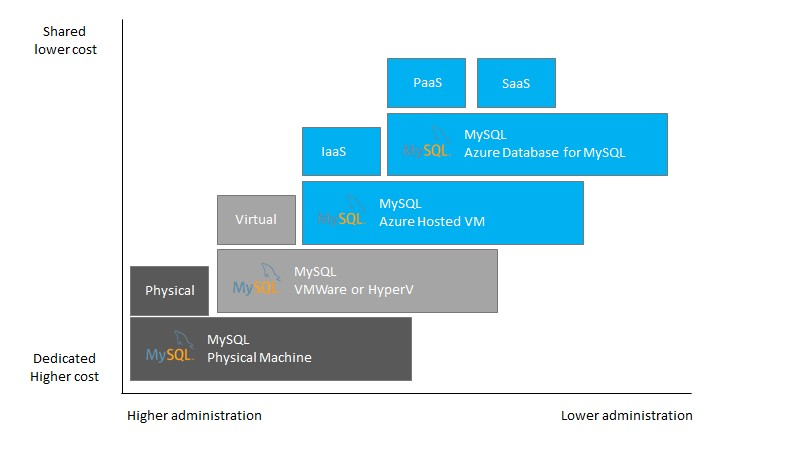

# Migrate MySQL on-premises to Azure Database for MySQL

[!INCLUDE[applies-to-mysql-single-flexible-server](../../includes/applies-to-mysql-single-flexible-server.md)]

This migration guide is designed to provide stackable and actionable information for MySQL customers and software integrators seeking to migrate MySQL workloads to [Azure Database for MySQL](../../overview.md). This guide gives applicable knowledge that applies to most cases and provides guidance that leads to the successful planning and execution of a MySQL migration to Azure.

The process of moving existing databases and MySQL workloads into the cloud can present challenges concerning the workload functionality and the connectivity of existing applications. The information presented throughout this guide offers helpful links and recommendations focusing on a successful migration and ensure workloads and applications continue operating as originally intended.

The information provided centers on a customer journey using the Microsoft [Cloud Adoption Framework](/azure/cloud-adoption-framework/get-started/) to perform assessment, migration, and post-optimization activities for an Azure Database for MySQL environment.

## MySQL

MySQL has a rich history in the open-source community and has become popular with corporations worldwide for websites and other business-critical applications. This guide assists administrators who have been asked to scope, plan, and execute the migration. Administrators that are new to MySQL can also review the [MySQL Documentation](https://dev.mysql.com/doc/) for more profound information on the internal workings of MySQL. Additionally, this guide also links to several reference articles through each of the sections to point you to helpful information and tutorials.

## Azure Database for MySQL

[Azure Database for MySQL](../../overview.md) is a Platform as a Service (PaaS) offering by Microsoft, where the MySQL environment is fully managed. In this fully managed environment, the operating system and software updates are automatically applied, and the implementation of high availability and protection of the data.

In addition to the PaaS offering, it's still possible to run MySQL in Azure VMs. Reference the [Choose the right MySQL Server option in Azure](../../select-right-deployment-type.md) article to decide what deployment type is most appropriate for the target data workload.

**Comparison of MySQL environments**

This guide focuses entirely on migrating the on-premises MySQL workloads to the Platform as a Service Azure Database for MySQL offering due to its various advantages over Infrastructure as a Service (IaaS) such as scale-up and scale-out, pay-as-you-go, high availability, security, and manageability features.  

## Next steps

> [!div class="nextstepaction"]
> [Representative Use Case](./02-representative-use-case.md)
