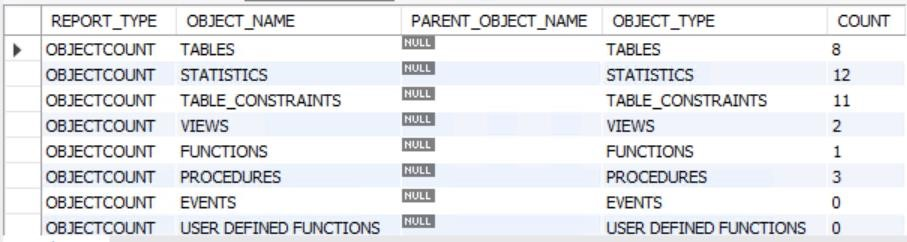
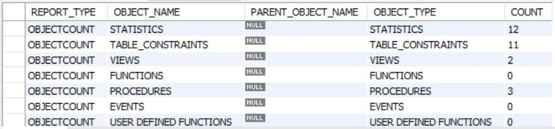

# Migrate MySQL on-premises to Azure Database for MySQL: Data Migration

[!INCLUDE[applies-to-mysql-single-flexible-server](../../includes/applies-to-mysql-single-flexible-server.md)]

## Prerequisites

[Performance baselines](07-performance-baselines.md)

## Back up the database

As a prudent step before upgrade or migrate data, export the database before the upgrade using MySQL Workbench or manually via the `mysqldump` command.

## Offline vs. online

Before a migration tool is selected, it should be determined if the migration should be online or offline.

  - **Offline migrations** causes the system to be down while the migration takes place. This option ensures that no transactions are occurring and the state of the data is exactly what is expected when restored in Azure.

  - **Online migrations** migrates the data in near real time. This option is appropriate when there's little downtime for the users or application consuming the data workload. The process involves replicating the data using a replication method such as `binlog` or similar.

For WWI, their environment has some complex networking and security requirements that don't allow for the appropriate changes to be applied for inbound and outbound connectivity in the target migration time frame. These complexities and requirements essentially eliminate the online approach from consideration.

> [!NOTE]
> Review the Planning and Assessment sections for more details on Offline vs Online migration.

## Data drift

Offline migration strategies have the potential for data drift. Data drift occurs when newly modified source data becomes out of sync with migrated data. When this happens, a full export or a delta export is needed. You can mitigate this problem by stopping all traffic to the database and then performing your export. If stopping all data modification traffic isn't possible, you need to account for the drift.

Determining the changes can become complicated if the database tables don’t have columns such as a numeric based primary keys, or some type of modify and create date in every table that needs to be migrated.

For example, if a numeric based primary key is present and the migration is importing in sort order, it's relatively simple to determine where the import stopped and restart it from that position. If no numeric based key is present, then it could be possible to utilize modify and create date, and again, import in a sorted manner so you can restart the migration from the last date seen in the target.

## Performance recommendations

### Exporting

  - Use an export tool that can run in a multi-threaded mode such as mydumper

  - When using MySQL 8.0, use [partitioned tables](https://dev.mysql.com/doc/refman/8.0/en/partitioning-overview.html) when appropriate to increase the speed of exports.

### Importing

  - Create clustered indexes and primary keys after loading data. Load data in primary key order, or other if primary key some date column (such as modify date or create date) in sorted order.

  - Delay the creation of secondary indexes until after data is loaded. Create all secondary indexes after loading.

  - Disable foreign key constraints before loading. Disabling foreign key checks provides significant performance gains. Enable the constraints and verify the data after the load to ensure referential integrity.

  - Load data in parallel. Avoid too much parallelism that could cause resource contention and monitor resources by using the metrics available in the Azure portal.

## Perform the migration

  - Back up the database

  - Create and verify the Azure Landing zone

  - Configure Source Server Parameters

  - Configure Target Server Parameters

  - Export the database objects (schema, users, etc.)

  - Export the data

  - Import the database objects

  - Import the data

  - Validation

  - Reset Target Server Parameters

  - Migrate the Application(s)

## Common steps

Despite what path is taken, there are common steps that must be performed:

  - Upgrade to a supported Azure MySQL version

  - Inventory Database Objects

  - Export users and permissions

## Migrate to latest MySQL version

Since the WWI Conference database is running 5.5, it's necessary to perform an upgrade. The CIO has asked that they upgrade to the latest version of MySQL (currently 8.0).

There are two ways to upgrade to 8.0:

  - In-place

  - Export/Import

When deciding to do an upgrade, it's important that to run the **upgrade checker** tool to determine if there are any conflicts. For example, when upgrading to MySQL Server 8.0, the tool checks for the following conflicts:

  - Database object names that conflict with reserve words in MySQL 8.0

  - Usage of the utf8mb3 charset

  - Usage of the ZEROFILL/display length type attributes

  - Table names that conflict with tables in 8.0

  - Temporal type usage

  - Foreign key constraint names longer than 64 characters

If the upgrade checker reports no issues, it's safe to do an in-place upgrade by replacing MySQL binaries. Databases with issues need to be exported and the issues addressed.

## WWI scenario

After successfully migrating the MySQL instance to 8.0, the WWI migration team realized the original [Database Migration Service (DMS)](01-mysql-migration-guide-intro.md) migration path could no longer be used as the DMS tool currently only supports 5.6 and 5.7. DMS required network access. The WWI migration team wasn't ready to handle their complex network issues. These environmental issues narrowed their migration tool choice to MySQL Workbench.

## Database objects

As outlined in the Test Plans section, an inventory of database objects should be done before and after the migration to ensure that you have migrated everything.

If you would like to execute a stored procedure to generate this information, you can use something similar to the following:

```
DELIMITER // 
CREATE PROCEDURE `Migration_PerformInventory`(IN schemaName CHAR(64)) 
BEGIN 

        DECLARE finished INTEGER DEFAULT 0; 
          DECLARE tableName varchar(100) DEFAULT ""; 

        #get all tables 
            DECLARE curTableNames 
                CURSOR FOR 
                    SELECT TABLE_NAME FROM information_schema.tables where TABL
E_SCHEMA = schemaName; 
        
            -- declare NOT FOUND handler 
            DECLARE CONTINUE HANDLER 
                FOR NOT FOUND SET finished = 1; 
        
            DROP TABLE IF EXISTS MIG_INVENTORY; 

                CREATE TABLE MIG_INVENTORY 
                ( 
                      REPORT_TYPE VARCHAR(1000), 
                      OBJECT_NAME VARCHAR(1000), 
                  PARENT_OBJECT_NAME VARCHAR (1000), 
                      OBJECT_TYPE VARCHAR(1000), 
                      COUNT INT
                ) 
                ROW_FORMAT=DYNAMIC, 
                ENGINE='InnoDB';
              INSERT INTO MIG_INVENTORY (REPORT_TYPE,OBJECT_NAME, OBJECT_TYPE, COUNT) 
                SELECT
                     'OBJECTCOUNT', 'TABLES', 'TABLES', COUNT(*)
              FROM 
                     information_schema.tables 
                where 
                     TABLE_SCHEMA = schemaName;
                #### Constraints
              INSERT INTO MIG_INVENTORY (REPORT_TYPE,OBJECT_NAME, OBJECT_TYPE, COUNT) 
                SELECT 
                      'OBJECTCOUNT', 'STATISTICS', 'STATISTICS', COUNT(*) 
                FROM 
                      information_schema.STATISTICS 
                WHERE 
                      TABLE_SCHEMA = schemaName; 
                INSERT INTO MIG_INVENTORY (REPORT_TYPE,OBJECT_NAME, OBJECT_TYPE, COUNT) 
                SELECT 
                      'OBJECTCOUNT', 'VIEWS', 'VIEWS', COUNT(*) 
                FROM 
                      information_schema.VIEWS 
                WHERE 
                      ROUTINE_TYPE = 'FUNCTION' and 
                      ROUTINE_SCHEMA = schemaName;

                INSERT INTO MIG_INVENTORY (REPORT_TYPE,OBJECT_NAME, OBJECT_TYPE, COUNT) 
                SELECT 
                      'OBJECTCOUNT', 'PROCEDURES', 'PROCEDURES', COUNT(*) 
                FROM 
                      information_schema.ROUTINES 
                WHERE 
                      ROUTINE_TYPE = 'PROCEDURE' and 
                      ROUTINE_SCHEMA = schemaName; 

                INSERT INTO MIG_INVENTORY (REPORT_TYPE,OBJECT_NAME, OBJECT_TYPE, COUNT) 
                SELECT 
                       'OBJECTCOUNT', 'EVENTS', 'EVENTS', COUNT(*) 
                FROM 
                       information_schema.EVENTS 
                WHERE 
                       EVENT_SCHEMA = schemaName; 

                INSERT INTO MIG_INVENTORY (REPORT_TYPE,OBJECT_NAME, OBJECT_TYPE, COUNT) 
                SELECT 
                       'OBJECTCOUNT', 'USER DEFINED FUNCTIONS', 'USER DEFINED FUNCTIONS'
        , COUNT(*) 
                FROM 
                        mysql.func; 

                INSERT INTO MIG_INVENTORY (REPORT_TYPE,OBJECT_NAME, OBJECT_TYPE, COUNT) 
                SELECT 
                        'OBJECTCOUNT', 'USERS', 'USERS', COUNT(*) 
                FROM 
                        mysql.user 
                WHERE 
                        user <> '' order by user; 

                OPEN curTableNames; 
        
                getTableName: LOOP 
                        FETCH curTableNames INTO tableName; 
                        IF finished = 1 THEN 
                              LEAVE getTableName; 
                        END IF; 

                   SET @s = CONCAT('SELECT COUNT(*) into @TableCount FROM ', schemaName, 
'.', tableName); 
        #SELECT @s; 
            PREPARE stmt FROM @s; 
        EXECUTE stmt;
        INSERT INTO MIG_INVENTORY (REPORT_TYPE,OBJECT_NAME, OBJECT_TYPE, COUNT) 
            
                SELECT 
                    'TABLECOUNT', tableName, 'TABLECOUNT', @TableCount; 
        DEALLOCATE PREPARE stmt; 
        
     END LOOP getTableName; 
     CLOSE curTableNames; 
          
   SELECT * FROM MIG_INVENTORY; 
END // 

DELIMITER ; 

CALL Migration_PerformInventory('reg_app');
```

  - Calling this procedure on the source DB reveals the following (truncated output):



  - The target database procedure result should resemble the image below after completing the migration. Notice there are no functions in the DB.Functions were eliminated before the migration.



## Users and permissions

A successful migration requires migrating associated users and permissions to the target environment.

Export all users and their grants using the following PowerShell script:

```
$username = "yourusername"; 
$password = "yourpassword"; 
mysql -u$username -p$password --skip-column-names -A -e"SELECT CONCAT('SHOW G
RANTS FOR ''',user,'''@''',host,''';') FROM mysql.user WHERE user<>''" > Show
Grants.sql; 

$lines = get-content "ShowGrants.sql" 

foreach ($line in $lines) 
{ 
mysql -u$username -p$password --skip-column-names -A -e"$line" >> AllGrants.sql 
}
```

  - Create a new PowerShell script using PowerShell ISE (refer to the Setup document)

  - Set **your username** to root and **your password** to the root user’s password

You can then run the `AllGrants.sql` script targeting the new Azure Database for MySQL:

```
$username = "yourusername"; 
$password = "yourpassword"; 
$server = "serverDNSname"; 
$lines = get-content "AllGrants.sql" 

foreach ($line in $lines)
{ 
mysql -u$username -p$password -h$server --ssl-ca=c:\temp\BaltimoreCyberTrus
tRoot.crt.cer --skip-column-names -A -e"$line" 
}
```

You can also create users in Azure Database for MySQL using PowerShell: /en-us/azure/mysql/howto-create-users

## Execute migration

With the basic migration components in place, it's now possible to proceed with the data migration. There were several tools and methods introduced previously. For WWI, they are going to utilize the MySQL Workbench path to export the data and then import it into Azure Database for MySQL.

## Data migration checklist

  - Understand the complexity of the environment and if an online approach is feasible.

  - Account for data drift. Stopping the database service can eliminate potential data drift.

  - Configure source parameters for fast export.

  - Configure target parameters for fast import.

  - Test any migrations that have a different source version vs the target.

  - Migrate any non-data based objects such as user names and privileges.

  - Make sure all tasks are documented and checked off as the migration is executed.  


## Next steps

> [!div class="nextstepaction"]
> [Data Migration with MySQL Workbench](./09-data-migration-with-mySQL-workbench.md)