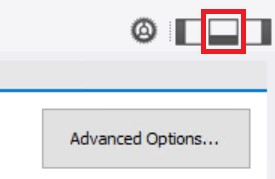

# Migrate MySQL on-premises to Azure Database for MySQL: Data Migration with MySQL Workbench

[!INCLUDE[applies-to-mysql-single-flexible-server](../../includes/applies-to-mysql-single-flexible-server.md)]

## Prerequisites

[Data migration](08-data-migration.md)

## Setup

Follow all the steps in the Setup guide to create an environment to support the following steps.

## Configuring server parameters (Source)

Depending on the type of migration You've chosen (offline vs. online), you want to evaluate if you are going to modify the server parameters to support a fast egress of the data. If you are doing online, it may not be necessary to do anything to server parameters as you are likely to perform a `binlog` replication and have the data syncing on its own. However, if you are doing an offline migration, once you stop application traffic, you can switch the server parameters from supporting the workload to supporting the export.

## Configuring server parameters (Target)

Review the server parameters before starting the import process into Azure Database for MySQL. Server parameters can be retrieved and set using the [Azure portal](../../howto-server-parameters.md) or by calling the [Azure PowerShell for MySQL cmdlets](../../howto-configure-server-parameters-using-powershell.md) to make the changes.

Execute the following PowerShell script to get all parameters:

```
\[Net.ServicePointManager\]::SecurityProtocol = \[Net.SecurityProtocolType\]::Tls
12

Install-Module -Name Az.MySql
Connect-AzAccount
$rgName = "{RESOURCE\_GROUP\_NAME}";
$serverName = "{SERVER\_NAME}";
Get-AzMySqlConfiguration -ResourceGroupName $rgName -ServerName $serverName
```

- To do the same with the mysql tool, download the [CA root certification](https://www.digicert.com/CACerts/BaltimoreCyberTrustRoot.crt.pem) to c:\\temp (make this directory).

    > [!NOTE]
    > The certificate is subject to change. Reference [Configure SSL connectivity in your application to securely connect to Azure Database for MySQL](../../howto-configure-ssl.md) for the latest certificate information.
    
- Run the following in a command prompt, be sure to update the tokens:

```
mysql --host {servername}.mysql.database.azure.com --database mysql --user 
{u sername}@{servername} -p --ssl-ca=c:\\temp\\BaltimoreCyberTrustRoot.crt.cer
-A -e "SHOW GLOBAL VARIABLES;" \> c:\\temp\\settings\_azure.txt
```

In the new \`settings\_azure.txt\` file, you can see the default Azure Database for MySQL server parameters as shown in the [appendix](15-appendix.md#environment-setup).

To support the migration, set the target MySQL instance parameters to allow for a faster ingress. The following server parameters should be set before starting the data migration:

- `max\_allowed\_packet` – set the parameter to `1073741824` (that is, 1 GB) or the largest size of a row in the database to prevent any overflow issue due to long rows. Consider adjusting this parameter if there are large BLOB rows that need to be pulled out (or read).

- `innodb\_buffer\_pool\_size` – Scale up the server to 32 vCore Memory Optimized SKU from the Pricing tier of the portal during migration to increase the innodb\_buffer\_pool\_size. Innodb\_buffer\_pool\_size can only be increased by scaling up compute for Azure Database for MySQL server. Reference [Server parameters in Azure Database for MySQL](../../concepts-server-parameters.md#innodb_buffer_pool_size) for the max value for the tier. The maximum value in a Memory Optimized 32 vCore system is `132070244352`.

- `innodb\_io\_capacity` & `innodb\_io\_capacity\_max` - Change the parameter to `9000` to improve the IO utilization to optimize for migration speed.

- `max\_connections` - If using a tool that generates multiple threads to increase throughput, increase the connections to support that tool. Default is `151`, max is `5000`.

    > [!NOTE]
    > Take care when performing scaling. Some operations can't be undone, such as storage scaling.
    
These settings can be updated using the Azure PowerShell cmdlets below:

```
Install-Module -Name Az.MySql
$rgName = " {RESOURCE\_GROUP\_NAME}";
$serverName = "{SERVER\_NAME}";

Select-AzSubscription -Subscription "{SUBSCRIPTION\_ID}"
Update-AzMySqlConfiguration -Name max\_allowed\_packet -ResourceGroupName
$rgna me -ServerName $serverName -Value 1073741824  
Update-AzMySqlConfiguration -Name innodb\_buffer\_pool\_size -ResourceGroupName 
$rgname -ServerName $serverName -Value 16106127360
Update-AzMySqlConfiguration -Name innodb\_io\_capacity -ResourceGroupName 
$rgna me -ServerName $serverName -Value 9000
Update-AzMySqlConfiguration -Name innodb\_io\_capacity\_max -ResourceGroupName 
$ rgname -ServerName $serverName -Value 9000

\#required if You've functions

Update-AzMySqlConfiguration -Name log\_bin\_trust\_function\_creators 
-ResourceGr oupName $rgname -ServerName $serverName -Value ON
```
## Data

### Tool choice

With the database objects and users from the source system migrated, the migration can begin. Databases running on MySQL version 8.0 can't use Azure DMS to migrate the workload. Instead, migration users should use MySQL Workbench.

### Manual import and export steps

- Open MySQL Workbench and connect as the local database’s root user.

- Under \*\*Management\*\*, select \*\*Data Export\*\*. Select the **reg\_app** schema.

- In **Objects to Export**, select **Dump Stored Procedures and Functions**, **Dump Events** and **Dump Triggers**.

- Under **Export Options**, select **Export to Self-Contained File**.

- Also, select the **Include Create Schema** checkbox. Refer to the image below to observe the correct mysqldump configuration.

    

    **Test**

- If any of these options appear unavailable, they're likely obstructed by the Output pane. Just change the editor layout.

    

    **Test**

- Select the **Export Progress** tab.

- Select **Start Export**, notice MySQL Workbench makes calls to the `mysqldump` tool.

- Open the newly created export script.

- Find any `DEFINER` statements and either change to a valid user or remove them completely.

> [!NOTE]
> This can be done by passing the `--skip-definer` in the mysqldump command. This is not an option in the MySQL Workbench; therefore, the lines need to be manually removed in the export commands. Although we point out four items to remove here, there can be other items that could fail when migrating from one MySQL version to another (such as new reserved words).

- Find `SET GLOBAL` statements and either change to a valid user or remove them completely.

- Ensure `sql\_mode` isn’t set to `NO\_AUTO\_CREATE\_USER`.

- Remove the `hello\_world` function.

- In MySQL Workbench, create a new connection to the Azure Database for MySQL.

    - For Hostname, enter the full server DNS (ex: `servername.mysql.database.azure.com`).

    - Enter the username (ex: `sqlroot@servername`).

    - Select the **SSL** tab.

    - For the SSL CA File, browse to the **BaltimoreCyberTrustRoot.crt.cer** key file.

    - Select **Test Connection**, ensure the connection completes.

    - Select **OK**.

        

        **MySQL connection dialog box is displayed.**

- Select **File-\>Open SQL Script**.

- Browse to the dump file, select **Open**.

- Select **Execute**.

## Update applications to support SSL

- Switch to the Java Server API in Visual Studio code.

- Open the **launch.json** file.

- Update the **DB\_CONNECTION\_URL** to `jdbc:mysql://serverDNSname:3306/reg\_app?useUnicode=true\&useJDBCCompliantT imezoneShift=true\&useLegacyDatetimeCode=false\&serverTimezone=UTC\&verifySe rverCertificate=true\&useSSL=true\&requireSSL=true\&noAccessToProcedureBodie s=true.` Note the additional SSL parameters.

- Update **DB\_USER\_NAME** to **conferenceuser@servername**.

- Start the debug configuration, and ensure that the application works locally with the new database.

## Revert server parameters

The following parameters can be changed on the Azure Database for MySQL target instance. These parameters can be set through the Azure portal or by using the [Azure PowerShell for MySQL cmdlets.](../../howto-configure-server-parameters-using-powershell.md)

```
$rgName = "YourRGName";
$serverName = "servername";
Update-AzMySqlConfiguration -Name max\_allowed\_packet -ResourceGroupName 
$rgna me -ServerName $serverName -Value 536870912
Update-AzMySqlConfiguration -Name innodb\_buffer\_pool\_size -ResourceGroupName 
$rgname -ServerName $serverName -Value 16106127360
Update-AzMySqlConfiguration -Name innodb\_io\_capacity -ResourceGroupName $rgna 
me -ServerName $serverName -Value 200
Update-AzMySqlConfiguration -Name innodb\_io\_capacity\_max -ResourceGroupName 
$ rgname -ServerName $serverName -Value 2000
```
## Change connection string for the Java API

- Use the following commands to change the connection string for the App Service Java API

```
$rgName = "YourRGName"; 
$app_name = "servername";
az webapp config appsettings set -g $rgName -n $app_name 
--settings DB_CONNECTION_URL={DB_CONNECTION_URL}
```

> [!NOTE]
> Remember that you can use the Portal to set the connection string.

- Restart the App Service API

```
az webapp restart -g $rgName -n $app\_name
```
You've successfully completed an on-premises to Azure Database for MySQL migration\!  


## Next steps

> [!div class="nextstepaction"]
> [Post Migration Management](./10-post-migration-management.md)
