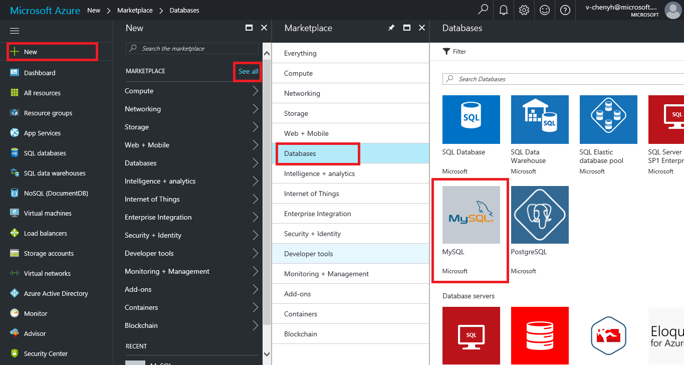
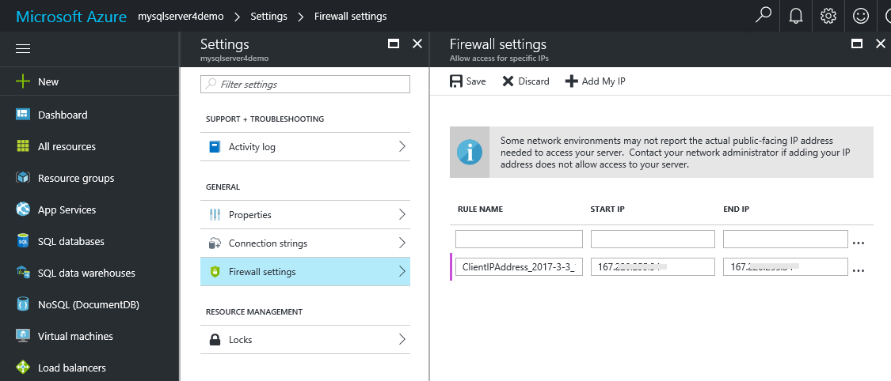

# Create an Azure Database for MySQL server using Azure portal

This article steps you through using the Azure portal to create a sample Azure Database for MySQL server in about five minutes. 

If you don't have an Azure subscription, create a [free](https://azure.microsoft.com/free/) account before you begin.

## Log in to Azure
Open your favorite web browser, and visit [Microsoft Azure portal](https://portal.azure.com/). Enter your credentials to log in to the portal. The default view is your service dashboard.


## Create Azure Database for MySQL server
1. Navigate to **Databases** > **MySQL**. If you cannot find MySQL Server under **Databases** category, click **See all** to show all available database services. You can also type **MySQL** in the search box to quickly find the service.



2. Click **MySQL** icon, and then click **Create**.

In our example, fill out the Azure Database for MySQL form with the following information:
- **Server name:** mysqlserver4demo (server name is globally unique)
- **Subscription:** MySQLaaS (select from drop-down)
- **Resource group:** myresource (create a resource group or use an existing one)
- **Server admin login:** myadmin (setup admin account name)
- **Password:**  (set up admin account password)
- **Confirm password:** (confirm admin account password)
- **Location:** North Europe (select between **North Europe** and **West US**)
- **Version:** 5.6 (choose MySQL server version)
- **Configure performance:** Basic (choose **Performance tier**, **Compute Units**, **Storage**, and then click **OK**)

In a minute or two, there is a MySQL server running in the cloud. You can click **Notifications** button on the toolbar to monitor the deployment process.

> [!TIP]
> We strongly recommend that you put Azure services in the same region and select the location closest to you. In addition, you can check the **Pin to dashboard** option to allow easy tracking of your deployments.


## Configure the firewall
Before connecting to Azure Database for MySQL from your client for the first time, you must configure the firewall and add the client's public network IP address (or IP address range) to the whitelist.
1. Click your newly created server, and then click **Settings**.


2. Under **GENERAL** section, click **Firewall settings**. You can **Add My IP**, or configure firewall rules here. Remember to click **Save** after you have created the rules.



## Connect to the server using mysql command-line tool

You can create multiple databases within a MySQL server. There is no limit to the number of databases that can be created, but multiple databases share server resources.
1. Click the server created in Step 1, then click **Properties**. Make note of the **SERVER NAME** and **SERVER ADMIN LOGIN** for later.


2. Connect to the server using **mysql** command-line tool:

```sql
 mysql -h mysqlserver4demo.database.windows.net -u
 myadmin@mysqlserver4demo -p
```


3. View server status:
```sql
 mysql> status
```
> [!TIP]
> TIP: For additional commands, see [MySQL 5.6 Reference Manual - Chapter 4.5.1](https://dev.mysql.com/doc/refman/5.6/en/mysql.html).

## Next steps
- To create an Azure Database for MySQL server with Azure CLI, see [Create MySQL server – CLI](mysql-quickstart-connect-query-using-mysql.md).
- To connect and query using MySQL Workbench GUI tool, see [Connect and query with Workbench](placeholder.md).
- For a technical overview of Azure Database for MySQL, see [About the Azure Database for MySQL service](placeholder.md).