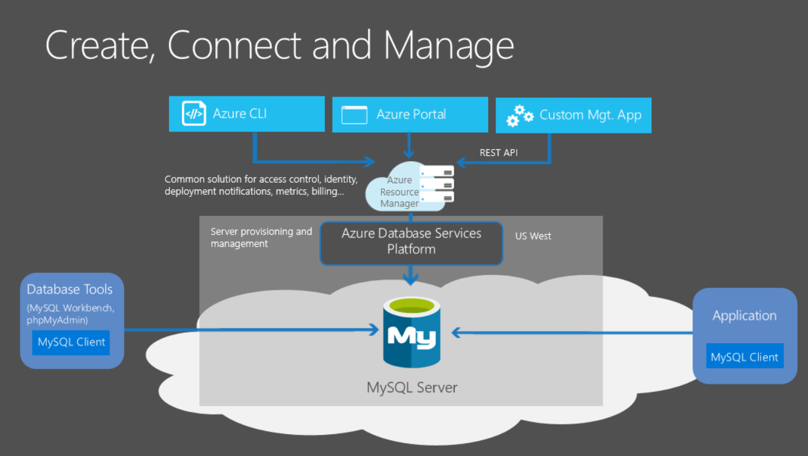

# What is Azure Database for MySQL?

Azure Database for MySQL is a relational database service in the Microsoft cloud based on the [MySQL Community Edition](https://www.mysql.com/products/community/) (available under the GPLv2 license) database engine, versions 5.6 and 5.7. Azure Database for MySQL delivers:

- Built-in high availability with no additional cost.
- Predictable performance, using inclusive pay-as-you-go pricing.
- Scale as needed within seconds.
- Secured to protect sensitive data at-rest and in-motion.
- Automatic backups and point-in-time-restore for up to 35 days.
- Enterprise-grade security and compliance.

These capabilities require almost no administration and all are provided at no additional cost. They allow you to focus on rapid app development and accelerating your time to market rather than allocating precious time and resources to managing virtual machines and infrastructure. In addition, you can continue to develop your application with the open-source tools and platform of your choice to deliver with the speed and efficiency your business demands, all without having to learn new skills.

This article is an introduction to Azure Database for MySQL core concepts and features related to performance, scalability, and manageability, with links to explore details. See these quickstarts to get you started:

- [Create an Azure Database for MySQL server using Azure portal](quickstart-create-mysql-server-database-using-azure-portal.md)
- [Create an Azure Database for MySQL server using Azure CLI](quickstart-create-mysql-server-database-using-azure-cli.md)

For a set of Azure CLI samples, see:

- [Azure CLI samples for Azure Database for MySQL](sample-scripts-azure-cli.md)

## Adjust performance and scale within seconds
The Azure Database for MySQL service offers several service tiers: Basic, General Purpose, and Memory Optimized. Each tier offers different performance and capabilities to support lightweight to heavyweight database workloads. You can build your first app on a small database for a few dollars a month, and then adjust the scale to meet the needs of your solution. Dynamic scalability enables your database to transparently respond to rapidly changing resource requirements. You only pay for the resources you need, and only when you need them. See [Pricing tiers](concepts-service-tiers.md) for details.

## Monitoring and alerting
How do you decide when to dial up and down? You use the built-in performance monitoring and alerting features, combined with the performance ratings based on vCores. Using these tools, you can quickly assess the impact of scaling vCores up or down based on your current or projected performance needs. See [Alerts](howto-alert-on-metric.md) for details.

## Keep your app and business running
Azure's industry leading 99.99% availability service level agreement (SLA), powered by a global network of Microsoft-managed datacenters, helps keep your app running 24/7. With every Azure Database for MySQL server, you take advantage of built-in security, fault tolerance, and data protection that you would otherwise have to buy or design, build, and manage. With Azure Database for MySQL, you can use point-in-time restore to recover a server to an earlier state, as far back as 35 days.

## Secure your data
Azure database services have a tradition of data security that Azure Database for MySQL upholds, with features that limit access, protect data at-rest and in-motion, and help you monitor activity. Visit the [Azure Trust Center](https://www.microsoft.com/en-us/trustcenter/security) for information about Azure's platform security.

The Azure Database for MySQL service uses storage encryption for data at-rest and is FIPS 140-2 compliant. Data, including backups, are encrypted on disk (with the exception of temporary files that are created by the engine while running queries). The service uses AES 256-bit cipher that is included in Azure storage encryption, and the keys are system managed. Storage encryption is always on and cannot be disabled.

By default, the Azure Database for MySQL service is configured to require [SSL connection security](./concepts-ssl-connection-security.md) for data in-motion across the network. Enforcing SSL connections between your database server and your client applications helps to protect against "man in the middle" attacks by encrypting the data stream between the server and your application. Optionally, you can disable requiring SSL for connecting to your database service if your client application does not support SSL connectivity.

## Contacts
For any questions or suggestions you might have about working with Azure Database for MySQL, send an email to the Azure Database for MySQL Team ([@Ask Azure DB for MySQL](mailto:AskAzureDBforMySQL@service.microsoft.com)). Note that this is not a technical support alias.

In addition, consider the following points of contact as appropriate:

- To contact Azure Support, [file a ticket from the Azure portal](https://portal.azure.com/?#blade/Microsoft_Azure_Support/HelpAndSupportBlade).
- To fix an issue with your account, file a [support request](https://ms.portal.azure.com/#blade/Microsoft_Azure_Support/HelpAndSupportBlade/newsupportrequest) in the Azure portal.
- To provide feedback or to request new features, create an entry via [UserVoice](https://feedback.azure.com/forums/597982-azure-database-for-mysql).

## Next steps
Now that you've read an introduction to Azure Database for MySQL and answered the question "What is Azure Database for MySQL?," you're ready to:

- See the pricing page for cost comparisons and calculators. [Pricing](https://azure.microsoft.com/pricing/details/mysql/)
- Get started by creating your first server. [Create an Azure Database for MySQL server using Azure portal](quickstart-create-mysql-server-database-using-azure-portal.md)
- Build your first app using your preferred language: [Python](./connect-python.md) | [Node.JS](./connect-nodejs.md) | [Java](./connect-java.md) | [Ruby](./connect-ruby.md) | [PHP](./connect-php.md) | [.NET (C#)](./connect-csharp.md) | [Go](./connect-go.md)
