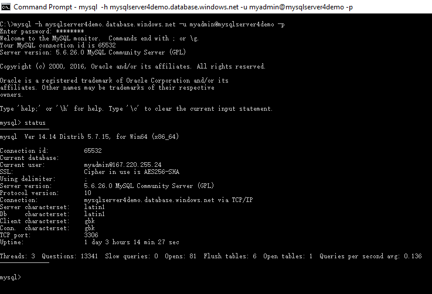

# Quickstart: Connect and query Azure Database for MySQL using mysql command-line tool
This quickstart describes how to use **mysql** command-line tool to connect and query a database in an Azure Database for MySQL server.

## Before you begin
Before you begin this quickstart, make sure you are ready with the following:
 
* **[mysql](https://dev.mysql.com/doc/refman/5.6/en/mysql.html) command-line tool** with input line editing capabilities. It supports interactive and noninteractive use. When used interactively, query results are presented in an ASCII-table format. When used noninteractively (for example, as a filter), the resulting format is tab-separated. The output format can be changed using command options.

* **An existing Azure Database for MySQL server**. Make sure you have created a server and enabled server-level firewall rules using one of the following quickstarts:
    - [Create Azure Database for MySQL server using Azure portal](quickstart-create-mysql-server-database-using-azure-portal.md)
    - [Create Azure Database for MySQL server using Azure CLI](quickstart-create-mysql-server-database-using-azure-cli.md)

> [!TIP]
> For more information about **mysql** command-line tool, see [MySQL 5.6 Reference Manual - Chapter 4.5.1](https://dev.mysql.com/doc/refman/5.6/en/mysql.html).

## Get connection information
From the Azure portal, get the fully qualified server name for your Azure Database for MySQL server. Use the server name to connect to your server using standard MySQL client application and tools.

1. Sign in to the [Azure portal](https://portal.azure.com/).
2. Click **All resources** from the left-hand menu, and click your Azure Database for MySQL server.
3. Click **Properties**. Make note of the **SERVER NAME** and **SERVER ADMIN LOGIN** for later. 


In this example, the server name is *mysqlserver4demo.database.windows.net*, and the server admin login is *myadmin@mysqlserver4demo*.

## Connect to the server
To connect to the database, enter the following into **mysql** command-line tool:

```dos
C:\mysql -h mysqlserver4demo.database.windows.net -u myadmin@mysqlserver4demo -p
```


## Create the database
The CREATE DATABASE command creates a database. Copy and paste the following command at the command prompt to create a database.
```sql
mysql> CREATE DATABASE mydemodb;
```
This command creates a database named `mydemodb`. If it executes successfully, mysql returns a message of "Query OK."

## Connect to the database
The USE command selects a database ready for executing the commands shown below. Copy and paste the following command at the mysql command prompt to connect to the database:

```sql
mysql> USE mydemodb;
```
This command changes selected database to `mydemodb` - the one created in the previous step. All subsequent manipulations are targeted to this selected database. If this command executes successfully, mysql returns a message of "Database changed."

## Create a table
The CREATE TABLE command creates a table. Copy and paste the following command at the mysql command prompt to create a table.
```sql
mysql> CREATE TABLE customers (CustomerID INT, CustomerName VARCHAR(50), PRIMARY KEY (CustomerID))ENGINE=InnoDB;
```
This command creates a table named `customers` that has two columns: CustomerID and CustomerName. CustomerID is the primary key. If it executes successfully, mysql returns a message of “Query OK”.

## Insert data into the table
The INSERT INTO command inserts data into a table. Copy and paste the following command at the mysql command prompt to insert data into selected table.

```sql
mysql> INSERT INTO customers (CustomerID, CustomerName) VALUES('1001', 'Hannah'), (‘1002’, ‘Peter’);
```
This command inserts two rows into `customers` table. If it executes successfully, mysql returns a message of "Query OK, 2 rows affected."

## Query data in the table
The SELECT command queries data rows from a table. Copy and paste the following command at the mysql command prompt to query all rows from the target table.
```sql
mysql> SELECT * FROM customers;
```
This command outputs two rows from table `customers`. If it executes successfully, mysql has the following output:


## Update data in the table
The UPDATE command updates existing rows in a table. Copy and paste the following command at the mysql command prompt to update one row.
```sql
mysql> UPDATE customers SET CustomerName='Rose' WHERE CustomerID='1002';
```
This command changes CustomerName from `Peter` to `Rose`. If it executes successfully, mysql returns a message of "Query OK, 1 row affected."

## Delete data in the table
The DELETE command can be used to delete existing rows in the table. Copy and paste the following command at the mysql command prompt to delete one row.
```sql
mysql> DELETE FROM customers WHERE CustomerName='Hannah';
```
This command deletes entire row of record that contains `Hannah`. If it executes successfully, mysql returns a message of "Query OK, 1 row affected."

## Delete entire table
The DROP command can be used to delete an entire table and its data. 

[!IMPORTANT] The DROP command cannot be undone. Make sure you want to delete the table and all its data.  

Copy and paste the following command at the mysql command prompt to delete entire table.
```sql
mysql> DROP TABLE customers;
```
This command deletes all rows in `customers` table, meaning the table no longer exists after this action. If this command executes successfully, mysql returns a message of "Query OK, 0 rows affected."

## Next steps
- For more information regarding mysql command-line tool, see [MySQL 5.6 Reference Manual - Chapter 4.5.1](https://dev.mysql.com/doc/refman/5.6/en/mysql.html)