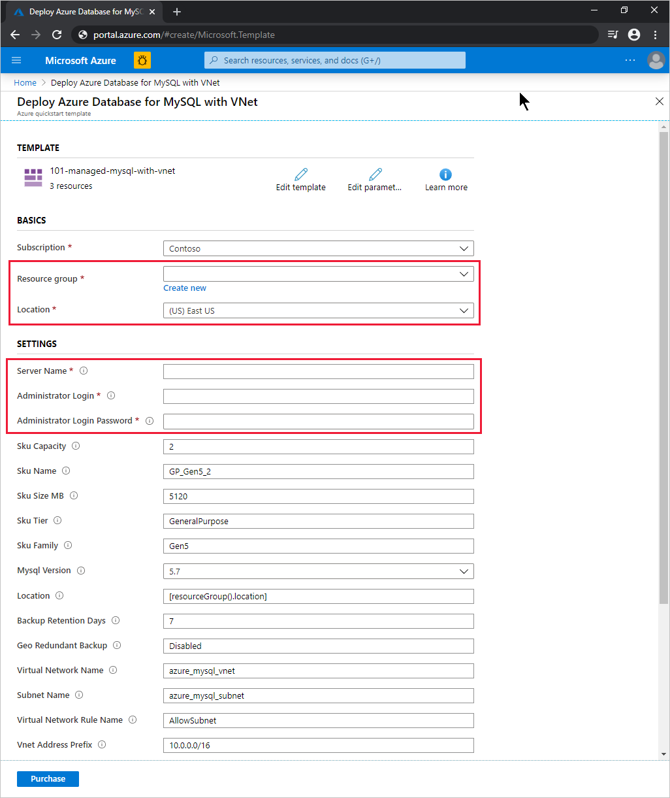

# Quickstart: Use an ARM template to create an Azure Database for MySQL server

Azure Database for MySQL is a managed service that you use to run, manage, and scale highly available MySQL databases in the cloud. In this quickstart, you use an ARM template to create an Azure Database for MySQL server with virtual network integration. You can create the server in the Azure portal, Azure CLI, or Azure PowerShell.

[!INCLUDE [About Azure Resource Manager](../../includes/resource-manager-quickstart-introduction.md)]

## Prerequisites

# [Portal](#tab/azure-portal)

An Azure account with an active subscription. [Create one for free](https://azure.microsoft.com/free/).

# [PowerShell](#tab/PowerShell)

* An Azure account with an active subscription. [Create one for free](https://azure.microsoft.com/free/).
* If you want to run the code locally, [Azure PowerShell](/powershell/azure/).

# [CLI](#tab/CLI)

* An Azure account with an active subscription. [Create one for free](https://azure.microsoft.com/free/).
* If you want to run the code locally, [Azure CLI](/cli/azure/).

---

## Create an Azure Database for MySQL server

You create an Azure Database for MySQL server with a defined set of compute and storage resources. To learn more, see [Azure Database for MySQL pricing tiers](concepts-pricing-tiers.md). You create the server within an [Azure resource group](../azure-resource-manager/management/overview.md).

### Review the template

The template used in this quickstart is from [Azure Quickstart Templates](https://azure.microsoft.com/resources/templates/101-managed-mysql-with-vnet/).

:::code language="json" source="~/quickstart-templates/101-managed-mysql-with-vnet/azuredeploy.json" range="001-231" highlight="149,162,176,199,213":::

The template defines five Azure resources:

* [**Microsoft.Network/virtualNetworks**](/azure/templates/microsoft.network/virtualnetworks)
* [**Microsoft.Network/virtualNetworks/subnets**](/azure/templates/microsoft.network/virtualnetworks/subnets)
* [**Microsoft.DBforMySQL/servers**](/azure/templates/microsoft.dbformysql/servers)
* [**Microsoft.DBforMySQL/servers/virtualNetworkRules**](/azure/templates/microsoft.dbformysql/servers/virtualnetworkrules)
* [**Microsoft.DBforMySQL/servers/firewallRules**](/azure/templates/microsoft.dbformysql/servers/firewallrules)

More Azure Database for MySQL template samples can be found in the [quickstart template gallery](https://azure.microsoft.com/resources/templates/?resourceType=Microsoft.Dbformysql&pageNumber=1&sort=Popular).

## Deploy the template

# [Portal](#tab/azure-portal)

Select the following link to deploy the Azure Database for MySQL server template in the Azure portal:

[](https://portal.azure.com/#create/Microsoft.Template/uri/https%3a%2f%2fraw.githubusercontent.com%2fAzure%2fazure-quickstart-templates%2fmaster%2f101-managed-mysql-with-vnet%2fazuredeploy.json)

On the **Deploy Azure Database for MySQL with VNet** page:

1. For **Resource group**, select **Create new**, enter a name for the new resource group, and select **OK**.

2. If you created a new resource group, select a **Location** for the resource group and the new server.

3. Enter a **Server Name**, **Administrator Login**, and **Administrator Login Password**.

    

4. Change the other default settings if you want:

    * **Subscription**: the Azure subscription you want to use for the server.
    * **Sku Capacity**: the vCore capacity, which can be *2* (the default), *4*, *8*, *16*, *32*, or *64*.
    * **Sku Name**: the SKU tier prefix, SKU family, and SKU capacity, joined by underscores, such as *B_Gen5_1*, *GP_Gen5_2* (the default), or *MO_Gen5_32*.
    * **Sku Size MB**: the storage size, in megabytes, of the Azure Database for MySQL server (default *5120*).
    * **Sku Tier**: the deployment tier, such as *Basic*, *GeneralPurpose* (the default), or *MemoryOptimized*.
    * **Sku Family**: *Gen4* or *Gen5* (the default), which indicates hardware generation for server deployment.
    * **Mysql Version**: the version of MySQL server to deploy, such as *5.6* or *5.7* (the default).
    * **Backup Retention Days**: the desired period for geo-redundant backup retention, in days (default *7*).
    * **Geo Redundant Backup**: *Enabled* or *Disabled* (the default), depending on geo-disaster recovery (Geo-DR) requirements.
    * **Virtual Network Name**: the name of the virtual network (default *azure_mysql_vnet*).
    * **Subnet Name**: the name of the subnet (default *azure_mysql_subnet*).
    * **Virtual Network Rule Name**: the name of the virtual network rule allowing the subnet (default *AllowSubnet*).
    * **Vnet Address Prefix**: the address prefix for the virtual network (default *10.0.0.0/16*).
    * **Subnet Prefix**: the address prefix for the subnet (default *10.0.0.0/16*).

5. Read the terms and conditions, and then select **I agree to the terms and conditions stated above**.

6. Select **Purchase**.

# [PowerShell](#tab/PowerShell)

Use the following interactive code to create a new Azure Database for MySQL server using the template. The code prompts you for the new server name, the name and location of a new resource group, and an administrator account name and password.

To run the code in Azure Cloud Shell, select **Try it** at the upper corner of any code block.

```azurepowershell-interactive
$serverName = Read-Host -Prompt "Enter a name for the new Azure Database for MySQL server"
$resourceGroupName = Read-Host -Prompt "Enter a name for the new resource group where the server will exist"
$location = Read-Host -Prompt "Enter an Azure region (for example, centralus) for the resource group"
$adminUser = Read-Host -Prompt "Enter the Azure Database for MySQL server's administrator account name"
$adminPassword = Read-Host -Prompt "Enter the administrator password" -AsSecureString

New-AzResourceGroup -Name $resourceGroupName -Location $location # Use this command when you need to create a new resource group for your deployment
New-AzResourceGroupDeployment -ResourceGroupName $resourceGroupName `
    -TemplateUri https://raw.githubusercontent.com/Azure/azure-quickstart-templates/master/101-managed-mysql-with-vnet/azuredeploy.json `
    -serverName $serverName `
    -administratorLogin $adminUser `
    -administratorLoginPassword $adminPassword

Read-Host -Prompt "Press [ENTER] to continue ..."
```

# [CLI](#tab/CLI)

Use the following interactive code to create a new Azure Database for MySQL server using the template. The code prompts you for the new server name, the name and location of a new resource group, and an administrator account name and password.

To run the code in Azure Cloud Shell, select **Try it** at the upper corner of any code block.

```azurecli-interactive
echo "Enter a name for the new Azure Database for MySQL server:" &&
read serverName &&
echo "Enter a name for the new resource group where the server will exist:" &&
read resourceGroupName &&
echo "Enter an Azure region (for example, centralus) for the resource group:" &&
read location &&
echo "Enter the Azure Database for MySQL server's administrator account name:" &&
read adminUser &&
echo "Enter the administrator password:" &&
read adminPassword &&
params='serverName='$serverName' administratorLogin='$adminUser' administratorLoginPassword='$adminPassword &&
az group create --name $resourceGroupName --location $location &&
az deployment group create --resource-group $resourceGroupName --parameters $params --template-uri https://raw.githubusercontent.com/Azure/azure-quickstart-templates/master/101-managed-mysql-with-vnet/azuredeploy.json &&
echo "Press [ENTER] to continue ..."
```

---

## Review deployed resources

# [Portal](#tab/azure-portal)

Follow these steps to see an overview of your new Azure Database for MySQL server:

1. In the [Azure portal](https://portal.azure.com), search for and select **Azure Database for MySQL servers**.

2. In the database list, select your new server. The **Overview** page for your new Azure Database for MySQL server appears.

# [PowerShell](#tab/PowerShell)

Run the following interactive code to view details about your Azure Database for MySQL server. You'll have to enter the name of the new server.

```azurepowershell-interactive
$serverName = Read-Host -Prompt "Enter the name of your Azure Database for MySQL server"
Get-AzResource -ResourceType "Microsoft.DBforMySQL/servers" -Name $serverName | ft
Write-Host "Press [ENTER] to continue..."
```

# [CLI](#tab/CLI)

Run the following interactive code to view details about your Azure Database for MySQL server. You'll have to enter the name and the resource group of the new server.

```azurecli-interactive
echo "Enter your Azure Database for MySQL server name:" &&
read serverName &&
echo "Enter the resource group where the Azure Database for MySQL server exists:" &&
read resourcegroupName &&
az resource show --resource-group $resourcegroupName --name $serverName --resource-type "Microsoft.DbForMySQL/servers"
```

---

## Clean up resources

When it's no longer needed, delete the resource group, which deletes the resources in the resource group.

# [Portal](#tab/azure-portal)

1. In the [Azure portal](https://portal.azure.com), search for and select **Resource groups**.

2. In the resource group list, choose the name of your resource group.

3. In the **Overview** page of your resource group, select **Delete resource group**.

4. In the confirmation dialog box, type the name of your resource group, and then select **Delete**.

# [PowerShell](#tab/PowerShell)

```azurepowershell-interactive
$resourceGroupName = Read-Host -Prompt "Enter the Resource Group name"
Remove-AzResourceGroup -Name $resourceGroupName
Write-Host "Press [ENTER] to continue..."
```

# [CLI](#tab/CLI)

```azurecli-interactive
echo "Enter the Resource Group name:" &&
read resourceGroupName &&
az group delete --name $resourceGroupName &&
echo "Press [ENTER] to continue ..."
```

---

## Next steps

For a step-by-step tutorial that guides you through the process of creating a template, see:

> [!div class="nextstepaction"]
> [ Tutorial: Create and deploy your first Azure Resource Manager template](../azure-resource-manager/templates/template-tutorial-create-first-template.md)
