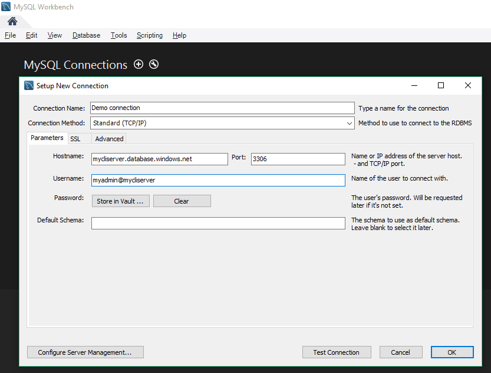

# Quickstart: Create an Azure Database for MySQL server using Azure CLI

> [!TIP]
> Consider using the simpler [az mysql up](/cli/azure/ext/db-up/mysql#ext-db-up-az-mysql-up) Azure CLI command (currently in preview). Try out the [quickstart](./quickstart-create-server-up-azure-cli.md).

This quickstart describes how to use the Azure CLI to create an Azure Database for MySQL server in an Azure resource group in about five minutes. The Azure CLI is used to create and manage Azure resources from the command line or in scripts.

If you don't have an Azure subscription, create a [free](https://azure.microsoft.com/free/) account before you begin.

[!INCLUDE [cloud-shell-try-it](../../includes/cloud-shell-try-it.md)]

If you choose to install and use the CLI locally, this article requires that you are running the Azure CLI version 2.0 or later. Run `az --version` to find the version. If you need to install or upgrade, see [Install Azure CLI]( /cli/azure/install-azure-cli). 

If you have multiple subscriptions, choose the appropriate subscription in which the resource exists or is billed for. Select a specific subscription ID under your account using [az account set](/cli/azure/account#az-account-set) command.
```azurecli-interactive
az account set --subscription 00000000-0000-0000-0000-000000000000
```

## Create a resource group
Create an [Azure resource group](https://docs.microsoft.com/azure/azure-resource-manager/resource-group-overview) using the [az group create](/cli/azure/group#az-group-create) command. A resource group is a logical container into which Azure resources are deployed and managed as a group.

The following example creates a resource group named `myresourcegroup` in the `westus` location.

```azurecli-interactive
az group create --name myresourcegroup --location westus
```

## Create an Azure Database for MySQL server
Create an Azure Database for MySQL server with the **[az mysql server create](/cli/azure/mysql/server#az-mysql-server-create)** command. A server can manage multiple databases. Typically, a separate database is used for each project or for each user.

**Setting** | **Sample value** | **Description**
---|---|---
name | mydemoserver | Choose a unique name that identifies your Azure Database for MySQL server. The server name can contain only lowercase letters, numbers, and the hyphen (-) character. It must contain from 3 to 63 characters.
resource-group | myresourcegroup | Provide the name of the Azure resource group.
sku-name | GP_Gen5_2 | The name of the sku. Follows the convention {pricing tier}\_{compute generation}\_{vCores} in shorthand. See below this table for more information about the sku-name parameter.
backup-retention | 7 | How long a backup should be retained. Unit is days. Range is 7-35. 
geo-redundant-backup | Disabled | Whether geo-redundant backups should be enabled for this server or not. Allowed values: Enabled, Disabled.
location | westus | The Azure location for the server.
ssl-enforcement | Enabled | Whether ssl should be enabled or not for this server. Allowed values: Enabled, Disabled.
storage-size | 51200 | The storage capacity of the server (unit is megabytes). Valid storage-size is minimum 5120MB and increases in 1024MB increments. See the [pricing tiers](./concepts-pricing-tiers.md) document for more information about storage size limits. 
version | 5.7 | The MySQL major version.
admin-user | myadmin | The username for the administrator login. It cannot be **azure_superuser**, **admin**, **administrator**, **root**, **guest**, or **public**.
admin-password | *secure password* | The password of the administrator user. It must contain between 8 and 128 characters. Your password must contain characters from three of the following categories: English uppercase letters, English lowercase letters, numbers, and non-alphanumeric characters.


The sku-name parameter value follows the convention {pricing tier}\_{compute generation}\_{vCores} as in the examples below:
+ `--sku-name B_Gen5_1` maps to Basic, Gen 5, and 1 vCore. This option is the smallest SKU available.
+ `--sku-name GP_Gen5_32` maps to General Purpose, Gen 5, and 32 vCores.
+ `--sku-name MO_Gen5_2` maps to Memory Optimized, Gen 5, and 2 vCores.

Please see the [pricing tiers](./concepts-pricing-tiers.md) documentation to understand the valid values per region and per tier.

The following example creates a MySQL 5.7 server in West US named `mydemoserver` in your resource group `myresourcegroup` with server admin login `myadmin`. This is a **Gen 4** **General Purpose** server with **2 vCores**. Substitute the `<server_admin_password>` with your own value.

```azurecli-interactive
az mysql server create --resource-group myresourcegroup --name mydemoserver  --location westus --admin-user myadmin --admin-password <server_admin_password> --sku-name GP_Gen5_2 --version 5.7
```

> [!NOTE]
> Consider using the Basic pricing tier if light compute and I/O are adequate for your workload. Note that servers created in the Basic pricing tier cannot later be scaled to General Purpose or Memory Optimized. See the [pricing page](https://azure.microsoft.com/pricing/details/mysql/) for more information.
> 

## Configure firewall rule
Create an Azure Database for MySQL server-level firewall rule using the **[az mysql server firewall-rule create](/cli/azure/mysql/server/firewall-rule#az-mysql-server-firewall-rule-create)** command. A server-level firewall rule allows an external application, such as the **mysql.exe** command-line tool or MySQL Workbench to connect to your server through the Azure MySQL service firewall. 

The following example creates a firewall rule called `AllowMyIP` that allows connections from a specific IP address, 192.168.0.1. Substitute in the IP address or range of IP addresses that correspond to where you'll be connecting from. 

```azurecli-interactive
az mysql server firewall-rule create --resource-group myresourcegroup --server mydemoserver --name AllowMyIP --start-ip-address 192.168.0.1 --end-ip-address 192.168.0.1
```

> [!NOTE]
> Connections to Azure Database for MySQL communicate over port 3306. If you try to connect from within a corporate network, outbound traffic over port 3306 might not be allowed. If this is the case, you can't connect to your server unless your IT department opens port 3306.
> 


## Configure SSL settings
By default, SSL connections between your server and client applications are enforced. This default ensures security of "in-motion" data by encrypting the data stream over the internet. To make this quick start easier, disable SSL connections for your server. Disabling SSL is not recommended for production servers. For more information, see [Configure SSL connectivity in your application to securely connect to Azure Database for MySQL](./howto-configure-ssl.md).

The following example disables enforcing SSL on your MySQL server.
 
 ```azurecli-interactive
 az mysql server update --resource-group myresourcegroup --name mydemoserver --ssl-enforcement Disabled
 ```

## Get the connection information

To connect to your server, you need to provide host information and access credentials.

```azurecli-interactive
az mysql server show --resource-group myresourcegroup --name mydemoserver
```

The result is in JSON format. Make a note of the **fullyQualifiedDomainName** and **administratorLogin**.
```json
{
  "administratorLogin": "myadmin",
  "earliestRestoreDate": null,
  "fullyQualifiedDomainName": "mydemoserver.mysql.database.azure.com",
  "id": "/subscriptions/00000000-0000-0000-0000-000000000000/resourceGroups/myresourcegroup/providers/Microsoft.DBforMySQL/servers/mydemoserver",
  "location": "westus",
  "name": "mydemoserver",
  "resourceGroup": "myresourcegroup",
  "sku": {
    "capacity": 2,
    "family": "Gen5",
    "name": "GP_Gen5_2",
    "size": null,
    "tier": "GeneralPurpose"
  },
  "sslEnforcement": "Enabled",
  "storageProfile": {
    "backupRetentionDays": 7,
    "geoRedundantBackup": "Disabled",
    "storageMb": 5120
  },
  "tags": null,
  "type": "Microsoft.DBforMySQL/servers",
  "userVisibleState": "Ready",
  "version": "5.7"
}
```

## Connect to the server using the mysql.exe command-line tool
Connect to your server using the **mysql.exe** command-line tool. You can download MySQL from [here](https://dev.mysql.com/downloads/) and install it on your computer. 

Type the next commands: 

1. Connect to the server using **mysql** command-line tool:
   ```bash
   mysql -h mydemoserver.mysql.database.azure.com -u myadmin@mydemoserver -p
   ```

2. View server status:
   ```sql
   mysql> status
   ```
   If everything goes well, the command-line tool should output the following text:

```dos
C:\Users\>mysql -h mydemoserver.mysql.database.azure.com -u myadmin@mydemoserver -p
Enter password: ***********
Welcome to the MySQL monitor.  Commands end with ; or \g.
Your MySQL connection id is 65512
Server version: 5.6.26.0 MySQL Community Server (GPL)

Copyright (c) 2000, 2016, Oracle and/or its affiliates. All rights reserved.

Oracle is a registered trademark of Oracle Corporation and/or its
affiliates. Other names may be trademarks of their respective
owners.

Type 'help;' or '\h' for help. Type '\c' to clear the current input statement.

mysql> status
--------------
mysql  Ver 14.14 Distrib 5.6.35, for Win64 (x86_64)

Connection id:          65512
Current database:
Current user:           myadmin@116.230.243.143
SSL:                    Not in use
Using delimiter:        ;
Server version:         5.6.26.0 MySQL Community Server (GPL)
Protocol version:       10
Connection:             mydemoserver.mysql.database.azure.com via TCP/IP
Server characterset:    latin1
Db     characterset:    latin1
Client characterset:    gbk
Conn.  characterset:    gbk
TCP port:               3306
Uptime:                 2 days 9 hours 47 min 20 sec

Threads: 4  Questions: 34833  Slow queries: 2  Opens: 84  Flush tables: 4  Open tables: 1  Queries per second avg: 0.167
--------------

mysql>
```

> [!TIP]
> For additional commands, see [MySQL 5.7 Reference Manual - Chapter 4.5.1](https://dev.mysql.com/doc/refman/5.7/en/mysql.html).

## Connect to the server using the MySQL Workbench GUI tool
1. Launch the MySQL Workbench application on your client computer. You can download and install MySQL Workbench from [here](https://dev.mysql.com/downloads/workbench/).

2. In the **Setup New Connection** dialog box, enter the following information on **Parameters** tab:

   

| **Setting** | **Suggested Value** | **Description** |
|---|---|---|
|	Connection Name | My Connection | Specify a label for this connection (this can be anything) |
| Connection Method | choose Standard (TCP/IP) | Use TCP/IP protocol to connect to Azure Database for MySQL> |
| Hostname | mydemoserver.mysql.database.azure.com | Server name you previously noted. |
| Port | 3306 | The default port for MySQL is used. |
| Username | myadmin@mydemoserver | The server admin login you previously noted. |
| Password | **** | Use the admin account password you configured earlier. |

Click **Test Connection** to test if all parameters are correctly configured.
Now, you can click the connection to successfully connect to the server.

## Clean up resources
If you don't need these resources for another quickstart/tutorial, you can delete them by doing the following command: 

```azurecli-interactive
az group delete --name myresourcegroup
```

If you would just like to delete the one newly created server, you can run **[az mysql server delete](/cli/azure/mysql/server#az-mysql-server-delete)** command.
```azurecli-interactive
az mysql server delete --resource-group myresourcegroup --name mydemoserver
```

## Next steps

> [!div class="nextstepaction"]
> [Design a MySQL Database with Azure CLI](./tutorial-design-database-using-cli.md)
