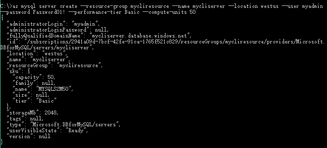

# Create an Azure Database for MySQL server using Azure CLI
This quickstart describes how to use the Azure CLI to create an Azure Database for MySQL server in an Azure resource group in about five minutes. The Azure CLI is used to create and manage Azure resources from the command line or in scripts.

To complete this quickstart, make sure you have installed the latest [Azure CLI 2.0](https://docs.microsoft.com/cli/azure/install-azure-cli). 

If you don't have an Azure subscription, create a [free](https://azure.microsoft.com/free/) account before you begin.

## Log in to Azure
Log in to your Azure subscription with the [az login](/cli/azure/#login) command and follow the on-screen directions.

```azurecli
az login
```
Follow the command prompt instructions to open https://aka.ms/devicelog in your browser, and then enter the code generated in the **command prompt**.

## Create a resource group
Create an [Azure resource group](https://docs.microsoft.com/en-us/azure/azure-resource-manager/resource-group-overview) using the [az group create](https://docs.microsoft.com/cli/azure/group#create) command. A resource group is a logical container into which Azure resources are deployed and managed as a group.

The following example creates a resource group named `mycliresource` in the `westus` location.

```azurecli
az group create --name mycliresource --location westus
```

## Create an Azure Database for MySQL server
Create an Azure Database for MySQL server with the **az mysql server create** command. A server can manage multiple databases. Typically, a separate database is used for each project or for each user.

The following example creates an Azure Database for MySQL server located in `westus` in the resource group `mycliresource` with name `mycliserver`. The server has an administrator log in named `myadmin` and password `Password01!`. The server is created with **Basic** performance tier and **50** compute units shared between all the databases in the server. You can scale compute and storage up or down depending on the application needs.

```azurecli
az mysql server create --resource-group mycliresource --name mycliserver--location westus --user myadmin --password Password01! --performance-tier Basic --compute-units 50
```



## Configure firewall rule
Create an Azure Database for MySQL server-level firewall rule using the **az mysql server firewall-rule create** command. A server-level firewall rule allows an external application, such as the **mysql.exe** command-line tool or MySQL Workbench to connect to your server through the Azure MySQL service firewall. 

The following example creates a firewall rule for a predefined address range, which in this example is the entire possible range of IP addresses.

```azurecli
az mysql server firewall-rule create --resource-group mycliresource --server mycliserver --name AllowYourIP --start-ip-address 0.0.0.0 --end-ip-address 255.255.255.255
```
## Configure SSL settings
By default, SSL connections between your server and client applications are enforced.  This ensures security of "in-motion" data by encrypting the data stream over the internet.  To make this quick start easy, we will be disabling SSL connections for your server.  This is not reccomended for production servers.  For more details, see [Configure SSL connectivity in your application to securely connect to Azure Database for MySQL](./howto-configure-ssl.md).

The following example disables enforcing SSL on your MySQL server.
 
 ```azurecli
 az mysql server update --resource-group mycliresource --name mycliserver -g -n --ssl-enforcement Disabled
 ```

## Get the connection information

To connect to your server, you need to provide host information and access credentials.

```azurecli
az mysql server show --resource-group mycliresource --name mycliserver
```

The result is in JSON format. Make a note of the **fullyQualifiedDomainName** and **administratorLogin**.
```json
{
  "administratorLogin": "myadmin",
  "administratorLoginPassword": null,
  "fullyQualifiedDomainName": "mycliserver.mysql.database.azure.com",
  "id": "/subscriptions/00000000-0000-0000-0000-000000000000/resourceGroups/mycliresource/providers/Microsoft.DBforMySQL/servers/mycliserver",
  "location": "westus",
  "name": "mycliserver",
  "resourceGroup": "mycliresource",
  "sku": {
    "capacity": 50,
    "family": null,
    "name": "MYSQLS2M50",
    "size": null,
    "tier": "Basic"
  },
  "storageMb": 2048,
  "tags": null,
  "type": "Microsoft.DBforMySQL/servers",
  "userVisibleState": "Ready",
  "version": null
}
```

## Connect to the server using the mysql.exe command-line tool
To connect to your server using the **mysql.exe** command-line tool, make sure you have the MySQL installation on your computer.  You can download MySQL from [here](https://dev.mysql.com/downloads/).

Open the command prompt and enter the following: 

1. Connect to the server using **mysql** command-line tool:
```dos
 mysql -h mycliserver.mysql.database.azure.com -u myadmin@mycliserver -p
```

2. View server status:
```dos
 mysql> status
```
If everything goes well, the command-line tool should output the following:

```dos
C:\Users\v-chenyh>mysql -h mycliserver.mysql.database.azure.com -u myadmin@mycliserver -p
Enter password: ***********
Welcome to the MySQL monitor.  Commands end with ; or \g.
Your MySQL connection id is 65512
Server version: 5.6.26.0 MySQL Community Server (GPL)

Copyright (c) 2000, 2016, Oracle and/or its affiliates. All rights reserved.

Oracle is a registered trademark of Oracle Corporation and/or its
affiliates. Other names may be trademarks of their respective
owners.

Type 'help;' or '\h' for help. Type '\c' to clear the current input statement.

mysql> status
--------------
mysql  Ver 14.14 Distrib 5.6.35, for Win64 (x86_64)

Connection id:          65512
Current database:
Current user:           myadmin@116.230.243.143
SSL:                    Not in use
Using delimiter:        ;
Server version:         5.6.26.0 MySQL Community Server (GPL)
Protocol version:       10
Connection:             mycliserver.mysql.database.azure.com via TCP/IP
Server characterset:    latin1
Db     characterset:    latin1
Client characterset:    gbk
Conn.  characterset:    gbk
TCP port:               3306
Uptime:                 2 days 9 hours 47 min 20 sec

Threads: 4  Questions: 34833  Slow queries: 2  Opens: 84  Flush tables: 4  Open tables: 1  Queries per second avg: 0.167
--------------

mysql>
```

> [!TIP]
> For additional commands, see [MySQL 5.6 Reference Manual - Chapter 4.5.1](https://dev.mysql.com/doc/refman/5.6/en/mysql.html).

## Connect to the server using the MySQL Workbench GUI tool
1.	Launch the MySQL Workbench application on your client computer. You can download and install MySQL Workbench from [here](https://dev.mysql.com/downloads/workbench/).

2.	In the **Setup New Connection** dialog box, enter the following information on **Parameters** tab:

| **Parameters** | **Description** |
|----------------|-----------------|
|	*Connection Name* | specify a name for this connection (this can be anything) |
| *Connection Method* | choose Standard (TCP/IP) |
| *Hostname* | mycliserver.mysql.database.azure.com (Server name you previously noted) |
| *Port* | 3306 |
| *Username* | myadmin@mycliserver (Server admin login you previously noted) |
| *Password* | Please store the admin account password |

   

Click **Test Connection** to test if all parameters are correctly configured.
Now, you can click the connection just created to successfully connect to the server.

## Clean up resources

If you don't need these resources for another quickstart/tutorial, you can delete them by doing the following: 

```azurecli
az group delete --name mycliresource
```

## Next steps

> [!div class="nextstepaction"]
> [Design a MySQL Database with Azure CLI](./tutorial-design-database-using-cli.md)
