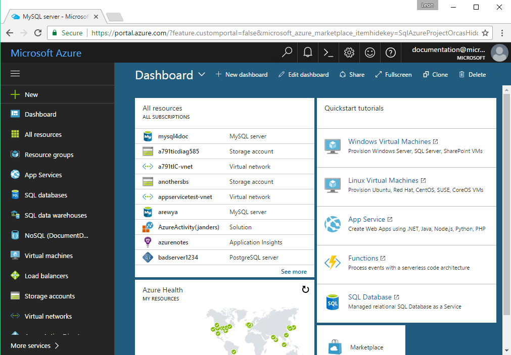

# Create an Azure Database for MySQL server using Azure portal

This article steps you through using the Azure portal to create a sample Azure Database for MySQL server in about five minutes. 

If you don't have an Azure subscription, create a [free](https://azure.microsoft.com/free/) account before you begin.

## Log in to Azure
Open your favorite web browser, and visit [Microsoft Azure portal](https://portal.azure.com/). Enter your credentials to log in to the portal. The default view is your service dashboard.



## Create Azure Database for MySQL server

1. Navigate to **Databases** > **MySQL**. If you cannot find MySQL Server under **Databases** category, click **See all** to show all available database services. You can also type **MySQL** in the search box to quickly find the service.


2. Click **MySQL** icon, and then click **Create**.
In our example, fill out the Azure Database for MySQL form with the following information:

- **Server name:** mysqlserver4demo (server name is globally unique)
- **Subscription:** MySQLaaS (select from drop-down)
- **Resource group:** myresource (create a resource group or use an existing one)
- **Server admin login:** myadmin (setup admin account name)
- **Password:**  (set up admin account password)
- **Confirm password:** (confirm admin account password)
- **Location:** North Europe (select between **North Europe** and **West US**)
- **Version:** 5.6 (choose MySQL server version)
- **Configure performance:** Basic (choose **Performance tier**, **Compute Units**, **Storage**, and then click **OK**)


  In a few minutes, there is a MySQL server running in the cloud. You can click **Notifications** button (bell icon) on the toolbar to monitor the deployment process.

> [!TIP]
> We recommend that you put Azure services in the same region and select the location closest to you. In addition, you can check the **Pin to dashboard** option to allow easy tracking of your deployments.

## Configure the firewall
Before connecting to Azure Database for MySQL from your client for the first time, you must configure the firewall and add the client's public network IP address (or IP address range) to the whitelist.

1. Click your newly created server, and then click **Settings**.
  

2. Under the **GENERAL** section, click **Firewall settings**. You can click to **Add My IP**, or configure firewall rules here. Remember to click **Save** after you have created the rules.
  

## Get connection information
Get the fully qualified server name for your Azure MySQL server in the Azure portal. You use the fully qualified server name to connect to your server using mysql command line tool.

1.	In [Azure portal](https://portal.azure.com/), click **All resources** from the left-hand menu, and click your Azure Database for MySQL server.

2.	Click **Properties**. Note down **SERVER NAME** and **SERVER ADMIN LOGIN**.
In this example, the server name is *mysql4doc.database.windows.net*, and the server admin login is *mysqladmin@mysql4doc*.

## Connect to the server using mysql command-line tool
You can create multiple databases within a MySQL server. There is no limit to the number of databases that can be created, but multiple databases share server resources.

1. Connect to the server using **mysql** command-line tool:
```dos
 mysql -h mysqlserver4demo.database.windows.net -u myadmin@mysqlserver4demo -p
```

2. View server status:
```dos
 mysql> status
```
  

> [!TIP]
> TIP: For additional commands, see [MySQL 5.6 Reference Manual - Chapter 4.5.1](https://dev.mysql.com/doc/refman/5.6/en/mysql.html).

## Connect to the server using Workbench GUI tool
1.	Launch the Workbench application on your client computer. You can download and install Workbench from [here](https://dev.mysql.com/downloads/workbench/).

2.	In **Setup New Connection** dialog box, enter the following information on **Parameters** tab:

-	**Connection Name**: specify a name for this connection
-	**Connection Method**: choose Standard (TCP/IP)
-	**Hostname**: mysqlserver4demo.database.windows.net (SERVER NAME you note down previously)
-	**Port**: 3306
-	**Username**: myadmin@mysqlserver4demo (SERVER ADMIN LOGIN you note down previously)
-	**Password**: you can store admin account password in vault


3.	Click **Test Connection** to test if all parameters are correctly configured.

4.	Now, you can click the connection just created to successfully connect to the server.

> SSL is enforced by default while server is created, which means you need extra configuration to enable connection. You could go to “connection security” on the portal to disable enforcing SSL or configure SSL in MySQL Workbench. It is recommended to enforce SSL to ensure higher security.

## Clean up resources
Clean-up all resources you created in the quickstart by deleting the [Azure resource group](../azure-resource-manager/resource-group-overview.md).

> [!TIP]
> Other quickstarts in this collection build upon this quick start. If you plan to continue on to work with subsequent quickstarts, do not clean up the resources created in this quickstart. If you do not plan to continue, use the following steps to delete all resources created by this quickstart in the Azure portal.

1.	From the left-hand menu in the Azure portal, click **Resource groups** and then click **myresource**.

2.	On your resource group page, click **Delete**, type **myresource** in the text box, and then click Delete.

If you just would like to delete the newly created server:

1.	From the left-hand menu in Azure portal, click Azure Database for MySQL servers and then search for the server you just created.

2.	On the **Overview** page, click the **Delete** button on the top pane.


3.	Confirm the server name you want to delete, and show the databases under it that is affected. Type **mysqlserver4demo** in the text box, and then click **Delete**.

## Next steps
- To create Azure Database for MySQL server via Azure CLI, see [Create Azure Database for MySQL server using Azure CLI](./quickstart-create-mysql-server-database-using-azure-cli.md).
- For a technical overview, see [About the Azure Database for MySQL service](./overview.md).