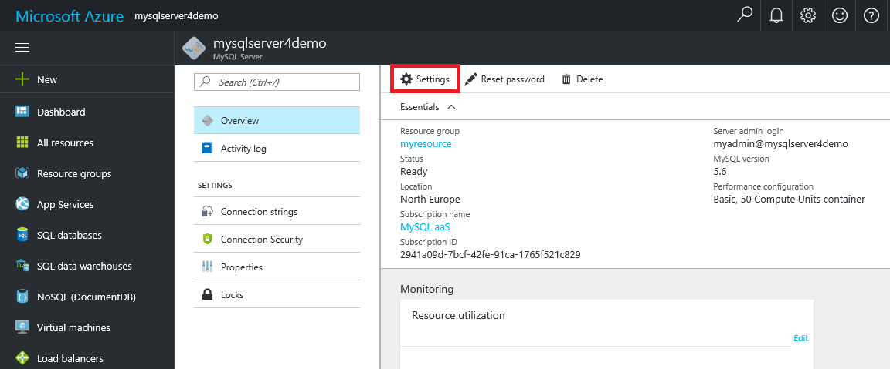

# Create an Azure Database for MySQL server using Azure portal

This article walks you through using the Azure portal to create a sample Azure Database for MySQL server in about five minutes. 

If you don't have an Azure subscription, create a [free](https://azure.microsoft.com/free/) account before you begin.

## Log in to Azure
Open your web browser, and navigate to the [Microsoft Azure portal](https://portal.azure.com/). Enter your credentials to log in to the portal. The default view is your service dashboard.

## Create Azure Database for MySQL server

1. Navigate to **Databases** > **MySQL**. If you cannot find Azure Database for MySQL Server under the **Databases** category, click **See all** to show all available database services. You can also type **MySQL** in the search box to quickly find the service.


2. Click the **MySQL** icon, and then click **Create**.
In our example, fill out the Azure Database for MySQL page with the following information:

| **Form Field** | **Field Description** |
|----------------|-----------------------|
| *Server name* | mysqlserver4demo (server name is globally unique) |
| *Subscription* | MySQLaaS (select from drop-down) |
| *Resource group* | myresource (create a resource group or use an existing one) |
| *Server admin login* | myadmin (setup admin account name) |
| *Password* | set up admin account password |
| *Confirm password* | confirm admin account password |
| *Location* | North Europe (select between **North Europe** and **West US**) |
| *Version* | 5.6 (choose MySQL server version) |
| *Configure performance* | Basic (choose **Performance tier**, **Compute Units**, **Storage**, and then click **OK**) |


After a few minutes, your Azure Database for MySQL server will be provisioned and running. You can click the **Notifications** button (bell icon) on the toolbar to monitor the deployment process.

> [!TIP]
> We recommend that you put Azure services in the same region and select the location closest to you. In addition, you can check the **Pin to dashboard** option to allow easy tracking of your deployments.

## Configure the firewall
Before connecting to Azure Database for MySQL from your client for the first time, you must configure the firewall and add the client's public network IP address (or IP address range) to the whitelist.

1. Click your newly created server, and then click **Settings**.
  

2. Under the **GENERAL** section, click **Firewall settings**. You can click **Add My IP** to add your local computer's IP address, or configure a range of IP addresses. Remember to click **Save** after you have created the rules.
  

## Get connection information
Get the fully qualified domain name for your Azure MySQL server in the Azure portal. You use the fully qualified domain name to connect to your server using the **mysql.exe** command line tool.

1.	In [Azure portal](https://portal.azure.com/), click **All resources** from the left-hand menu, and click your Azure Database for MySQL server.

2.	Click **Properties**. Note down **SERVER NAME** and **SERVER ADMIN LOGIN**.
In this example, the server name is *mysql4doc.database.windows.net*, and the server admin login is *mysqladmin@mysql4doc*.

## Connect to the server using mysqlexe command-line tool
You can create multiple databases within a MySQL server. There is no limit to the number of databases that can be created, but multiple databases share the same server resources.  To connect to your server using the **mysql.exe** command-line tool, open the **Azure Cloud Shell** in the portal and enter the following:

1. Connect to the server using **mysql** command-line tool:
```dos
 mysql -h mysqlserver4demo.database.windows.net -u myadmin@mysqlserver4demo -p
```

2. View server status:
```dos
 mysql> status
```
  

> [!TIP]
> For additional commands, see [MySQL 5.6 Reference Manual - Chapter 4.5.1](https://dev.mysql.com/doc/refman/5.6/en/mysql.html).

## Connect to the server using the MySQL Workbench GUI tool
1.	Launch the MySQL Workbench application on your client computer. You can download and install MySQL Workbench from [here](https://dev.mysql.com/downloads/workbench/).

2.	In **Setup New Connection** dialog box, enter the following information on **Parameters** tab:

| **Parameters** | **Description** |
|----------------|-----------------|
|	*Connection Name* | specify a name for this connection (this can be anything) |
| *Connection Method* | choose Standard (TCP/IP) |
| *Hostname* | mycliserver.database.windows.net (SERVER NAME you note down previously) |
| *Port* | 3306 |
| *Username* | myadmin@mycliserver (SERVER ADMIN LOGIN you note down previously) |
| *Password* | you can store admin account password in vault |


3.	Click **Test Connection** to test if all parameters are correctly configured.

4.	Now, you can click the connection just created to successfully connect to the server.

> SSL is enforced by default on your server which requires extra configuration in order to connect successfully. See [Configure SSL connectivity in your application to securely connect to Azure Database for MySQL](./howto-configure-ssl.md).  If you want to disable SSL for this quick start, you can go to “Connection security” in the portal to disable enforcing SSL.

## Clean up resources

If you don't need these resources for another quickstart/tutorial, you can delete them by doing the following:

1. From the left-hand menu in the Azure portal, click **Resource groups** and then click **myresource**. 
2. On your resource group page, click **Delete**, type **myresource** in the text box, and then click **Delete**.

## Next steps

> [!div class="nextstepaction"]
> [Design your first Azure Database for MySQL database](./tutorial-design-database-using-portal.md)

