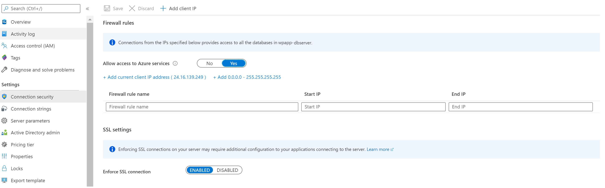

# Create an Azure Database for MySQL server by using the Azure portal

Azure Database for MySQL is a managed service that you use to run, manage, and scale highly available MySQL Databases in the cloud. This Quickstart shows you how to create an Azure Database for MySQL server in about five minutes using the Azure portal.  

If you don't have an Azure subscription, create a [free Azure account](https://azure.microsoft.com/free/) before you begin.

## Sign in to the Azure portal
Open your web browser, and then go to the [Azure portal](https://portal.azure.com/). Enter your credentials to sign in to the portal. The default view is your service dashboard.

## Create an Azure Database for MySQL server
You create an Azure Database for MySQL server with a defined set of [compute and storage resources](./concepts-compute-unit-and-storage.md). You create the server within an [Azure resource group](../azure-resource-manager/management/overview.md).

Follow these steps to create an Azure Database for MySQL server:

1. Select **Create a resource** (+) in the upper-left corner of the  portal.

2. Select **Databases** > **Azure Database for MySQL**. You can also enter **MySQL** in the search box to find the service.

   

3. Fill out the new server details form with the following information:
   
   

    **Setting** | **Suggested value** | **Field description** 
    ---|---|---
    Server name | Unique server name | Enter a unique name that identifies your Azure Database for MySQL server. For example, 'mysqldbserver'.The server name can contain only lowercase letters, numbers, and the hyphen (-) character. It must contain from 3 to 63 characters.
    Subscription | Your subscription | Select the Azure subscription that you want to use for your server. If you have multiple subscriptions, choose the subscription in which you get billed for the resource.
    Resource group | *myresourcegroup* | Provide a new or existing resource group name. Resource group can be used organize you azure dependencies that belong to single project.
    Select source | *Blank* | Select *Blank* to create a new server from scratch. (You select *Backup* if you are creating a server from a geo-backup of an existing Azure Database for MySQL server).
    Server admin login | myadmin | A sign-in account to use when you're connecting to the server. The admin sign-in name cannot be **azure_superuser**, **admin**, **administrator**, **root**, **guest**, or **public**.
    Password | *Your choice* | Provide a new password for the server admin account. It must contain from 8 to 128 characters with a combination of uppercase or lowercase letters, numbers, and non-alphanuric characters (!, $, #, %, and so on).
    Confirm password | *Your choice*| Confirm the admin account password.
    Location | *The region closest to your users*| Choose the location that is closest to your users or your other Azure applications.
    Version | *The latest major version*| The latest major version (unless you have specific requirements that require another version).
    Compute + Storage | **General Purpose**, **Gen 5**, **2 vCores**, **5 GB**, **7 days**, **Geographically Redundant** | Click on **Configure server** to modify these compute , storage size and backup retention period. For read/write heavy workloads choose a higher compute (vvcores) and storage size. Price of yourserver depends on the compute, storage configuration and backup retention configuration. We have three pricing tiers : **Basic** , **General Purpose** and **Memory Optimized** and see the [pricing page](https://azure.microsoft.com/pricing/details/mysql/) for more information. .

4. Select **Review + create** to provision the server. Provisioning can take up to 20 minutes.
   
5. Select **Notifications** on the toolbar (the bell icon) to monitor the deployment process.
   
   By default, the following databases are created under your server: **information_schema**, **mysql**, **performance_schema**, and **sys**.

## Configure a server-level firewall rule
By default the server created is not publicly accessible and you need to give permissions to your local machine IP. To give access to your IP , go to your server resource in the Azure portal and select **Connection security** from left side menu for your server resource.  If you are not sure how to find your resource , see [How to open a resource](https://docs.microsoft.com/en-us/azure/azure-resource-manager/management/manage-resources-portal#open-resources).

   
   
Now click on **Add current client IP address** and then click on **Save** . You can add additional IPs or provide an IP range to give access to your server. For more information, see [How to manage firewall rules on Azure Database for MySQL server](./concepts-firewall-rules.md)

## Connect to your server using the mysql client in Azure Cloud Shell
If you dont have any MySQL tools installed , using [Azure Cloud Shell](https://docs.microsoft.com/en-us/azure/cloud-shell/overview) in the portal is the easiest way to connect to your server . 
- Launch Azure Cloud Shell in the portal by clicking in this icon on the top left side. Make a note of your server name , server admin login name , password and subscription Id for your newly created server from the **Overview** section of your server as shown in the image below.

> Note: If you are launching cloud shell for the first time, you will see a prompt to create a resource group, storage account. This is a one-time step and will be automatically attached for all sessions. 


- Azure cloud shell has **MySQL command-line tool** available to use to connect to your server and perform database operations , so you can run this command directly . Replace values with your actual server name and admin user login name . Admin username requires '@<servername> as shown below for Azure Database for MySQL  

```azurecli-interactive
mysql --host <fully qualified server name> --user <server admin username>@<server name> -p
```
Here is how the experience looks like in the Cloud Shell terminal
```
Requesting a Cloud Shell.Succeeded.
Connecting terminal...

Welcome to Azure Cloud Shell

Type "az" to use Azure CLI
Type "help" to learn about Cloud Shell

sunitha@Azure:~$mysql -h wpapp-mysqldbserver.mysql.database.azure.com -u admin@wpapp-mysqldbserver -p
Enter password:
Welcome to the MySQL monitor.  Commands end with ; or \g.
Your MySQL connection id is 64796
Server version: 5.6.42.0 Source distribution

Copyright (c) 2000, 2020, Oracle and/or its affiliates. All rights reserved.

Oracle is a registered trademark of Oracle Corporation and/or its
affiliates. Other names may be trademarks of their respective
owners.

Type 'help;' or '\h' for help. Type '\c' to clear the current input statement.

mysql>
```

> **Manage your database from local machine**
>
>If using mysql.exe , you can run the You can the above command to connect to your MySQL database server . You can also [Connect with MySQL Workbench](./connect-workbench.md) if that is your tool of choice or you can use mysql.exe command line on your local machine to connect to your server. 

- In the same Azure Cloud Shell terminal , create a database **myproject** 
```
mysql> CREATE DATABASE myproject;
Query OK, 1 row affected (0.27 sec)
```
- Create a table **Persons**
```
mysql> USE myproject;
Database changed
mysql> CREATE TABLE Persons ( PersonID int,   LastName varchar(255),  FirstName varchar(255),  Address varchar(255), City varchar(255) );
Query OK, 0 rows affected (0.56 sec)
```
- Insert sample data into the **Persons** table
```
mysql> INSERT INTO Persons (PersonID, LastName,FirstName,Address,City) VALUES (1, 'Smith', 'John', 'One Micorosft Way ', 'Redmond');
Query OK, 1 row affected (0.21 sec)
```
- Retrieve the sample data from the **Persons** table
```
mysql> SELECT * FROM Personsl
    -> ;
ERROR 1146 (42S02): Table 'myproject.personsl' doesn't exist
mysql> SELECT * FROM Persons;
+----------+----------+-----------+--------------------+---------+
| PersonID | LastName | FirstName | Address            | City    |
+----------+----------+-----------+--------------------+---------+
|        1 | Smith    | John      | One Micorosft Way  | Redmond |
+----------+----------+-----------+--------------------+---------+
1 row in set (0.03 sec)

```

## Clean up resources
In the preceding steps, you created Azure Database for MySQL server in a resource group. If you don't expect to need these resources in the future, you can delete them by deleting the resource group. You can delete the [Azure resource group](../azure-resource-manager/management/overview.md), which includes all the resources in the resource group.  But If your resource group has other resources that you want to keep intact, then only delete only the new MySQL server resource.

## Next steps
> [!div class="nextstepaction"]
>[Build a PHP app on Windows with MySQL](../app-service/app-service-web-tutorial-php-mysql.md)
>[Build PHP app on Linux with MySQL](app-service/containers/tutorial-php-mysql-app.md)
>[Build Java based Spring App with MySQL](https://docs.microsoft.com/azure/developer/java/spring-framework/spring-app-service-e2e?tabs=bash)
