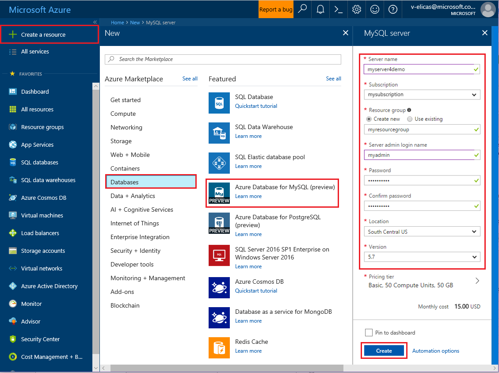
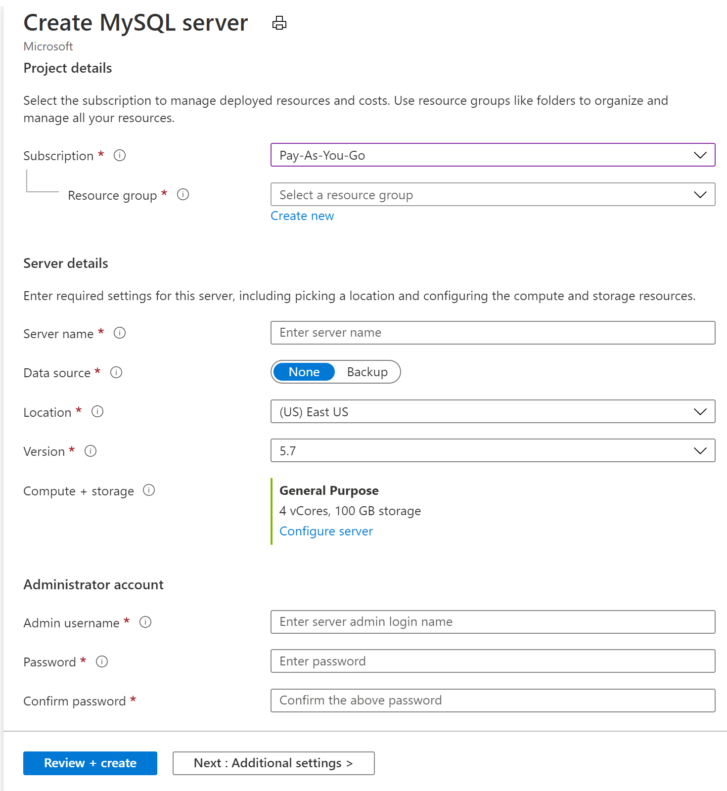
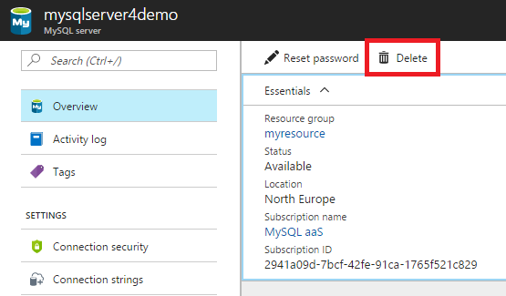

# Create an Azure Database for MySQL server by using the Azure portal

Azure Database for MySQL is a managed service that you use to run, manage, and scale highly available MySQL Databases in the cloud. This Quickstart shows you how to create an Azure Database for MySQL server in about five minutes using the Azure portal.  

If you don't have an Azure subscription, create a [free Azure account](https://azure.microsoft.com/free/) before you begin.

## Sign in to the Azure portal
Open your web browser, and then go to the [Azure portal](https://portal.azure.com/). Enter your credentials to sign in to the portal. The default view is your service dashboard.

## Create an Azure Database for MySQL server
You create an Azure Database for MySQL server with a defined set of [compute and storage resources](./concepts-compute-unit-and-storage.md). You create the server within an [Azure resource group](../azure-resource-manager/resource-group-overview.md).

Follow these steps to create an Azure Database for MySQL server:

1. Select the **Create a resource** button (+) in the upper-left corner of the  portal.

2. Select **Databases** > **Azure Database for MySQL**. You can also type **MySQL** in the search box to find the service.

   

3. Fill out the new server details form with the following information:
   
   

    **Setting** | **Suggested value** | **Field description** 
    ---|---|---
    Server name | Unique server name | Choose a unique name that identifies your Azure Database for MySQL server. For example, mydemoserver. The domain name *.mysql.database.azure.com* is appended to the server name you provide. The server name can contain only lowercase letters, numbers, and the hyphen (-) character. It must contain from 3 to 63 characters.
    Subscription | Your subscription | Select the Azure subscription that you want to use for your server. If you have multiple subscriptions, choose the subscription in which you get billed for the resource.
    Resource group | *myresourcegroup* | Provide a new or existing resource group name.    Resource group|*myresourcegroup*| A new resource group name or an existing one from your subscription.
    Select source | *Blank* | Select *Blank* to create a new server from scratch. (You select *Backup* if you are creating a server from a geo-backup of an existing Azure Database for MySQL server).
    Server admin login | myadmin | A sign-in account to use when you're connecting to the server. The admin sign-in name cannot be **azure_superuser**, **admin**, **administrator**, **root**, **guest**, or **public**.
    Password | *Your choice* | Provide a new password for the server admin account. It must contain from 8 to 128 characters. Your password must contain characters from three of the following categories: English uppercase letters, English lowercase letters, numbers (0-9), and non-alphanumeric characters (!, $, #, %, and so on).
    Confirm password | *Your choice*| Confirm the admin account password.
    Location | *The region closest to your users*| Choose the location that is closest to your users or your other Azure applications.
    Version | *The latest major version*| The latest major version (unless you have specific requirements that require another version).
    Pricing tier | **General Purpose**, **Gen 4**, **2 vCores**, **5 GB**, **7 days**, **Geographically Redundant** | The compute, storage, and backup configurations for your new server. Select **Pricing tier**. Next, select the **General Purpose** tab. *Gen 4*, *2 vCores*, *5 GB*, and *7 days* are the default values for **Compute Generation**, **vCore**, **Storage**, and **Backup Retention Period**. You can leave those sliders as is. To enable your server backups in geo-redundant storage, select **Geographically Redundant** from the **Backup Redundancy Options**. To save this pricing tier selection, select **OK**. The next screenshot captures these selections.
  
    > [!IMPORTANT]
    > The server admin sign-in and password that you specify here are required to sign in to the server and its databases later in this Quickstart. Remember or record this information for later use.
    > 

   

4.	Select **Create** to provision the server. Provisioning can take up to 20 minutes.
   
5.	Select **Notifications** on the toolbar (the bell icon) to monitor the deployment process.
   
  By default, the following databases are created under your server: **information_schema**, **mysql**, **performance_schema**, and **sys**.

## Configure a server-level firewall rule

The Azure Database for MySQL service creates a firewall at the server level. It prevents external applications and tools from connecting to the server and any databases on the server, unless a firewall rule is created to open the firewall for specific IP addresses. 

1.	 After the deployment finishes, locate your server. If necessary, you can search for it. For example, select **All Resources** from the menu on the left. Then type in the server name, such as the example **mydemoserver**, to search for your newly created server. Select the server name from the search result list. The **Overview** page for your server opens and provides options for further configuration.

2. On the server page, select **Connection security**.

3.	Under the **Firewall rules** heading, select the blank text box in the **Rule Name** column to begin creating the firewall rule. Enter the precise range of IPs of the clients that will be accesing this server.
   
   


4. On the upper toolbar of the **Connection security** page, select **Save**. Wait until the notification appears stating that the update has finished successfully before you continue. 

   > [!NOTE]
   > Connections to Azure Database for MySQL communicate over port 3306. If you try to connect from within a corporate network, outbound traffic over port 3306 might not be allowed. If this is the case, you can't connect to your server unless your IT department opens port 3306.
   > 

## Get the connection information
To connect to your database server, you need the full server name and admin sign-in credentials. You might have noted those values earlier in the Quickstart article. If you didn't, you can easily find the server name and sign-in information from the server **Overview** page or the **Properties** page in the Azure portal.

To find these values, take the following steps: 

1. Open your server's **Overview** page. Make a note of the **Server name** and **Server admin login name**. 

2. Hover your cursor over each field, and the copy icon appears to the right of the text. Select the copy icon as needed to copy the values.

In this example, the server name is **mydemoserver.mysql.database.azure.com**, and the server admin sign-in is **myadmin@mydemoserver**.

## Connect to MySQL by using the mysql command-line tool
There are a number of applications you can use to connect to your Azure Database for MySQL server. 

Let's first use the [mysql](https://dev.mysql.com/doc/refman/5.7/en/mysql.html) command-line tool to illustrate how to connect to the server. You can also use a web browser and Azure Cloud Shell as described here without installing additional software. If you have the mysql utility installed locally, you can connect from there as well.

1. Launch Azure Cloud Shell via the terminal icon (**>_**) on the upper right of the Azure portal.


2.  Azure Cloud Shell opens in your browser, where you can type bash shell commands.

   

3. At the Cloud Shell prompt, connect to your Azure Database for MySQL server by typing the mysql command line.

    To connect to an Azure Database for MySQL server with the mysql utility, use the following format:

    ```bash
    mysql --host <fully qualified server name> --user <server admin login name>@<server name> -p
    ```

    For example, the following command connects to our example server:

    ```azurecli-interactive
    mysql --host mydemoserver.mysql.database.azure.com --user myadmin@mydemoserver -p
    ```

    mysql parameter |Suggested value|Description
    ---|---|---
    --host | *Server name* | The server name value that you used earlier when you created the Azure Database for MySQL server. Our example server is **mydemoserver.mysql.database.azure.com**. Use the fully qualified domain name (**\*.mysql.database.azure.com**) as shown in the example. If you don't remember your server name, follow the steps in the previous section to get the connection information. 
    --user | *Server admin login name* |The server admin login username that you supplied when you created the Azure Database for MySQL server earlier. If you don't remember the username, follow the steps in the previous section to get the connection information. The format is *username@servername*.
    -p | *Wait until prompted* |When prompted, provide the same password that you provided when you created the server. Note that the typed password characters are not shown on the bash prompt when you type them. After you've entered the password, select **Enter**.

   After it's connected, the mysql utility displays a `mysql>` prompt at which you can type commands. 

   Following is example mysql output:

    ```bash
    Welcome to the MySQL monitor.  Commands end with ; or \g.
    Your MySQL connection id is 65505
    Server version: 5.6.26.0 MySQL Community Server (GPL)
    
    Copyright (c) 2000, 2017, Oracle and/or its affiliates. All rights reserved.
    
    Oracle is a registered trademark of Oracle Corporation and/or its
    affiliates. Other names may be trademarks of their respective
    owners.

    Type 'help;' or '\h' for help. Type '\c' to clear the current input statement.
    
    mysql>
    ```
    > [!TIP]
    > If the firewall is not configured to allow the IP address of Azure Cloud Shell, the following error occurs:
    >
    > ERROR 2003 (28000): Client with IP address 123.456.789.0 is not allowed to access the server.
    >
    > To resolve the error, make sure the server configuration matches the steps in the "Configure a server-level firewall rule" section of the article.

4. To ensure the connection is functional, view the server status by typing `status` at the mysql> prompt.

    ```sql
    status
    ```

   > [!TIP]
   > For additional commands, see [MySQL 5.7 Reference Manual--Chapter 4.5.1](https://dev.mysql.com/doc/refman/5.7/en/mysql.html).

5.  Create a blank database at the **mysql>** prompt by typing the following command:
    ```sql
    CREATE DATABASE quickstartdb;
    ```
    The command might take a few moments to complete. 

    Within an Azure Database for MySQL server, you can create one or multiple databases. You can opt to create a single database per server to utilize all the resources, or create multiple databases to share the resources. There is no limit to the number of databases that you can create, but multiple databases share the same server resources. 

6. List the databases at the **mysql>** prompt by typing the following command:

    ```sql
    SHOW DATABASES;
    ```

7.  Type `\q`, and then select the **Enter** key to quit the mysql tool. You can close Azure Cloud Shell after you are done.

Now you have connected to the Azure Database for MySQL server and created a blank user database. Continue to the next section for a similar exercise. The next exercise connects to the same server by using another common tool, MySQL Workbench.

## Connect to the server by using the MySQL Workbench GUI tool
To connect to the server by using the GUI tool MySQL Workbench, take the following steps:

1.	Open the MySQL Workbench application on your client computer. You can download and install MySQL Workbench from [Download MySQL Workbench](https://dev.mysql.com/downloads/workbench/).

2. Create a new connection. Click the plus (+) icon beside the **MySQL Connections** heading.

3. In the **Setup New Connection** dialog box, enter your server connection information on the **Parameters** tab. Placeholder values are shown as an example. Replace the Hostname, Username, and Password with your own values.

   

    |Setting |Suggested value|Field description|
    |---|---|---|
     Connection name | Demo connection | A label for this connection. |
    Connection method | Standard (TCP/IP) | Standard (TCP/IP) is sufficient. |
    Hostname | *Server name* | The server name value that you used when you created the Azure Database for MySQL server earlier. Our example server is **mydemoserver.mysql.database.azure.com**. Use the fully qualified domain name (**\*.mysql.database.azure.com**) as shown in the example. If you don't remember your server name, follow the steps in the previous section to get the connection information.|
     Port | 3306 | The port to use when connecting to your Azure Database for MySQL server. |
    Username |  *Server admin login name* | The server admin sign-in information that you supplied when you created the Azure Database for MySQL server earlier. Our example username is **myadmin@mydemoserver**. If you don't remember the username, follow the steps in the previous section to get the connection information. The format is *username@servername*.
    Password | *Your password* | Select the **Store in Vault...** button to save the password. |

4. Select **Test Connection** to test whether all parameters are  configured correctly. Then select **OK** to save the connection. 

    > [!NOTE]
    > SSL is enforced by default on your server and requires extra configuration  to connect successfully. For more information, see [Configure SSL connectivity in your application to securely connect to Azure Database for MySQL](./howto-configure-ssl.md). To disable SSL for this Quickstart, go to the Azure portal. Then select the Connection security page to disable the **Enforce SSL** connection toggle button.

## Clean up resources
You can clean up the resources that you created in the Quickstart in two ways. You can delete the [Azure resource group](../azure-resource-manager/resource-group-overview.md), which includes all the resources in the resource group. If you want to keep the other resources intact, delete only the one server resource.

> [!TIP]
> Other Quickstarts in this collection build on this Quickstart. If you plan to continue working with Quickstarts, don't clean up the resources that you created in this Quickstart. If you don't plan to continue, use the following steps to delete all the resources that you created with this Quickstart.
>

To delete the entire resource group including the newly created server, take the following steps:

1.	Locate your resource group in the Azure portal. On the menu on the left, select **Resource groups**, and then select the name of your resource group (such as our example, **myresourcegroup**).

2.	On your resource group page, select **Delete**. Then type the name of your resource group (such as our example **myresourcegroup**) in the box to confirm deletion, and select **Delete**.

To delete only the newly created server, take the following steps:

1.	Locate your server in the Azure portal if you don't already have it open. From the menu on the left in the Azure portal, select **All resources**. Then search for the server you created.

2.	On the **Overview** page, select **Delete**. 

   

3.	Confirm the name of the server that you want to delete, and show the databases under it that are affected. Type your server name in the box (such as our example **mydemoserver**). Select **Delete**.

## Next steps

> [!div class="nextstepaction"]
> [Design your first Azure Database for MySQL database](./tutorial-design-database-using-portal.md)

