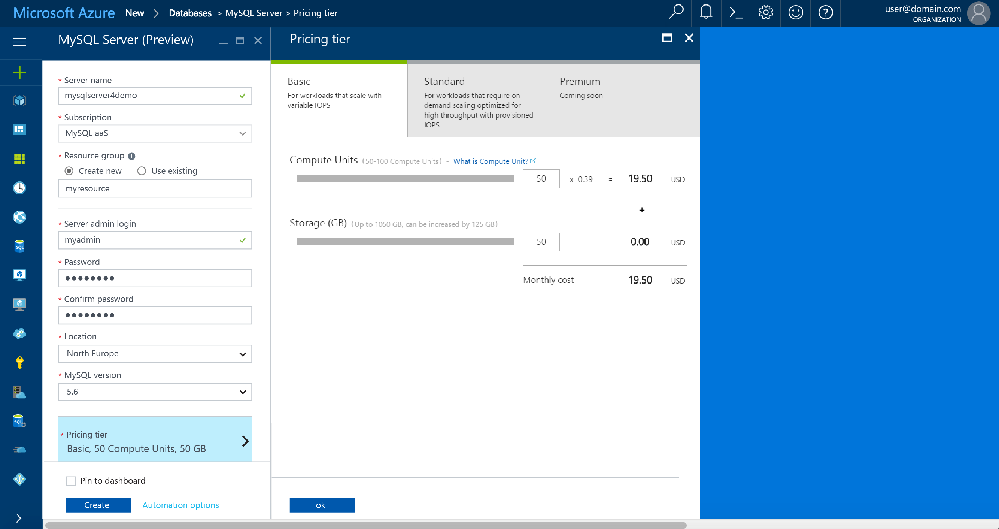
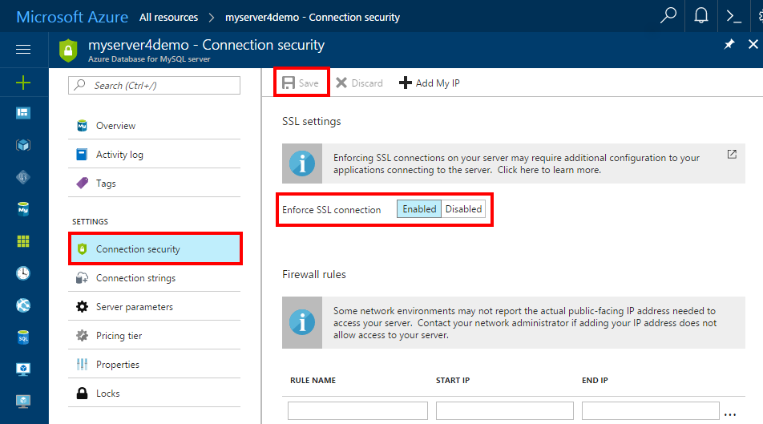
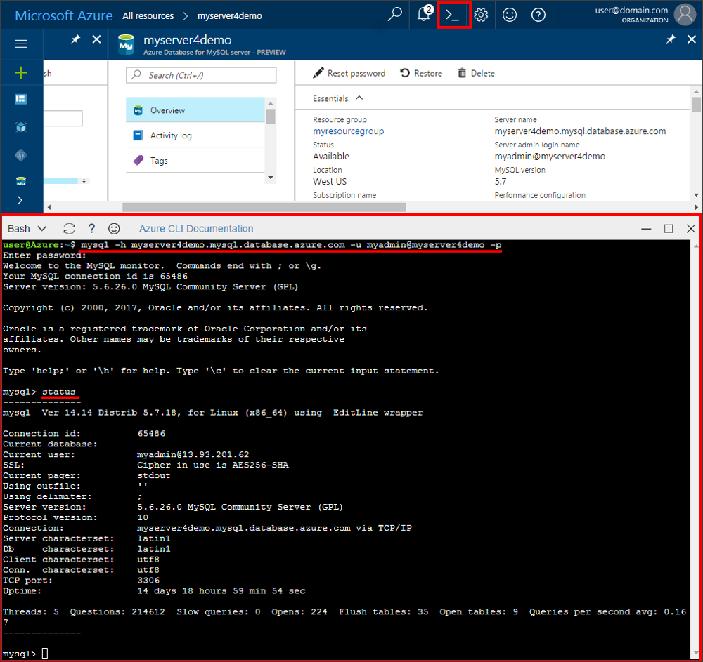

# Create an Azure Database for MySQL server using Azure portal
This article walks you through using the Azure portal to create an Azure Database for MySQL server in about five minutes. 

If you don't have an Azure subscription, create a [free](https://azure.microsoft.com/free/) account before you begin.

## Log in to Azure
Open your web browser, and navigate to the [Microsoft Azure portal](https://portal.azure.com/). Enter your credentials to sign in to the portal. The default view is your service dashboard.

## Create Azure Database for MySQL server
1. Click the **New** button found on the upper left corner of the Azure portal.

2. Select **Databases** from the **New** page, and select **Azure Database for MySQL** from the **Databases** page. You can also type **MySQL** in the New page search box to find the service.


3. Fill out the new server details form with the following information, as shown on the preceding image:

| **Setting** | **Suggested value** | **Field Description** |
|---|---|---|
| *Server name* | myserver4demo  | Server name has to be globally unique. |
| *Subscription* | mysubscription | Select your subscription from the drop-down. |
| *Resource group* | myresourcegroup | Create a resource group or use an existing one. |
| *Server admin login* | myadmin | Specify an account name to be admin in MySQL engine. |
| *Password* |  | Set a strong admin account password. |
| *Confirm password* |  | Confirm the admin account password. |
| *Location* |  | Select an available region. |
| *Version* | 5.7 | Choose the latest version. |
| *Pricing Tier* | Basic, 50 Compute Units, 50 Storage (GB)  | Choose **Pricing tier**, **Compute Units**, **Storage (GB)**, and then click **OK**. |
| *Pin to Dashboard* | Check | Recommended to check this box so you may find the server easily later on |

   Click **Pricing Tier** to specify the pricing tier and performance level for your new database. For this quick start, select Basic Tier, 50 Compute Units and 50 GB of included storage. Then click **OK** to save the pricing tier.
   
   

   Then, click **Create**. In a minute or two, a new Azure Database for MySQL server is running in the cloud. Click **Notifications** (bell icon) button on the toolbar to monitor the deployment process.

## Configure the firewall
Before connecting to Azure Database for MySQL for the first time, configure the firewall and add the client's public network IP address (or a range) to the whitelist.

1. After the deployment completes, click **All Resources** from the left-hand menu and type in the name **myserver4demo** to search for your newly created server. Click the server name listed in the search result. The Overview page for your server opens and provides options for further configuration.

2. In the server blade, select **Connection Security**.

3. Click **Add My IP** to add your local computer's IP address, or configure a range of IP addresses. Remember to click **Save** after you have created the rules.
  

## Get connection information
Get the fully qualified domain name for your Azure MySQL server in the Azure portal. You use the fully qualified domain name to connect to your server using the **mysql.exe** command-line tool.

1.	In [Azure portal](https://portal.azure.com/), click **All resources** from the left-hand menu, and click your Azure Database for MySQL server.

2.	Click **Properties**. Note down **SERVER NAME** and **SERVER ADMIN LOGIN**.
In this example, the server name is *myserver4demo.mysql.database.azure.com*, and the server admin login is *myadmin@myserver4demo*.

## Connect to the server using mysqlexe command-line tool
Use [mysql command-line tool](https://dev.mysql.com/doc/refman/5.7/en/mysql.html) to establish a connection to your Azure Database for MySQL server. You can run the mysql command-line tool in the browser using the Azure Cloud Shell, or launch it from your own machine using mysql tools installed locally. To launch the Azure Cloud Shell, click the `Try It` button on a code block in this article, or visit the [Azure portal](https://portal.azure.com) and click the `>_` icon in the top right toolbar. 

1. Type the command to connect:
```azurecli-interactive
mysql -h myserver4demo.mysql.database.azure.com -u myadmin@myserver4demo -p
```

2. View server status to ensure the connection is functional. Type `status` at the mysql> prompt once it is connected.
```sql
status
```

   

   > [!TIP]
   > For additional commands, see [MySQL 5.7 Reference Manual - Chapter 4.5.1](https://dev.mysql.com/doc/refman/5.7/en/mysql.html).

3. Create an empty database by typing the `CREATE DATABASE` command at the mysql> prompt.

   ```sql
   CREATE DATABASE quickstartdb;
   ```

   Within an Azure Database for MySQL server, you can have one or multiple databases. You can opt to create a single database per server to utilize all the resources, or create multiple databases to share the resources. There is no limit to the number of databases that can be created, but multiple databases share the same server resources.  

4. List the databases by typing `SHOW DATABASES` command at the mysql> prompt.

   ```sql
   SHOW DATABASES;
   ```

## Connect to the server using the MySQL Workbench GUI tool
1.	Launch the MySQL Workbench application on your client computer. You can download and install MySQL Workbench from [here](https://dev.mysql.com/downloads/workbench/).

2.	In **Setup New Connection** dialog box, enter the following information on **Parameters** tab:

   

| **Setting** | **Suggested value** | **Field Description** |
|---|---|---|
|	*Connection Name* | Demo Connection| Specify a label for this connection. |
| *Connection Method* | Standard (TCP/IP) | Standard (TCP/IP) is sufficient. |
| *Hostname* | myserver4demo.mysql.database.azure.com | Use the fully qualified server name for your server. |
| *Port* | 3306 | Use the default port 3306. |
| *Username* | myadmin@myserver4demo  | Use the server admin login you noted previously with an @ character and the server name. |
| *Password* | your password | Click Store in Vault... button to save the password. |

Click **Test Connection** to test if all parameters are correctly configured. Click OK to save the connection. 

> [!NOTE]
> SSL is enforced by default on your server, and requires extra configuration in order to connect successfully. See [Configure SSL connectivity in your application to securely connect to Azure Database for MySQL](./howto-configure-ssl.md).  If you want to disable SSL for this quick start, visit the Azure portal and click the Connection security page to disable the Enforce SSL connection toggle button.

## Clean up resources
Clean up all resources you created in the quickstart by deleting the [Azure resource group](../azure-resource-manager/resource-group-overview.md).

> [!TIP]
> Other quickstarts in this collection build upon this quick start. If you plan to continue on to work with subsequent quickstarts, do not clean up the resources created in this quickstart. If you do not plan to continue, use the following steps to delete all resources created by this quickstart in the Azure portal.

1.	From the left-hand menu in the Azure portal, click **Resource groups** and then click **myresourcegroup**.
2.	On your resource group page, click **Delete**, type **myresourcegroup** in the text box, and then click Delete.

If you would like to delete the newly created server:
1.	From the left-hand menu in Azure portal, click PostgreSQL servers and then search for the server you just created
2.	On the Overview page, click the Delete button on the top pane

3.	Confirm the server name you want to delete, and show the databases under it that is affected. Type **myserver4demo** in the text box, and then click Delete.


## Next steps

> [!div class="nextstepaction"]
> [Design your first Azure Database for MySQL database](./tutorial-design-database-using-portal.md)

