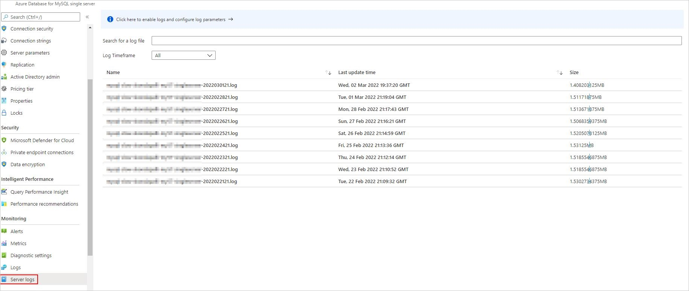

# Troubleshoot query performance in Azure Database for MySQL

[!INCLUDE[applies-to-mysql-single-flexible-server](../includes/applies-to-mysql-single-flexible-server.md)]

[!INCLUDE[azure-database-for-mysql-single-server-deprecation](../includes/azure-database-for-mysql-single-server-deprecation.md)]

Query performance can be impacted by multiple factors, so it’s first important to look at the scope of the symptoms you’re experiencing in your Azure Database for MySQL server. For example, is query performance slow for:

* All queries running on the Azure Database for MySQL server?
* A specific set of queries?
* A specific query?

Also keep in mind that any recent changes to the structure or underlying data of the tables you’re querying can affect performance.

## Enabling logging functionality

Before analyzing individual queries, you need to define query benchmarks. With this information, you can implement logging functionality on the database server to trace queries that exceed a threshold you specify based on the needs of the application.

With Azure Database for MySQL, it’s recommended to use the slow query log feature to identify queries that take longer than *N* seconds to run. After you've identified the queries from the slow query log, you can use MySQL diagnostics to troubleshoot these queries.

Before you can begin to trace long running queries, you need enable the `slow_query_log` parameter by using the Azure portal or Azure CLI. With this parameter enabled, you should also configure the value of the `long_query_time` parameter to specify the number of seconds that queries can run before being identified as “slow running” queries. The default value of the parameter is 10 seconds, but you can adjust the value to address the needs of your application’s SLA.

[  ](media/how-to-troubleshoot-query-performance-new/slow-query-log.png#lightbox)

While the slow query log is a great tool for tracing long running queries, there are certain scenarios in which it might not be effective. For example, the slow query log:

* Negatively impacts performance if the number of queries is very high or if the query statement is very large. Adjust the value of the `long_query_time` parameter accordingly.
* May not be helpful if you’ve also enabled the `log_queries_not_using_index` parameter, which specifies to log queries expected to retrieve all rows. Queries performing a full index scan take advantage of an index, but they’d be logged because the index doesn't limit the number of rows returned.

## Retrieving information from the logs

Logs are available for up to seven days from their creation. You can list and download slow query logs via the Azure portal or Azure CLI. In the Azure portal, navigate to your server, under **Monitoring**, select **Server logs**, and then select the downward arrow next to an entry to download the logs associated with the date and time you’re investigating.

[  ](media/how-to-troubleshoot-query-performance-new/retrieving-information-logs.png#lightbox)
  
In addition, if your slow query logs are integrated with Azure Monitor logs through Diagnostic logs, you can run queries in an editor to analyze them further:

```kusto
AzureDiagnostics
| where Resource == '<your server name>'
| where Category == 'MySqlSlowLogs'
| project TimeGenerated, Resource , event_class_s, start_time_t , query_time_d, sql_text_s
| where query_time_d > 10
```

> [!NOTE]
> For more examples to get you started with diagnosing slow query logs via Diagnostic logs, see [Analyze logs in Azure Monitor Logs](./concepts-server-logs.md#analyze-logs-in-azure-monitor-logs).
>

The following snapshot depicts a sample slow query.

```
# Time: 2021-11-13T10:07:52.610719Z
# User@Host: root[root] @  [172.30.209.6]  Id: 735026
# Query_time: 25.314811  Lock_time: 0.000000 Rows_sent: 126  Rows_examined: 443308
use employees;
SET timestamp=1596448847;
select * from titles where DATE(from_date) > DATE('1994-04-05') AND title like '%senior%';;
```

Notice that the query ran in 26 seconds, examined over 443k rows, and returned 126 rows of results.

Usually, you should focus on queries with high values for Query_time and Rows_examined. However, if you notice queries with a high Query_time but only a few Rows_examined, this often indicates the presence of a resource bottleneck. For these cases, you should check if there's any IO throttle or CPU usage.

## Profiling a query

After you’ve identified a specific slow running query, you can use the EXPLAIN command and profiling to gather additional detail.

To check the query plan, run the following command:

```
EXPLAIN <QUERY>
```

> [!NOTE]
> For more information about using EXPLAIN statements, see [How to use EXPLAIN to profile query performance in Azure Database for MySQL](./how-to-troubleshoot-query-performance.md).
>

In addition to creating an EXPLAIN plan for a query, you can use the SHOW PROFILE command, which allows you to diagnose the execution of statements that have been run within the current session.

To enable profiling and profile a specific query in a session, run the following set of commands:

```
SET profiling = 1;
<QUERY>;
SHOW PROFILES;
SHOW PROFILE FOR QUERY <X>;
```

> [!NOTE]
> Profiling individual queries is only available in a session and historical statements cannot be profiled.
>

Let’s take a closer look at using these commands to profile a query. First, enable profiling for the current session, run the `SET PROFILING = 1` command:

```
mysql> SET PROFILING = 1;
Query OK, 0 rows affected, 1 warning (0.00 sec)
```

Next, execute a suboptimal query that performs a full table scan:

```
mysql> select * from sbtest8 where c like '%99098187165%';
+----+---------+-------------------------------------------------------------------------------------------------------------------------+-------------------------------------------------------------+
| id | k       | c                                                                                                                       | pad                                                         |
+----+---------+-------------------------------------------------------------------------------------------------------------------------+-------------------------------------------------------------+
| 10 | 5035785 | 81674956652-89815953173-84507133182-62502329576-99098187165-62672357237-37910808188-52047270287-89115790749-78840418590 | 91637025586-81807791530-84338237594-90990131533-07427691758 |
+----+---------+-------------------------------------------------------------------------------------------------------------------------+-------------------------------------------------------------+
1 row in set (27.60 sec)
```

Then, display a list of all available query profiles by running the `SHOW PROFILES` command:

```
mysql> SHOW PROFILES;
+----------+-------------+----------------------------------------------------+
| Query_ID | Duration    | Query                                              |
+----------+-------------+----------------------------------------------------+
|        1 | 27.59450000 | select * from sbtest8 where c like '%99098187165%' |
+----------+-------------+----------------------------------------------------+
1 row in set, 1 warning (0.00 sec)
```

Finally, to display the profile for query 1, run the `SHOW PROFILE FOR QUERY 1` command.

```
mysql> SHOW PROFILE FOR QUERY 1;
+----------------------+-----------+
| Status               | Duration  |
+----------------------+-----------+
| starting             |  0.000102 |
| checking permissions |  0.000028 |
| Opening tables       |  0.000033 |
| init                 |  0.000035 |
| System lock          |  0.000018 |
| optimizing           |  0.000017 |
| statistics           |  0.000025 |
| preparing            |  0.000019 |
| executing            |  0.000011 |
| Sending data         | 27.594038 |
| end                  |  0.000041 |
| query end            |  0.000014 |
| closing tables       |  0.000013 |
| freeing items        |  0.000088 |
| cleaning up          |  0.000020 |
+----------------------+-----------+
15 rows in set, 1 warning (0.00 sec)
```

## Listing the most used queries on the database server

Whenever you're troubleshooting query performance, it’s helpful to understand which queries are most often run on your MySQL server.  You can use this information to gauge if any of the top queries are taking longer than usual to run. In addition, a developer or DBA could use this information to identify if any query has a sudden increase in query execution count and duration.

To list the top 10 most executed queries against your Azure Database for MySQL server, run the following query:

```
SELECT digest_text AS normalized_query,
 count_star AS all_occurrences,
 Concat(Round(sum_timer_wait / 1000000000000, 3), ' s') AS total_time,
 Concat(Round(min_timer_wait / 1000000000000, 3), ' s') AS min_time,
 Concat(Round(max_timer_wait / 1000000000000, 3), ' s') AS max_time,
 Concat(Round(avg_timer_wait / 1000000000000, 3), ' s') AS avg_time,
 Concat(Round(sum_lock_time / 1000000000000, 3), ' s') AS total_locktime,
 sum_rows_affected AS sum_rows_changed,
 sum_rows_sent AS sum_rows_selected,
 sum_rows_examined AS sum_rows_scanned,
 sum_created_tmp_tables,
 sum_select_scan,
 sum_no_index_used,
 sum_no_good_index_used
FROM performance_schema.events_statements_summary_by_digest
ORDER BY sum_timer_wait DESC LIMIT 10;
```

> [!NOTE]
> Use this query to benchmark the top executed queries in your database server and determine if there’s been a change in the top queries or if any existing queries in the initial benchmark have increased in run duration.
>

## Monitoring InnoDB garbage collection

When InnoDB garbage collection is blocked or delayed, the database can develop a substantial purge lag that can negatively affect storage utilization and query performance.

The InnoDB rollback segment history list length (HLL) measures the number of change records stored in the undo log. A growing HLL value indicates that InnoDB’s garbage collection threads (purge threads) aren’t keeping up with write workload or that purging is blocked by a long running query or transaction.

Excessive delays in garbage collection can have severe, negative consequences:

* The InnoDB system tablespace will expand, thus accelerating the growth of the underlying storage volume. At times, the system tablespace can swell by several terabytes as a result of a blocked purge. 
* Delete-marked records won’t be removed in a timely fashion. This can cause InnoDB tablespaces to grow and prevents the engine from reusing the storage occupied by these records.
* The performance of all queries might degrade, and CPU utilization might increase because of the growth of InnoDB storage structures.

As a result, it’s important to monitor HLL values, patterns, and trends.

### Finding HLL values

You can find the HLL value by running the show engine innodb status command. The value will be listed in the output, under the TRANSACTIONS heading:

```
mysql> show engine innodb status\G 
*************************** 1. row *************************** 
 
(...) 
 
------------ 
TRANSACTIONS 
------------ 
Trx id counter 52685768 
Purge done for trx's n:o < 52680802 undo n:o < 0 state: running but idle 
History list length 2964300 
 
(...) 
```

You can also determine the HLL value by querying the information_schema.innodb_metrics table:

```
mysql> select count from information_schema.innodb_metrics  
    -> where name = 'trx_rseg_history_len'; 
+---------+ 
|  count  | 
+---------+ 
| 2964300 | 
+---------+ 
1 row in set (0.00 sec)
```

### Interpreting HLL values

When interpreting HLL values, consider the guidelines listed in the following table:

| **Value** | **Notes** |
|---|---|
| Less than ~10,000 | Normal values, indicating that garbage collection isn't falling behind. |
| Between ~10,000 and ~1,000,000 | These values indicate a minor lag in garbage collection. Such values may be acceptable if they remain steady and don't increase. |
| Greater than ~1,000,000 | These values should be investigated and may require corrective actions |

### Addressing excessive HLL values

If the HLL shows large spikes or exhibits a pattern of periodic growth, investigate the queries and transactions running on your Azure Database for MySQL instance immediately. Then you can resolve any workload issues that might be preventing the progress of the garbage collection process. While it’s not expected for the database to be free of purge lag, you must not let the lag grow uncontrollably.

To obtain transaction information from the `information_schema.innodb_trx` table, for example, run the following commands:

```
select * from information_schema.innodb_trx  
order by trx_started asc\G
```

The detail in the `trx_started` column will help you calculate the transaction age.

```
mysql> select * from information_schema.innodb_trx  
    -> order by trx_started asc\G 
*************************** 1. row *************************** 
                    trx_id: 8150550 
                 trx_state: RUNNING 
               trx_started: 2021-11-13 20:50:11 
     trx_requested_lock_id: NULL 
          trx_wait_started: NULL 
                trx_weight: 0 
       trx_mysql_thread_id: 19 
                 trx_query: select * from employees where DATE(hire_date) > DATE('1998-04-05') AND first_name like '%geo%';
(…) 
```

For information about current database sessions, including the time spent in the session’s current state, check the `information_schema.processlist` table. The following output, for example, shows a session that’s been actively executing a query for the last 1462 seconds:

```
mysql> select user, host, db, command, time, info  
    -> from information_schema.processlist  
    -> order by time desc\G 
*************************** 1. row *************************** 
   user: test 
   host: 172.31.19.159:38004 
     db: employees 
command: Query 
   time: 1462 
   info: select * from employees where DATE(hire_date) > DATE('1998-04-05') AND first_name like '%geo%';
 
(...) 
```

## Recommendations

* Ensure that your database has enough resources allocated to run your queries. At times, you may need to scale up the instance size to get more CPU cores and additional memory to accommodate your workload. 
* Avoid large or long-running transactions by breaking them into smaller transactions.
* Configure innodb_purge_threads as per your workload to improve efficiency for background purge operations.
  > [!NOTE]
  > Test any changes to this server variable for each environment to gauge the change in engine behavior.
  >

* Use alerts on “Host CPU Percent”, “Host Memory Percent” and “Total Connections”  so that you get notifications if the system exceeds any of the specified thresholds.
* Use Query Performance Insights or Azure Workbooks to identify any problematic or slowly running queries, and then optimize them.
* For production database servers, collect diagnostics at regular intervals to ensure that everything is running smoothly. If not, troubleshoot and resolve any issues that you identify.

## Next steps

To find peer answers to your most important questions or to post or answer a question, visit [Stack Overflow](https://stackoverflow.com/questions/tagged/azure-database-mysql).
