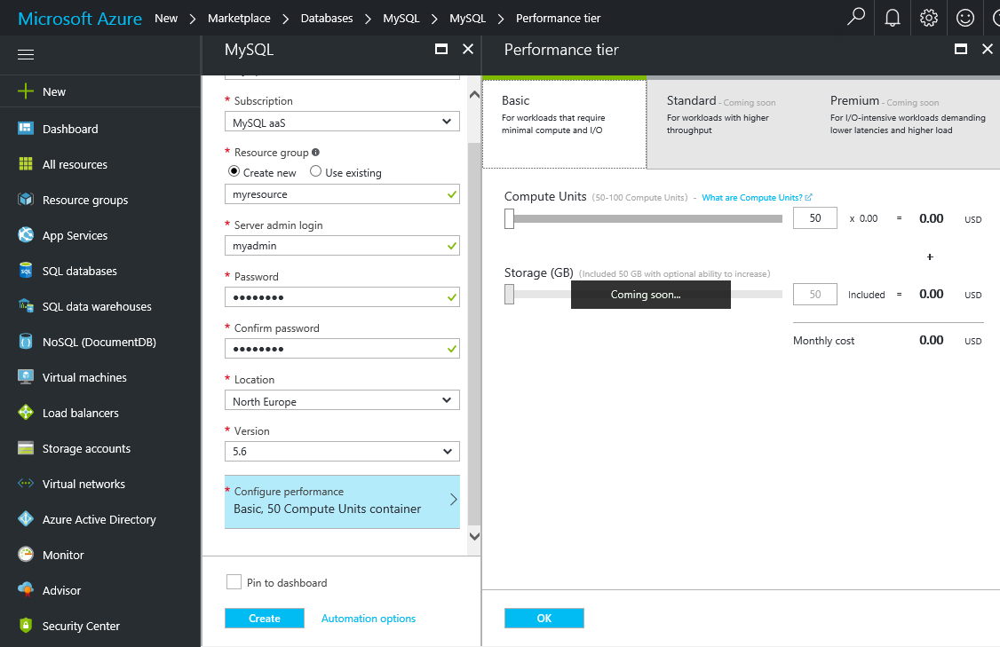

# Design your first Azure Database for MySQL database

Azure Database for MySQL is a managed service that enables you to run, manage, and scale highly available MySQL databases in the cloud. Using the Azure portal, you can easily manage your server and design a database.

In this tutorial, you use the Azure portal to learn how to:

> [!div class="checklist"]
> * Create an Azure Database for MySQL
> * Configure the server firewall
> * Use [mysql command line tool](https://dev.mysql.com/doc/refman/5.6/en/mysql.html) to create a database
> * Load sample data
> * Query data
> * Update data
> * Restore data

## Log in to the Azure portal
Open your favorite web browser, and visit [Microsoft Azure Portal](https://portal.azure.com/). Enter your credential to login to the portal. The default view is your service dashboard.

## Create an Azure Database for MySQL server
An Azure Database for MySQL server is created with a defined set of [compute and storage resources](./concepts-compute-unit-and-storage.md). The server is created within an [Azure resource group](https://docs.microsoft.com/en-us/azure/azure-resource-manager/resource-group-overview).

1.	Navigate to **Databases** -> **MySQL**. If you cannot find MySQL Server under **Databases** category, click **See all** to show all available database services. You can also type **MySQL** in the search box to quickly find the service.


2.	Click **MySQL** icon, and then click **Create**.

In our example, fill out the Azure Database for MySQL form with the following information:

| **Form Field** | **Field Description** |
|----------------|-----------------------|
| *Server name* | mysqlserver4demo (server name is globally unique) |
| *Subscription* | MySQLaaS (select from drop-down) |
| *Resource group* | myresource (create a resource group or use an existing one) |
| *Server admin login* | myadmin (setup admin account name) |
| *Password* | set up admin account password |
| *Confirm password* | confirm admin account password |
| *Location* | North Europe (select between **North Europe** and **West US**) |
| *Version* | 5.6 (choose MySQL server version) |
| *Configure performance* | Basic (choose **Performance tier**, **Compute Units**, **Storage**, and then click **OK**) |

Then, click **Create**. In a minute or two, you will have a new Azure Database for MySQL server running in the cloud. You can click **Notifications** button on the toolbar to monitor the deployment process.

> [!TIP]
> We recommend that you put Azure services in the same region and select the location closest to you. In addition, you can check the **Pin to dashboard** option to allow easy tracking of your deployments.



## Configure firewall
Azure Databases for MySQL are protected by a firewall. By default, all connections to the server and the databases inside the server are rejected. Before connecting to Azure Database for MySQL from your client for the first time, you must configure the firewall and add the client’s public network IP address (or IP address range) to the whitelist.

1.	Click your newly created server, and then click **Connection security**.


2.	You can **Add My IP**, or configure firewall rules here. Remember to click **Save** after you have created the rules.

You can now connect to the server using mysql command line tool or MySQL Workbench GUI tool.

> Azure Database for MySQL server communicates over port 3306. If you are trying to connect from within a corporate network, outbound traffic over port 3306 may not be allowed by your network's firewall. If so, you will not be able to connect to your Azure MySQL server unless your IT department opens port 3306.

## Get connection information
Get the fully qualified server name for your Azure MySQL server in the Azure portal. You use the fully qualified server name to connect to your server using mysql command line tool.

1.	In [Azure portal](https://portal.azure.com/), click **All resources** from the left-hand menu, and click your Azure Database for MySQL server.

2.	Click **Properties**. Note down **SERVER NAME** and **SERVER ADMIN LOGIN**.


In this example, the server name is *mysql4doc.database.windows.net*, and the server admin login is *mysqladmin@mysql4doc*.

## Connect to the server using mysql
Use [mysql command line tool](https://dev.mysql.com/doc/refman/5.6/en/mysql.html) to establish a connection to your Azure Database for MySQL server. In this example, the command is:
```cmd
mysql -h mysqlserver4demo.database.windows.net -u myadmin@mysqlserver4demo -p
```

## Create a blank database
Once you’re connected to the server, create a blank database to work with.
```sql
CREATE DATABASE mysampledb;
```

At the prompt, run the following command to switch connection to this newly created database:
```sql
USE mysampledb;
```

## Create tables in the database
Now that you know how to connect to the Azure Database for MySQL database, we can go over how to complete some basic tasks.

First, we can create a table and load it with some data. Let's create a table that stores inventory information.
```sql
CREATE TABLE inventory (
	id serial PRIMARY KEY, 
	name VARCHAR(50), 
	quantity INTEGER
);
```

## Load data into the tables
Now that we have a table, we can insert some data into it. At the open command prompt window, run the following query to insert some rows of data.
```sql
INSERT INTO inventory (id, name, quantity) VALUES (1, 'banana', 150); 
INSERT INTO inventory (id, name, quantity) VALUES (2, 'orange', 154);
```

Now you have two rows of sample data into the table you created earlier.

## Query and update the data in the tables
Execute the following query to retrieve information from the database table.
```sql
SELECT * FROM inventory;
```

You can also update the data in the tables.
```sql
UPDATE inventory SET quantity = 200 WHERE name = 'banana';
```

The row gets updated accordingly when you retrieve data.
```sql
SELECT * FROM inventory;
```

## Restore a database to a previous point in time
Imagine you have accidentally deleted this table. This is something you cannot easily recover from. Azure Database for MySQL allows you to go back to any point in time in the last up to 35 days and restore this point in time to a new server. You can use this new server to recover your deleted data. The following steps restore the sample server to a point before the table was added.

1- On the Azure Database for MySQL page for your server, click **Restore** on the toolbar. The **Restore** page opens.


2- Fill out the **Restore** form with the required information:

-	Restore point: Select a point-in-time that occurs before the server was changed.
-	Target server: Provide a new server name you want to restore to.
-	Location: You cannot select the region, by default it is same as the source server.
-	Pricing tier: You cannot change this value when restoring a server. It is same as the source server.


3- Click **OK** to restore the server to [restore to a point in time](./howto-restore-server-portal.md) before the tables was deleted. Restoring a server to a different point in time creates a duplicate new server as the original server as of the point in time you specify, provided that it is within the retention period for your service tier.

## Next Steps

In this tutorial, you use the Azure portal to learned how to:

> [!div class="checklist"]
> * Create an Azure Database for MySQL
> * Configure the server firewall
> * Use [mysql command line tool](https://dev.mysql.com/doc/refman/5.6/en/mysql.html) to create a database
> * Load sample data
> * Query data
> * Update data
> * Restore data

[Create and manage Azure Database for MySQL firewall rules using the Azure portal](./howto-manage-firewall-using-portal.md)
