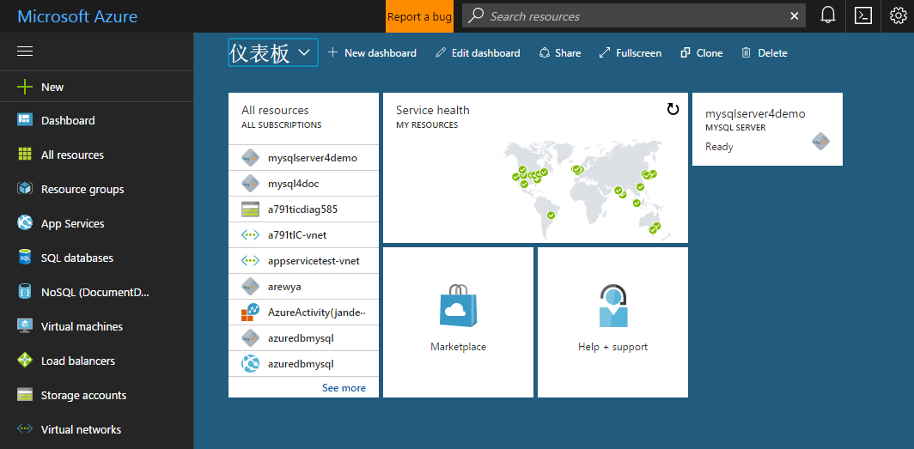
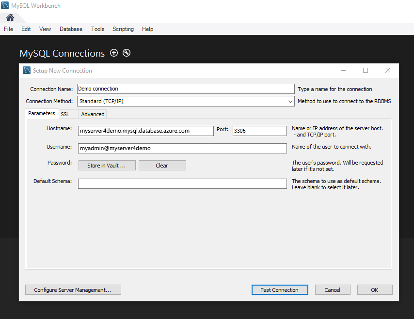

---
title: 'Design your first Azure Database for MySQL using Azure portal | Microsoft Docs'
description: This tutorial shows how to Design your first Azure Database for MySQL using the Azure portal.
services: mysql
author: v-chenyh
ms.author: v-chenyh
manager: jhubbard
editor: jasonh
ms.assetid:
ms.service: mysql-database
ms.devlang: na
ms.topic: article
ms.tgt_pltfrm: portal
ms.date: 05/10/2017
---
# Design your first Azure MySQL database
In this tutorial, you build a database for a university to track student grades and courses enrollment. This tutorial demonstrates how to use the [Azure portal](https://portal.azure.com/) and [MySQL Workbench](https://dev.mysql.com/doc/refman/5.6/en/workbench.html) to create an Azure MySQL database on an Azure MySQL cloud server, add tables to the database, load data into the tables, and query the database. It also demonstrates how to use MySQL Database point in time restore capabilities to restore the database to an earlier point in time.

To complete this tutorial, make sure you have installed the newest version of [MySQL Workbench](https://dev.mysql.com/doc/workbench/en/).

## Log in to the Azure portal
Open your favorite web browser, and visit [Microsoft Azure Portal](https://portal.azure.com/). Enter your credential to login to the portal. The default view is your service dashboard.



## Create an Azure MySQL server
1. Navigate to **Databases** -> **MySQL**. If you cannot find MySQL Server under **Databases** category, click **See all** to show all available database services. You can also type **MySQL** in the search box to quickly find the service.
  
> [!TIP]
> An Azure MySQL server is created with a defined set of compute and storage resources. The database is created within an Azure resource group and in an Azure Database for MySQL server.
2. Click **MySQL** icon, and then click **Create**.
In our example, fill out the Azure Database for MySQL form with the following information:
- **Server name:** mysqlserver4demo (server name is globally unique)
- **Subscription:** MySQLaaS (select from drop down)
- **Resource group:** myresource (create a new resource group or use an existing one)
- **Server admin login:** myadmin (setup admin account name)
- **Password** (setup admin account password)
- **Confirm password** (confirm admin account password)
- **Location:** North Europe (select between **North Europe** and **West US**)
- **Version:** 5.6 (choose MySQL server version)
- **Configure performance:** Basic (choose **Performance tier**, **Compute Units**, **Storage** and click **OK**)

In a minute or two, you will have a new MySQL server running in the cloud. You can click **Notifications** button on the toolbar to monitor the deployment process.

>[!TIP]
>We strongly recommend that you put Azure services in the same region and select the location closest to you. In addition, you can check **Pin to dashboard** option to allow easy tracking of your deployments.


## Configure firewall
Azure Databases for MySQL are protected by a firewall. By default, all connections to the server and the databases inside the server are rejected. Before connecting to Azure Database for MySQL from your client for the first time, you must configure the firewall and add the client’s public network IP address (or IP address range) to the whitelist.
1. Click your newly created server, and then click **Connection security**.
  
2. You can **Add My IP**, or configure firewall rules here. Remember to click **Save** after you have created the rules.
You can now connect to the server using mysql command line tool or MySQL Workbench GUI tool.

>[!TIP]
>Azure MySQL server communicates over port 3306. If you are trying to connect from within a corporate network, outbound traffic over port 3306 may not be allowed by your network's firewall. If so, you will not be able to connect to your Azure MySQL server unless your IT department opens port 3306.

## Get connection information
Get the fully qualified server name for your Azure MySQL server in the Azure portal. You use the fully qualified server name to connect to your server using MySQL Workbench.
1. In [Azure portal](https://portal.azure.com/), click **All resources** from the left-hand menu, and click your Azure MySQL server.
2. Click **Properties**. Note down **SERVER NAME** and **SERVER ADMIN LOGIN**.
  

In this example, the server name is *mysql4doc.database.windows.net*, and the server admin login is *mysqladmin@mysql4doc*.

## Connect to your server using MySQL Workbench
Use [MySQL Workbench](https://dev.mysql.com/doc/workbench/en/) to establish a connection to your Azure MySQL server.
1. Open MySQL Workbench.
2. In **Setup New Connection** dialog box, enter the following information on **Parameters** tab:
  - **Connection Name**: specify a name for this connection
  - **Connection Method**: choose Standard (TCP/IP)
  - **Hostname**: mysqlserver4demo.database.windows.net (SERVER NAME you note down in step 4)
  - **Port**: 3306
  - **Username**: myadmin@mysqlserver4demo (SERVER ADMIN LOGIN you note down in step 4)
  - **Password**: you can store admin account password in vault
  
3. Click **Test Connection** to test if all parameters are correctly configured.
4. Now, you can click the connection just created to successfully connect to the server.
> [!TIP]
> SSL is enforced by default while server is created, which means you need extra configuration to enable connection. You could go to "connection security" on the portal to disable enforcing SSL or learn how to configure SSL in MySQL Workbench. It is recommended to enforce SSL to ensure higher security.

## Create a blank database using MySQL Workbench
An Azure MySQL database is created with a defined set of compute and storage resources. The database is created within an [Azure resource group](https://docs.microsoft.com/en-us/azure/azure-resource-manager/resource-group-overview) and in an Azure MySQL Database logical server. 
Follow these steps to create a blank MySQL database using MySQL Workbench.
1. Click **Create a new schema in the connected server** button.
2. Fill out database name: **mysampledatabase**, then click **Apply**.


## Create tables using MySQL Workbench
Create four tables that model a student management system for universities using MySQL Workbench:
- Person
- Course
- Student
- Credit

The following diagram shows how these tables are related to each other. Some of these tables reference columns in other tables. For example, the Student table references the **PersonId** column of the **Person** table. Study the diagram to understand how the tables in this tutorial are related to one another. For an in-depth look at how to create effective database tables, see [Create effective database tables](https://msdn.microsoft.com/library/cc505842.aspx). For information about choosing data types, see [Data types](https://docs.microsoft.com/sql/t-sql/data-types/data-types-transact-sql).


1. Double click on the database name in the **SCHEMAS** of **Navigator Window**. This will select the database for operation.
2. Click **Create a new SQL tab for executing queries** button. A blank query window opens. In the query window, execute the following query to create four tables in your database:
```sql
 -- Create Person table
 CREATE TABLE Person
 (
 PersonId INT AUTO_INCREMENT PRIMARY KEY,
 FirstName NVARCHAR(128) NOT NULL,
 MiddelInitial NVARCHAR(10),
 LastName NVARCHAR(128) NOT NULL,
 DateOfBirth DATE NOT NULL
 );

 -- Create Student table
 CREATE TABLE Student
 (
 StudentId INT AUTO_INCREMENT PRIMARY KEY,
 PersonId INT REFERENCES Person (PersonId),
 Email NVARCHAR(256)
 );

 -- Create Course table
 CREATE TABLE Course
 (
 CourseId INT AUTO_INCREMENT PRIMARY KEY,
 Name NVARCHAR(50) NOT NULL,
 Teacher NVARCHAR(256) NOT NULL
 );

 -- Create Credit table
 CREATE TABLE Credit
 (
 StudentId INT REFERENCES Student (StudentId),
 CourseId INT REFERENCES Course (CourseId),
 Grade DECIMAL(5,2) CHECK (Grade <= 100.00),
 Attempt TINYINT,
 );
```
  You can expand the **Tables** node in the **Navigator Window** to see the tables you created.
  

## Load data into the tables
1. Create a folder called **SampleTableData** in your Downloads folder to store sample data for your database.
2. Right-click the following links and save them into the **SampleTableData** folder.
  - [SampleCourseData](https://sqldbtutorial.blob.core.windows.net/tutorials/SampleCourseData)
  - [SamplePersonData](https://sqldbtutorial.blob.core.windows.net/tutorials/SamplePersonData)
  - [SampleStudentData](https://sqldbtutorial.blob.core.windows.net/tutorials/SampleStudentData)
  - [SampleCreditData](https://sqldbtutorial.blob.core.windows.net/tutorials/SampleCreditData)
3. Open a command prompt window, and run the following command to connect to the Azure MySQL server using mysql command line interface.
```dos
C:\>mysql -h mysqlserver4demo.database.windows.net -u myadmin@mysqlserver4demo -p
```
In this example, server name is **mysqlserver4demo**. Replace it with your own server name.
4. Select **mysampledatabase** and execute the following commands to insert sample data into the tables.
```dos
mysql>
USE mysampledatabase;
LOAD DATA LOCAL INFILE 'C:/<folderPath>/Downloads/SampleTableData/SampleCourseData' INTO TABLE course FIELDS TERMINATED BY ',';
LOAD DATA LOCAL INFILE 'C:/<folderPath>/Downloads/SampleTableData/SamplePersonData' INTO TABLE person FIELDS TERMINATED BY ',';
LOAD DATA LOCAL INFILE 'C:/<folderPath>/Downloads/SampleTableData/SampleStudentData' INTO TABLE student FIELDS TERMINATED BY ',';
LOAD DATA LOCAL INFILE 'C:/<folderPath>/Downloads/SampleTableData/SampleCreditData' INTO TABLE credit FIELDS TERMINATED BY ',';
```
Replace <folderPath> with your Download folder path. You have now loaded sample data into the tables you created earlier.

## Query the tables
Execute the following queries to retrieve information from the database tables. The first query joins all four tables to find all the students who have participated in the class of “Introduction to Law” and a grade higher than 75. The second query joins all four tables and finds all courses in which 'Noe Coleman' has ever enrolled.
1. In MySQL Workbench query window, execute the following query:
```sql
 -- Find the students taught by Dominick Pope who have a grade higher than 75%
 SELECT person.FirstName, person.LastName, credit.Grade
 FROM person
 INNER JOIN student ON person.PersonId = student.PersonId
 INNER JOIN credit ON student.StudentId = credit.StudentId
 INNER JOIN course ON credit.CourseId = course.courseId
 WHERE course.Name = 'Introduction to Law'
 AND Grade > 75
```
2. In MySQL Workbench query window, execute the following query:
```sql
 -- Find all the courses in which Noe Coleman has ever enrolled
 SELECT course.Name, course.Teacher, credit.Grade
 FROM course
 INNER JOIN credit ON credit.CourseId = course.CourseId
 INNER JOIN student ON student.StudentId = credit.StudentId
 INNER JOIN person ON person.PersonId = student.PersonId
 WHERE person.FirstName = 'Noe'
 AND person.LastName = 'Coleman'
```
## Next Steps
- For Azure CLI samples of common tasks, see [Azure CLI samples for Azure Database for MySQL](sample-scripts-azure-cli.md)