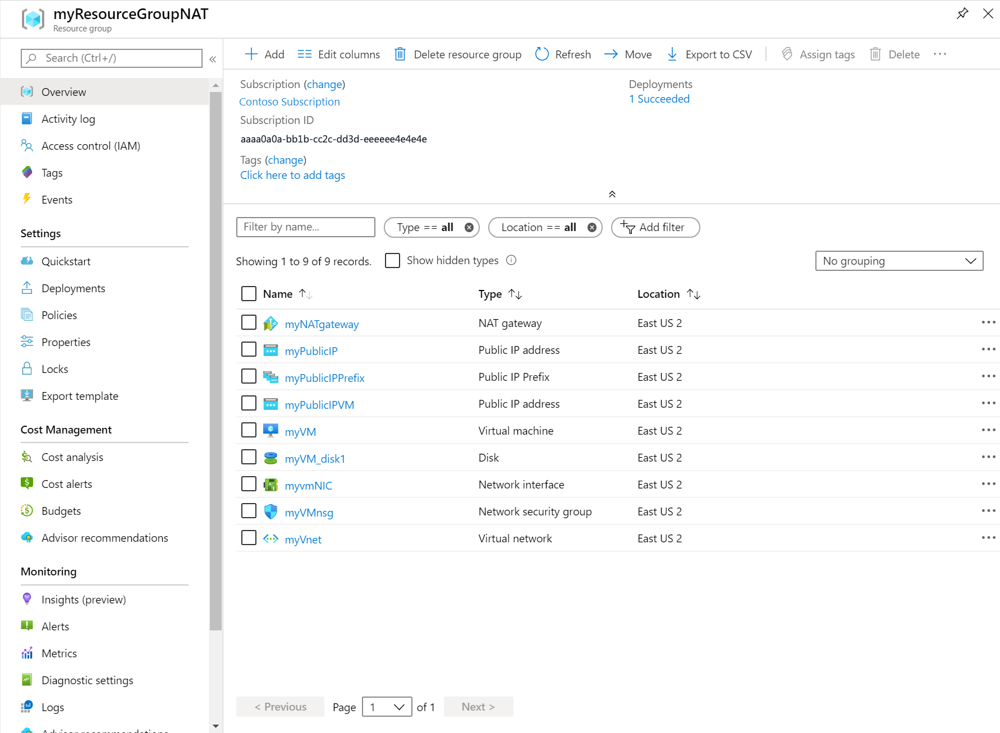

# Quickstart: Create a NAT gateway

In this quickstart, learn how to create a NAT gateway by using the Azure portal, Azure CLI, PowerShell, Bicep, ARM template and Terraform. The NAT Gateway service provides outbound connectivity for virtual machines in Azure.

:::image type="content" source="./media/quickstart-create-nat-gateway-portal/nat-gateway-qs-resources.png" alt-text="Diagram of resources created in nat gateway quickstart." lightbox="./media/quickstart-create-nat-gateway-portal/nat-gateway-qs-resources.png":::

## Prerequisites

### [Portal](#tab/portal)

- An Azure account with an active subscription. [Create an account for free](https://azure.microsoft.com/free/?WT.mc_id=A261C142F).

### [PowerShell](#tab/powershell)

- An Azure account with an active subscription. [Create an account for free](https://azure.microsoft.com/free/?WT.mc_id=A261C142F).

- Azure Cloud Shell or Azure PowerShell.

  The steps in this quickstart run the Azure PowerShell cmdlets interactively in [Azure Cloud Shell](/azure/cloud-shell/overview). To run the commands in the Cloud Shell, select **Open Cloudshell** at the upper-right corner of a code block. Select **Copy** to copy the code and then paste it into Cloud Shell to run it. You can also run the Cloud Shell from within the Azure portal.

  You can also [install Azure PowerShell locally](/powershell/azure/install-azure-powershell) to run the cmdlets. The steps in this article require Azure PowerShell module version 5.4.1 or later. Run `Get-Module -ListAvailable Az` to find your installed version. If you need to upgrade, see [Update the Azure PowerShell module](/powershell/azure/install-Az-ps#update-the-azure-powershell-module).

### [CLI](#tab/cli)

[!INCLUDE [quickstarts-free-trial-note](~/reusable-content/ce-skilling/azure/includes/quickstarts-free-trial-note.md)]

[!INCLUDE [azure-cli-prepare-your-environment-no-header.md](~/reusable-content/azure-cli/azure-cli-prepare-your-environment-no-header.md)]

### [ARM](#tab/arm)

- If you don't have an Azure subscription, create a [free account](https://azure.microsoft.com/free/?WT.mc_id=A261C142F) before you begin.

### [Bicep](#tab/bicep)

If you don't have an Azure subscription, create a [free account](https://azure.microsoft.com/free/?WT.mc_id=A261C142F) before you begin.

### [Terraform](#tab/terraform)

- An Azure account with an active subscription. You can [create an account for free](https://azure.microsoft.com/free/?WT.mc_id=A261C142F).

- [Install and configure Terraform](/azure/developer/terraform/quickstart-configure).

---

### [Portal](#tab/portal)

[!INCLUDE [virtual-network-create-with-nat-bastion.md](../../includes/virtual-network-create-with-nat-bastion.md)]

[!INCLUDE [create-test-virtual-machine-linux.md](~/reusable-content/ce-skilling/azure/includes/create-test-virtual-machine-linux.md)]

### [PowerShell](#tab/powershell)

## Create a resource group

Create a resource group with [New-AzResourceGroup](/powershell/module/az.resources/new-azresourcegroup). An Azure resource group is a logical container into which Azure resources are deployed and managed.

The following example creates a resource group named **test-rg** in the **eastus2** location:

```azurepowershell-interactive
$rsg = @{
    Name = 'test-rg'
    Location = 'eastus2'
}
New-AzResourceGroup @rsg
```

## Create the NAT gateway

In this section, create the NAT gateway and supporting resources.

```azurepowershell-interactive
## Create public IP address for NAT gateway ##
$ip = @{
    Name = 'public-ip-nat'
    ResourceGroupName = 'test-rg'
    Location = 'eastus2'
    Sku = 'Standard'
    AllocationMethod = 'Static'
    Zone = 1,2,3
}
$publicIP = New-AzPublicIpAddress @ip

## Create NAT gateway resource ##
$nat = @{
    ResourceGroupName = 'test-rg'
    Name = 'nat-gateway'
    IdleTimeoutInMinutes = '10'
    Sku = 'Standard'
    Location = 'eastus2'
    PublicIpAddress = $publicIP
}
$natGateway = New-AzNatGateway @nat

## Create subnet config and associate NAT gateway to subnet##
$subnet = @{
    Name = 'subnet-1'
    AddressPrefix = '10.0.0.0/24'
    NatGateway = $natGateway
}
$subnetConfig = New-AzVirtualNetworkSubnetConfig @subnet 

## Create Azure Bastion subnet ##
$bastsubnet = @{
    Name = 'AzureBastionSubnet' 
    AddressPrefix = '10.0.1.0/26'
}
$bastsubnetConfig = New-AzVirtualNetworkSubnetConfig @bastsubnet

## Create the virtual network ##
$net = @{
    Name = 'vnet-1'
    ResourceGroupName = 'test-rg'
    Location = 'eastus2'
    AddressPrefix = '10.0.0.0/16'
    Subnet = $subnetConfig,$bastsubnetConfig
}
$vnet = New-AzVirtualNetwork @net

## Create public IP address for bastion host ##
$ip = @{
    Name = 'public-ip'
    ResourceGroupName = 'test-rg'
    Location = 'eastus2'
    Sku = 'Standard'
    AllocationMethod = 'Static'
    Zone = 1,2,3
}
$publicip = New-AzPublicIpAddress @ip

## Create bastion host ##
$bastion = @{
    Name = 'bastion'
    ResourceGroupName = 'test-rg'
    PublicIpAddressRgName = 'test-rg'
    PublicIpAddressName = 'public-ip'
    VirtualNetworkRgName = 'test-rg'
    VirtualNetworkName = 'vnet-1'
    Sku = 'Basic'
}
New-AzBastion @bastion
```

The bastion host can take several minutes to deploy. Wait for the bastion host to deploy before moving on to the next section.

## Create virtual machine

In this section, you create a virtual machine to test the NAT gateway and verify the public IP address of the outbound connection.

```azurepowershell-interactive
# Set the administrator and password for the VM ##
$cred = Get-Credential

## Place the virtual network into a variable ##
$vnet = Get-AzVirtualNetwork -Name 'vnet-1' -ResourceGroupName 'test-rg'

## Create network interface for virtual machine ##
$nic = @{
    Name = "nic-1"
    ResourceGroupName = 'test-rg'
    Location = 'eastus2'
    Subnet = $vnet.Subnets[0]
}
$nicVM = New-AzNetworkInterface @nic

## Create a virtual machine configuration ##
$vmsz = @{
    VMName = 'vm-1'
    VMSize = 'Standard_DS1_v2'  
}
$vmos = @{
    ComputerName = 'vm-1'
    Credential = $cred
}
$vmimage = @{
    PublisherName = 'Canonical'
    Offer = '0001-com-ubuntu-server-jammy'
    Skus = '22_04-lts-gen2'
    Version = 'latest'     
}
$vmConfig = New-AzVMConfig @vmsz `
    | Set-AzVMOperatingSystem @vmos -Linux `
    | Set-AzVMSourceImage @vmimage `
    | Add-AzVMNetworkInterface -Id $nicVM.Id

## Create the virtual machine ##
$vm = @{
    ResourceGroupName = 'test-rg'
    Location = 'eastus2'
    VM = $vmConfig
}
New-AzVM @vm
```

Wait for the virtual machine creation to complete before moving on to the next section.


### [CLI](#tab/cli)

## Create a resource group

Create a resource group with [az group create](/cli/azure/group#az-group-create). An Azure resource group is a logical container into which Azure resources are deployed and managed.

```azurecli-interactive
az group create \
    --name test-rg \
    --location eastus2
```

## Create the NAT gateway

In this section, create the NAT gateway and supporting resources.

### Create public IP address

To access the internet, you need one or more public IP addresses for the NAT gateway. Use [az network public-ip create](/cli/azure/network/public-ip#az-network-public-ip-create) to create a public IP address resource.

```azurecli-interactive
az network public-ip create \
    --resource-group test-rg \
    --name public-ip-nat \
    --sku Standard \
    --allocation-method Static \
    --location eastus2 \
    --zone 1 2 3
```

### Create NAT gateway resource

Create a NAT gateway resource using [az network nat gateway create](/cli/azure/network/nat#az-network-nat-gateway-create). The NAT gateway uses the public IP address created in the previous step. The idle time out is set to 10 minutes.

```azurecli-interactive
az network nat gateway create \
    --resource-group test-rg \
    --name nat-gateway \
    --public-ip-addresses public-ip-nat \
    --idle-timeout 10
```

### Create virtual network and subnet

Create a virtual network named **vnet-1** with a subnet named **subnet-1** using [az network vnet create](/cli/azure/network/vnet#az-network-vnet-create). The IP address space for the virtual network is **10.0.0.0/16**. The subnet within the virtual network is **10.0.0.0/24**.

```azurecli-interactive
az network vnet create \
    --resource-group test-rg \
    --name vnet-1 \
    --address-prefix 10.0.0.0/16 \
    --subnet-name subnet-1 \
    --subnet-prefixes 10.0.0.0/24
```

### Create Azure Bastion subnet

Create an Azure Bastion subnet named **AzureBastionSubnet** using [az network vnet subnet create](/cli/azure/network/vnet/subnet#az-network-vnet-subnet-create):

```azurecli-interactive
az network vnet subnet create \
    --name AzureBastionSubnet \
    --resource-group test-rg \
    --vnet-name vnet-1 \
    --address-prefix 10.0.1.0/26
```

### Associate NAT gateway to subnet

Associate the NAT gateway to the subnet using [az network vnet subnet update](/cli/azure/network/vnet/subnet#az-network-vnet-subnet-update):

```azurecli-interactive
az network vnet subnet update \
    --resource-group test-rg \
    --vnet-name vnet-1 \
    --name subnet-1 \
    --nat-gateway nat-gateway
```

### Create public IP address for Bastion host

Create a public IP address for the Bastion host using [az network public-ip create](/cli/azure/network/public-ip#az-network-public-ip-create):

```azurecli-interactive
az network public-ip create \
    --resource-group test-rg \
    --name public-ip \
    --sku Standard \
    --location eastus2 \
    --zone 1 2 3
```

### Create Bastion host

Create the Azure Bastion host using [az network bastion create](/cli/azure/network/bastion#az-network-bastion-create):

```azurecli-interactive
az network bastion create \
    --name bastion \
    --public-ip-address public-ip \
    --resource-group test-rg \
    --vnet-name vnet-1 \
    --location eastus2
```

The Bastion host can take several minutes to deploy. Wait for the Bastion host to deploy before moving on to the next section.

## Create virtual machine

Create a virtual machine named **vm-1** to test the NAT gateway and verify the public IP address of the outbound connection. Use [az vm create](/cli/azure/vm#az-vm-create):

```azurecli-interactive
az vm create \
    --resource-group test-rg \
    --name vm-1 \
    --image Ubuntu2204 \
    --admin-username azureuser \
    --authentication-type password \
    --public-ip-address "" \
    --subnet subnet-1 \
    --vnet-name vnet-1
```

Wait for the virtual machine creation to complete before moving on to the next section.

### [ARM](#tab/arm)

[!INCLUDE [About Azure Resource Manager](~/reusable-content/ce-skilling/azure/includes/resource-manager-quickstart-introduction.md)]

If your environment meets the prerequisites and you're familiar with using ARM templates, select the **Deploy to Azure** button. The template opens in the Azure portal.

:::image type="content" source="~/reusable-content/ce-skilling/azure/media/template-deployments/deploy-to-azure-button.svg" alt-text="Button to deploy the Resource Manager template to Azure." border="false" link="https://portal.azure.com/#create/Microsoft.Template/uri/https%3A%2F%2Fraw.githubusercontent.com%2FAzure%2Fazure-quickstart-templates%2Fmaster%2Fquickstarts%2Fmicrosoft.network%2Fnat-gateway-1-vm%2Fazuredeploy.json":::

## Review the template

The template used in this quickstart is from [Azure Quickstart Templates](https://azure.microsoft.com/resources/templates/nat-gateway-1-vm).

This template is configured to create a:

* Virtual network

* NAT gateway resource

* Ubuntu virtual machine

The Ubuntu virtual machine is deployed to a subnet associated with the NAT gateway resource.

:::code language="json" source="~/quickstart-templates/quickstarts/microsoft.network/nat-gateway-1-vm/azuredeploy.json":::

Nine Azure resources are defined in the template:

* **[Microsoft.Network/networkSecurityGroups](/azure/templates/microsoft.network/networksecuritygroups)**: Creates a network security group.

* **[Microsoft.Network/networkSecurityGroups/securityRules](/azure/templates/microsoft.network/networksecuritygroups/securityrules)**: Creates a security rule.

* **[Microsoft.Network/publicIPAddresses](/azure/templates/microsoft.network/publicipaddresses)**: Creates a public IP address.

* **[Microsoft.Network/publicIPPrefixes](/azure/templates/microsoft.network/publicipprefixes)**: Creates a public IP prefix.

* **[Microsoft.Compute/virtualMachines](/azure/templates/Microsoft.Compute/virtualMachines)**: Creates a virtual machine.

* **[Microsoft.Network/virtualNetworks](/azure/templates/microsoft.network/virtualnetworks)**: Creates a virtual network.

* **[Microsoft.Network/natGateways](/azure/templates/microsoft.network/natgateways)**: Creates a NAT gateway resource.

* **[Microsoft.Network/virtualNetworks/subnets](/azure/templates/microsoft.network/virtualnetworks/subnets)**: Creates a virtual network subnet.

* **[Microsoft.Network/networkinterfaces](/azure/templates/microsoft.network/networkinterfaces)**: Creates a network interface.

## Deploy the template

### Portal

:::image type="content" source="~/reusable-content/ce-skilling/azure/media/template-deployments/deploy-to-azure-button.svg" alt-text="Button to deploy the Resource Manager template to Azure." border="false" link="https://portal.azure.com/#create/Microsoft.Template/uri/https%3A%2F%2Fraw.githubusercontent.com%2FAzure%2Fazure-quickstart-templates%2Fmaster%2Fquickstarts%2Fmicrosoft.network%2Fnat-gateway-1-vm%2Fazuredeploy.json":::

## Review deployed resources

1. Sign in to the [Azure portal](https://portal.azure.com).

1. Select **Resource groups** from the left pane.

1. Select the resource group that you created in the previous section. The default resource group name is **myResourceGroupNAT**

1. Verify the following resources were created in the resource group:

    

### PowerShell

```azurepowershell-interactive
$location = Read-Host -Prompt "Enter the location (i.e. westcentralus)"
$templateUri = "https://raw.githubusercontent.com/Azure/azure-quickstart-templates/master/quickstarts/microsoft.network/nat-gateway-1-vm/azuredeploy.json"

$resourceGroupName = "myResourceGroupNAT"

New-AzResourceGroup -Name $resourceGroupName -Location $location
New-AzResourceGroupDeployment -ResourceGroupName $resourceGroupName -TemplateUri $templateUri
```

### Azure CLI

```azurecli-interactive
read -p "Enter the location (i.e. westcentralus): " location
resourceGroupName="myResourceGroupNAT"
templateUri="https://raw.githubusercontent.com/Azure/azure-quickstart-templates/master/quickstarts/microsoft.network/nat-gateway-1-vm/azuredeploy.json"

az group create \
--name $resourceGroupName \
--location $location

az deployment group create \
--resource-group $resourceGroupName \
--template-uri  $templateUri
```

### [Bicep](#tab/bicep)

## Review the Bicep file

The Bicep file used in this quickstart is from [Azure Quickstart Templates](https://azure.microsoft.com/resources/templates/nat-gateway-1-vm/).

This Bicep file is configured to create a:

* Virtual network

* NAT gateway resource

* Ubuntu virtual machine

The Ubuntu VM is deployed to a subnet that's associated with the NAT gateway resource.

:::code language="bicep" source="~/quickstart-templates/quickstarts/microsoft.network/nat-gateway-1-vm/main.bicep":::

Nine Azure resources are defined in the Bicep file:

* **[Microsoft.Network/networkSecurityGroups](/azure/templates/microsoft.network/networksecuritygroups)**: Creates a network security group.

* **[Microsoft.Network/networkSecurityGroups/securityRules](/azure/templates/microsoft.network/networksecuritygroups/securityrules)**: Creates a security rule.

* **[Microsoft.Network/publicIPAddresses](/azure/templates/microsoft.network/publicipaddresses)**: Creates a public IP address.

* **[Microsoft.Network/publicIPPrefixes](/azure/templates/microsoft.network/publicipprefixes)**: Creates a public IP prefix.

* **[Microsoft.Compute/virtualMachines](/azure/templates/Microsoft.Compute/virtualMachines)**: Creates a virtual machine.

* **[Microsoft.Network/virtualNetworks](/azure/templates/microsoft.network/virtualnetworks)**: Creates a virtual network.

* **[Microsoft.Network/natGateways](/azure/templates/microsoft.network/natgateways)**: Creates a NAT gateway resource.

* **[Microsoft.Network/virtualNetworks/subnets](/azure/templates/microsoft.network/virtualnetworks/subnets)**: Creates a virtual network subnet.

* **[Microsoft.Network/networkinterfaces](/azure/templates/microsoft.network/networkinterfaces)**: Creates a network interface.

## Deploy the Bicep file

1. Save the Bicep file as **main.bicep** to your local computer.

1. Deploy the Bicep file using either Azure CLI or Azure PowerShell.

    ### Azure CLI

    ```azurecli
    az group create --name exampleRG --location eastus
    az deployment group create --resource-group exampleRG --template-file main.bicep --parameters adminusername=<admin-name>
    ```

    ### PowerShell

    ```azurepowershell
    New-AzResourceGroup -Name exampleRG -Location eastus
    New-AzResourceGroupDeployment -ResourceGroupName exampleRG -TemplateFile ./main.bicep -adminusername "<admin-name>"
    ```

    ---

    > [!NOTE]
    > Replace **\<admin-name\>** with the administrator username for the virtual machine. You'll also be prompted to enter **adminpassword**.

    When the deployment finishes, you should see a message indicating the deployment succeeded.

## Review deployed resources

Use the Azure portal, Azure CLI, or Azure PowerShell to list the deployed resources in the resource group.

### Azure CLI

```azurecli-interactive
az resource list --resource-group exampleRG
```

### PowerShell

```azurepowershell-interactive
Get-AzResource -ResourceGroupName exampleRG
```


### [Terraform](#tab/terraform)

This Terraform file deploys a virtual network, a NAT gateway resource, and Ubuntu virtual machine. The Ubuntu virtual machine is deployed to a subnet that is associated with the NAT gateway resource.

The script also generates a random SSH public key and associates it with the virtual machine for secure access. The public key is outputted at the end of the script execution. 

The script uses the Random and AzAPI providers in addition to the AzureRM provider. The Random provider is used to generate a unique name for the resource group and the SSH key. The AzAPI provider is used to generate the SSH public key. 

As with the public key, the names of the created resource group, virtual network, subnet, and NAT gateway are printed when the script is run.

[!INCLUDE [About Terraform](~/azure-dev-docs-pr/articles/terraform/includes/abstract.md)]

## Implement the Terraform code

> [!NOTE]
> The sample code for this article is located in the [Azure Terraform GitHub repo](https://github.com/Azure/terraform/tree/master/quickstart/101-nat-gateway-create).
> 
> See more [articles and sample code showing how to use Terraform to manage Azure resources](/azure/terraform)

1. Create a directory in which to test and run the sample Terraform code and make it the current directory.

1. Create a file named `main.tf` and insert the following code:

    :::code language="Terraform" source="~/terraform_samples/quickstart/101-nat-gateway-create/main.tf":::

1. Create a file named `outputs.tf` and insert the following code:

    :::code language="Terraform" source="~/terraform_samples/quickstart/101-nat-gateway-create/outputs.tf":::

1. Create a file named `providers.tf` and insert the following code:

    :::code language="Terraform" source="~/terraform_samples/quickstart/101-nat-gateway-create/providers.tf":::

1. Create a file named `ssh.tf` and insert the following code:

    :::code language="Terraform" source="~/terraform_samples/quickstart/101-nat-gateway-create/ssh.tf":::

1. Create a file named `variables.tf` and insert the following code:

    :::code language="Terraform" source="~/terraform_samples/quickstart/101-nat-gateway-create/variables.tf":::


## Initialize Terraform

[!INCLUDE [terraform-init.md](~/azure-dev-docs-pr/articles/terraform/includes/terraform-init.md)]

## Create a Terraform execution plan

[!INCLUDE [terraform-plan.md](~/azure-dev-docs-pr/articles/terraform/includes/terraform-plan.md)]

## Apply a Terraform execution plan

[!INCLUDE [terraform-apply-plan.md](~/azure-dev-docs-pr/articles/terraform/includes/terraform-apply-plan.md)]

## Verify the results

### Azure CLI

1. Get the Azure resource group name.

    ```console
    resource_group_name=$(terraform output -raw resource_group_name)
    ```

1. Get the NAT gateway ID.

    ```console
    nat_gateway=$(terraform output -raw nat_gateway)
    ```

1. Run [az network nat gateway show](/cli/azure/network/nat/gateway#az-network-nat-gateway-show) to display the details about the NAT gateway.

    ```azurecli
    az network nat gateway show \
        --resource-group $resource_group_name \
        --ids $nat_gateway
    ```

### PowerShell

1. Get the Azure resource group name.

    ```console
    $resource_group_name=$(terraform output -raw resource_group_name)
    ```

1. Get the NAT gateway ID.

    ```console
    $nat_gateway=$(terraform output -raw nat_gateway)
    ```

1. Run [Get-AzNatGateway](/powershell/module/az.network/get-aznatgateway) to display the details about the NAT gateway.

    ```azurepowershell
    $nat = @{
        Name = $nat_gateway
        ResourceGroupName = $resource_group_name
    }
    Get-AzNatGateway @nat
    ```

---

## Test NAT gateway

In this section, you test the NAT gateway. You first discover the public IP of the NAT gateway. You then connect to the test virtual machine and verify the outbound connection through the NAT gateway.
    
1. In the search box at the top of the portal, enter **Public IP**. Select **Public IP addresses** in the search results.

1. Select **public-ip-nat**.

1. Make note of the public IP address:

    :::image type="content" source="./media/quickstart-create-nat-gateway-portal/find-public-ip.png" alt-text="Discover public IP address of NAT gateway" border="true":::

1. In the search box at the top of the portal, enter **Virtual machine**. Select **Virtual machines** in the search results.

1. Select **vm-1**.

1. On the **Overview** page, select **Connect**, then select the **Bastion** tab.

1. Select **Use Bastion**.

1. Enter the username and password entered during virtual machine creation. Select **Connect**.

1. In the bash prompt, enter the following command:

    ```bash
    curl ifconfig.me
    ```

1. Verify the IP address returned by the command matches the public IP address of the NAT gateway.

    ```output
    azureuser@vm-1:~$ curl ifconfig.me
    203.0.113.0.25
    ```

## Clean up resources

### [Portal](#tab/portal)

[!INCLUDE [portal-clean-up.md](~/reusable-content/ce-skilling/azure/includes/portal-clean-up.md)]

### [PowerShell](#tab/powershell)

If you're not going to continue to use this application, delete the virtual network, virtual machine, and NAT gateway with the following command:

```azurepowershell-interactive
Remove-AzResourceGroup -Name 'test-rg' -Force
```

### [CLI](#tab/cli)

If you're not going to continue to use this application, delete the virtual network, virtual machine, and NAT gateway with the following command:

```azurecli-interactive
az group delete \
    --name test-rg \
    --yes
```

### [ARM](#tab/arm)

When no longer needed, you can use the [Remove-AzResourceGroup](/powershell/module/az.resources/remove-azresourcegroup) command to remove the resource group and all resources contained within.

```azurepowershell-interactive
Remove-AzResourceGroup -Name myResourceGroupNAT
```

### [Bicep](#tab/bicep)

### [Terraform](#tab/terraform)

[!INCLUDE [terraform-plan-destroy.md](~/azure-dev-docs-pr/articles/terraform/includes/terraform-plan-destroy.md)]

---

## Next steps

For more information on Azure NAT Gateway, see:
> [!div class="nextstepaction"]
> [Azure NAT Gateway overview](nat-overview.md)
