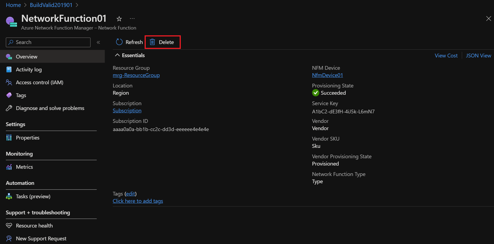
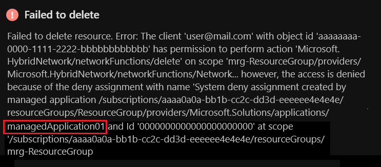
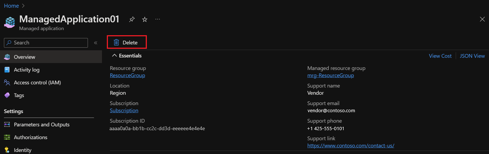

# Tutorial: Delete network functions on Azure Stack Edge

In this tutorial, you learn how to delete a network function and a device in Azure Network Function Manager by using the Azure portal. 

## Delete a network function

1. Sign in to the [Azure portal](https://portal.azure.com).

1. Go to the **Azure Network Manager - Devices** resource in which you've deployed a network function. Under **Network Function**, select the function that you want to delete.
 
   

1. Select **Delete**.
 
   

1. You might encounter a "Failed to delete resource" error while you're deleting the network function.

   
   
   If so, use the search box in the Azure portal to search for the managed application that the error mentioned. When the managed application appears under **Resources**, select it.
 
   

   In the details for the managed application, select **Delete**.
 
   

## Delete a device

> [!IMPORTANT] 
> Ensure that all the network functions deployed within Azure Network Function Manager are deleted before you delete a device.

Go to the **Azure Network Manager - Devices** resource in which you've deleted a network function, and then select **Delete**.
 

