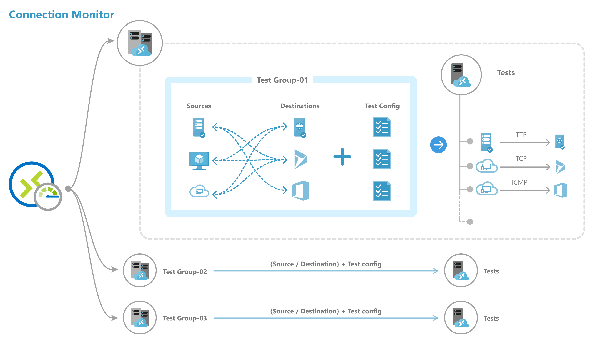

# Create an Azure Network Watcher connection monitor using PowerShell

> [!IMPORTANT]
> Starting 1 July 2021, you will not be able to add new tests in an existing workspace or enable a new workspace in Network Performance Monitor. You will also not be able to add new connection monitors in Connection Monitor (classic). You can continue to use the tests and connection monitors created prior to 1 July 2021. To minimize service disruption to your current workloads, [migrate your tests from Network Performance Monitor ](migrate-to-connection-monitor-from-network-performance-monitor.md) or  [migrate from Connection Monitor (classic)](migrate-to-connection-monitor-from-connection-monitor-classic.md) to the new Connection Monitor in Azure Network Watcher before 29 February 2024.


Learn how to use the Connection Monitor feature of Azure Network Watcher to monitor communication between your resources.


## Before you begin

In connection monitors that you create with Connection Monitor, you can add both on-premises machines and Azure virtual machines (VMs) as sources. These connection monitors can also monitor connectivity to endpoints. The endpoints can be on Azure or any other URL or IP.

A connection monitor includes the following entities:

* **Connection monitor resource**: A region-specific Azure resource. All of the following entities are properties of the connection monitor resource.
* **Endpoint**: A source or destination that participates in connectivity checks. Examples of endpoints include Azure VMs, on-premises agents, URLs, and IPs.
* **Test configuration**: A protocol-specific configuration for a test. Based on the protocol you choose, you can define the port, thresholds, test frequency, and other parameters.
* **Test group**: The group that contains source endpoints, destination endpoints, and test configurations. A connection monitor can contain more than one test group.
* **Test**: The combination of a source endpoint, destination endpoint, and test configuration. A test is the most granular level at which monitoring data is available. The monitoring data includes the percentage of checks that failed and the round-trip time (RTT).

	

## Steps to create a connection monitor

Use the following commands to create a connection monitor by using PowerShell.

```powershell

//Connect to your Azure account with the subscription
Connect-AzAccount
Select-AzSubscription -SubscriptionId <your-subscription>
//Select region
$nw = "NetworkWatcher_centraluseuap"
//Declare endpoints like Azure VM below. You can also give VNET,Subnet,Log Analytics workspace
$sourcevmid1 = New-AzNetworkWatcherConnectionMonitorEndpointObject -AzureVM -Name MyAzureVm -ResourceID /subscriptions/<your-subscription>/resourceGroups/<your resourceGroup>/providers/Microsoft.Compute/virtualMachines/<vm-name>
//Declare endpoints like URL, IPs
$bingEndpoint = New-AzNetworkWatcherConnectionMonitorEndpointObject -ExternalAddress -Name Bing -Address www.bing.com # Destination URL
//Create test configuration.Choose Protocol and parametersSample configs below.

$IcmpProtocolConfiguration = New-AzNetworkWatcherConnectionMonitorProtocolConfigurationObject -IcmpProtocol
$TcpProtocolConfiguration = New-AzNetworkWatcherConnectionMonitorProtocolConfigurationObject -TcpProtocol -Port 80
$httpProtocolConfiguration = New-AzNetworkWatcherConnectionMonitorProtocolConfigurationObject -HttpProtocol -Port 443 -Method GET -RequestHeader @{Allow = "GET"} -ValidStatusCodeRange 2xx, 300-308 -PreferHTTPS
$httpTestConfiguration = New-AzNetworkWatcherConnectionMonitorTestConfigurationObject -Name http-tc -TestFrequencySec 60 -ProtocolConfiguration $httpProtocolConfiguration -SuccessThresholdChecksFailedPercent 20 -SuccessThresholdRoundTripTimeMs 30
$icmpTestConfiguration = New-AzNetworkWatcherConnectionMonitorTestConfigurationObject -Name icmp-tc -TestFrequencySec 30 -ProtocolConfiguration $icmpProtocolConfiguration -SuccessThresholdChecksFailedPercent 5 -SuccessThresholdRoundTripTimeMs 500
$tcpTestConfiguration = New-AzNetworkWatcherConnectionMonitorTestConfigurationObject -Name tcp-tc -TestFrequencySec 60 -ProtocolConfiguration $TcpProtocolConfiguration -SuccessThresholdChecksFailedPercent 20 -SuccessThresholdRoundTripTimeMs 30
//Create Test Group
$testGroup1 = New-AzNetworkWatcherConnectionMonitorTestGroupObject -Name testGroup1 -TestConfiguration $httpTestConfiguration, $tcpTestConfiguration, $icmpTestConfiguration -Source $sourcevmid1 -Destination $bingEndpoint,
$testname = "cmtest9"
//Create Connection Monitor
New-AzNetworkWatcherConnectionMonitor -NetworkWatcherName $nw -ResourceGroupName NetworkWatcherRG -Name $testname -TestGroup $testGroup1

```

## Description of properties

* **ConnectionMonitorName**: Name of the connection monitor resource.

* **SUB**: Subscription ID of the subscription where you want to create a connection monitor.

* **NW**: Network Watcher resource ID in which a connection monitor is created.

* **Location**: Region in which a connection monitor is created.

* **Endpoints**
	* **Name**: Unique name for each endpoint.
	* **Resource ID**: For Azure endpoints, resource ID refers to the Azure Resource Manager resource ID for VMs. For non-Azure endpoints, resource ID refers to the Azure Resource Manager resource ID for the Log Analytics workspace linked to non-Azure agents.
	* **Address**: Applicable only when the resource ID is not specified or if the resource ID is in the Log Analytics workspace. If used without a resource ID, this can be the URL or IP of any public endpoint. If used with a Log Analytics resource ID, this refers to the FQDN of the monitoring agent.
	* **Filter**: For non-Azure endpoints, use filters to select monitoring agents from the Log Analytics workspace in the connection monitor resource. If filters are not set, all agents belonging to the Log Analytics workspace can be used for monitoring.
		* **Type**: Set as **Agent Address**.
		* **Address**: Set as the FQDN of your on-premises agent.

* **Test groups**
	* **Name**: Name your test group.
	* **Sources**: Choose from the endpoints you created earlier. Azure-based source endpoints need to have Azure Network Watcher extension installed; non-Azure-based source endpoints need to have an Azure Log Analytics agent installed. To install an agent for your source, see [Install monitoring agents](./connection-monitor-overview.md#install-monitoring-agents).
	* **Destinations**:  Choose from the endpoints you created earlier. You can monitor connectivity to Azure VMs or any endpoint (a public IP, URL, or FQDN) by specifying them as destinations. In a single test group, you can add Azure VMs, Office 365 URLs, Dynamics 365 URLs, and custom endpoints.
	* **Disable**: Disable monitoring for all sources and destinations that the test group specifies.

* **Test configurations**
	* **Name**: Name the test configuration.
	* **TestFrequencySec**: Specify how frequently sources ping destinations on the protocol and port that you specified. You can choose 30 seconds, 1 minute, 5 minutes, 15 minutes, or 30 minutes. Sources test connectivity to destinations based on the value that you choose. For example, if you select 30 seconds, sources check connectivity to the destination at least once in a 30-second period.
	* **Protocol**: Choose TCP, ICMP, HTTP, or HTTPS. Depending on the protocol, you can also select the following protocol-specific configurations:
		* **preferHTTPS**: Specify whether to use HTTPS over HTTP.
		* **port**: Specify the destination port of your choice.
		* **disableTraceRoute**: Stop sources from discovering topology and hop-by-hop RTT. This applies to test groups with TCP or ICMP.
		* **method**: Select the HTTP request method (GET or POST). This applies to test configurations with HTTP.
		* **path**: Specify path parameters to append to the URL.
		* **validStatusCodes**: Choose applicable status codes. If the response code does not match, a diagnostic message displays.
		* **requestHeaders**: Specify custom request header strings that pass to the destination.
	* **Success threshold**: Set thresholds on the following network parameters:
		* **checksFailedPercent**: Set the percentage of checks that can fail when sources check connectivity to destinations by using the criteria that you specified. For TCP or ICMP protocol, the percentage of failed checks might equal the percentage of packet loss. For HTTP protocol, this field represents the percentage of HTTP requests that received no response.
		* **roundTripTimeMs**: Set how long sources can take to connect to the destination over the test configuration in milliseconds.

## Scale limits

Connection monitors have the following scale limits:

* Maximum connection monitors per subscription per region: 100
* Maximum test groups per connection monitor: 20
* Maximum sources and destinations per connection monitor: 100
* Maximum test configurations per connection monitor: 20

## Next steps

* Learn [how to analyze monitoring data and set alerts](./connection-monitor-overview.md#analyze-monitoring-data-and-set-alerts).
* Learn [how to diagnose issues in your network](./connection-monitor-overview.md#diagnose-issues-in-your-network).
