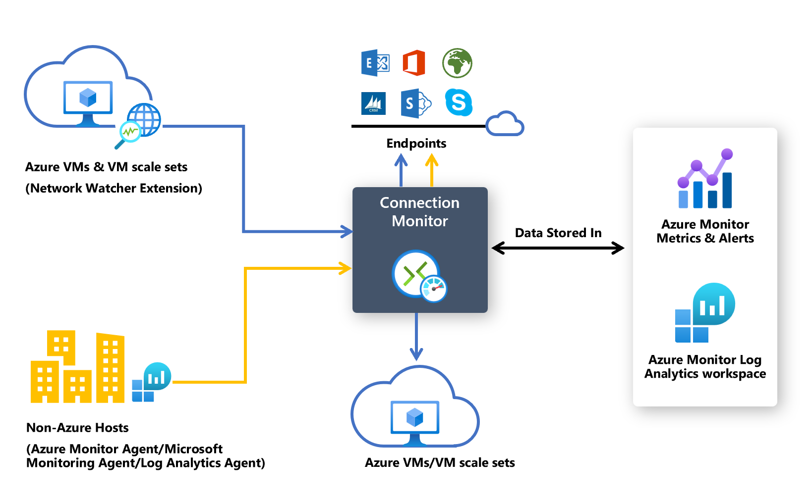

# Connection monitor overview

> [!IMPORTANT]
> As of July 1, 2021, you can no longer add new tests in an existing workspace or enable a new workspace in Network Performance Monitor (NPM). You're also no longer able to add new connection monitors in Connection Monitor (Classic). You can continue to use the tests and connection monitors that you've created prior to July 1, 2021. 
> 
> To minimize service disruption to your current workloads, [migrate your tests from Network Performance Monitor](migrate-to-connection-monitor-from-network-performance-monitor.md), or  [migrate from Connection Monitor (Classic)](migrate-to-connection-monitor-from-connection-monitor-classic.md) to the new Connection Monitor in Azure Network Watcher before February 29, 2024.

> [!IMPORTANT]
> Connection Monitor will now support end-to-end connectivity checks from and to *Azure Virtual Machine Scale Sets*, enabling faster performance monitoring and network troubleshooting across scale sets 

Connection Monitor provides unified, end-to-end connection monitoring in Azure Network Watcher. The Connection Monitor feature supports hybrid and Azure cloud deployments. Network Watcher provides tools to monitor, diagnose, and view connectivity-related metrics for your Azure deployments.

Here are some use cases for Connection Monitor:

- Your front-end web server virtual machine (VM) or virtual machine scale set communicates with a database server VM in a multi-tier application. You want to check network connectivity between the two VM/or scale sets.
- You want VMs/scale sets in, for example, the East US region to ping VMs/scale sets in the Central US region, and you want to compare cross-region network latencies.
- You have multiple on-premises office sites, one in Seattle, Washington, for example, and another in Ashburn, Virginia. Your office sites connect to Microsoft 365 URLs. For your users of Microsoft 365 URLs, you want to compare the latencies between Seattle and Ashburn.
- Your hybrid application needs connectivity to an Azure storage account endpoint. Your on-premises site and your Azure application connect to the same endpoint. You want to compare the latencies of the on-premises site with the latencies of the Azure application.
- You want to check the connectivity between your on-premises setups and the Azure VMs/virtual machine scale sets that host your cloud application.
- You want to check the connectivity from single or multiple instances of an Azure Virtual Machine Scale Set to your Azure or Non-Azure multi-tier application. 

Here are some benefits of Connection Monitor:

* Unified, intuitive experience for Azure and hybrid monitoring needs
* Cross-region, cross-workspace connectivity monitoring
* Higher probing frequencies and better visibility into network performance
* Faster alerting for your hybrid deployments
* Support for connectivity checks that are based on HTTP, Transmission Control Protocol (TCP), and Internet Control Message Protocol (ICMP) 
* Metrics and Log Analytics support for both Azure and non-Azure test setups



To start using Connection Monitor for monitoring, do the following: 

1. [Install monitoring agents](#install-monitoring-agents).
1. [Enable Network Watcher on your subscription](#enable-network-watcher-on-your-subscription).
1. [Create a connection monitor](#create-a-connection-monitor).
1. [Analyze monitoring data and set alerts](#analyze-monitoring-data-and-set-alerts).
1. [Diagnose issues in your network](#diagnose-issues-in-your-network).

The following sections provide details for these steps.

## Install monitoring agents

 > [!NOTE]
 > Connection Monitor now supports auto enablement of monitoring extensions for Azure & Non-Azure endpoints, thus eliminating the need for manual installation of monitoring solutions during the creation of Connection Monitor. 
 
Connection Monitor relies on lightweight executable files to run connectivity checks. It supports connectivity checks from both Azure environments and on-premises environments. The executable file that you use depends on whether your VM is hosted on Azure or on-premises.

### Agents for Azure Virtual Machines and virtual machine scale sets 

To make Connection Monitor recognize your Azure VMs or virtual machine scale sets as monitoring sources, install the Network Watcher Agent virtual machine extension on them. This extension is also known as the *Network Watcher extension*. Azure Virtual Machines and scale sets require the extension to trigger end-to-end monitoring and other advanced functionality. 

You can install the Network Watcher extension when you create a virtual machine or a scale set. You can also separately install, configure, and troubleshoot the Network Watcher extension for [Linux](../virtual-machines/extensions/network-watcher-linux.md) and [Windows](../virtual-machines/extensions/network-watcher-windows.md).

Rules for a network security group (NSG) or firewall can block communication between the source and destination. Connection Monitor detects this issue and shows it as a diagnostics message in the topology. To enable connection monitoring, ensure that the NSG and firewall rules allow packets over TCP or ICMP between the source and destination.

If you wish to escape the installation process for enabling the Network Watcher extension, you can proceed with the creation of Connection Monitor and allow auto enablement of Network Watcher extensions on your Azure VMs and scale sets.

 > [!Note]
 > In case the virtual machine scale sets is set for manual upgradation, the user will have to upgrade the scale set post Network Watcher extension installation in order to continue setting up the Connection Monitor with virtual machine scale sets as endpoints. Incase the virtual machine scale set is set to auto upgradation, the user need not worry about any upgradation after Network Watcher extension installation.
 > As Connection Monitor now supports unified auto enablement of monitoring extensions, user can consent to auto upgradation of VM scale set with auto enablement of Network Watcher extension during the creation on Connection Monitor for VM scale sets with manual upgradation. 

### Agents for on-premises machines

To make Connection Monitor recognize your on-premises machines as sources for monitoring, install the Log Analytics agent on the machines. Then, enable the [Network Performance Monitor solution](../network-watcher/connection-monitor-overview.md#enable-the-network-performance-monitor-solution-for-on-premises-machines). These agents are linked to Log Analytics workspaces, so you need to set up the workspace ID and primary key before the agents can start monitoring.

To install the Log Analytics agent for Windows machines, see [Install Log Analytics agent on Windows](../azure-monitor/agents/agent-windows.md).

If the path includes firewalls or network virtual appliances (NVAs), make sure that the destination is reachable.

To open the port:

* For Windows machines, run the [EnableRules.ps1](https://aka.ms/npmpowershellscript) PowerShell script without any parameters in a PowerShell window with administrator privileges.

* For Linux machines, change the PortNumber value manually. To do so:
   1. Go to */var/opt/microsoft/omsagent/npm_state*. 
   1. Open the *npmdregistry* file.
   1. Change the PortNumber value: ```“PortNumber:<port of your choice>”```.

   > [!NOTE]
   > The port numbers that you're using should be the same across all the agents used in a workspace. 

The script creates the registry keys that are required by the solution. It also creates Windows Firewall rules to allow agents to create TCP connections with each other. The registry keys that are created by the script specify whether to log the debug logs and the path for the logs file. The script also defines the agent TCP port that's used for communication. The values for these keys are automatically set by the script. Don't manually change these keys. By default, the port that's opened is 8084. You can use a custom port by providing the parameter portNumber to the script. Use the same port on all the computers where the script is run. 

For more information, see the "Network requirements" section of [Log Analytics agent overview](../azure-monitor/agents/log-analytics-agent.md#network-requirements).

The script configures only Windows Firewall locally. If you have a network firewall, make sure that it allows traffic destined for the TCP port that's used by Network Performance Monitor.

The Log Analytics Windows agent can be multi-homed to send data to multiple workspaces and System Center Operations Manager management groups. The Linux agent can send data only to a single destination, either a workspace or management group.

#### Enable the Network Performance Monitor solution for on-premises machines 

To enable the Network Performance Monitor solution for on-premises machines, do the following: 

1. In the Azure portal, go to **Network Watcher**.
1. On the left pane, under **Monitoring**, select **Network Performance Monitor**. 

   A list of workspaces with Network Performance Monitor solution enabled is displayed, filtered by **Subscriptions**. 
1. To add the Network Performance Monitor solution in a new workspace, select **Add NPM** at the top left. 
1. Select the subscription and workspace in which you want to enable the solution, and then select **Create**.
   
   After you've enabled the solution, the workspace takes a couple of minutes to be displayed.

Unlike Log Analytics agents, the Network Performance Monitor solution can be configured to send data only to a single Log Analytics workspace.

If you wish to escape the installation process for enabling the Network Watcher extension, you can proceed with the creation of Connection Monitor and allow auto enablement of monitoring solution on your on-premises machines. 

## Enable Network Watcher on your subscription

All subscriptions that have a virtual network are enabled with Network Watcher. When you create a virtual network in your subscription, Network Watcher is automatically enabled in the virtual network's region and subscription. This automatic enabling doesn't affect your resources or incur a charge. Ensure that Network Watcher isn't explicitly disabled on your subscription. 

Make sure that Network Watcher is [available for your region](https://azure.microsoft.com/global-infrastructure/services/?products=network-watcher&regions=all). For more information, see [Enable Network Watcher](./network-watcher-create.md).

## Create a connection monitor 

Connection Monitor monitors communication at regular intervals. It informs you of changes in reachability and latency. You can also check the current and historical network topology between source agents and destination endpoints.

Sources can be Azure VMs/ scale sets or on-premises machines that have an installed monitoring agent. Destination endpoints can be Microsoft 365 URLs, Dynamics 365 URLs, custom URLs, Azure VM resource IDs, IPv4, IPv6, FQDN, or any domain name.

### Access Connection Monitor

1. In the Azure portal, go to **Network Watcher**.
1. On the left pane, under **Monitoring**, select **Connection Monitor**.

   All the connection monitors that were created in Connection Monitor are displayed. To view the connection monitors that were created in the classic experience of Connection Monitor, select the **Connection Monitor** tab.
    
  :::image type="content" source="./media/connection-monitor-2-preview/cm-resource-view.png" alt-text="Screenshot showing the connection monitors that were created in Connection Monitor." lightbox="./media/connection-monitor-2-preview/cm-resource-view.png":::

### Create a connection monitor

In connection monitors that you create in Connection Monitor, you can add both on-premises machines and Azure VMs/ scale sets as sources. These connection monitors can also monitor connectivity to endpoints. The endpoints can be on Azure or any other URL or IP address.

Connection Monitor includes the following entities:

* **Connection monitor resource**: A region-specific Azure resource. All the following entities are properties of a connection monitor resource.
* **Endpoint**: A source or destination that participates in connectivity checks. Examples of endpoints include Azure VMs/ scale sets, on-premises agents, URLs, and IP addresses.
* **Test configuration**: A protocol-specific configuration for a test. Based on the protocol you select, you can define the port, thresholds, test frequency, and other properties.
* **Test group**: The group that contains source endpoints, destination endpoints, and test configurations. A connection monitor can contain more than one test group.
* **Test**: The combination of a source endpoint, destination endpoint, and test configuration. A test is the most granular level at which monitoring data is available. The monitoring data includes the percentage of checks that failed and the round-trip time (RTT).

 

You can create a connection monitor by using the [Azure portal](./connection-monitor-create-using-portal.md), [ARMClient](./connection-monitor-create-using-template.md), or [Azure PowerShell](connection-monitor-create-using-powershell.md).

All sources, destinations, and test configurations that you add to a test group get broken down into individual tests. Here's an example of how sources and destinations are arranged:

* Test group: TG1
* Sources: 3 (A, B, C)
* Destinations: 2 (D, E)
* Test configurations: 2 (Config 1, Config 2)
* Total tests created: 12

| Test number | Source | Destination | Test configuration |
| --- | --- | --- | --- |
| 1 | A | D | Config 1 |
| 2 | A | D | Config 2 |
| 3 | A | E | Config 1 |
| 4 | A | E | Config 2 |
| 5 | B | D | Config 1 |
| 6 | B | D | Config 2 |
| 7 | B | E | Config 1 |
| 8 | B | E | Config 2 |
| 9 | C | D | Config 1 |
| 10 | C | D | Config 2 |
| 11 | C | E | Config 1 |
| 12 | C | E | Config 2 |
| | |


### Scale limits

Connection monitors have the following scale limits:

* Maximum connection monitors per subscription per region: 100
* Maximum test groups per connection monitor: 20
* Maximum sources and destinations per connection monitor: 100
* Maximum test configurations per connection monitor: 20

Monitoring coverage for Azure and Non Azure Resources: 

Connection Monitor now provides 5 different coverage levels for monitoring compound resources i.e. VNets, SubNets, and virtual machine scale sets. The coverage level is defined as the % of instances of a compound resource actually included in monitoring those resources as sources or destinations. 
Users can manually select a coverage level from Low, Below Average, Average, Above Average, and Full to define an approximate % of instances to be included in monitoring the particular resource as an endpoint

## Analyze monitoring data and set alerts

After you create a connection monitor, sources check connectivity to destinations based on your test configuration.

While monitoring endpoints, Connection Monitor re-evaluates the status of endpoints once every 24 hours. Hence, in case a VM gets deallocated or is turned-off during a 24-hour cycle, Connection Monitor would report an indeterminate state due to absence of data in the network path till the end of the 24-hour cycle before re-evaluating the status of the VM and reporting the VM status as deallocated. 

  > [!NOTE]
  >  In case of monitoring an Azure Virtual Machine Scale Set, instances of a particular scale set selected for monitoring (either by the user or picked up by default as part of the coverage level selected) might get deallocated or scaled down in the middle of the 24-hour cycle. In this particular time period, Connection Monitor will not be able to recognize this action and thus end-up reporting an indeterminate state due to the absence of data. 
  >  Users are advised to allow random selection of virtual machine scale sets instances within coverage levels instead of selecting particular instances of scale sets for monitoring, to minimize the risks of non-discoverability of deallocated or scaled down virtual machine scale sets instances in a 24 hours cycle and lead to an indeterminate state of connection monitor.  

### Checks in a test

Depending on the protocol that you select in the test configuration, Connection Monitor runs a series of checks for the source-destination pair. The checks run according to the test frequency that you select.

If you use HTTP, the service calculates the number of HTTP responses that returned a valid response code. You can set valid response codes by using PowerShell and Azure CLI. The result determines the percentage of failed checks. To calculate RTT, the service measures the time between an HTTP call and the response.

If you use TCP or ICMP, the service calculates the packet-loss percentage to determine the percentage of failed checks. To calculate RTT, the service measures the time taken to receive the acknowledgment (ACK) for the packets that were sent. If you've enabled traceroute data for your network tests, you can view the hop-by-hop loss and latency for your on-premises network.


### States of a test

Depending on the data that the checks return, tests can have the following states:

* **Pass**: Actual values for the percentage of failed checks and RTT are within the specified thresholds.
* **Fail**: Actual values for the percentage of failed checks or RTT exceeded the specified thresholds. If no threshold is specified, a test reaches the *Fail* state when the percentage of failed checks is 100.
* **Warning**: 
     * If a threshold is specified and Connection Monitor observes a checks-failed percentage that's more than 80 percent of the threshold, the test is marked as *Warning*.
     * In the absence of specified thresholds, Connection Monitor automatically assigns a threshold. When that threshold is exceeded, the test status changes to *Warning*. For round-trip time in TCP or ICMP tests, the threshold is 750 milliseconds (ms). For the checks-failed percentage, the threshold is 10 percent. 
* **Indeterminate**: No data in the Log Analytics workspace. Check the metrics. 
* **Not Running**: Disabled by disabling the test group.  

### Data collection, analysis, and alerts

The data that Connection Monitor collects is stored in the Log Analytics workspace. You set up this workspace when you created the connection monitor. 

Monitoring data is also available in Azure Monitor Metrics. You can use Log Analytics to keep your monitoring data for as long as you want. Azure Monitor stores metrics for only 30 days by default. 

You can [set metric-based alerts on the data](https://azure.microsoft.com/blog/monitor-at-scale-in-azure-monitor-with-multi-resource-metric-alerts/).

#### Monitoring dashboards

On the monitoring dashboards, you can view a list of the connection monitors that you can access for your subscriptions, regions, time stamps, sources, and destination types.

When you go to Connection Monitor from Network Watcher, you can view data by:

* **Connection monitor**: A list of all connection monitors that were created for your subscriptions, regions, time stamps, sources, and destination types. This view is the default.
* **Test groups**: A list of all test groups that were created for your subscriptions, regions, time stamps, sources, and destination types. These test groups aren't filtered by connection monitors.
* **Test**: A list of all tests that were run for your subscriptions, regions, time stamps, sources, and destination types. These tests aren't filtered by connection monitors or test groups.

In the following image, the three data views are indicated by arrow 1.

On the dashboard, you can expand each connection monitor to view its test groups. Then you can expand each test group to view the tests that run in it. 

You can filter a list based on:

* **Top-level filters**: Search the list by text, entity type (Connection Monitor, test group, or test) timestamp, and scope. Scope includes subscriptions, regions,  sources, and destination types. See box 1 in the following image.
* **State-based filters**: Filter by the state of the connection monitor, test group, or test. See box 2 in the following image.
* **Alert-based filter**: Filter by alerts that are fired on the connection monitor resource. See box 3 in the following image.

  :::image type="content" source="./media/connection-monitor-2-preview/cm-view.png" alt-text="Screenshot showing how to filter views of connection monitors, test groups, and tests in Connection Monitor." lightbox="./media/connection-monitor-2-preview/cm-view.png":::
    
For example, to view all tests in Connection Monitor, where the source IP is 10.192.64.56, do the following:

1. Change the view to **Test**.
1. In the **Search** box, enter **10.192.64.56**.
1. Under **Scope**, in the top-level filter, select **Sources**.

To show only failed tests in Connection Monitor, where the source IP is 10.192.64.56, do the following:
1. Change the view to **Test**.
1. For the state-based filter, select **Fail**.
1. In the **Search** box, enter **10.192.64.56**.
1. Under **Scope**, in the top-level filter, select **Sources**.

To show only failed tests in Connection Monitor, where the destination is outlook.office365.com, do the following:
1. Change the view to **Test**.
1. For the state-based filter, select **Fail**.
1. In the **Search** box, enter **office.live.com**.
1. Under **Scope**, in the top-level filter, select **Destinations**.
  
  :::image type="content" source="./media/connection-monitor-2-preview/tests-view.png" alt-text="Screenshot showing a view that's filtered to show only failed tests for the outlook.office365.com destination." lightbox="./media/connection-monitor-2-preview/tests-view.png":::

To know the reason for the failure of a connection monitor or test group or test, select the **Reason** column. This tells which threshold (checks-failed percentage or RTT) was breached and displays related diagnostics messages.
  
  :::image type="content" source="./media/connection-monitor-2-preview/cm-reason-of-failure.png" alt-text="Screenshot showing the reason of failure for a connection monitor, test, or test group." lightbox="./media/connection-monitor-2-preview/cm-reason-of-failure.png":::
    
To view the trends in RTT and the percentage of failed checks for a connection monitor, do the following:

1. Select the connection monitor that you want to investigate.

    :::image type="content" source="./media/connection-monitor-2-preview/cm-drill-landing.png" alt-text="Screenshot showing metrics for a connection monitor, displayed by test group." lightbox="./media/connection-monitor-2-preview/cm-drill-landing.png":::

   The pane displays the following sections:  
    * **Essentials**: The resource-specific properties of the selected connection monitor. 
    * **Summary**: 
        * The aggregated trendlines for RTT and the percentage of failed checks for all tests in the connection monitor. You can set a specific time to view the details.
        * The top five across test groups, sources, and destinations, based on the RTT or percentage of failed checks. 
    * **Tabs**: Test Groups, Sources, Destinations, and Test Configurations. Lists test groups, sources, or destinations in the connection monitor. Check for tests  failed, aggregate RTT, and checks-failed percentage values. You can also go back in time to view data. 
    * **Issues**: Hop-level issues for each test in the connection monitor. 

   :::image type="content" source="./media/connection-monitor-2-preview/cm-drill-landing-2.png" alt-text="Screenshot showing metrics for a connection monitor, displayed by test group part 2." lightbox="./media/connection-monitor-2-preview/cm-drill-landing-2.png":::

1. On this pane, you can:

    * Select **View all tests** to view all tests in the connection monitor.

      * Select tests and compare them.
    
        :::image type="content" source="./media/connection-monitor-2-preview/cm-compare-test.png" alt-text="Screenshot showing comparison of 2 tests" lightbox="./media/connection-monitor-2-preview/cm-compare-test.png":::
    
      * Use clusters to expand compound resources such as virtual networks and subnets to its child resources.

      * View topology for any tests by selecting the topology.    

    * Select **View all test groups**, **View test configurations**, **View sources**, and **View destinations** to view details specific to each. 

    * Select a test group, test configuration, source, or destination to view all tests in the entity.

To view the trends in RTT and the percentage of failed checks for a test group, do the following:

* Select the test group that you want to investigate. 

   You can view and navigate between them as you would in the connection monitor: essentials, summary, table for test groups, sources, destinations, and test configurations. 

To view the trends in RTT and the percentage of failed checks for a test, do the following:

1. Select the test that you want to investigate. You can view the network topology and the end-to-end trend charts for checks-failed percentage and round-trip time. 

1. To view the identified issues, in the topology, select any hop in the path. The hops are Azure resources. 

   > [!NOTE]
   > This functionality isn't currently available for on-premises networks.

   :::image type="content" source="./media/connection-monitor-2-preview/cm-test-topology.png" alt-text="Screenshot showing the topology view of a test." lightbox="./media/connection-monitor-2-preview/cm-test-topology.png":::

#### Log queries in Log Analytics

Use Log Analytics to create custom views of your monitoring data. All displayed data is from Log Analytics. You can interactively analyze data in the repository. Correlate the data from Agent Health or other solutions that are based on Log Analytics. Export the data to Excel or Power BI, or create a shareable link.

#### Network topology in Connection Monitor 

You usually build Connection Monitor topology by using the result of a traceroute command that's performed by the agent. The traceroute command basically gets all the hops from source to destination.

However, in instances where either the source or destination lies within Azure boundaries, you build the topology by merging the results of two distinct operations.
The first operation is the result of the traceroute command. The second operation is the result of an internal command that identifies a logical route based on (customer) network configuration within Azure boundaries. This internal command is similar to the Network Watcher next hop diagnostics tool.  

Because the second operation is logical and the first operation doesn't usually identify any hops within Azure boundaries, a few hops in the merged result (mostly those within Azure boundaries) won't display latency values.

#### Metrics in Azure Monitor

In connection monitors that were created before the Connection Monitor experience, all four metrics are available: % Probes Failed, AverageRoundtripMs, ChecksFailedPercent, and RoundTripTimeMs. 

In connection monitors that were created in the Connection Monitor experience, data is available only for ChecksFailedPercent, RoundTripTimeMs, and Test Result metrics.

Metrics are generated according to monitoring frequency, and they describe aspects of a connection monitor at a particular time. Connection Monitor metrics also have multiple dimensions, such as SourceName, DestinationName, TestConfiguration, and TestGroup. You can use these dimensions to visualize specific data and target it while defining alerts.

Azure metrics currently allow a minimum granularity of 1 minute. If the frequency is less than 1 minute, aggregated results will be displayed.

  :::image type="content" source="./media/connection-monitor-2-preview/monitor-metrics.png" alt-text="Screenshot showing metrics in Connection Monitor." lightbox="./media/connection-monitor-2-preview/monitor-metrics.png":::

When you use metrics, set the resource type as **Microsoft.Network/networkWatchers/connectionMonitors**.

| Metric | Display name | Unit | Aggregation type | Description | Dimensions |
| --- | --- | --- | --- | --- | --- |
| ProbesFailedPercent (classic) | % Probes Failed (classic) | Percentage | Average | Percentage of connectivity monitoring probes failed.<br>This metric is available only for Connection Monitor (Classic).  | No dimensions |
| AverageRoundtripMs (classic) | Avg. round-trip time (ms) (classic) | Milliseconds | Average | Average network RTT for connectivity monitoring probes sent between source and destination.<br>This metric is available only for Connection Monitor (Classic). |             No dimensions |
| ChecksFailedPercent | % Checks Failed | Percentage | Average | Percentage of failed checks for a test. | ConnectionMonitorResourceId <br>SourceAddress <br>SourceName <br>SourceResourceId <br>SourceType <br>Protocol <br>DestinationAddress <br>DestinationName <br>DestinationResourceId <br>DestinationType <br>DestinationPort <br>TestGroupName <br>TestConfigurationName <br>Region <br>SourceIP <br>DestinationIP <br>SourceSubnet <br>DestinationSubnet |
| RoundTripTimeMs | Round-trip time (ms) | Milliseconds | Average | RTT for checks sent between source and destination. This value isn't averaged. | ConnectionMonitorResourceId <br>SourceAddress <br>SourceName <br>SourceResourceId <br>SourceType <br>Protocol <br>DestinationAddress <br>DestinationName <br>DestinationResourceId <br>DestinationType <br>DestinationPort <br>TestGroupName <br>TestConfigurationName <br>Region <br>SourceIP <br>DestinationIP <br>SourceSubnet <br>DestinationSubnet |
| TestResult | Test Result | Count | Average | Connection monitor test results. <br>Interpretation of result values: <br>0-&nbsp;Indeterminate <br>1- Pass <br>2- Warning <br>3- Fail| SourceAddress <br>SourceName <br>SourceResourceId <br>SourceType <br>Protocol <br>DestinationAddress <br>DestinationName <br>DestinationResourceId <br>DestinationType <br>DestinationPort <br>TestGroupName <br>TestConfigurationName <br>SourceIP <br>DestinationIP <br>SourceSubnet <br>DestinationSubnet |
| | |

#### Metric-based alerts for Connection Monitor

You can create metric alerts on connection monitors by using the following methods: 

* From Connection Monitor, create metric alerts during the creation of connection monitors by using [the Azure portal](connection-monitor-preview-create-using-portal.md#). 
* From Connection Monitor, create metric alerts by using **Configure Alerts** in the dashboard. 
* From Azure Monitor, create metric alerts by doing the following: 

    1. Select the connection monitor resource that you created in Connection Monitor.
    1. Ensure that **Metric** is selected as the signal type for the connection monitor.
    1. In **Add Condition**, for the **Signal Name**, select **ChecksFailedPercent** or **RoundTripTimeMs**.
    1. For **Signal Type**, select **Metrics**. For example, select **ChecksFailedPercent**.
    1. All the dimensions for the metric are listed. Select the dimension name and dimension value. For example, select **Source Address**, and then enter the IP address of any source in your connection monitor.
    1. In **Alert Logic**, enter the following values:
        * **Condition Type**: **Static**.
        * **Condition** and **Threshold**.
        * **Aggregation Granularity and Frequency of Evaluation**: Connection Monitor updates data every minute.
    1. In **Actions**, select your action group.
    1. Provide alert details.
    1. Create the alert rule.

  :::image type="content" source="./media/connection-monitor-2-preview/mdm-alerts.jpg" alt-text="Screenshot showing the 'Create rule' pane in Azure Monitor, with the 'Source address' and 'Source endpoint name' fields highlighted." lightbox="./media/connection-monitor-2-preview/mdm-alerts.jpg":::

## Diagnose issues in your network

Connection Monitor helps you diagnose issues in your connection monitor and your network. Issues in your hybrid network are detected by the Log Analytics agents that you installed earlier. Issues in Azure are detected by the Network Watcher extension. 

You can view issues in the Azure network in the network topology.

For networks whose sources are on-premises VMs, the following issues can be detected:

* Request timed out.
* Endpoint not resolved by DNS – temporary or persistent. URL invalid.
* No hosts found.
* Source unable to connect to destination. Target not reachable through ICMP.
* Certificate-related issues: 
    * Client certificate required to authenticate agent. 
    * Certificate revocation list isn't accessible. 
    * Host name of the endpoint doesn't match the certificate's subject or subject alternate name. 
    * Root certificate is missing in source's Local Computer Trusted Certification Authorities store. 
    * SSL certificate is expired, invalid, revoked, or incompatible.

For networks whose sources are Azure VMs, the following issues can be detected:

* Agent issues:
    * Agent stopped.
    * Failed DNS resolution.
    * No application or listener listening on the destination port.
    * Socket could not be opened.
* VM state issues: 
    * Starting
    * Stopping
    * Stopped
    * Deallocating
    * Deallocated
    * Rebooting
    * Not allocated
* ARP table entry is missing.
* Traffic was blocked because of local firewall issues or NSG rules.
* Virtual network gateway issues: 
    * Missing routes.
    * The tunnel between two gateways is disconnected or missing.
    * The second gateway wasn't found by the tunnel.
    * No peering info was found.

  > [!NOTE]
  > If there are two connected gateways and one of them isn't in the same region as the source endpoint, Connection Monitor identifies it as a 'no route learned' for the topology view. Connectivity is unaffected. This is a known issue, and we're in the process of fixing it. 

  * The route was missing in Microsoft Edge.
  * Traffic stopped because of system routes or user-defined route (UDR).
  * Border Gateway Protocol (BGP) isn't enabled on the gateway connection.
  * The dynamic IP address (DIP) probe is down at the load balancer.

## Compare Azure connectivity-monitoring support types 

You can migrate tests from Network Performance Monitor and Connection Monitor (Classic) to the latest Connection Monitor with a single click and with zero downtime.
 
The migration helps produce the following results:

* Agents and firewall settings work as is. No changes are required. 

* Existing connection monitors are mapped to Connection Monitor > Test Group > Test format. By selecting **Edit**, you can view and modify the properties of the latest Connection Monitor, download a template to make changes to Connection Monitor, and submit it via Azure Resource Manager. 
* Azure Virtual Machines with the Network Watcher extension send data to both the workspace and the metrics. Connection Monitor makes the data available through the new metrics (ChecksFailedPercent and RoundTripTimeMs) instead of the old metrics (ProbesFailedPercent and AverageRoundtripMs). The old metrics will get migrated to new metrics as ProbesFailedPercent > ChecksFailedPercent and AverageRoundtripMs > RoundTripTimeMs.
* Data monitoring:
   * **Alerts**: Migrated automatically to the new metrics.
   * **Dashboards and integrations**: Requires manual editing of the metrics set. 
   
There are several reasons to migrate from Network Performance Monitor and Connection Monitor (Classic) to Connection Monitor. The following table lists a few use cases that show how the latest Connection Monitor performs against Network Performance Monitor and Connection Monitor (Classic). 

| Feature	| Network Performance Monitor | Connection Monitor (Classic) | Connection Monitor |
| -------  | --------------------------- | -------------------------- | ------------------ | 
| Unified experience for Azure and hybrid monitoring |	Not available |	Not available |	Available |
| Cross-subscription, cross-region, and cross-workspace monitoring | Allows cross-subscription and cross-region monitoring, but doesn’t allow cross-workspace monitoring. |	Not available | Allows cross-subscription and cross-workspace monitoring; cross-workspaces have a regional boundary.  |
| Centralized workspace support | 	Not available |	Not available	| Available |
| Multiple sources can ping multiple destinations | Performance monitoring allows multiple sources to ping multiple destinations. Service connectivity monitoring allows multiple sources to ping a single service or URL. Express Route allows multiple sources to ping multiple destinations. | Not available | Available |
| Unified topology across on-premises, internet hops, and Azure | Not available | Not available	| Available |
| HTTP status code checks | Not available	| Not available	| Available |
| Connectivity diagnostics | Not available | Available | Available |
| Compound resources - Virtual networks, subnets, and on-premises custom networks | Performance monitoring supports subnets, on-premises networks, and logical network groups. Service connectivity monitoring and Express Route support only on-premises and cross-workspace monitoring. | Not available | Available |
| Connectivity metrics and dimensions measurements |	Not available | Loss, latency, and RTT. | Available |
| Automation – PowerShell, the Azure CLI, Terraform | Not available | Available | Available |
| Support for Linux | Performance monitoring supports Linux. Service Connectivity Monitor and Express Route do not support Linux. | Available | Available |
| Support for public, government, Mooncake, and air-gapped cloud | Available | Available | Available|

## Related content
    
- To learn how to create a connection monitor, see [Monitor network communication between two virtual machines using the Azure portal](monitor-vm-communication.md). 
- To find answers to the most frequently asked questions, see [Connection monitor FAQ](frequently-asked-questions.yml#connection-monitor).
- To learn how to migrate to Connection monitor, see [Migrate to Connection Monitor from Connection Monitor (Classic)](migrate-to-connection-monitor-from-connection-monitor-classic.md).
