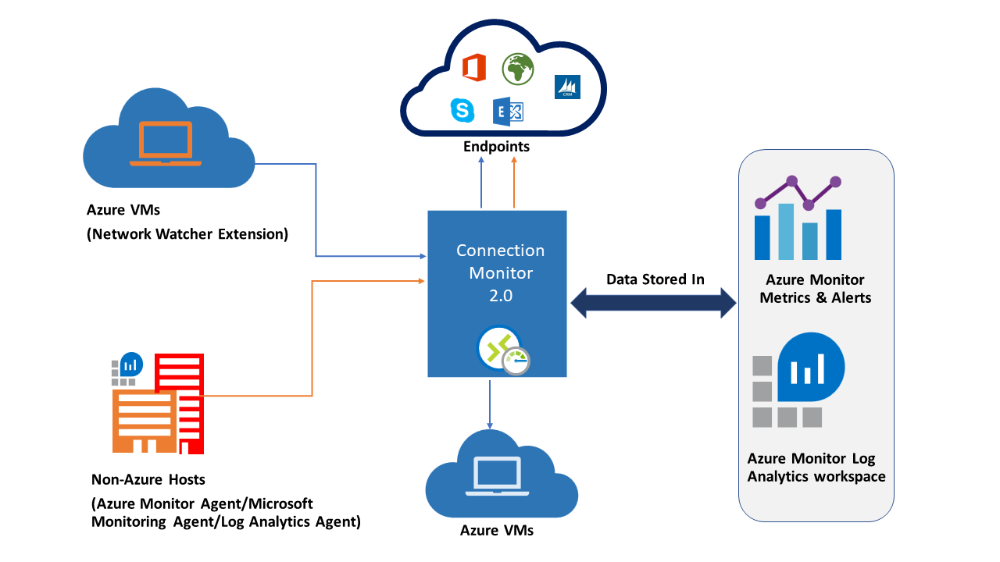

# Network Connectivity Monitoring with Connection Monitor

> [!IMPORTANT]
> Starting 1 July 2021, you will not be able to add new tests in an existing workspace or enable a new workspace in Network Performance Monitor. You will also not be able to add new connection monitors in Connection Monitor (classic). You can continue to use the tests and connection monitors created prior to 1 July 2021. To minimize service disruption to your current workloads, [migrate your tests from Network Performance Monitor ](migrate-to-connection-monitor-from-network-performance-monitor.md) or  [migrate from Connection Monitor (classic)](migrate-to-connection-monitor-from-connection-monitor-classic.md) to the new Connection Monitor in Azure Network Watcher before 29 February 2024.

Connection Monitor provides unified end-to-end connection monitoring in Azure Network Watcher. The Connection Monitor feature supports hybrid and Azure cloud deployments. Network Watcher provides tools to monitor, diagnose, and view connectivity-related metrics for your Azure deployments.

Here are some use cases for Connection Monitor:

- Your front-end web server VM communicates with a database server VM in a multi-tier application. You want to check network connectivity between the two VMs.
- You want VMs in the East US region to ping VMs in the Central US region, and you want to compare cross-region network latencies.
- You have multiple on-premises office sites in Seattle, Washington, and in Ashburn, Virginia. Your office sites connect to Microsoft 365 URLs. For your users of Microsoft 365 URLs, compare the latencies between Seattle and Ashburn.
- Your hybrid application needs connectivity to an Azure Storage endpoint. Your on-premises site and your Azure application connect to the same Azure Storage endpoint. You want to compare the latencies of the on-premises site to the latencies of the Azure application.
- You want to check the connectivity between your on-premises setups and the Azure VMs that host your cloud application.

Connection Monitor combines the best of two features: the Network Watcher [Connection Monitor (Classic)](./network-watcher-monitoring-overview.md#monitor-communication-between-a-virtual-machine-and-an-endpoint) feature and the Network Performance Monitor (NPM) [Service Connectivity Monitor](../azure-monitor/insights/network-performance-monitor-service-connectivity.md), [ExpressRoute Monitoring](../expressroute/how-to-npm.md), and [Performance Monitoring](../azure-monitor/insights/network-performance-monitor-performance-monitor.md) feature.

Here are some benefits of Connection Monitor:

* Unified, intuitive experience for Azure and hybrid monitoring needs
* Cross-region, cross-workspace connectivity monitoring
* Higher probing frequencies and better visibility into network performance
* Faster alerting for your hybrid deployments
* Support for connectivity checks that are based on HTTP, TCP, and ICMP 
* Metrics and Log Analytics support for both Azure and non-Azure test setups



To start using Connection Monitor for monitoring, follow these steps: 

1. Install monitoring agents.
1. Enable Network Watcher on your subscription.
1. Create a connection monitor.
1. Set up data analysis and alerts.
1. Diagnose issues in your network.

The following sections provide details for these steps.

## Install monitoring agents

Connection Monitor relies on lightweight executable files to run connectivity checks. It supports connectivity checks from both Azure environments and on-premises environments. The executable file that you use depends on whether your VM is hosted on Azure or on-premises.

### Agents for Azure virtual machines

To make Connection Monitor recognize your Azure VMs as monitoring sources, install the Network Watcher Agent virtual machine extension on them. This extension is also known as the *Network Watcher extension*. Azure virtual machines require the extension to trigger end-to-end monitoring and other advanced functionality. 

You can install the Network Watcher extension when you [create a VM](./connection-monitor.md#create-the-first-vm). You can also separately install, configure, and troubleshoot the Network Watcher extension for [Linux](../virtual-machines/extensions/network-watcher-linux.md) and [Windows](../virtual-machines/extensions/network-watcher-windows.md).

Rules for a network security group (NSG) or firewall can block communication between the source and destination. Connection Monitor detects this issue and shows it as a diagnostic message in the topology. To enable connection monitoring, ensure that NSG and firewall rules allow packets over TCP or ICMP between the source and destination.

### Agents for on-premises machines

To make Connection Monitor recognize your on-premises machines as sources for monitoring, install the Log Analytics agent on the machines.  Then enable the Network Performance Monitor solution. These agents are linked to Log Analytics workspaces, so you need to set up the workspace ID and primary key before the agents can start monitoring.

To install the Log Analytics agent for Windows machines, see [Install Log Analytics agent on Windows](../azure-monitor/agents/agent-windows.md).

If the path includes firewalls or network virtual appliances (NVAs), then make sure that the destination is reachable.

For Windows machines, to open the port, run the [EnableRules.ps1](https://aka.ms/npmpowershellscript) PowerShell script without any parameters in a PowerShell window with administrative privileges.

For Linux machines, portNumbers to be used needs to be changed manually. 
* Navigate to path: /var/opt/microsoft/omsagent/npm_state. 
* Open file: npmdregistry
* Change the value for Port Number ```“PortNumber:<port of your choice>”```

 Do note that port numbers being used should be same across all the agents used in a workspace. 

The script creates registry keys required by the solution. It also creates Windows Firewall rules to allow agents to create TCP connections with each other. The registry keys created by the script specify whether to log the debug logs and the path for the logs file. The script also defines the agent TCP port used for communication. The values for these keys are automatically set by the script. Don't manually change these keys. The port opened by default is 8084. You can use a custom port by providing the parameter portNumber to the script. Use the same port on all the computers where the script is run. [Read more](../azure-monitor/agents/log-analytics-agent.md#network-requirements) about the network requirements for Log Analytics agents

The script configures only Windows Firewall locally. If you have a network firewall, make sure that it allows traffic destined for the TCP port used by Network Performance Monitor.

## Enable Network Watcher on your subscription

All subscriptions that have a virtual network are enabled with Network Watcher. When you create a virtual network in your subscription, Network Watcher is automatically enabled in the virtual network's region and subscription. This automatic enabling doesn't affect your resources or incur a charge. Ensure that Network Watcher isn't explicitly disabled on your subscription. 

Do ensure that Network Watcher is [available for your region](https://azure.microsoft.com/global-infrastructure/services/?products=network-watcher&regions=all). For more information, see [Enable Network Watcher](./network-watcher-create.md).

## Create a connection monitor 

Connection Monitor monitors communication at regular intervals. It informs you of changes in reachability and latency. You can also check the current and historical network topology between source agents and destination endpoints.

Sources can be Azure VMs or on-premises machines that have an installed monitoring agent. Destination endpoints can be Microsoft 365 URLs, Dynamics 365 URLs, custom URLs, Azure VM resource IDs, IPv4, IPv6, FQDN, or any domain name.

### Access Connection Monitor

1. On the Azure portal home page, go to **Network Watcher**.
1. On the left, in the **Monitoring** section, select **Connection Monitor**.
1. You see all of the connection monitors that were created in Connection Monitor. To see the connection monitors that were created in the classic experience of Connection Monitor, go to the **Connection Monitor** tab.
    
  :::image type="content" source="./media/connection-monitor-2-preview/cm-resource-view.png" alt-text="Screenshot showing connection monitors that were created in Connection Monitor" lightbox="./media/connection-monitor-2-preview/cm-resource-view.png":::

### Create a connection monitor

In connection monitors that you create in Connection Monitor, you can add both on-premises machines and Azure VMs as sources. These connection monitors can also monitor connectivity to endpoints. The endpoints can be on Azure or any other URL or IP.

Connection Monitor includes the following entities:

* **Connection monitor resource** – A region-specific Azure resource. All of the following entities are properties of a connection monitor resource.
* **Endpoint** – A source or destination that participates in connectivity checks. Examples of endpoints include Azure VMs, on-premises agents, URLs, and IPs.
* **Test configuration** – A protocol-specific configuration for a test. Based on the protocol you chose, you can define the port, thresholds, test frequency, and other parameters.
* **Test group** – The group that contains source endpoints, destination endpoints, and test configurations. A connection monitor can contain more than one test group.
* **Test** – The combination of a source endpoint, destination endpoint, and test configuration. A test is the most granular level at which monitoring data is available. The monitoring data includes the percentage of checks that failed and the round-trip time (RTT).

 

You can create a connection monitor using [Azure portal](./connection-monitor-create-using-portal.md), [ARMClient](./connection-monitor-create-using-template.md) or [PowerShell](connection-monitor-create-using-powershell.md)

All sources, destinations, and test configurations that you add to a test group get broken down to individual tests. Here's an example of how sources and destinations are broken down:

* Test group: TG1
* Sources: 3 (A, B, C)
* Destinations: 2 (D, E)
* Test configurations: 2 (Config 1, Config 2)
* Total tests created: 12

| Test number | Source | Destination | Test configuration |
| --- | --- | --- | --- |
| 1 | A | D | Config 1 |
| 2 | A | D | Config 2 |
| 3 | A | E | Config 1 |
| 4 | A | E | Config 2 |
| 5 | B | D | Config 1 |
| 6 | B | D | Config 2 |
| 7 | B | E | Config 1 |
| 8 | B | E | Config 2 |
| 9 | C | D | Config 1 |
| 10 | C | D | Config 2 |
| 11 | C | E | Config 1 |
| 12 | C | E | Config 2 |

### Scale limits

Connection monitors have the following scale limits:

* Maximum connection monitors per subscription per region: 100
* Maximum test groups per connection monitor: 20
* Maximum sources and destinations per connection monitor: 100
* Maximum test configurations per connection monitor: 20

## Analyze monitoring data and set alerts

After you create a connection monitor, sources check connectivity to destinations based on your test configuration.

### Checks in a test

Based on the protocol that you chose in the test configuration, Connection Monitor runs a series of checks for the source-destination pair. The checks run according to the test frequency that you chose.

If you use HTTP, the service calculates the number of HTTP responses that returned a valid response code. Valid response codes can be set using PowerShell and CLI. The result determines the percentage of failed checks. To calculate RTT, the service measures the time between an HTTP call and the response.

If you use TCP or ICMP, the service calculates the packet-loss percentage to determine the percentage of failed checks. To calculate RTT, the service measures the time taken to receive the acknowledgment (ACK) for the packets that were sent. If you enabled traceroute data for your network tests, you can see hop-by-hop loss and latency for your on-premises network.

### States of a test

Based on the data that the checks return, tests can have the following states:

* **Pass** – Actual values for the percentage of failed checks and RTT are within the specified thresholds.
* **Fail** – Actual values for the percentage of failed checks or RTT exceeded the specified thresholds. If no threshold is specified, then a test reaches the Fail state when the percentage of failed checks is 100.
* **Warning** – 
     * If threshold is specified and Connection Monitor observes checks failed percent more than 80% of threshold,  the test is marked as warning.
     * In the absence of specified thresholds, Connection Monitor automatically assigns a threshold. When that threshold is exceeded, the test status changes to Warning. For round trip time in TCP or ICMP tests, the threshold is 750msec. For checks failed percent , the threshold is 10%. 
* **Indeterminate** – No data in Log Analytics Workspace.  Check metrics. 
* **Not Running** – Disabled by disabling test group  

### Data collection, analysis, and alerts

The data that Connection Monitor collects is stored in the Log Analytics workspace. You set up this workspace when you created the connection monitor. 

Monitoring data is also available in Azure Monitor Metrics. You can use Log Analytics to keep your monitoring data for as long as you want. Azure Monitor stores metrics for only 30 days by default. 

You can [set metric-based alerts on the data](https://azure.microsoft.com/blog/monitor-at-scale-in-azure-monitor-with-multi-resource-metric-alerts/).

#### Monitoring dashboards

On the monitoring dashboards, you see a list of the connection monitors that you can access for your subscriptions, regions, time stamps, sources, and destination types.

When you go to Connection Monitor from Network Watcher, you can view data by:

* **Connection monitor** – List of all connection monitors created for your subscriptions, regions, time stamps, sources, and destination types. This view is the default.
* **Test groups** – List of all test groups created for your subscriptions, regions, time stamps, sources, and destination types. These test groups aren't filtered by connection monitors.
* **Test** – List of all tests that run for your subscriptions, regions, time stamps, sources, and destination types. These tests aren't filtered by connection monitors or test groups.

In the following image, the three data views are indicated by arrow 1.

On the dashboard, you can expand each connection monitor to see its test groups. Then you can expand each test group to see the tests that run in it. 

You can filter a list based on:

* **Top-level filters** – Search list by text, entity type (Connection Monitor, test group or test) timestamp and scope. Scope includes subscriptions, regions,  sources, and destination types. See box 1 in the following image.
* **State-based filters** – Filter by the state of the connection monitor, test group, or test. See box 2 in the following image.
* **Alert based filter** - Filter by alerts fired on the connection monitor resource. See box 3 in the following image.

  :::image type="content" source="./media/connection-monitor-2-preview/cm-view.png" alt-text="Screenshot showing how to filter views of connection monitors, test groups, and tests in Connection Monitor " lightbox="./media/connection-monitor-2-preview/cm-view.png":::
    
For example, to look at all tests in Connection Monitor where the source IP is 10.192.64.56:
1. Change the view to **Test**.
1. In the search field, type *10.192.64.56*
1. In **Scope** in top level filter, select **Sources**.

To show only failed tests in Connection Monitor where the source IP is 10.192.64.56:
1. Change the view to **Test**.
1. For the state-based filter, select **Fail**.
1. In the search field, type *10.192.64.56*
1. In **Scope** in top level filter, select **Sources**.

To show only failed tests in Connection Monitor where the destination is outlook.office365.com:
1. Change view to **Test**.
1. For the state-based filter, select **Fail**.
1. In the search field, enter *office.live.com*
1. In **Scope** in top level filter, select **Destinations**.
  
  :::image type="content" source="./media/connection-monitor-2-preview/tests-view.png" alt-text="Screenshot showing a view that's filtered to show only failed tests for the Outlook.Office365.com destination" lightbox="./media/connection-monitor-2-preview/tests-view.png":::

To know reason  for failure of a Connection monitor or test group or test, click the column named reason.  This tells which threshold ( checks failed % or  RTT) was breached and related diagnostic messages
  
  :::image type="content" source="./media/connection-monitor-2-preview/cm-reason-of-failure.png" alt-text="Screenshot showing reason of failure for a connection monitor, test or test group" lightbox="./media/connection-monitor-2-preview/cm-reason-of-failure.png":::
    
To view the trends in RTT and the percentage of failed checks for a connection monitor:
1. Select the connection monitor that you want to investigate.

    :::image type="content" source="./media/connection-monitor-2-preview/cm-drill-landing.png" alt-text="Screenshot showing metrics for a connection monitor, displayed by test group" lightbox="./media/connection-monitor-2-preview/cm-drill-landing.png":::

1. You will see the following sections  
    1. Essentials - Resource specific properties of the selected Connection Monitor 
    1. Summary - 
        1. Aggregated trendlines for RTT and percentage of failed checks for all tests in the connection monitor. You can set a specific time to view the details.
        1. Top 5 across test groups, sources and destinations  based on the RTT or percentage of failed checks. 
    1. Tabs for Test Groups , Sources, Destinations and Test Configurations- Lists test groups, sources or destinations in the Connection Monitor. Check tests  failed, aggregate RTT and checks failed % values.  You can also go back in time to view data. 
    1. Issues - Hop level issues for each test in the Connection Monitor. 

    :::image type="content" source="./media/connection-monitor-2-preview/cm-drill-landing-2.png" alt-text="Screenshot showing metrics for a connection monitor, displayed by test group part 2" lightbox="./media/connection-monitor-2-preview/cm-drill-landing-2.png":::

1. You can
    * Click View all tests - to view all tests in the Connection Monitor
    * Click View all test groups, test configurations, sources and destinations - to view  details specific to each. 
    * Choose a test group, test configuration, source or destination - to view all tests in the entity.

1. From the view all tests view, you can:
    * Select tests and click compare.
    
    :::image type="content" source="./media/connection-monitor-2-preview/cm-compare-test.png" alt-text="Screenshot showing comparison of 2 tests" lightbox="./media/connection-monitor-2-preview/cm-compare-test.png":::
    
    * Use cluster to expand compound resources like VNET, Subnets to its child resources
    * View topology for any tests by clicking topology.

To view the trends in RTT and the percentage of failed checks for a test group:
1. Select the test group that you want to investigate. 
1. You will view similar to connection monitor - essentials, summary, table for test groups, sources, destinations and test configurations. Navigate them like you would do for a connection monitor

To view the trends in RTT and the percentage of failed checks for a test:
1. Select the test that you want to investigate. You will see the network topology and the end to end trend charts for checks failed % and round trip time. To see the identified issues, in the topology, select any hop in the path. (These hops are Azure resources.) This functionality isn't currently available for on-premises networks

  :::image type="content" source="./media/connection-monitor-2-preview/cm-test-topology.png" alt-text="Screenshot showing topology view of a test" lightbox="./media/connection-monitor-2-preview/cm-test-topology.png":::

#### Log queries in Log Analytics

Use Log Analytics to create custom views of your monitoring data. All data that the UI displays is from Log Analytics. You can interactively analyze data in the repository. Correlate the data from Agent Health or other solutions that are based in Log Analytics. Export the data to Excel or Power BI, or create a shareable link.

#### Network Topology in Connection Monitor 

Connection Monitor topology is usually built using the result of Trace route command performed by the agent which basically gets all the hops from source to destination.
However in case when either source/destination lies with in Azure Boundary, Topology is built by merging the results of 2 distinct operations.
First one is obviously the result of Trace Route command. The 2nd one is the result of an internal command (very similar to Next Hop Diagnostics tool of NW) which identifies a logical route based on (customer) network configuration within Azure Boundary. 
Since the later one is logical and the former one doesn't usually identify any hops with in Azure Boundary, few hops in the merged result (mostly all the hops in the Azure Boundary) will not have latency values.

#### Metrics in Azure Monitor

In connection monitors that were created before the Connection Monitor experience, all four metrics are available: % Probes Failed, AverageRoundtripMs, ChecksFailedPercent, and RoundTripTimeMs. In connection monitors that were created in the Connection Monitor experience, data is available only for ChecksFailedPercent, RoundTripTimeMs and Test Result metrics.

Metrics are emitted as per monitoring frequency and describe aspect of a connection monitor at a particular time. 
Connection Monitor metrics also have multiple dimensions such as SourceName, DestinationName, TestConfiguration, TestGroup etc. 
These dimensions can be used to visualize a specific set of data and also to target the same while defining alerts.
Currently Azure Metrics allows minimum granularity of 1 minute, If frequency is less than 1 minute, aggregated results will be displayed.

  :::image type="content" source="./media/connection-monitor-2-preview/monitor-metrics.png" alt-text="Screenshot showing metrics in Connection Monitor" lightbox="./media/connection-monitor-2-preview/monitor-metrics.png":::

When you use metrics, set the resource type as Microsoft.Network/networkWatchers/connectionMonitors

| Metric | Display name | Unit | Aggregation type | Description | Dimensions |
| --- | --- | --- | --- | --- | --- |
| ProbesFailedPercent (classic) | % Probes Failed (classic) | Percentage | Average | Percentage of connectivity monitoring probes failed.<br>This metric is available only for Connection monitor classic  | No dimensions |
| AverageRoundtripMs (classic) | Avg. Round-trip Time (ms) (classic) | Milliseconds | Average | Average network RTT for connectivity monitoring probes sent between source and destination.<br>This metric is available only for Connection monitor classic |             No dimensions |
| ChecksFailedPercent | % Checks Failed | Percentage | Average | Percentage of failed checks for a test. | ConnectionMonitorResourceId <br>SourceAddress <br>SourceName <br>SourceResourceId <br>SourceType <br>Protocol <br>DestinationAddress <br>DestinationName <br>DestinationResourceId <br>DestinationType <br>DestinationPort <br>TestGroupName <br>TestConfigurationName <br>Region <br>SourceIP <br>DestinationIP <br>SourceSubnet <br>DestinationSubnet |
| RoundTripTimeMs | Round-trip Time (ms) | Milliseconds | Average | RTT for checks sent between source and destination. This value isn't averaged. | ConnectionMonitorResourceId <br>SourceAddress <br>SourceName <br>SourceResourceId <br>SourceType <br>Protocol <br>DestinationAddress <br>DestinationName <br>DestinationResourceId <br>DestinationType <br>DestinationPort <br>TestGroupName <br>TestConfigurationName <br>Region <br>SourceIP <br>DestinationIP <br>SourceSubnet <br>DestinationSubnet |
| TestResult | Test Result | Count | Average | Connection monitor test result <br>Interpretation of result values is as follows: <br>0- Indeterminate <br>1- Pass <br>2- Warning <br>3- Fail| SourceAddress <br>SourceName <br>SourceResourceId <br>SourceType <br>Protocol <br>DestinationAddress <br>DestinationName <br>DestinationResourceId <br>DestinationType <br>DestinationPort <br>TestGroupName <br>TestConfigurationName <br>SourceIP <br>DestinationIP <br>SourceSubnet <br>DestinationSubnet |

#### Metric based alerts for Connection Monitor

You can create metric alerts on connection monitors using the methods below 

1. From Connection Monitor, during creation of Connection Monitor [using Azure portal](connection-monitor-preview-create-using-portal.md#) 
1. From Connection Monitor, using "Configure Alerts" in the dashboard 
1. From Azure Monitor - To create an alert in Azure Monitor: 
    1. Choose the connection monitor resource that you created in Connection Monitor.
    1. Ensure that **Metric** shows up as signal type for the connection monitor.
    1. In **Add Condition**, for the **Signal Name**, select **ChecksFailedPercent** or **RoundTripTimeMs**.
    1. For **Signal Type**, choose **Metrics**. For example, select **ChecksFailedPercent**.
    1. All of the dimensions for the metric are listed. Choose the dimension name and dimension value. For example, select **Source Address** and then enter the IP address of any source in your connection monitor.
    1. In **Alert Logic**, fill in the following details:
        * **Condition Type**: **Static**.
        * **Condition** and **Threshold**.
        * **Aggregation Granularity and Frequency of Evaluation**: Connection Monitor updates data every minute.
    1. In **Actions**, choose your action group.
    1. Provide alert details.
    1. Create the alert rule.

  :::image type="content" source="./media/connection-monitor-2-preview/mdm-alerts.jpg" alt-text="Screenshot showing the Create rule area in Azure Monitor. Source address and Source endpoint name are highlighted" lightbox="./media/connection-monitor-2-preview/mdm-alerts.jpg":::

## Diagnose issues in your network

Connection Monitor helps you diagnose issues in your connection monitor and your network. Issues in your hybrid network are detected by the Log Analytics agents that you installed earlier. Issues in Azure are detected by the Network Watcher extension. 

You can view issues in the Azure network in the network topology.

For networks whose sources are on-premises VMs, the following issues can be detected:

* Request timed out.
* Endpoint not resolved by DNS – temporary or persistent. URL invalid.
* No hosts found.
* Source unable to connect to destination. Target not reachable through ICMP.
* Certificate-related issues: 
    * Client certificate required to authenticate agent. 
    * Certificate relocation list isn't accessible. 
    * Host name of the endpoint doesn't match the certificate's subject or subject alternate name. 
    * Root certificate is missing in source's Local Computer Trusted Certification Authorities store. 
    * SSL certificate is expired, invalid, revoked, or incompatible.

For networks whose sources are Azure VMs, the following issues can be detected:

* Agent issues:
    * Agent stopped.
    * Failed DNS resolution.
    * No application or listener listening on the destination port.
    * Socket could not be opened.
* VM state issues: 
    * Starting
    * Stopping
    * Stopped
    * Deallocating
    * Deallocated
    * Rebooting
    * Not allocated
* ARP table entry is missing.
* Traffic was blocked because of local firewall issues or NSG rules.
* Virtual network gateway issues: 
    * Missing routes.
    * The tunnel between two gateways is disconnected or missing.
    * The second gateway wasn't found by the tunnel.
    * No peering info was found.
> [!NOTE]
> If there are 2 connected gateways and one of them is not in the same region as source endpoint, CM identifies it as a 'no route learned' for the topology view. Connectivity is not impacted. This is a known issue and fix is in progress. 
* Route was missing in Microsoft Edge.
* Traffic stopped because of system routes or UDR.
* BGP isn't enabled on the gateway connection.
* The DIP probe is down at the load balancer.

## Comparision between Azure's Connectivity Monitoring Support 

You can migrate tests from Network Performance Monitor and Connection Monitor (Classic) to New, Improved Connection Monitor with a single click and with zero downtime.
 
The migration helps produce the following results:

* Agents and firewall settings work as is. No changes are required. 
* Existing connection monitors are mapped to Connection Monitor > Test Group > Test format. By selecting **Edit**, you can view and modify the properties of the new Connection Monitor, download a template to make changes to Connection Monitor, and submit it via Azure Resource Manager. 
* Azure virtual machines with the Network Watcher extension send data to both the workspace and the metrics. Connection Monitor makes the data available through the new metrics (ChecksFailedPercent and RoundTripTimeMs) instead of the old metrics (ProbesFailedPercent and AverageRoundtripMs). The old metrics will get migrated to new metrics as ProbesFailedPercent -> ChecksFailedPercent and AverageRoundtripMs -> RoundTripTimeMs.
* Data monitoring:
   * **Alerts**: Migrated automatically to the new metrics.
   * **Dashboards and integrations**: Require manually editing of the metrics set. 
   
There are several reasons to migrate from Network Performance Monitor and Connection Monitor (Classic) to Connection Monitor. Below are some of the use cases which show us how Azure's Connection Monitor performs against Network Performance Monitor and Connection Monitor (Classic) . 

 | Feature	| Network Performance Monitor | Connection Monitor (Classic) | Connection Monitor |
 | -------  | --------------------------- | -------------------------- | ------------------ | 
 | Unified experience for Azure and Hybrid monitoring |	Not Available |	Not Available |	Available |
 | Cross Subscription, Cross Region, Cross Workspace Monitoring | Allows cross subscription, cross region monitoring but doesn’t allow cross workspace monitoring |	Not Available | Allows Cross Subscription , Cross Workspace monitoring; Azure Agents have regional boundary  |
 | Centralized workspace support | 	Not Available |	Not Available	| Available |
 | Multiple Sources can ping Multiple Destinations | Performance Monitoring allows multiple sources to ping multiple destinations , Service Connectivity Monitoring allows multiple sources to ping a single service/URL and Express Route allows multiple source to ping multiple destinations | Not Available | Available |
 | Unified Topology across On-Premises, Internet Hops and Azure | Not Available | Not Available	| Available |
 | HTTP Status Code Checks | Not Available	| Not Available	| Available |
 | Connectivity Diagnostics | Not Available | Available | Available |
 | Compound resources - VNETs , Subnets & On-Premises Custom Networks | Performance Monitoring supports Subnets, On premise Networks and Logical Network Groups , Service Connectivity Monitoring and Express Route support only On Premise and Azure Agents | Not Available | Available |
 | Connectivity Metrics and Dimensions Measurements |	Not Available | Loss, Latency, RTT | Available |
 | Automation – PS/ CLI/Terraform | Not Available | Available | Available |
 | Support for Linux | Performance Monitoring supports Linux, Service Connectivity Monitor and Express Route do not support Linux | Available | Available |
 | Support for Public, Government , Mooncake & Air-Gapped Cloud | Available | Available | Available|


## FAQ

### Are classic VMs supported?
No, Connection Monitor does not support Classic VMs. It is recommended to migrate IaaS resources from classic to Azure Resource Manager as classic resources will be [deprecated](../virtual-machines/classic-vm-deprecation.md). Refer this article to understand [how to migrate](../virtual-machines/migration-classic-resource-manager-overview.md).

### My topology is not decorated or my hops have missing information?
From non-Azure to Azure, topology can only be decorated if destination Azure resource and connection monitor resource are in same region 

### My Connection Monitor creation is failing with error "We don't allow creating different endpoints for the same VM"?
Same Azure VM cannot be used with different configurations in the same connection monitor. 
For example, using same VM with a filter and without a filter in same connection monitor is not supported.

### The test failure reason is "Nothing to Display"?
Issues displayed on the Connection Monitor dashboard are found during topology discovery or hop exploration. There can be cases where the threshold set for % loss or RTT is breached but no issues are found on hops.

### While migrating existing Connection Monitor (Classic) to Connection Monitor, the external endpoint tests are being migrated with TCP protocol only? 
There is no protocol selection in Connection Monitor (Classic). So customer would not have been able to specify connectivity to external endpoints using HTTP protocol in Connection Monitor (Classic).
All the tests have TCP protocol only in Connection Monitor (Classic), that's why on migration we create TCP configuration in tests in Connection Monitor. 

## Next Steps
    
   * Learn [How to create Connection Monitor using Azure portal](./connection-monitor-create-using-portal.md)  
   * Learn [How to create Connection Monitor using ARMClient](./connection-monitor-create-using-template.md)
