# Create a Connection Monitor (Preview) using the Azure portal

Learn how to create Connection Monitor (Preview) to monitor communication between your resources using the Azure portal. It supports hybrid and Azure cloud deployments.

## Before you begin 

In connection monitors that you create in Connection Monitor (Preview), you can add both on-premises machines and Azure VMs as sources. These connection monitors can also monitor connectivity to endpoints. The endpoints can be on Azure or any other URL or IP.

Connection Monitor (Preview) includes the following entities:

* **Connection monitor resource** – A region-specific Azure resource. All of the following entities are properties of a connection monitor resource.
* **Endpoint** – A source or destination that participates in connectivity checks. Examples of endpoints include 
	* Azure VMs
	* Azure VNETs
	* Azure subnets
	* On-premises agents
	* On-premises subnets
	* On-premises custom network comprising of multiple subnets
	* URLs, and IPs 
* **Test configuration** – A protocol-specific configuration for a test. Based on the protocol you chose, you can define the port, thresholds, test frequency, and other parameters.
* **Test group** – The group that contains source endpoints, destination endpoints, and test configurations. A connection monitor can contain more than one test group.
* **Test** – The combination of a source endpoint, destination endpoint, and test configuration. A test is the most granular level at which monitoring data is available. The monitoring data includes the percentage of checks that failed and the round-trip time (RTT).

	

## Steps to create

To create a Connection Monitor (Preview) using the Azure portal, follow below steps:

1. On the Azure portal home page, go to **Network Watcher**.
1. On the left, in the **Monitoring** section, select **Connection Monitor (Preview)**.
1. You see all of the connection monitors that were created in Connection Monitor (Preview). To see the connection monitors that were created in the classic experience of Connection Monitor, go to the **Connection Monitor** tab.

    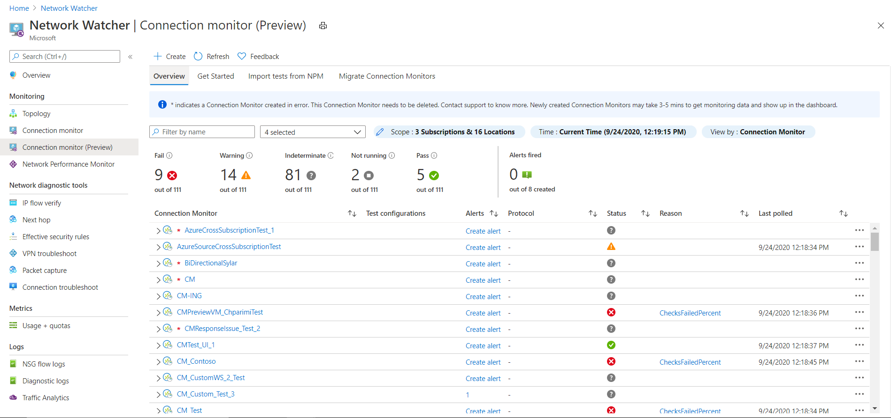   
	
1. On the **Connection Monitor (Preview)** dashboard, in the upper-left corner, select **Create**.

   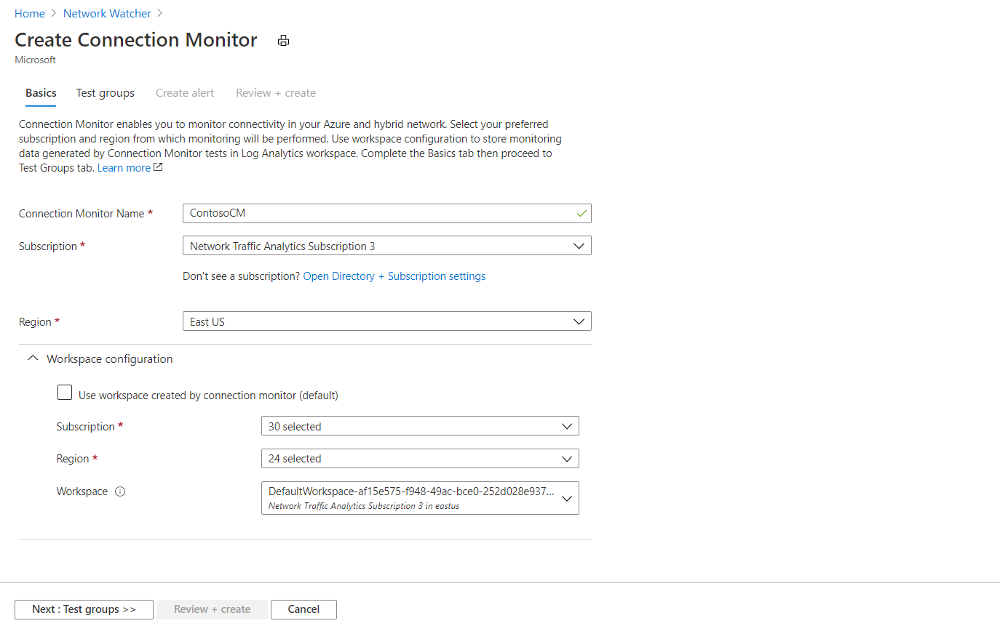

1. On the **Basics** tab, enter information for your connection monitor:
   * **Connection Monitor Name** – Add the name of your connection monitor. Use the standard naming rules for Azure resources.
   * **Subscription** – Choose a subscription for your connection monitor.
   * **Region** – Choose a region for your connection monitor. You can select only the source VMs that are created in this region.
   * **Workspace configuration** - Your workspace holds your monitoring data. You can use a custom workspace or the default workspace. 
       * To use the default workspace, select the check box. 
       * To choose a custom workspace, clear the check box. Then choose the subscription and region for your custom workspace. 
1. At the bottom of the tab, select **Next: Test groups**.

   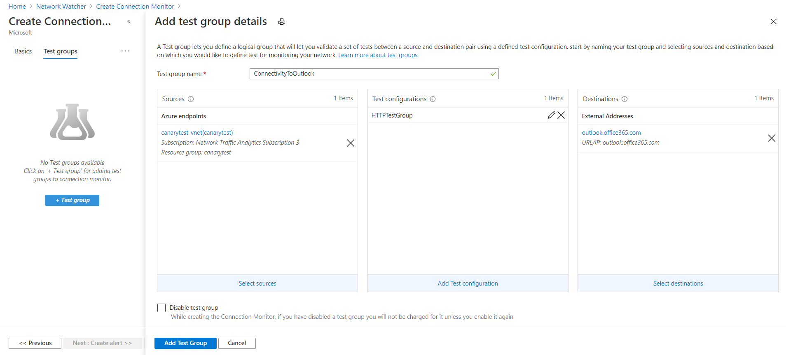

1. Add sources, destinations and test configurations in your test groups. To set up your test groups, see [Create test groups in Connection Monitor](#create-test-groups-in-a-connection-monitor). 
1. At the bottom of the tab, select **Next: Create Alerts**.

   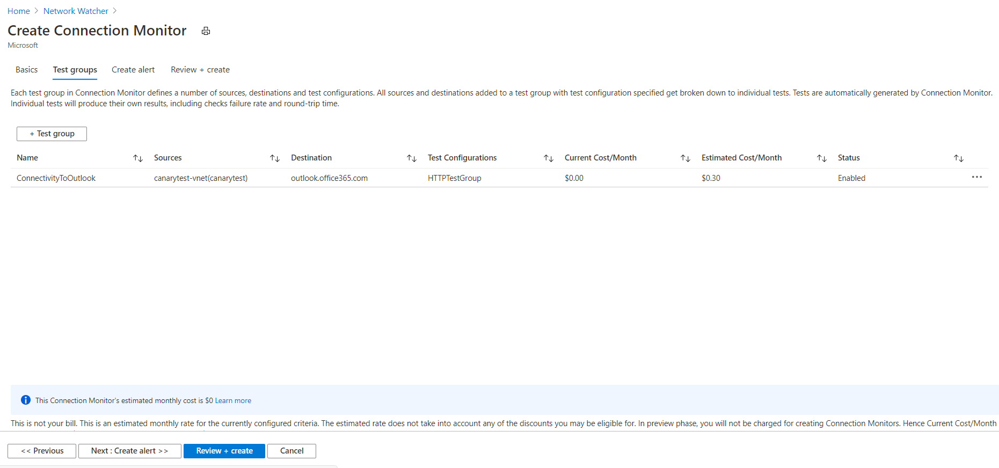

1. To create alerts, see [Create Alerts in Connection Monitor](#create-alerts-in-connection-monitor)
1. At the bottom of the tab, select **Next: Review + create**.

  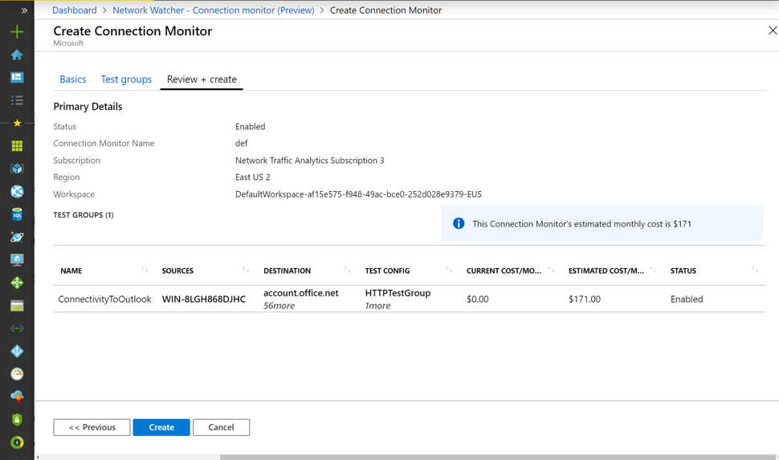

1. On the **Review + create** tab, review the basic information and test groups before you create the connection monitor. If you need to edit the connection monitor:
   * To edit basic details, select the pencil icon.
   * To edit a test group, select it.

   > [!NOTE] 
   > The **Review + create** tab shows the cost per month during the Connection Monitor preview stage. Currently, the **CURRENT COST** column shows no charge. When Connection Monitor becomes generally available, this column will show a monthly charge. 
   > 
   > Even in the Connection Monitor preview stage, Log Analytics ingestion charges apply.

1. When you're ready to create the connection monitor, at the bottom of the **Review + create** tab, select **Create**.

Connection Monitor (Preview) creates the connection monitor resource in the background.

## Create test groups in a connection monitor

Each test group in a connection monitor includes sources and destinations that get tested on network parameters. They're tested for the percentage of checks that fail and the RTT over test configurations.

From the Azure portal, to create a test group in a connection monitor, you specify values for the following fields:

* **Disable Test Group** – You can select this field to disable monitoring for all sources and destinations that the test group specifies. This selection is cleared by default.
* **Name** – Name your test group.
* **Sources** – You can specify both Azure VMs and on-premises machines as sources if agents are installed on them. To install an agent for your source, see [Install monitoring agents](https://docs.microsoft.com/azure/network-watcher/connection-monitor-preview#install-monitoring-agents).
   * To choose Azure agents, select the **Azure endpoints** tab. Here you see only VMs that are bound to the region that you specified when you created the connection monitor. By default, VMs are grouped into the subscription that they belong to. These groups are collapsed. 
   
       You can drill down from the Subscription level to other levels in the hierarchy:

      **Subscription** > **Resource groups** > **VNETs** > **Subnets** > **VMs with agents**

      You can also change the value of the **group by** field to start the tree from any other level. For example, if you group by virtual network, you see the VMs that have agents in the hierarchy **VNETs** > **Subnets** > **VMs with agents**.
       Selecting a VNET ,subnet or a single VM sets the corresponding resource ID as the endpoint. By default, all VMs in the selected VNET or subnet with Network Watcher extension participate in monitoring. To reduce the scope, either select specific subnets/agents or change the value of the scope property. 

      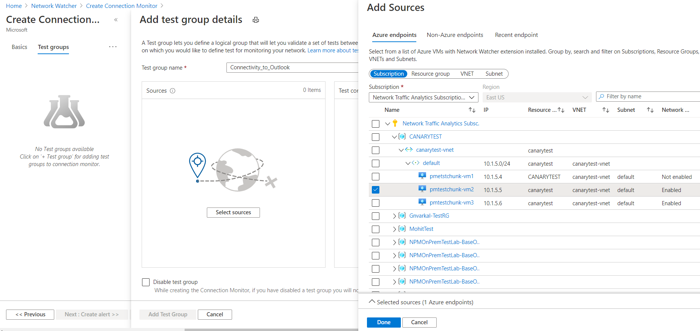

   * To choose on-premises agents, select the **Non–Azure Agents** tab. By default, agents are grouped into workspaces by region. All of these workspaces have the Network Performance Monitor solution configured. 
   
       If you need to add Network Performance Monitor to your workspace, get it from [Azure Marketplace](https://azuremarketplace.microsoft.com/marketplace/apps/Microsoft.NetworkMonitoringOMS?tab=Overview). For information about how to add Network Performance Monitor, see [Monitoring solutions in Azure Monitor](https://docs.microsoft.com/azure/azure-monitor/insights/solutions). 
   
       In the **Create Connection Monitor** view, on the **Basics** tab, the default region is selected. If you change the region, you can choose agents from workspaces in the new region.  You can select one or more agents or subnets. In the subnet view, you can select specific IPs for monitoring. Adding multiple subnets will create a custom on-premises network namely "OnPremises_Network_1". You can also change the value of the **Group by** field to group by subnets.

      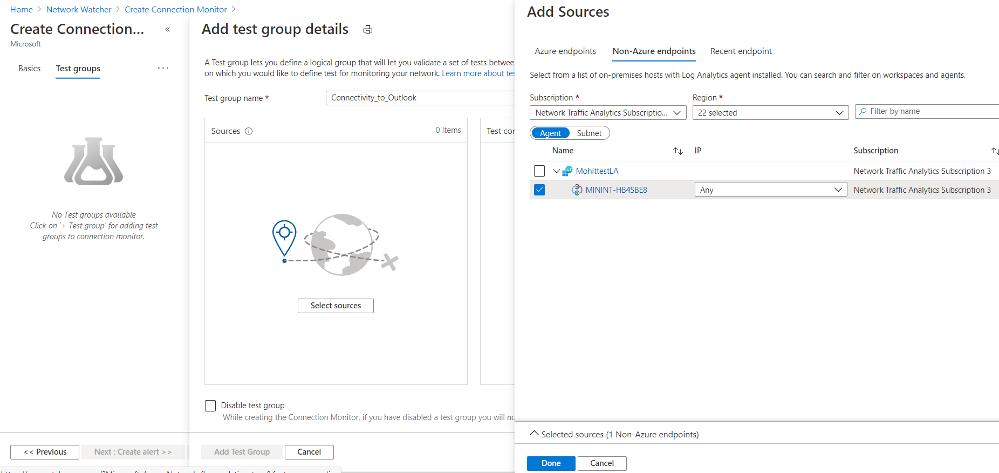

   * You can also choose recently used endpoints, using **Recent Endpoint** tab 
   
   * When you finish setting up sources, select **Done**. You can still edit basic properties like endpoint name by clicking the endpoint in the Create Test Group view. 

* **Destinations** – You can monitor connectivity to Azure VMs, on-premises machines or any endpoint (a public IP, URL, or FQDN) by specifying them as destinations. In a single test group, you can add Azure VMs, on-premises machine, Office 365 URLs, Dynamics 365 URLs, and custom endpoints.

    * To choose Azure VMs as destinations, select the **Azure endpoints** tab. By default, the Azure VMs are grouped into a subscription hierarchy that's in the same region that you selected in the **Create Connection Monitor** view, on the **Basics** tab. You can change the region and choose Azure VMs from the newly selected region. Then you can drill down from Subscription level to other levels in the hierarchy, just like the source Azure endpoints.
     You can select VNETs, subnets or single VMs,  similar to source Azure endpoints.Selecting a VNET ,subnet or a single VM sets the corresponding resource ID as the endpoint. By default, all VMs in the selected VNET or subnet with Network Watcher extension participate in monitoring. To reduce the scope, either select specific subnets/agents or change the value of the scope property. 

       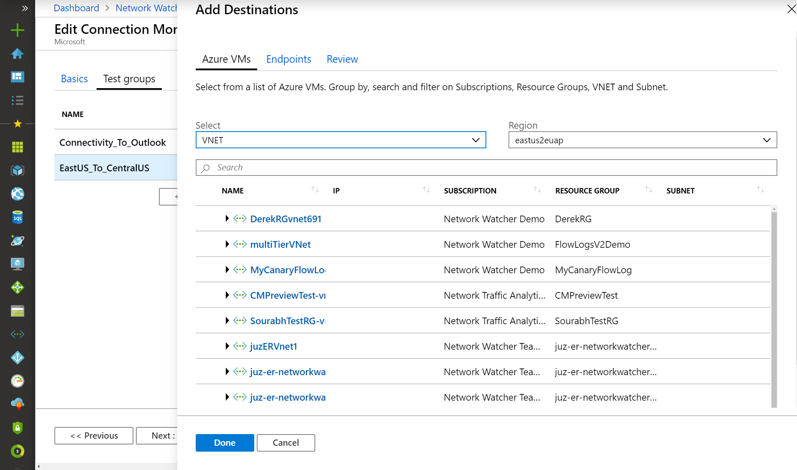

       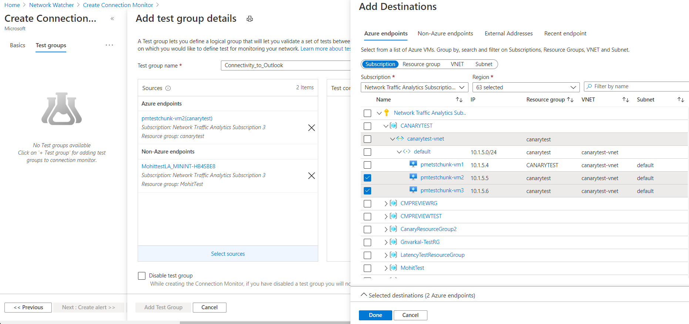
    
    * To choose non Azure agents as destinations, select the Non-Azure endpoints tab. By default, agents are grouped into workspaces by region. All of these workspaces have the Network Performance Monitor solution configured. If you need to add Network Performance Monitor to your workspace, get it from Azure Marketplace. For information about how to add Network Performance Monitor, see Monitoring solutions in Azure Monitor. In the Create Connection Monitor view, on the Basics tab, the default region is selected. If you change the region, you can choose agents from workspaces in the new region. You can select one or more agents or subnets. In the subnet view, you can select specific IPs for monitoring. Adding multiple subnets will create a custom on-premises network namely "OnPremises_Network_1".  
    
     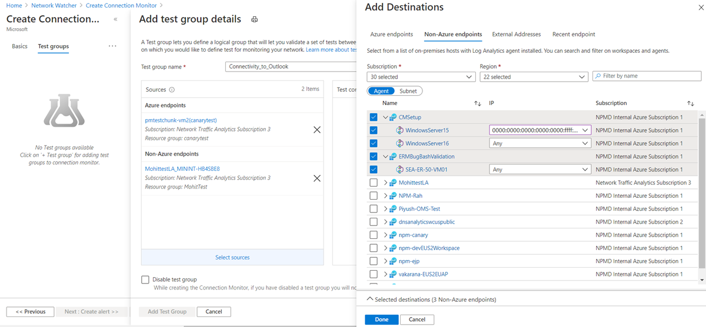
	
    * To choose public endpoints as destinations, select the **External Addresses** tab. The list of endpoints includes Office 365 test URLs and Dynamics 365 test URLs, grouped by name. In addition to these endpoints, you can choose an endpoint that was created in other test groups in the same connection monitor. 
    
        To add a new endpoint, in the upper-right corner, select **+ Endpoints**. Then provide an endpoint name and URL, IP, or FQDN.

       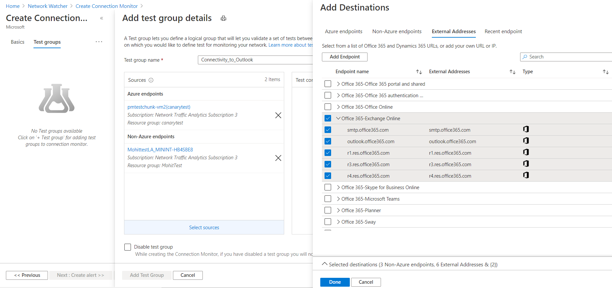

    * To choose recently used endpoints, go to the **Recent Endpoints** tab.
    * When you finish choosing destinations, select **Done**. You can still edit basic properties like endpoint name by clicking the endpoint in the Create Test Group view. 

* **Test configurations** – You can associate one or more test configurations in a test group. Create a new test configuration using the "New configuration" tab or use a test configuration used in other test groups in the same Connection Monitor through  "Choose Existing" tab.

    * **Name** – Name the test configuration.
    * **Protocol** – Choose TCP, ICMP, or HTTP. To change HTTP to HTTPS, select **HTTP** as the protocol, and select **443** as the port.
        * **Create network test configuration** – This check box appears only if you select **HTTP** in the **Protocol** field. Select this box to create another test configuration that uses the same sources and destinations that you specified elsewhere in your configuration. The newly created test configuration is named `<the name of your test configuration>_networkTestConfig`.
        * **Disable traceroute** – This field applies when protocol is TCP or ICMP. Select this box to stop sources from discovering topology and hop-by-hop RTT.
    * **Destination port** – You can customize this field with a destination port of your choice.
    	* Listen on port - This field applies when protocol is TCP. Select this box to open the chosen TCP port if not already open. 
    * **Test Frequency** – Use this field to choose how frequently sources will ping destinations on the protocol and port that you specified. You can choose 30 seconds, 1 minute, 5 minutes, 15 minutes, or 30 minutes. Select custom to enter frequency of your choice between 30 seconds to 30 minutes. Sources will test connectivity to destinations based on the value that you choose.  For example, if you select 30 seconds, sources will check connectivity to the destination at least once in a 30-second period.
    * **Success Threshold** – You can set thresholds on the following network parameters:
       * **Checks failed** – Set the percentage of checks that can fail when sources check connectivity to destinations by using the criteria that you specified. For TCP or ICMP protocol, the percentage of failed checks can be equated to the percentage of packet loss. For HTTP protocol, this field represents the percentage of HTTP requests that received no response.
       * **Round-trip time** – Set the RTT in milliseconds for how long sources can take to connect to the destination over the test configuration.
    
       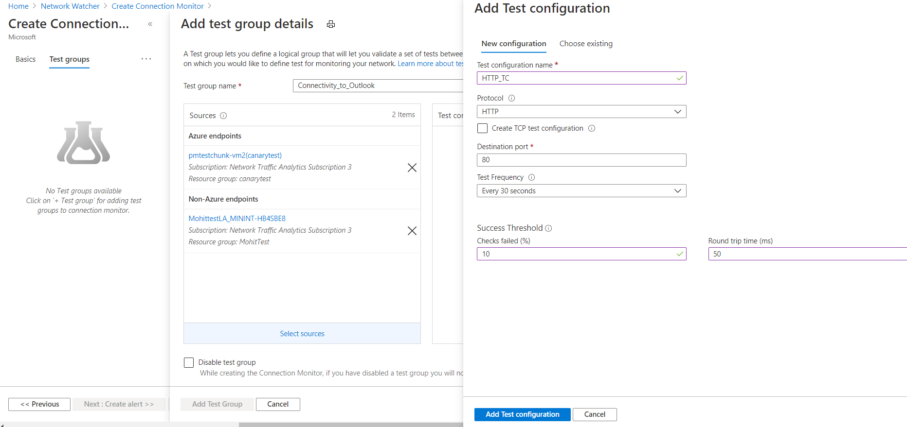
       
## Create Alerts in Connection Monitor

You can setup alerts on tests that are failing based on the thresholds set in test configurations.   

From the Azure portal, to create alerts in a connection monitor, you specify values for the following fields: 

- Create alert - You can select this field to create a metric alert in Azure Monitor. Selecting this will enable the other fields for editing. Additional charges for alert will be applicable based on [pricing for alerts](https://azure.microsoft.com/pricing/details/monitor/) 

- Scope -> Resource and Scope -> Hierarchy - This is prefilled based on the values specified in the Basics tab 

- Condition -> The alert is created on the "Test Result(preview)" metric. When the test result of the connection monitor is failed, the alert rule will get fired. 

- Action Group -You can choose to enter your email directly or you can choose to create alerts via action groups. If you choose to enter your email directly, an action group with the name NPM Email ActionGroup is created and the email ID is added to that action group.If you choose to use action groups, you will have to select an previously created action group. You can learn how to create an action group here.Once the alert is successfully created, you can use Manage Alerts link to manage your alerts. 

- Alert Rule Name - Name of the Connection Monitor 

- Enable rule upon creation - This will enable the alert rule based on the condition. Disable this if you want to create the rule but not enable it. 

  	

## Scale limits

Connection monitors have the following scale limits:

* Maximum connection monitors per subscription per region: 100
* Maximum test groups per connection monitor: 20
* Maximum sources and destinations per connection monitor: 100
* Maximum test configurations per connection monitor: 2 via the Azure portal

## Next steps

* Learn [how to analyze monitoring data and set alerts](https://docs.microsoft.com/azure/network-watcher/connection-monitor-preview#analyze-monitoring-data-and-set-alerts)
* Learn [how to diagnose issues in your network](https://docs.microsoft.com/azure/network-watcher/connection-monitor-preview#diagnose-issues-in-your-network)
