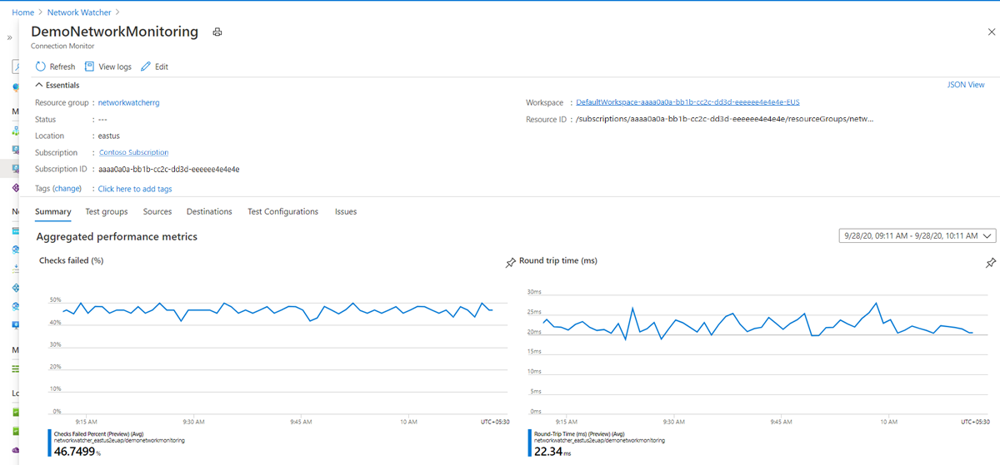

# Network Connectivity Monitoring with Connection Monitor (Preview)

Connection Monitor (Preview) provides unified end-to-end connection monitoring in Azure Network Watcher. The Connection Monitor (Preview) feature supports hybrid and Azure cloud deployments. Network Watcher provides tools to monitor, diagnose, and view connectivity-related metrics for your Azure deployments.

Here are some use cases for Connection Monitor (Preview):

- Your front-end web server VM communicates with a database server VM in a multi-tier application. You want to check network connectivity between the two VMs.
- You want VMs in the East US region to ping VMs in the Central US region, and you want to compare cross-region network latencies.
- You have multiple on-premises office sites in Seattle, Washington, and in Ashburn, Virginia. Your office sites connect to Office 365 URLs. For your users of Office 365 URLs, compare the latencies between Seattle and Ashburn.
- Your hybrid application needs connectivity to an Azure Storage endpoint. Your on-premises site and your Azure application connect to the same Azure Storage endpoint. You want to compare the latencies of the on-premises site to the latencies of the Azure application.
- You want to check the connectivity between your on-premises setups and the Azure VMs that host your cloud application.

In its preview phase, Connection Monitor combines the best of two features: the Network Watcher [Connection Monitor](https://docs.microsoft.com/azure/network-watcher/network-watcher-monitoring-overview#monitor-communication-between-a-virtual-machine-and-an-endpoint) feature and the Network Performance Monitor (NPM) [Service Connectivity Monitor](https://docs.microsoft.com/azure/azure-monitor/insights/network-performance-monitor-service-connectivity) feature.

Here are some benefits of Connection Monitor (Preview):

* Unified, intuitive experience for Azure and hybrid monitoring needs
* Cross-region, cross-workspace connectivity monitoring
* Higher probing frequencies and better visibility into network performance
* Faster alerting for your hybrid deployments
* Support for connectivity checks that are based on HTTP, TCP, and ICMP 
* Metrics and Log Analytics support for both Azure and non-Azure test setups


To start using Connection Monitor (Preview) for monitoring, follow these steps: 

1. Install monitoring agents.
1. Enable Network Watcher on your subscription.
1. Create a connection monitor.
1. Set up data analysis and alerts.
1. Diagnose issues in your network.

The following sections provide details for these steps.

## Install monitoring agents

Connection Monitor relies on lightweight executable files to run connectivity checks.  It supports connectivity checks from both Azure environments and on-premises environments. The executable file that you use depends on whether your VM is hosted on Azure or on-premises.

### Agents for Azure virtual machines

To make Connection Monitor recognize your Azure VMs as monitoring sources, install the Network Watcher Agent virtual machine extension on them. This extension is also known as the *Network Watcher extension*. Azure virtual machines require the extension to trigger end-to-end monitoring and other advanced functionality. 

You can install the Network Watcher extension when you [create a VM](https://docs.microsoft.com/azure/network-watcher/connection-monitor#create-the-first-vm). You can also separately install, configure, and troubleshoot the Network Watcher extension for [Linux](https://docs.microsoft.com/azure/virtual-machines/extensions/network-watcher-linux) and [Windows](https://docs.microsoft.com/azure/virtual-machines/extensions/network-watcher-windows).

Rules for a network security group (NSG) or firewall can block communication between the source and destination. Connection Monitor detects this issue and shows it as a diagnostic message in the topology. To enable connection monitoring, ensure that NSG and firewall rules allow packets over TCP or ICMP between the source and destination.

### Agents for on-premises machines

To make Connection Monitor recognize your on-premises machines as sources for monitoring, install the Log Analytics agent on the machines. Then enable the Network Performance Monitor solution. These agents are linked to Log Analytics workspaces, so you need to set up the workspace ID and primary key before the agents can start monitoring.

To install the Log Analytics agent for Windows machines, see [Azure Monitor virtual machine extension for Windows](https://docs.microsoft.com/azure/virtual-machines/extensions/oms-windows).

If the path includes firewalls or network virtual appliances (NVAs), then make sure that the destination is reachable.

## Enable Network Watcher on your subscription

All subscriptions that have a virtual network are enabled with Network Watcher. When you create a virtual network in your subscription, Network Watcher is automatically enabled in the virtual network's region and subscription. This automatic enabling doesn't affect your resources or incur a charge. Ensure that Network Watcher isn't explicitly disabled on your subscription. 

For more information, see [Enable Network Watcher](https://docs.microsoft.com/azure/network-watcher/network-watcher-create).

## Create a connection monitor 

Connection Monitor monitors communication at regular intervals. It informs you of changes in reachability and latency. You can also check the current and historical network topology between source agents and destination endpoints.

Sources can be Azure VMs or on-premises machines that have an installed monitoring agent. Destination endpoints can be Office 365 URLs, Dynamics 365 URLs, custom URLs, Azure VM resource IDs, IPv4, IPv6, FQDN, or any domain name.

### Access Connection Monitor (Preview)

1. On the Azure portal home page, go to **Network Watcher**.
1. On the left, in the **Monitoring** section, select **Connection Monitor (Preview)**.
1. You see all of the connection monitors that were created in Connection Monitor (Preview). To see the connection monitors that were created in the classic experience of Connection Monitor, go to the **Connection Monitor** tab.

    


### Create a connection monitor

In connection monitors that you create in Connection Monitor (Preview), you can add both on-premises machines and Azure VMs as sources. These connection monitors can also monitor connectivity to endpoints. The endpoints can be on Azure or any other URL or IP.

Connection Monitor (Preview) includes the following entities:

* **Connection monitor resource** – A region-specific Azure resource. All of the following entities are properties of a connection monitor resource.
* **Endpoint** – A source or destination that participates in connectivity checks. Examples of endpoints include Azure VMs, on-premises agents, URLs, and IPs.
* **Test configuration** – A protocol-specific configuration for a test. Based on the protocol you chose, you can define the port, thresholds, test frequency, and other parameters.
* **Test group** – The group that contains source endpoints, destination endpoints, and test configurations. A connection monitor can contain more than one test group.
* **Test** – The combination of a source endpoint, destination endpoint, and test configuration. A test is the most granular level at which monitoring data is available. The monitoring data includes the percentage of checks that failed and the round-trip time (RTT).

 

#### Create a connection monitor from the Azure portal

To create a connection monitor from the Azure portal, follow these steps:

1. On the **Connection Monitor (Preview)** dashboard, in the upper-left corner, select **Create**.
1. On the **Basics** tab, enter information for your connection monitor:
   * **Connection Monitor Name** – Add the name of your connection monitor. Use the standard naming rules for Azure resources.
   * **Subscription** – Choose a subscription for your connection monitor.
   * **Region** – Choose a region for your connection monitor. You can select only the source VMs that are created in this region.
   * **Workspace configuration** - Your workspace holds your monitoring data. You can use a custom workspace or the default workspace. 
       * To use the default workspace, select the check box. 
       * To choose a custom workspace, clear the check box. Then choose the subscription and region for your custom workspace. 
1. At the bottom of the tab, select **Next: Test groups**.

   

1. On the **Test groups** tab, select **+ Test group**. To set up your test groups, see [Create test groups in Connection Monitor](#create-test-groups-in-a-connection-monitor). 
1. At the bottom of the tab, select **Next: Review + create** to review your connection monitor.

   

1. On the **Review + create** tab, review the basic information and test groups before you create the connection monitor. If you need to edit the connection monitor:
   * To edit basic details, select the pencil icon.
   * To edit a test group, select it.

   > [!NOTE] 
   > The **Review + create** tab shows the cost per month during the Connection Monitor preview stage. Currently, the **CURRENT COST** column shows no charge. When Connection Monitor becomes generally available, this column will show a monthly charge. 
   > 
   > Even in the Connection Monitor preview stage, Log Analytics ingestion charges apply.

1. When you're ready to create the connection monitor, at the bottom of the **Review + create** tab, select **Create**.

   

Connection Monitor (Preview) creates the connection monitor resource in the background.

#### Create a connection monitor by using ARMClient

Use the following code to create a connection monitor by using ARMClient.

```armclient
$connectionMonitorName = "sampleConnectionMonitor"

$ARM = "https://management.azure.com"

$SUB = "subscriptions/<subscription id 1>;"

$NW = "resourceGroups/NetworkWatcherRG/providers/Microsoft.Network/networkWatchers/NetworkWatcher\_<region>"

$body =

"{

location: '<region>',

properties: {

endpoints: [{

name: 'workspace',

resourceId: '/subscriptions/<subscription id>/resourcegroups/<resource group>/providers/Microsoft.OperationalInsights/workspaces/sampleWorkspace',

filter: {

 items: [{

type: 'AgentAddress',

address: '<FQDN of your on-premises agent>'

}]

}

          },

 {

name: 'vm1',

resourceId: '/subscriptions/<subscription id>/resourceGroups/<resource group>/providers/Microsoft.Compute/virtualMachines/<vm-name>'

},

 {

name: 'vm2',

resourceId: '/subscriptions/<subscription id>/resourceGroups/<resource group>/providers/Microsoft.Compute/virtualMachines/<vm-name>'

   },

{

name: 'azure portal'

address: '<URL>'

   },

 {

    name: 'ip',

     address: '<IP>'

 }

  ],

  testGroups: [{

    name: 'Connectivity to Azure Portal and Public IP',

    testConfigurations: ['http', 'https', 'tcpEnabled', 'icmpEnabled'],

    sources: ['vm1', 'workspace'],

    destinations: ['azure portal', 'ip']

   },

{

    name: 'Connectivty from Azure VM 1 to Azure VM 2',

   // Choose your protocol
   
    testConfigurations: ['http', 'https', 'tcpDisabled', 'icmpDisabled'],

    sources: ['vm1'],

    destinations: ['vm2'],

    disable: true

   }

  ],

  testConfigurations: [{

    name: 'http',

    testFrequencySec: <frequency>,

    protocol: 'HTTP',

    successThreshold: {

     checksFailedPercent: <threshold for checks failed %>,

     roundTripTimeMs: <threshold for RTT>

    }

   }, {

    name: 'https',

    testFrequencySec: <frequency>,

    protocol: 'HTTP',

    httpConfiguration: {

     preferHTTPS: true

    },

    successThreshold: {

     checksFailedPercent: <choose your checks failed threshold>,

     roundTripTimeMs: <choose your RTT threshold>

    }

   }, {

    name: 'tcpEnabled',

    testFrequencySec: <frequency>,

    protocol: 'TCP',

    tcpConfiguration: {

     port: 80

    },

    successThreshold: {

     checksFailedPercent: <choose your checks failed threshold>,

     roundTripTimeMs: <choose your RTT threshold>

    }

   }, {

    name: 'icmpEnabled',

    testFrequencySec: <frequency>,

    protocol: 'ICMP',

    successThreshold: {

     checksFailedPercent: <choose your checks failed threshold>,

     roundTripTimeMs: <choose your RTT threshold>

    }

   }, {

    name: 'icmpDisabled',

    testFrequencySec: <frequency>,

    protocol: 'ICMP',

    icmpConfiguration: {

     disableTraceRoute: true

    },

    successThreshold: {

     checksFailedPercent: <choose your checks failed threshold>,

     roundTripTimeMs: <choose your RTT threshold>

    }

   }, {

    name: 'tcpDisabled',

    testFrequencySec: <frequency>,

    protocol: 'TCP',

    tcpConfiguration: {

     port: 80,

     disableTraceRoute: true

    },

    successThreshold: {

     checksFailedPercent: <choose your checks failed threshold>,

     roundTripTimeMs: <choose your RTT threshold>

    }

   }

  ]

 }

} "
```

Here's the deployment command:
```
armclient PUT $ARM/$SUB/$NW/connectionMonitors/$connectionMonitorName/?api-version=2019-07-01 $body -verbose
```

### Create test groups in a connection monitor

Each test group in a connection monitor includes sources and destinations that get tested on network parameters. They're tested for the percentage of checks that fail and the RTT over test configurations.

From the Azure portal, to create a test group in a connection monitor, you specify values for the following fields:

* **Disable Test Group** – You can select this field to disable monitoring for all sources and destinations that the test group specifies. This selection is cleared by default.
* **Name** – Name your test group.
* **Sources** – You can specify both Azure VMs and on-premises machines as sources if agents are installed on them. To install an agent for your source, see [Install monitoring agents](#install-monitoring-agents).
   * To choose Azure agents, select the **Azure Agents** tab. Here you see only VMs that are bound to the region that you specified when you created the connection monitor. By default, VMs are grouped into the subscription that they belong to. These groups are collapsed. 
   
       You can drill down from the Subscription level to other levels in the hierarchy:

      **Subscription** > **Resource groups** > **VNETs** > **Subnets** > **VMs with agents**

      You can also change the value of the **Group by** field to start the tree from any other level. For example, if you group by virtual network, you see the VMs that have agents in the hierarchy **VNETs** > **Subnets** > **VMs with agents**.

      

   * To choose on-premises agents, select the **Non–Azure Agents** tab. By default, agents are grouped into workspaces by region. All of these workspaces have the Network Performance Monitor solution configured. 
   
       If you need to add Network Performance Monitor to your workspace, get it from [Azure Marketplace](https://azuremarketplace.microsoft.com/marketplace/apps/Microsoft.NetworkMonitoringOMS?tab=Overview). For information about how to add Network Performance Monitor, see [Monitoring solutions in Azure Monitor](https://docs.microsoft.com/azure/azure-monitor/insights/solutions). 
   
       In the **Create Connection Monitor** view, on the **Basics** tab, the default region is selected. If you change the region, you can choose agents from workspaces in the new region. You can also change the value of the **Group by** field to group by subnets.

      


   * To review the Azure and non-Azure agents that you selected, go to the **Review** tab.

      

   * When you finish setting up sources, at the bottom of the **Add Sources** panel, select **Done**.

* **Destinations** – You can monitor connectivity to Azure VMs or any endpoint (a public IP, URL, or FQDN) by specifying them as destinations. In a single test group, you can add Azure VMs, Office 365 URLs, Dynamics 365 URLs, and custom endpoints.

    * To choose Azure VMs as destinations, select the **Azure VMs** tab. By default, the Azure VMs are grouped into a subscription hierarchy that's in the same region that you selected in the **Create Connection Monitor** view, on the **Basics** tab. You can change the region and choose Azure VMs from the newly selected region. Then you can drill down from Subscription level to other levels in the hierarchy, like the Azure Agents level.

       

       

    * To choose endpoints as destinations, select the **Endpoints** tab. The list of endpoints includes Office 365 test URLs and Dynamics 365 test URLs, grouped by name. In addition to these endpoints, you can choose an endpoint that was created in other test groups in the same connection monitor. 
    
        To add a new endpoint, in the upper-right corner, select **+ Endpoints**. Then provide an endpoint name and URL, IP, or FQDN.

       

    * To review the Azure VMs and endpoints that you chose, select the **Review** tab.
    * When you finish choosing destinations, select **Done**.

* **Test configurations** – You can associate test configurations in a test group. The Azure portal allows only one test configuration per test group, but you can use ARMClient to add more.

    * **Name** – Name the test configuration.
    * **Protocol** – Choose TCP, ICMP, or HTTP. To change HTTP to HTTPS, select **HTTP** as the protocol, and select **443** as the port.
        * **Create network test configuration** – This check box appears only if you select **HTTP** in the **Protocol** field. Select this box to create another test configuration that uses the same sources and destinations that you specified elsewhere in your configuration. The newly created test configuration is named `<the name of your test configuration>_networkTestConfig`.
        * **Disable traceroute** – This field applies to test groups whose protocol is TCP or ICMP. Select this box to stop sources from discovering topology and hop-by-hop RTT.
    * **Destination port** – You can customize this field with a destination port of your choice.
    * **Test Frequency** – Use this field to choose how frequently sources will ping destinations on the protocol and port that you specified. You can choose 30 seconds, 1 minute, 5 minutes, 15 minutes, or 30 minutes. Sources will test connectivity to destinations based on the value that you choose.  For example, if you select 30 seconds, sources will check connectivity to the destination at least once in a 30-second period.
    * **Success Threshold** – You can set thresholds on the following network parameters:
       * **Checks failed** – Set the percentage of checks that can fail when sources check connectivity to destinations by using the criteria that you specified. For TCP or ICMP protocol, the percentage of failed checks can be equated to the percentage of packet loss. For HTTP protocol, this field represents the percentage of HTTP requests that received no response.
       * **Round-trip time** – Set the RTT in milliseconds for how long sources can take to connect to the destination over the test configuration.
    
       

All sources, destinations, and test configurations that you add to a test group get broken down to individual tests. Here's an example of how sources and destinations are broken down:

* Test group: TG1
* Sources: 3 (A, B, C)
* Destinations: 2 (D, E)
* Test configurations: 2 (Config 1, Config 2)
* Total tests created: 12

| Test number | Source | Destination | Test configuration |
| --- | --- | --- | --- |
| 1 | A | D | Config 1 |
| 2 | A | D | Config 2 |
| 3 | A | E | Config 1 |
| 4 | A | E | Config 2 |
| 5 | B | D | Config 1 |
| 6 | B | D | Config 2 |
| 7 | B | E | Config 1 |
| 8 | B | E | Config 2 |
| 9 | C | D | Config 1 |
| 10 | C | D | Config 2 |
| 11 | C | E | Config 1 |
| 12 | C | E | Config 2 |

### Scale limits

Connection monitors have the following scale limits:

* Maximum connection monitors per subscription per region: 100
* Maximum test groups per connection monitor: 20
* Maximum sources and destinations per connection monitor: 100
* Maximum test configurations per connection monitor: 
    * 20 via ARMClient
    * 2 via the Azure portal

## Analyze monitoring data and set alerts

After you create a connection monitor, sources check connectivity to destinations based on your test configuration.

### Checks in a test

Based on the protocol that you chose in the test configuration, Connection Monitor (Preview) runs a series of checks for the source-destination pair. The checks run according to the test frequency that you chose.

If you use HTTP, the service calculates the number of HTTP responses that returned a response code. The result determines the percentage of failed checks. To calculate RTT, the service measures the time between an HTTP call and the response.

If you use TCP or ICMP, the service calculates the packet-loss percentage to determine the percentage of failed checks. To calculate RTT, the service measures the time taken to receive the acknowledgment (ACK) for the packets that were sent. If you enabled traceroute data for your network tests, you can see hop-by-hop loss and latency for your on-premises network.

### States of a test

Based on the data that the checks return, tests can have the following states:

* **Pass** – Actual values for the percentage of failed checks and RTT are within the specified thresholds.
* **Fail** – Actual values for the percentage of failed checks or RTT exceeded the specified thresholds. If no threshold is specified, then a test reaches the Fail state when the percentage of failed checks is 100.
* **Warning** – No criteria was specified for the percentage of failed checks. In the absence of specified criteria, Connection Monitor (Preview) automatically assigns a threshold. When that threshold is exceeded, the test status changes to Warning.

### Data collection, analysis, and alerts

The data that Connection Monitor (Preview) collects is stored in the Log Analytics workspace. You set up this workspace when you created the connection monitor. 

Monitoring data is also available in Azure Monitor Metrics. You can use Log Analytics to keep your monitoring data for as long as you want. Azure Monitor stores metrics for only 30 days by default. 

You can [set metric-based alerts on the data](https://azure.microsoft.com/blog/monitor-at-scale-in-azure-monitor-with-multi-resource-metric-alerts/).

#### Monitoring dashboards

On the monitoring dashboards, you see a list of the connection monitors that you can access for your subscriptions, regions, time stamps, sources, and destination types.

When you go to Connection Monitor (Preview) from Network Watcher, you can view data by:

* **Connection monitor** – List of all connection monitors created for your subscriptions, regions, time stamps, sources, and destination types. This view is the default.
* **Test groups** – List of all test groups created for your subscriptions, regions, time stamps, sources, and destination types. These test groups aren't filtered by connection monitors.
* **Test** – List of all tests that run for your subscriptions, regions, time stamps, sources, and destination types. These tests aren't filtered by connection monitors or test groups.

In the following image, the three data views are indicated by arrow 1.

On the dashboard, you can expand each connection monitor to see its test groups. Then you can expand each test group to see the tests that run in it. 

You can filter a list based on:

* **Top-level filters** – Choose subscriptions, regions, time stamp sources, and destination types. See box 2 in the following image.
* **State-based filters** – Filter by the state of the connection monitor, test group, or test. See arrow 3 in the following image.
* **Custom filters** – Choose **Select all** to do a generic search. To search by a specific entity, select from the drop-down list. See arrow 4 in the following image.


For example, to look at all tests in Connection Monitor (Preview) where the source IP is 10.192.64.56:
1. Change the view to **Test**.
1. In the search field, type *10.192.64.56*
1. In the drop-down list, select **Sources**.

To show only failed tests in Connection Monitor (Preview) where the source IP is 10.192.64.56:
1. Change the view to **Test**.
1. For the state-based filter, select **Fail**.
1. In the search field, type *10.192.64.56*
1. In the drop-down list, select **Sources**.

To show only failed tests in Connection Monitor (Preview) where the destination is outlook.office365.com:
1. Change view to **Test**.
1. For the state-based filter, select **Fail**.
1. In the search field, enter *outlook.office365.com*
1. In the drop-down list, select **Destinations**.

   

To view the trends in RTT and the percentage of failed checks for a connection monitor:
1. Select the connection monitor that you want to investigate. By default, the monitoring data is organized by test group.

   

1. Choose the test group that you want to investigate.

   

    You see your test group's top five failed tests, based on the RTT or percentage of failed checks. For each test, you see the RTT and trend lines for the percentage of failed checks.
1. Select a test from the list, or choose another test to investigate. For your time interval and the percentage of failed checks, you see threshold and actual values. For RTT, you see the values for threshold, average, minimum, and maximum.

   

1. Change the time interval to view more data.
1. Change the view to see sources, destinations, or test configurations. 
1. Choose a source based on failed tests, and investigate the top five failed tests. For example, choose **View by** > **Sources** and **View by** > **Destinations** to investigate the relevant tests in the connection monitor.

   

To view the trends in RTT and the percentage of failed checks for a test group:

1. Select the test group that you want to investigate. 

    By default, the monitoring data is arranged by sources, destinations, and test configurations (tests). Later, you can change the view from test groups to sources, destinations, or test configurations. Then choose an entity to investigate the top five failed tests. For example, change the view to sources and destinations to investigate the relevant tests in the selected connection monitor.
1. Choose the test that you want to investigate.

   

    For your time interval and for your percentage of failed checks, you see threshold values and actual values. For RTT, you see values for threshold, average, minimum, and maximum. You also see fired alerts for the test that you selected.
1. Change the time interval to view more data.

To view the trends in RTT and the percentage of failed checks for a test:
1. Select the source, destination, and test configuration that you want to investigate.

    For your time interval and for the percentage of failed checks, you see threshold values and actual values. For RTT, you see values for threshold, average, minimum, and maximum. You also see fired alerts for the test that you selected.

   

1. To see the network topology, select **Topology**.

   

1. To see the identified issues, in the topology, select any hop in the path. (These hops are Azure resources.) This functionality isn't currently available for on-premises networks.

   

#### Log queries in Log Analytics

Use Log Analytics to create custom views of your monitoring data. All data that the UI displays is from Log Analytics. You can interactively analyze data in the repository. Correlate the data from Agent Health or other solutions that are based in Log Analytics. Export the data to Excel or Power BI, or create a shareable link.

#### Metrics in Azure Monitor

In connection monitors that were created before the Connection Monitor (Preview) experience, all four metrics are available: % Probes Failed, AverageRoundtripMs, ChecksFailedPercent (Preview), and RoundTripTimeMs (Preview). In connection monitors that were created in the Connection Monitor (Preview) experience, data is available only for the metrics that are tagged with *(Preview)*.


When you use metrics, set the resource type as Microsoft.Network/networkWatchers/connectionMonitors

| Metric | Display name | Unit | Aggregation type | Description | Dimensions |
| --- | --- | --- | --- | --- | --- |
| ProbesFailedPercent | % Probes Failed | Percentage | Average | Percentage of connectivity monitoring probes failed. | No dimensions |
| AverageRoundtripMs | Avg. Round-trip Time (ms) | Milliseconds | Average | Average network RTT for connectivity monitoring probes sent between source and destination. |             No dimensions |
| ChecksFailedPercent (Preview) | % Checks Failed (Preview) | Percentage | Average | Percentage of failed checks for a test. | ConnectionMonitorResourceId <br>SourceAddress <br>SourceName <br>SourceResourceId <br>SourceType <br>Protocol <br>DestinationAddress <br>DestinationName <br>DestinationResourceId <br>DestinationType <br>DestinationPort <br>TestGroupName <br>TestConfigurationName <br>Region |
| RoundTripTimeMs (Preview) | Round-trip Time (ms) (Preview) | Milliseconds | Average | RTT for checks sent between source and destination. This value isn't averaged. | ConnectionMonitorResourceId <br>SourceAddress <br>SourceName <br>SourceResourceId <br>SourceType <br>Protocol <br>DestinationAddress <br>DestinationName <br>DestinationResourceId <br>DestinationType <br>DestinationPort <br>TestGroupName <br>TestConfigurationName <br>Region |

#### Metric alerts in Azure Monitor

To create an alert in Azure Monitor:

1. Choose the connection monitor resource that you created in Connection Monitor (Preview).
1. Ensure that **Metric** shows up as signal type for the connection monitor.
1. In **Add Condition**, for the **Signal Name**, select **ChecksFailedPercent(Preview)** or **RoundTripTimeMs(Preview)**.
1. For **Signal Type**, choose **Metrics**. For example, select **ChecksFailedPercent(Preview)**.
1. All of the dimensions for the metric are listed. Choose the dimension name and dimension value. For example, select **Source Address** and then enter the IP address of any source in your connection monitor.
1. In **Alert Logic**, fill in the following details:
   * **Condition Type**: **Static**.
   * **Condition** and **Threshold**.
   * **Aggregation Granularity and Frequency of Evaluation**: Connection Monitor (Preview) updates data every minute.
1. In **Actions**, choose your action group.
1. Provide alert details.
1. Create the alert rule.

   

## Diagnose issues in your network

Connection Monitor (Preview) helps you diagnose issues in your connection monitor and your network. Issues in your hybrid network are detected by the Log Analytics agents that you installed earlier. Issues in Azure are detected by the Network Watcher extension. 

You can view issues in the Azure network in the network topology.

For networks whose sources are on-premises VMs, the following issues can be detected:

* Request timed out.
* Endpoint not resolved by DNS – temporary or persistent. URL invalid.
* No hosts found.
* Source unable to connect to destination. Target not reachable through ICMP.
* Certificate-related issues: 
    * Client certificate required to authenticate agent. 
    * Certificate relocation list isn't accessible. 
    * Host name of the endpoint doesn't match the certificate's subject or subject alternate name. 
    * Root certificate is missing in source's Local Computer Trusted Certification Authorities store. 
    * SSL certificate is expired, invalid, revoked, or incompatible.

For networks whose sources are Azure VMs, the following issues can be detected:

* Agent issues:
    * Agent stopped.
    * Failed DNS resolution.
    * No application or listener listening on the destination port.
    * Socket could not be opened.
* VM state issues: 
    * Starting
    * Stopping
    * Stopped
    * Deallocating
    * Deallocated
    * Rebooting
    * Not allocated
* ARP table entry is missing.
* Traffic was blocked because of local firewall issues or NSG rules.
* Virtual network gateway issues: 
    * Missing routes.
    * The tunnel between two gateways is disconnected or missing.
    * The second gateway wasn't found by the tunnel.
    * No peering info was found.
* Route was missing in Microsoft Edge.
* Traffic stopped because of system routes or UDR.
* BGP isn't enabled on the gateway connection.
* The DIP probe is down at the load balancer.
