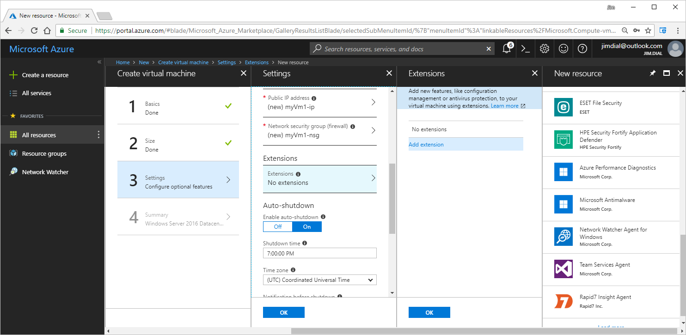
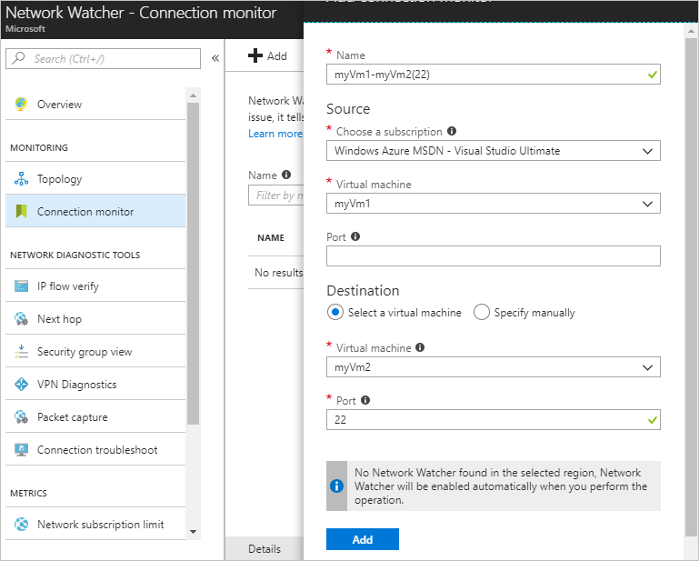
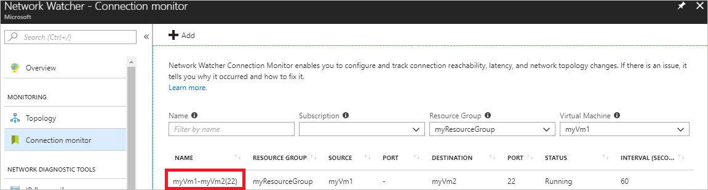
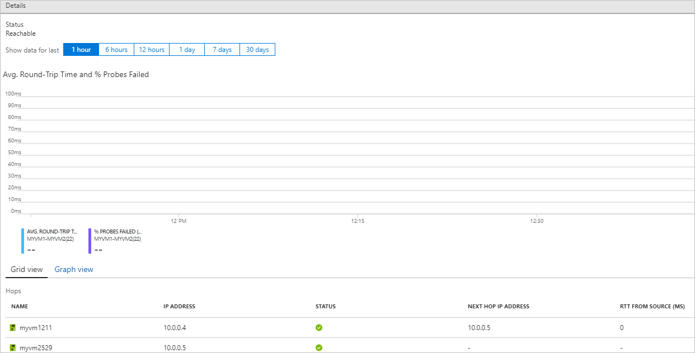
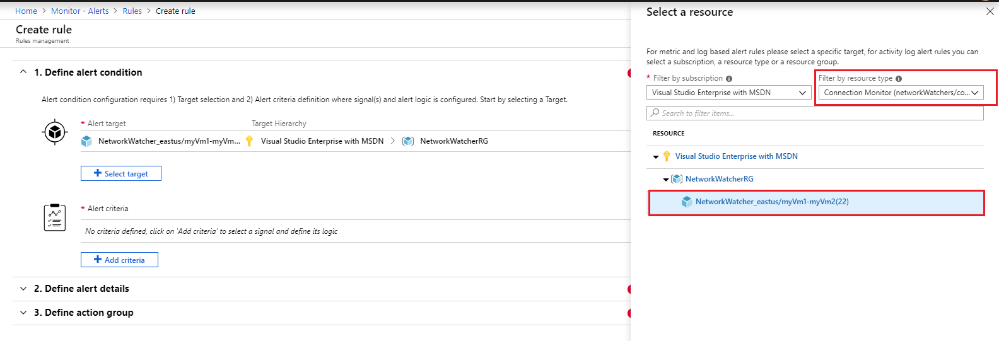
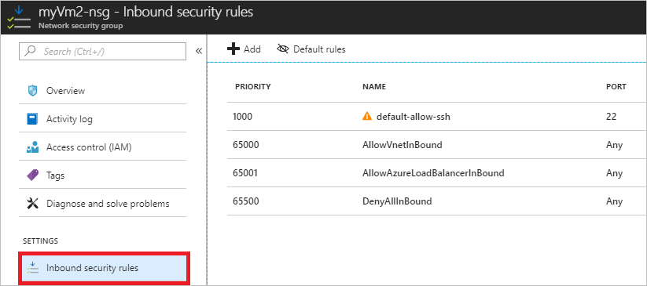
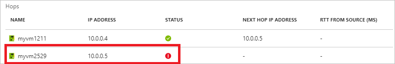

# Tutorial: Monitor network communication between two virtual machines using the Azure portal

Successful communication between a virtual machine (VM) and an endpoint such as another VM, can be critical for your organization. Sometimes, configuration changes are introduced which can break communication. In this tutorial, you learn how to:

> [!div class="checklist"]
> * Create two VMs
> * Monitor communication between VMs with the connection monitor capability of Network Watcher
> * Generate alerts on Connection Monitor metrics
> * Diagnose a communication problem between two VMs, and learn how you can resolve it

If you don't have an Azure subscription, create a [free account](https://azure.microsoft.com/free/?WT.mc_id=A261C142F) before you begin.

## Sign in to Azure

Sign in to the [Azure portal](https://portal.azure.com).

## Create VMs

Create two VMs.

### Create the first VM

1. Select **+ Create a resource** found on the upper, left corner of the Azure portal.
2. Select **Compute**, and then select an operating system. In this tutorial, **Windows Server 2016 Datacenter** is used.
3. Enter, or select, the following information, accept the defaults for the remaining settings, and then select **OK**:

    |Setting|Value|
    |---|---|
    |Name|myVm1|
    |User name| Enter a user name of your choosing.|
    |Password| Enter a password of your choosing. The password must be at least 12 characters long and meet the [defined complexity requirements](../virtual-machines/windows/faq.md?toc=%2fazure%2fnetwork-watcher%2ftoc.json#what-are-the-password-requirements-when-creating-a-vm).|
    |Subscription| Select your subscription.|
    |Resource group| Select **Create new** and enter **myResourceGroup**.|
    |Location| Select **East US**|

4. Select a size for the VM and then select **Select**.
5. Under **Settings**, select **Extensions**. Select **Add extension**, and select **Network Watcher Agent for Windows**, as shown in the following picture:

    

6. Under **Network Watcher Agent for Windows**, select **Create**, under **Install extension** select **OK**, and then under **Extensions**, select **OK**.
7. Accept the defaults for the remaining **Settings** and select **OK**.
8. Under **Create** of the **Summary**, select **Create** to start VM deployment.

### Create the second VM

Complete the steps in [Create the first VM](#create-the-first-vm) again, with the following changes:

|Step|Setting|Value|
|---|---|---|
| 1 | Select a version of **Ubuntu Server** |                                                                         |
| 3 | Name                                  | myVm2                                                                   |
| 3 | Authentication type                   | Paste your SSH public key or select **Password**, and enter a password. |
| 3 | Resource group                        | Select **Use existing** and select **myResourceGroup**.                 |
| 6 | Extensions                            | **Network Watcher Agent for Linux**                                             |

The VM takes a few minutes to deploy. Wait for the VM to finish deploying before continuing with the remaining steps.

## Create a connection monitor

Create a connection monitor to monitor communication over TCP port 22 from *myVm1* to *myVm2*.

1. On the left side of the portal, select **All services**.
2. Start typing *network watcher* in the **Filter** box. When **Network Watcher** appears in the search results, select it.
3. Under **MONITORING**, select **Connection monitor**.
4. Select **+ Add**.
5. Enter or select the information for the connection you want to monitor, and then select **Add**. In the example shown in the following picture, the connection monitored is from the *myVm1* VM to the *myVm2* VM over port 22:

    | Setting                  | Value               |
    | ---------                | ---------           |
    | Name                     | myVm1-myVm2(22)     |
    | Source                   |                     |
    | Virtual machine          | myVm1               |
    | Destination              |                     |
    | Select a virtual machine |                     |
    | Virtual machine          | myVm2               |
    | Port                     | 22                  |

    

## View a connection monitor

1. Complete steps 1-3 in [Create a connection monitor](#create-a-connection-monitor) to view connection monitoring. You see a list of existing connection monitors, as shown in the following picture:

    

2. Select the monitor with the name **myVm1-myVm2(22)**, as shown in the previous picture, to see details for the monitor, as shown in the following picture:

    

    Note the following information:

    | Item                     | Value                      | Details                                                     |
    | ---------                | ---------                  |--------                                                     |
    | Status                   | Reachable                  | Lets you know whether the endpoint is reachable or not.|
    | AVG. ROUND-TRIP          | Lets you know the round-trip time to make the connection, in milliseconds. Connection monitor probes the connection every 60 seconds, so you can monitor latency over time.                                         |
    | Hops                     | Connection monitor lets you know the hops between the two endpoints. In this example, the connection is between two VMs in the same virtual network, so there is only one hop, to the 10.0.0.5 IP address. If any existing system or custom routes, route traffic between the VMs through a VPN gateway, or network virtual appliance, for example, additional hops are listed.                                                                                                                         |
    | STATUS                   | The green check marks for each endpoint let you know that each endpoint is healthy.    ||

## Generate alerts

Alerts are created by alert rules in Azure Monitor and can automatically run saved queries or custom log searches at regular intervals. A generated alert can automatically run one or more actions, such as to notify someone or start another process. When setting an alert rule, the resource that you target determines the list of available metrics that you can use to generate alerts.

1. In Azure portal, select the **Monitor** service, and then select **Alerts** > **New alert rule**.
2. Click **Select target**, and then select the resources that you want to target. Select the **Subscription**, and set **Resource type** to filter down to the Connection Monitor that you want to use.

    
1. Once you have selected a resource to target, select **Add criteria**.The Network Watcher has [metrics on which you can create alerts](https://docs.microsoft.com/azure/monitoring-and-diagnostics/monitoring-near-real-time-metric-alerts#metrics-and-dimensions-supported). Set **Available signals** to the metrics ProbesFailedPercent and AverageRoundtripMs:

    
1. Fill out the alert details like alert rule name, description and severity. You can also add an action group to the alert to automate and customize the alert response.

## View a problem

By default, Azure allows communication over all ports between VMs in the same virtual network. Over time, you, or someone in your organization, might override Azure's default rules, inadvertently causing a communication failure. Complete the following steps to create a communication problem and then view the connection monitor again:

1. In the search box at the top of the portal, enter *myResourceGroup*. When the **myResourceGroup** resource group appears in the search results, select it.
2. Select the **myVm2-nsg** network security group.
3. Select **Inbound security rules**, and then select **Add**, as shown in the following picture:

    

4. The default rule that allows communication between all VMs in a virtual network is the rule named **AllowVnetInBound**. Create a rule with a higher priority (lower number) than the **AllowVnetInBound** rule that denies inbound communication over port 22. Select, or enter, the following information, accept the remaining defaults, and then select **Add**:

    | Setting                 | Value          |
    | ---                     | ---            |
    | Destination port ranges | 22             |
    | Action                  | Deny           |
    | Priority                | 100            |
    | Name                    | DenySshInbound |

5. Since connection monitor probes at 60-second intervals, wait a few minutes and then on the left side of the portal, select **Network Watcher**, then **Connection monitor**, and then select the **myVm1-myVm2(22)** monitor again. The results are different now, as shown in the following picture:

    

    You can see that there's a red exclamation icon in the status column for the **myvm2529** network interface.

6. To learn why the status has changed, select 10.0.0.5, in the previous picture. Connection monitor informs you that the reason for the communication failure is: *Traffic blocked due to the following network security group rule: UserRule_DenySshInbound*.

    If you didn't know that someone had implemented the security rule you created in step 4, you'd learn from connection monitor that the rule is causing the communication problem. You could then change, override, or remove the rule, to restore communication between the VMs.

## Clean up resources

When no longer needed, delete the resource group and all of the resources it contains:

1. Enter *myResourceGroup* in the **Search** box at the top of the portal. When you see **myResourceGroup** in the search results, select it.
2. Select **Delete resource group**.
3. Enter *myResourceGroup* for **TYPE THE RESOURCE GROUP NAME:** and select **Delete**.

## Next steps

In this tutorial, you learned how to monitor a connection between two VMs. You learned that a network security group rule prevented communication to a VM. To learn about all of the different responses connection monitor can return, see [response types](network-watcher-connectivity-overview.md#response). You can also monitor a connection between a VM, a fully qualified domain name, a uniform resource identifier, or an IP address.

At some point, you may find that resources in a virtual network are unable to communicate with resources in other networks connected by an Azure virtual network gateway. Advance to the next tutorial to learn how to diagnose a problem with a virtual network gateway.

> [!div class="nextstepaction"]
> [Diagnose communication problems between networks](diagnose-communication-problem-between-networks.md)
