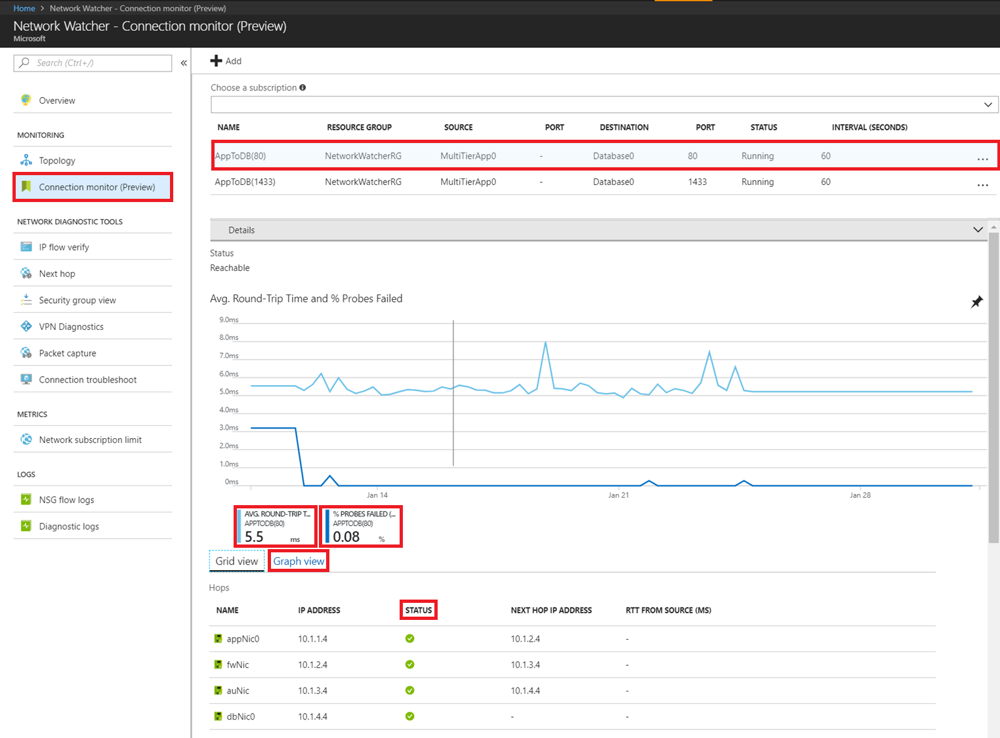
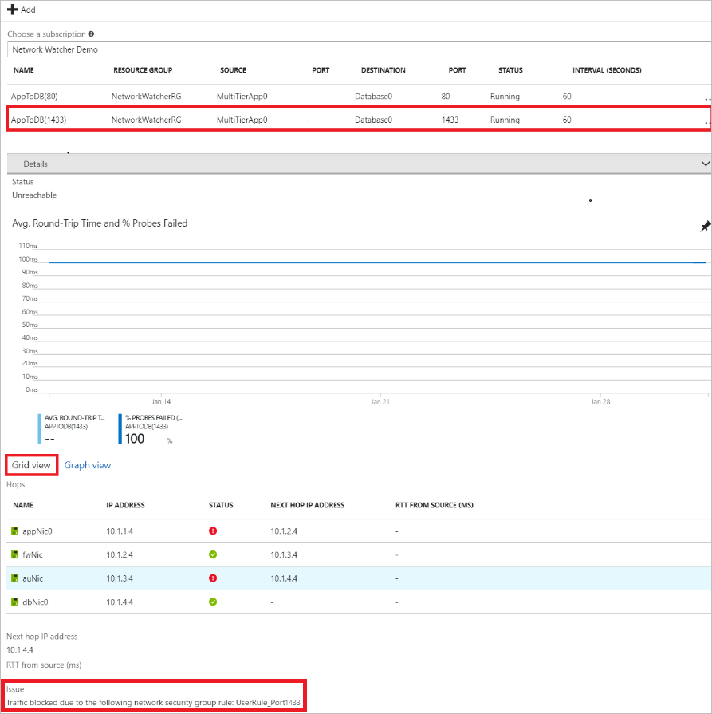

# Monitor network connections with Azure Network Watcher using the Azure portal

Learn how to use connection monitor to monitor network connectivity between an Azure virtual machine and an IP address. Connection monitor provides monitoring at a connection level. A connection is defined as a combination of source and destination IP address and port. Connection monitor enables scenarios like monitoring connectivity from a virtual machine in a virtual network to a virtual machine running SQL server in the same or different virtual network, over port 1433. Connection monitor provides you connection latency as an Azure Monitor metric, recorded every 60 seconds. It also provides you a hop-by-hop topology, and identifies configuration issues impacting your connection.

## Prerequisites

You must meet the following prerequisites before completing the steps in this article:

* An instance of Network Watcher in the region you want to monitor a connection for. If you don't already have one, you can create one by completing the steps in [Create an Azure Network Watcher instance](network-watcher-create.md).
* A virtual machine to monitor from.
* Have the `AzureNetworkWatcherExtension` installed in the virtual machine you want to monitor a connection from. To install the extension in a Windows virtual machine, see [Azure Network Watcher Agent virtual machine extension for Windows](../virtual-machines/windows/extensions-nwa.md?toc=%2fazure%2fnetwork-watcher%2ftoc.json) and to install the extension in a Linux virtual machine see [Azure Network Watcher Agent virtual machine extension for Linux](../virtual-machines/linux/extensions-nwa.md?toc=%2fazure%2fnetwork-watcher%2ftoc.json).

## Sign in to Azure 

Sign in to the [Azure portal](http://portal.azure.com).

## Create a connection monitor

The following steps enable connection monitoring to a destination virtual machine over ports 80 and 1433:

1. On the left side of the portal, select **More services**.
2. Start typing *network watcher*. When **Network Watcher** appears in the search results, select it.
3. Under **MONITORING**, select **Connection monitor (Preview)**. Features in preview release do not have the same level of reliability or region availability as features in general release.
4. Select **+ Add**.
5. Enter or select the information for the connection you want to monitor, and then select **Add**. In the example shown in the following picture, the connection monitored is between the *MultiTierApp0* and *Database0* virtual machines:

    

    Monitoring begins. Connection monitor probes every 60 seconds.

## View connection monitoring

1. Complete steps 1-3 in [Create a connection monitor](#create-a-connection-monitor) to view connection monitoring.
2. The following picture shows details for the AppToDB(80) connection. The **Status** is reachable. The **Graph view** shows the **Average Round Trip Time** and **% Probes Failed**. The graph provides hop-by-hop information,  and shows that no issues are impacting destination reachability.

    

3. Viewing the *AppToDB(1433)* monitor, shown in the following picture, you see that for the same source and destination virtual machines, the status is unreachable over port 1433. The **Grid view** in this scenario provides the hop-by-hop information and the issue impacting reachability. In this case, an NSG rule is blocking all traffic on port 1433 at the second hop.

    

## Next steps

- Learn how to automate packet captures with virtual machine alerts by [Creating an alert-triggered packet capture](network-watcher-alert-triggered-packet-capture.md).
- Determine if certain traffic is allowed in or out of your virtual machine by using [IP flow verify](network-watcher-check-ip-flow-verify-portal.md).