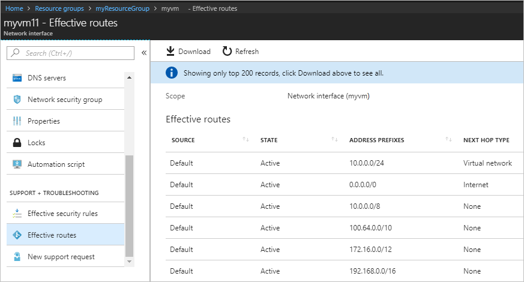

# Tutorial: Diagnose a virtual machine network routing problem using the Azure portal

When you deploy a virtual machine (VM), Azure creates several default routes for it. You may create custom routes to override Azure's default routes. Sometimes, a custom route can result in a VM not being able to communicate with other resources. In this tutorial, you learn how to:

> [!div class="checklist"]
> * Create a VM
> * Test communication to a URL using the next hop capability of Network Watcher
> * Test communication to an IP address
> * Diagnose a routing problem, and learn how you can resolve it

If you prefer, you can diagnose a virtual machine network routing problem using the [Azure CLI](diagnose-vm-network-routing-problem-cli.md) or [Azure PowerShell](diagnose-vm-network-routing-problem-powershell.md).

If you don't have an Azure subscription, create a [free account](https://azure.microsoft.com/free/?WT.mc_id=A261C142F) before you begin.

## Log in to Azure

Log in to the Azure portal at https://portal.azure.com.

## Create a VM

1. Select **+ Create a resource** found on the upper, left corner of the Azure portal.
2. Select **Compute**, and then select **Windows Server 2016 Datacenter** or **Ubuntu Server 17.10 VM**.
3. Enter, or select, the following information, accept the defaults for the remaining settings, and then select **OK**:

    |Setting|Value|
    |---|---|
    |Name|myVm|
    |User name| Enter a user name of your choosing.|
    |Password| Enter a password of your choosing. The password must be at least 12 characters long and meet the [defined complexity requirements](../virtual-machines/windows/faq.md?toc=%2fazure%2fnetwork-watcher%2ftoc.json#what-are-the-password-requirements-when-creating-a-vm).|
    |Subscription| Select your subscription.|
    |Resource group| Select **Create new** and enter **myResourceGroup**.|
    |Location| Select **East US**|

4. Select a size for the VM and then select **Select**.
5. Under **Settings**, accept all the defaults, and select **OK**.
6. Under **Create** of the **Summary**, select **Create** to start VM deployment. The VM takes a few minutes to deploy. Wait for the VM to finish deploying before continuing with the remaining steps.

## Test network communication

To test network communication with Network Watcher, you must first enable a network watcher in at least one Azure region and then use Network Watcher's next hop capability to test communication.

### Enable network watcher

If you already have a network watcher enabled in at least one region, skip to [Use next hop](#use-next-hop).

1. In the portal, select **All services**. In the **Filter box**, enter *Network Watcher*. When **Network Watcher** appears in the results, select it.
2. Select **Regions**, to expand it, and then select **...** to the right of **East US**, as shown in the following picture:

    

3. Select **Enable Network Watcher**.

### Use next hop

Azure automatically creates routes to default destinations. You may create custom routes that override the default routes. Sometimes, custom routes can cause communication to fail. Use the next hop capability of Network Watcher to determine which route Azure is using to route traffic.

1. In the Azure portal, select **Next hop**, under **Network Watcher**.
2. Select your subscription, enter or select the following values, and then select **Next hop**, as shown in the picture that follows:

    |Setting                  |Value                                                   |
    |---------                |---------                                               |
    | Resource group          | Select myResourceGroup                                 |
    | Virtual machine         | Select myVm                                            |
    | Network interface       | myvm - Your network interface name may be different.   |
    | Source IP address       | 10.0.0.4                                               |
    | Destination IP address  | 13.107.21.200 - One of the addresses for <www.bing.com>. |

    

    After a few seconds, the result informs you that the next hop type is **Internet**, and that the **Route table ID** is **System Route**. This result lets you know that there is a valid system route to the destination.

3. Change the **Destination IP address** to *172.31.0.100* and select **Next hop** again. The result returned informs you that **None** is the **Next hop type**, and that the **Route table ID** is also **System Route**. This result lets you know that, while there is a valid system route to the destination, there is no next hop to route the traffic to the destination.

## View details of a route

1. To analyze routing further, review the effective routes for the network interface. In the search box at the top of the portal, enter *myvm* (or whatever the name was of the network interface you checked). When **myvm** appears in the search results, select it.
2. Select **Effective routes** under **SUPPORT + TROUBLESHOOTING**, as shown in the following picture:

    

    When you ran the test using 13.107.21.200 in [Use next hop](#use-next-hop), the route with the address prefix 0.0.0.0/0 was used to route traffic to the address, since no other route includes the address. By default, all addresses not specified within the address prefix of another route are routed to the internet.

    When you ran the test using 172.31.0.100 however, the result informed you that there was no next hop type. As you can see in the previous picture, though there is a default route to the 172.16.0.0/12 prefix, which includes the 172.31.0.100 address, the **NEXT HOP TYPE** is **None**. Azure creates a default route to 172.16.0.0/12, but doesn't specify a next hop type until there is a reason to. If, for example, you added the 172.16.0.0/12 address range to the address space of the virtual network, Azure changes the **NEXT HOP TYPE** to **Virtual network** for the route. A check would then show **Virtual network** as the **NEXT HOP TYPE**.

## Clean up resources

When no longer needed, delete the resource group and all of the resources it contains:

1. Enter *myResourceGroup* in the **Search** box at the top of the portal. When you see **myResourceGroup** in the search results, select it.
2. Select **Delete resource group**.
3. Enter *myResourceGroup* for **TYPE THE RESOURCE GROUP NAME:** and select **Delete**.

## Next steps

In this tutorial, you created a VM and diagnosed network routing from the VM. You learned that Azure creates several default routes and tested routing to two different destinations. Learn more about [routing in Azure](../virtual-network/virtual-networks-udr-overview.md?toc=%2fazure%2fnetwork-watcher%2ftoc.json) and how to [create custom routes](../virtual-network/manage-route-table.md?toc=%2fazure%2fnetwork-watcher%2ftoc.json#create-a-route).

For outbound VM connections, you can also determine the latency, allowed and denied network traffic between the VM and an endpoint, and the route used to an endpoint, using Network Watcher's [connection troubleshoot](network-watcher-connectivity-portal.md) capability. Learn how you can monitor communication between a VM and an endpoint, such as an IP address or URL, over time using the Network Watcher connection monitor capability.

> [!div class="nextstepaction"]
> [Monitor a network connection](connection-monitor.md)