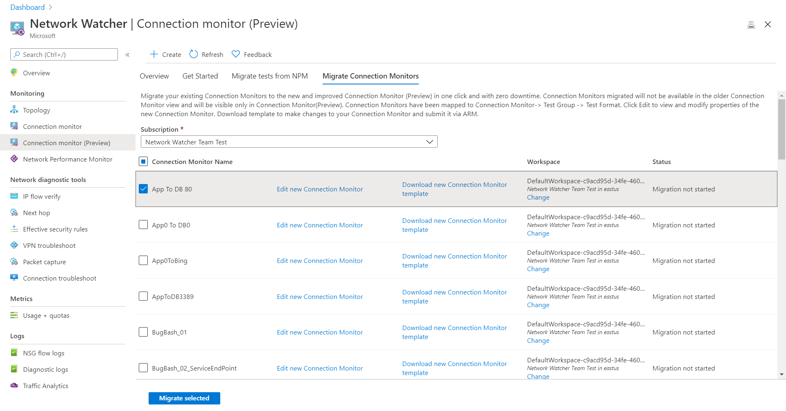

# Migrate to Connection Monitor from Connection Monitor (Classic)

> [!IMPORTANT]
> Starting 1 July 2021, you will not be able to add new connection monitors in Connection Monitor (classic) but you can continue to use existing connection monitors created prior to 1 July 2021. To minimize service disruption to your current workloads, [migrate from Connection Monitor (classic) to the new Connection Monitor](migrate-to-connection-monitor-from-connection-monitor-classic.md)  in Azure Network Watcher before 29 February 2024.

You can migrate existing connection monitors to new, improved Connection Monitor with only a few clicks and with zero downtime. To learn more about the benefits, see [Connection Monitor](./connection-monitor-overview.md).

## Key points to note

The migration helps produce the following results:

* Agents and firewall settings work as is. No changes are required. 
* Existing connection monitors are mapped to Connection Monitor > Test Group > Test format. By selecting **Edit**, you can view and modify the properties of the new Connection Monitor, download a template to make changes to Connection Monitor, and submit it via Azure Resource Manager. 
* Azure virtual machines with the Network Watcher extension send data to both the workspace and the metrics. Connection Monitor makes the data available through the new metrics (ChecksFailedPercent and RoundTripTimeMs) instead of the old metrics (ProbesFailedPercent and AverageRoundtripMs). The old metrics will get migrated to new metrics as ProbesFailedPercent -> ChecksFailedPercent and AverageRoundtripMs -> RoundTripTimeMs.
* Data monitoring:
   * **Alerts**: Migrated automatically to the new metrics.
   * **Dashboards and integrations**: Require manually editing of the metrics set. 
	
## Prerequisites

1. If you're using a custom workspace, ensure that Network Watcher is enabled in your subscription and in the region of your Log Analytics workspace. If not you will see an error stating "Before you attempt migrate, please enable Network watcher extension in selection subscription and location of LA workspace selected."
1. In case virtual machines used as sources in  connection monitor (classic) no longer have the Network Watcher extension enabled, you will see an error message stating "Connection monitors having following tests cannot be imported as one or more azure virtual machines don't have network watcher extension installed. Install network watcher extension and click refresh to import them."

## Migrate the connection monitors

1. To migrate the older connection monitors to the newer one, select **Connection Monitor**, and then select **Migrate Connection Monitors**.

	
	
1. Select your subscription and the connection monitors you want to migrate, and then select **Migrate selected**. 

With only a few clicks, you've migrated the existing connection monitors to Connection Monitor. Once migrated from CM (Classic) to CM, you will not be able to see the monitor under CM (Classic)

You can now customize Connection Monitor properties, change the default workspace, download templates, and check the migration status. 

After the migration begins, the following changes take place: 
* The Azure Resource Manager resource changes to the newer connection monitor.
	* The name, region, and subscription of the connection monitor remain unchanged. The resource ID is unaffected.
	* Unless the connection monitor is customized, a default Log Analytics workspace is created in the subscription and in the region of the connection monitor. This workspace is where monitoring data is stored. The test result data is also stored in the metrics.
	* Each test is migrated to a test group called *defaultTestGroup*.
	* Source and destination endpoints are created and used in the new test group. The default names are *defaultSourceEndpoint* and *defaultDestinationEndpoint*.
	* The destination port and probing interval are moved to a test configuration called *defaultTestConfiguration*. The protocol is set based on the port values. Success thresholds and other optional properties are left blank.
* Metrics alerts are migrated to Connection Monitor metrics alerts. The metrics are different, hence the change. For more information, see [Network connectivity monitoring with Connection Monitor](./connection-monitor-overview.md#metrics-in-azure-monitor).
* The migrated connection monitors are no longer displayed as the older connection monitor solution. They're now available for use only in Connection Monitor.
* Any external integrations, such as dashboards in Power BI and Grafana, and integrations with Security Information and Event Management (SIEM) systems, must be migrated manually. This is the only manual step you need to perform to migrate your setup.

## Common Errors Encountered

Below are some common errors faced during the migration : 

| Error  |    Reason   |
|---|---|
|Following Connection monitors cannot be imported as one or more Subscription/Region combination don't have network watcher enabled. Enable network watcher and click refresh to import them. List of Connection monitor - {0}   |  This error occurs when User is migrating tests from CM(classic) to Connection Monitor and Network Watcher Extension is not enabled in one or more subscriptions and regions of CM (classic). User needs to enable NW Extension in the subscription and refresh to import them before migrating again   |
|Connection monitors having following tests cannot be imported as one or more azure virtual machines don't have network watcher extension installed. Install network watcher extension and click refresh to import them. List of tests - {0} |    This error occurs when User is migrating tests from CM(classic) to Connection Monitor and Network Watcher Extension is not installed in one or more Azure VMs of CM (classic). User needs to install NW Extension in the Azure VM and refresh before migrating again |
|No rows to display   |  This error occurs when User is trying to migrate subscriptions from CM (Classic) to CM but no CM (classic) is created in the subscriptions |

## Next steps

To learn more about Connection Monitor, see:
* [Migrate from Network Performance Monitor to Connection Monitor](./migrate-to-connection-monitor-from-network-performance-monitor.md)
* [Create Connection Monitor by using the Azure portal](./connection-monitor-create-using-portal.md)

	
 
	
