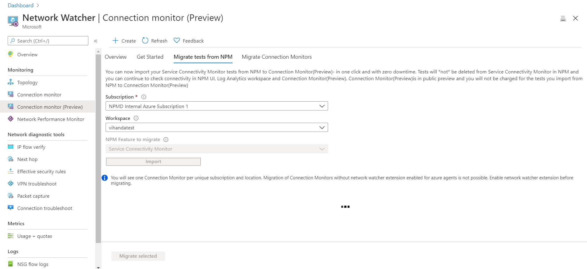

# Migrate to Connection Monitor (Preview) from Network Performance Monitor

You can migrate tests from Network Performance Monitor (NPM) to new, improved Connection Monitor (Preview) with a single click and with zero downtime. To learn more about the benefits, see [Connection Monitor (Preview)](https://docs.microsoft.com/azure/network-watcher/connection-monitor-preview).

>[!NOTE]
> Only tests from Service Connectivity Monitor can be migrated to Connection Monitor (Preview).
>

## Key points to note

The migration helps produce the following results:

* On-premises agents and firewall settings work as is. No changes are required. Log Analytics agents that are installed on Azure virtual machines need to be replaced with the Network Watcher extension.
* Existing tests are mapped to Connection Monitor (Preview) > Test Group > Test format. By selecting **Edit**, you can view and modify the properties of the new Connection Monitor (Preview), download a template to make changes to it, and submit the template via Azure Resource Manager.
* Agents send data to both the Log Analytics workspace and the metrics.
* Data monitoring:
   * **Data in Log Analytics**: Before migration, the data remains in the workspace in which NPM is configured in the NetworkMonitoring table. After the migration, the data goes to the NetworkMonitoring table and ConnectionMonitor_CL table in the same workspace. After the tests are disabled in NPM, the data is stored only in the ConnectionMonitor_CL table.
   * **Log-based alerts, dashboards, and integrations**: You must manually edit the queries based on the new ConnectionMonitor_CL table. To re-create the alerts in metrics, see [Network connectivity monitoring with Connection Monitor (Preview)](https://docs.microsoft.com/azure/network-watcher/connection-monitor-preview#metrics-in-azure-monitor).
	
## Prerequisites

* Ensure that Network Watcher is enabled in your subscription and the region of the Log Analytics workspace.
* Azure virtual machines with Log Analytics agents installed must be enabled with the Network Watcher extension.

## Migrate the tests

To migrate the tests from Network Performance Monitor to Connection Monitor (Preview), do the following:

1. In Network Watcher, select **Connection Monitor**, and then select the **Migrate tests from NPM** tab. 

	
	
1. In the drop-down lists, select your subscription and workspace, and then select the NPM feature you want to migrate. Currently, you can migrate tests only from Service Connectivity Monitor.  
1. Select **Import** to migrate the tests.

After the migration begins, the following changes take place: 
* A new connection monitor resource is created.
   * One connection monitor per region and subscription is created. For tests with on-premises agents, the new connection monitor name is formatted as `<workspaceName>_"on-premises"`. For tests with Azure agents, the new connection monitor name is formatted as `<workspaceName>_<Azure_region_name>`.
   * Monitoring data is now stored in the same Log Analytics workspace in which NPM is enabled, in a new table called Connectionmonitor_CL. 
   * The test name is carried forward as the test group name. The test description isn't migrated.
   * Source and destination endpoints are created and used in the new test group. For on-premises agents, the endpoints are formatted as `<workspaceName>_"endpoint"_<FQDN of on-premises machine>`. For Azure, if the migrating tests contain agents that aren't running, you need to enable the agents and migrate again.
   * Destination port and probing interval are moved to a test configuration called *TC_\<testname>* and *TC_\<testname>_AppThresholds*. The protocol is set based on the port values. Success thresholds and other optional properties are left blank.
* NPM isn't disabled, so the migrated tests can continue to send data to the NetworkMonitoring and ConnectionMonitor_CL tables. This approach ensures that existing log-based alerts and integrations are unaffected.
* The newly created connection monitor is visible in Connection Monitor (Preview).

After the migration, be sure to:
* Manually disable the tests in NPM. Until you do so, you'll continue to be charged for them. 
* While you're disabling NPM, re-create your alerts on the ConnectionMonitor_CL table or use metrics. 
* Migrate any external integrations to the ConnectionMonitor_CL table. Examples of external integrations are dashboards in Power BI and Grafana, and integrations with Security Information and Event Management (SIEM) systems.

## Next steps

To learn more about Connection Monitor (Preview), see:
* [Migrate from Connection Monitor to Connection Monitor (Preview)](migrate-to-connection-monitor-preview-from-connection-monitor.md)
* [Create Connection Monitor (Preview) by using the Azure portal](https://docs.microsoft.com/azure/network-watcher/connection-monitor-preview-create-using-portal)
