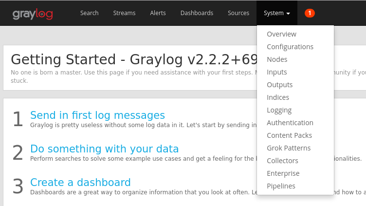
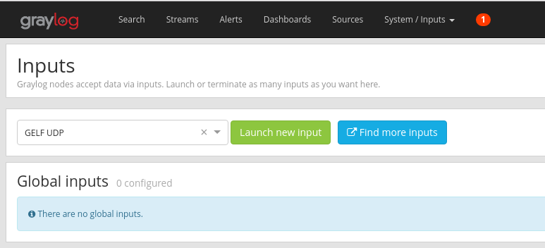
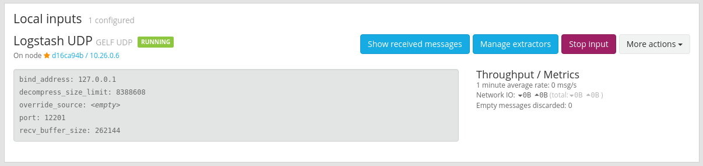
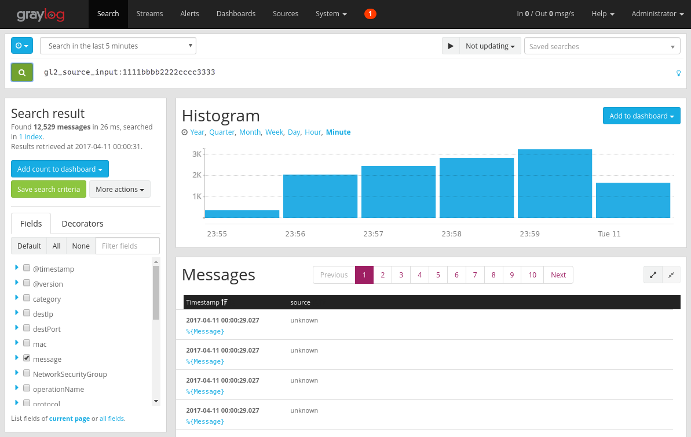
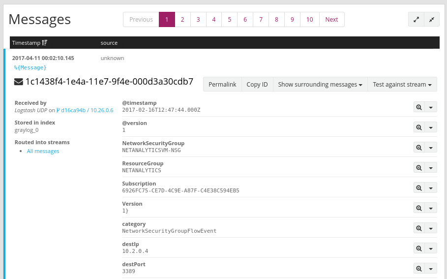
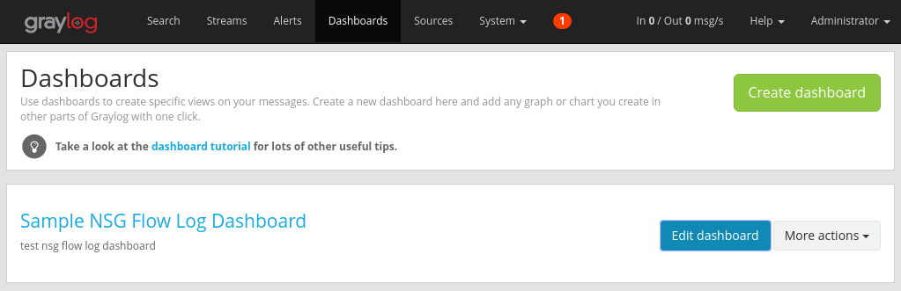
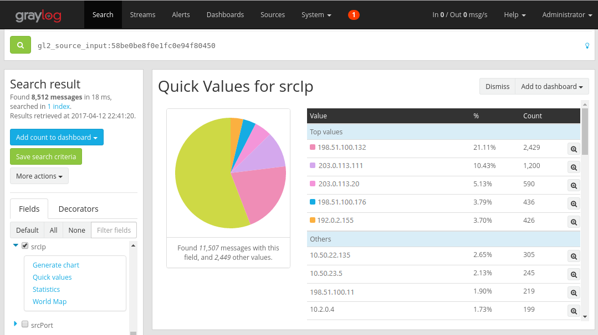
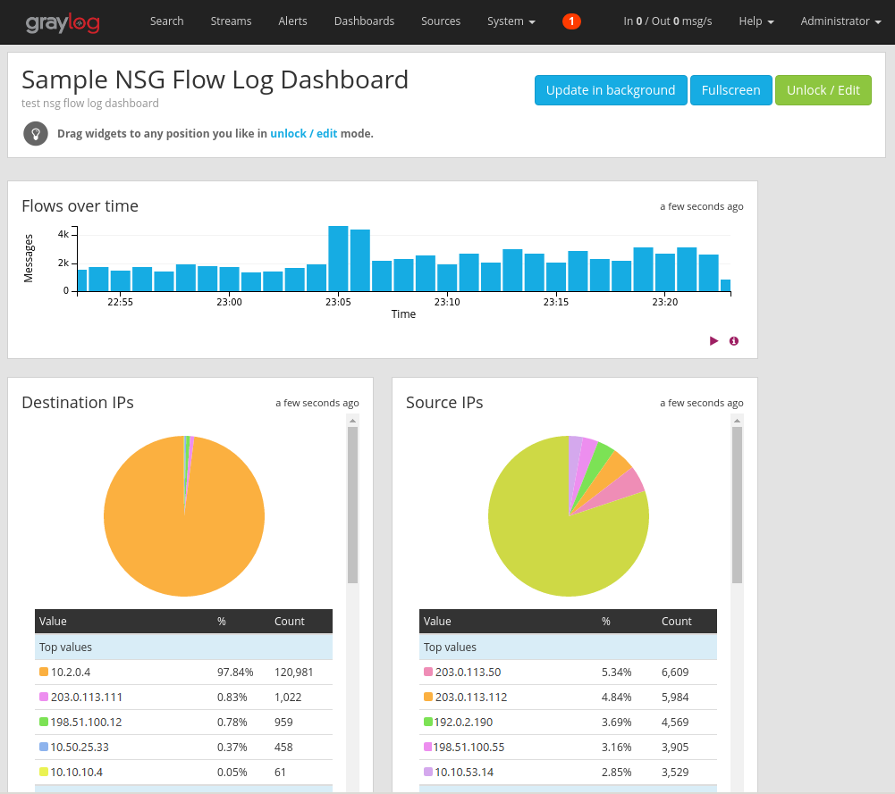

# Manage and analyze network security group flow logs in Azure using Network Watcher and Graylog

[Network security group flow logs](network-watcher-nsg-flow-logging-overview.md) provide information that you can use to understand ingress and egress IP traffic for Azure network interfaces. Flow logs show outbound and inbound flows on a per network security group rule basis, the network interface the flow applies to, 5-tuple information (Source/Destination IP, Source/Destination Port, Protocol) about the flow, and if the traffic was allowed or denied.

You can have many network security groups in your network with flow logging enabled. Several network security groups with flow logging enabled can make it cumbersome to parse and gain insights from your logs. This article provides a solution to centrally manage these network security group flow logs using Graylog, an open source log management and analysis tool, and Logstash, an open source server-side data processing pipeline.

> [!Warning]
> The following steps work with flow logs version 1. For details, see [Introduction to flow logging for network security groups](network-watcher-nsg-flow-logging-overview.md). The following instructions will not work with version 2 of the log files, without modification.

## Scenario

Network security group flow logs are enabled using Network Watcher. Flow logs flow in to Azure blob storage. A Logstash plugin is used to connect and process flow logs from blob storage and send them to Graylog. Once the flow logs are stored in Graylog, they can be analyzed and visualized into customized dashboards.


## Installation Steps

### Enable network security group flow logging

For this scenario, you must have network security group flow logging enabled on at least one network security group in your account. For instructions on
enabling network security group flow logs, refer to the following article [Introduction to flow logging for network security groups](network-watcher-nsg-flow-logging-overview.md).

### Setting up Graylog

In this example, both Graylog and Logstash are configured on an Ubuntu 14.04 Server, deployed in Azure.

- Refer to the [documentation](https://docs.graylog.org/en/2.2/pages/installation/os/ubuntu.html) from Graylog, for step by step instructions on how install onto Ubuntu.
- Make sure to also configure the Graylog web interface by following the [documentation](https://docs.graylog.org/en/2.2/pages/configuration/web_interface.html#configuring-webif).

This example uses the minimum Graylog setup (i.e a single instance of a Graylog), but Graylog can be architected to scale across resources depending on your system and production needs. For more information on architectural considerations or a deep architectural guide, see Graylog’s [documentation](https://docs.graylog.org/en/2.2/pages/architecture.html) and [architectural guide](https://www.slideshare.net/Graylog/graylog-engineering-design-your-architecture).

Graylog can be installed in many ways, depending on your platform and preferences. For a full list of possible installation methods, refer to Graylog's official
[documentation](https://docs.graylog.org/en/2.2/pages/installation.html). The Graylog server application runs on Linux distributions and has the following
prerequisites:

-  Java SE 8 or later – [Azul Azure JDK documentation](https://aka.ms/azure-jdks)
-  Elastic Search 2.x (2.1.0 or later) - [Elasticsearch installation documentation](https://www.elastic.co/guide/en/elasticsearch/reference/2.4/_installation.html)
-  MongoDB 2.4 or later – [MongoDB installation documentation](https://docs.mongodb.com/manual/administration/install-on-linux/)

### Install Logstash

Logstash is used to flatten the JSON formatted flow logs to a flow tuple level. Flattening the flow logs makes the logs easier to organize and search in Graylog.

1. To install Logstash, run the following commands:

   ```bash
   curl -L -O https://artifacts.elastic.co/downloads/logstash/logstash-5.2.0.deb
   sudo dpkg -i logstash-5.2.0.deb
   ```

2. Configure Logstash to parse the flow logs and send them to Graylog. Create a Logstash.conf file:

   ```bash
   sudo touch /etc/logstash/conf.d/logstash.conf
   ```

3. Add the following content to the file. Change the highlighted values to reflect your storage account details:

   ```
    input {
        azureblob
        {
            storage_account_name => "mystorageaccount"
            storage_access_key => "NrUZmx7pJSKaRJzvQbeiZWi5nBRWOTr7Wwr9DrvK7YtDBrADYxT1y0oEExtSlkDnGRt7qcRiZzEBCCyRYND8SxSt"
            container => "insights-logs-networksecuritygroupflowevent"
            registry_create_policy => "start_over"
            codec => "json"
            file_head_bytes => 21
            file_tail_bytes => 9
            # Possible options: `do_not_break`, `with_head_tail`, `without_head_tail`
            break_json_down_policy  => 'with_head_tail'
            break_json_batch_count => 2
            interval => 5
        }
    }
    
    filter {
        split { field => "[records]" }
        split { field => "[records][properties][flows]"}
        split { field => "[records][properties][flows][flows]"}
        split { field => "[records][properties][flows][flows][flowTuples]"
    }
    
     mutate {
        split => { "[records][resourceId]" => "/"}
        add_field =>{
                    "Subscription" => "%{[records][resourceId][2]}"
                    "ResourceGroup" => "%{[records][resourceId][4]}"
                    "NetworkSecurityGroup" => "%{[records][resourceId][8]}"
        }
        convert => {"Subscription" => "string"}
        convert => {"ResourceGroup" => "string"}
        convert => {"NetworkSecurityGroup" => "string"}
        split => { "[records][properties][flows][flows][flowTuples]" => ","}
        add_field => {
                    "unixtimestamp" => "%{[records][properties][flows][flows][flowTuples][0]}"
                    "srcIp" => "%{[records][properties][flows][flows][flowTuples][1]}"
                    "destIp" => "%{[records][properties][flows][flows][flowTuples][2]}"
                    "srcPort" => "%{[records][properties][flows][flows][flowTuples][3]}"
                    "destPort" => "%{[records][properties][flows][flows][flowTuples][4]}"
                    "protocol" => "%{[records][properties][flows][flows][flowTuples][5]}"
                    "trafficflow" => "%{[records][properties][flows][flows][flowTuples][6]}"
                    "traffic" => "%{[records][properties][flows][flows][flowTuples][7]}"
        }
        add_field => {
                    "time" => "%{[records][time]}"
                    "systemId" => "%{[records][systemId]}"
                    "category" => "%{[records][category]}"
                    "resourceId" => "%{[records][resourceId]}"
                    "operationName" => "%{[records][operationName}}"
                    "Version" => "%{[records][properties][Version}}"
                    "rule" => "%{[records][properties][flows][rule]}"
                    "mac" => "%{[records][properties][flows][flows][mac]}"
        }
        convert => {"unixtimestamp" => "integer"}
        convert => {"srcPort" => "integer"}
        convert => {"destPort" => "integer"}
        add_field => { "message" => "%{Message}" }
    }
        date {
            match => ["unixtimestamp" , "UNIX"]
        }
    }
    output {
        stdout { codec => rubydebug }
        udp {
            host => "127.0.0.1"
            port => 12201
        }
    }
    ```
   The Logstash config file provided is composed of three parts: the input, filter, and output. The input section designates the input source of the logs that Logstash will process – in this case, you are going to use an Azure blog input plugin (installed in the next steps) that allows us to access the network security group flow log JSON files stored in blob storage.

The filter section then flattens each flow log file so that each individual flow tuple and its associated properties becomes a separate Logstash event.

Finally, the output section forwards each Logstash event to the Graylog server. To suit your specific needs, modify the Logstash config file, as required.

   > [!NOTE]
   > The previous config file assumes that the Graylog server has been configured on the local host loopback IP address 127.0.0.1. If not, be sure to change the host parameter in the output section to the correct IP address.

For further instructions on installing Logstash, see the Logstash [documentation](https://www.elastic.co/guide/en/beats/libbeat/5.2/logstash-installation.html).

### Install the Logstash input plug-in for Azure blob storage

The Logstash plugin allows you to directly access the flow logs from their designated blob storage account. To install the plug-in, from the default Logstash installation directory (in this case /usr/share/logstash/bin), run the following command:

```bash
cd /usr/share/logstash/bin
sudo ./logstash-plugin install logstash-input-azureblob
```

For more information about this plug in, see the [documentation](https://github.com/Azure/azure-diagnostics-tools/tree/master/Logstash/logstash-input-azureblob).

### Set up connection from Logstash to Graylog

Now that you have established a connection to the flow logs using Logstash and set up the Graylog server, you need to configure Graylog to accept the incoming log files.

1. Navigate to your Graylog Server web interface using the URL you configured for it. You can access the interface by directing your browser to
    `http://<graylog-server-ip>:9000/`

2. To navigate to the configuration page, select the **System** drop-down menu in the top navigation bar to the right, and then click **Inputs**.
   Alternatively, navigate to `http://<graylog-server-ip>:9000/system/inputs`

   

3. To launch the new input, select *GELF UDP* in the **Select input** drop-down, and then fill out the form. GELF stands for Graylog Extended Log Format. The GELF format is developed by Graylog. To learn more about its advantages, see the Graylog [documentation](https://docs.graylog.org/en/2.2/pages/gelf.html).

   Make sure to bind the input to the IP you configured your Graylog server on. The IP address should match the **host** field of the UDP output of the Logstash configuration file. The default port should be *12201*. Ensure the port matches the **port** field in the UDP output designated in the Logstash config file.

   

   Once you launch the input, you should see it appear under the **Local inputs** section, as shown in the following picture:

   

   To learn more about Graylog message inputs, refer to the [documentation](https://docs.graylog.org/en/2.2/pages/sending_data.html#what-are-graylog-message-inputs).

4. Once these configurations have been made, you can start Logstash to begin reading in flow logs with the following command: `sudo systemctl start logstash.service`.

### Search through Graylog messages

After allowing some time for your Graylog server to collect messages, you are able to search through the messages. To check the messages being sent to your Graylog server, from the **Inputs** configuration page click the “**Show received messages**” button of the GELF UDP input you created. You are directed to a screen that looks similar to the following picture: 



Clicking on the blue “%{Message}” link expands each message to show the parameters of each flow tuple, as shown in the following picture:



By default, all message fields are included in the search if you don’t select a specific message field to search for. If you want to search for specific messages (i.e – flow tuples from a specific source IP) you can use the Graylog search query language as [documented](https://docs.graylog.org/en/2.2/pages/queries.html)

## Analyze network security group flow logs using Graylog

Now that Graylog it set up running, you can use some of its functionality to better understand your flow log data. One such way is by using dashboards to create specific views of your data.

### Create a dashboard

1. In the top navigation bar, select **Dashboards** or navigate to `http://<graylog-server-ip>:9000/dashboards/`

2. From there, click the green **Create dashboard** button and fill out the short form with the title and description of your dashboard. Hit the
    **Save** button to create the new dashboard. You see a dashboard similar to the following picture:

    

### Add widgets

You can click the title of the dashboard to see it, but right now it's empty, since we haven’t added any widgets. An easy and useful type widget to add to
the dashboard are **Quick Values** charts, which display a list of values of the selected field, and their distribution.

1. Navigate back to the search results of the UDP input that’s receiving flow logs by selecting **Search** from the top navigation bar.

2. Under the **Search result** panel to the left side of the screen, find the **Fields** tab, which lists the various fields of each incoming flow tuple
    message.

3. Select any desired parameter in which to visualize (in this example, the IP source is selected). To show the list of possible widgets, click the blue drop-down arrow to the left of the field, then select **Quick values** to generate the widget. You should see something similar to the following picture:

   

4. From there, you can select the **Add to dashboard** button at the top right corner of the widget and select the corresponding dashboard to add.

5. Navigate back to the dashboard to see the widget you just added.

   You can add a variety of other widgets such as histograms and counts to your dashboard to keep track of important metrics, such as the sample dashboard shown in the following picture:

   

    For further explanation on dashboards and the other types of widgets, refer to Graylog’s [documentation](https://docs.graylog.org/en/2.2/pages/dashboards.html).

By integrating Network Watcher with Graylog, you now have a convenient and centralized way to manage and visualize network security group flow logs. Graylog has a number of other powerful features such as streams and alerts that can also be used to further manage flow logs and better understand your network traffic. Now that
you have Graylog set up and connected to Azure, feel free to continue to explore the other functionality that it offers.

## Next steps

Learn how to visualize your network security group flow logs with Power BI by visiting [Visualize network security group flows logs with Power
BI](network-watcher-visualize-nsg-flow-logs-power-bi.md).
