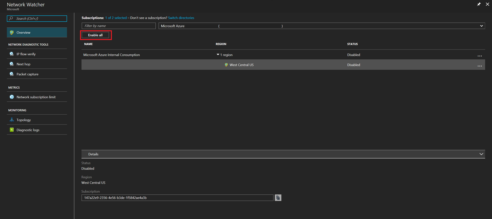

# Create an Azure Network Watcher instance

Network Watcher is a regional service that enables you to monitor and diagnose conditions at a network scenario level in, to, and from Azure. Scenario level monitoring enables you to diagnose problems at an end to end network level view. Network diagnostic and visualization tools available with Network Watcher help you understand, diagnose, and gain insights to your network in Azure. Network Watcher is enabled through the creation of a Network Watcher resource. This resource allows you to utilize Network Watcher capabilities.


[!INCLUDE [updated-for-az](../../includes/updated-for-az.md)]

## Network Watcher is automatically enabled
When you create or update a virtual network in your subscription, Network Watcher will be enabled automatically in your Virtual Network's region. There is no impact to your resources or associated charge for automatically enabling Network Watcher.

#### Opt-out of Network Watcher automatic enablement
If you would like to opt out of Network Watcher automatic enablement, you can do so by running the following commands:

> [!WARNING]
> Opting-out of Network Watcher automatic enablement is a permanent change. Once you opt-out you cannot opt-in without [contacting support](https://azure.microsoft.com/support/options/)

```azurepowershell-interactive
Register-AzProviderFeature -FeatureName DisableNetworkWatcherAutocreation -ProviderNamespace Microsoft.Network
Register-AzResourceProvider -ProviderNamespace Microsoft.Network
```

```azurecli-interactive
az feature register --name DisableNetworkWatcherAutocreation --namespace Microsoft.Network
az provider register -n Microsoft.Network
```


## Create a Network Watcher in the portal

Navigate to **All Services** > **Networking** > **Network Watcher**. You can select all the subscriptions you want to enable Network Watcher for. This action creates a Network Watcher in every region that is available.



When you enable Network Watcher using the portal, the name of the Network Watcher instance is automatically set to *NetworkWatcher_region_name* where *region_name* corresponds to the Azure region where the instance is enabled. For example, a Network Watcher enabled in the West Central US region is named *NetworkWatcher_westcentralus*.

The Network Watcher instance is automatically created in a resource group named *NetworkWatcherRG*. The resource group is created if it does not already exist.

If you wish to customize the name of a Network Watcher instance and the resource group it's placed into, you can use Powershell, the Azure CLI, the REST API, or ARMClient methods described in the sections that follow. In each option, the resource group must exist before you create a Network Watcher in it.  

## Create a Network Watcher with PowerShell

To create an instance of Network Watcher, run the following example:

```powershell
New-AzNetworkWatcher -Name "NetworkWatcher_westcentralus" -ResourceGroupName "NetworkWatcherRG" -Location "West Central US"
```

## Create a Network Watcher with the Azure CLI

To create an instance of Network Watcher, run the following example:

```azurecli
az network watcher configure --resource-group NetworkWatcherRG --locations westcentralus --enabled
```

## Create a Network Watcher with the REST API

The ARMclient is used to call the REST API using PowerShell. The ARMClient is found on chocolatey at [ARMClient on Chocolatey](https://chocolatey.org/packages/ARMClient)

### Log in with ARMClient

```powerShell
armclient login
```

### Create the network watcher

```powershell
$subscriptionId = '<subscription id>'
$networkWatcherName = '<name of network watcher>'
$resourceGroupName = '<resource group name>'
$apiversion = "2016-09-01"
$requestBody = @"
{
'location': 'West Central US'
}
"@

armclient put "https://management.azure.com/subscriptions/${subscriptionId}/resourceGroups/${resourceGroupName}/providers/Microsoft.Network/networkWatchers/${networkWatcherName}?api-version=${api-version}" $requestBody
```

## Next steps

Now that you have an instance of Network Watcher, learn about the features available:

* [Topology](network-watcher-topology-overview.md)
* [Packet capture](network-watcher-packet-capture-overview.md)
* [IP flow verify](network-watcher-ip-flow-verify-overview.md)
* [Next hop](network-watcher-next-hop-overview.md)
* [Security group view](network-watcher-security-group-view-overview.md)
* [NSG flow logging](network-watcher-nsg-flow-logging-overview.md)
* [Virtual Network Gateway troubleshooting](network-watcher-troubleshoot-overview.md)

Once a Network Watcher instance is, you can enable packet capture within virtual machines. To learn how, see [Create an alert triggered packet capture](network-watcher-alert-triggered-packet-capture.md)
