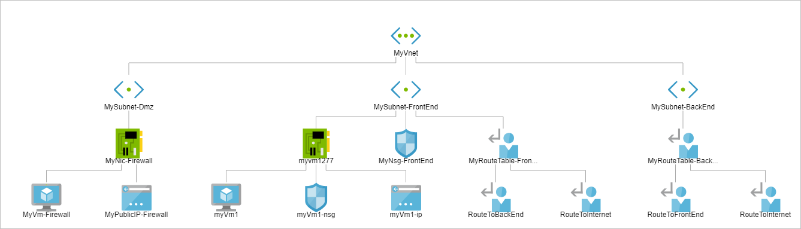
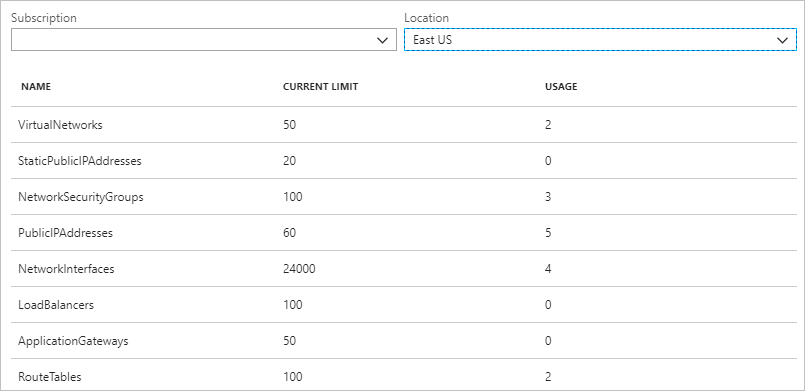
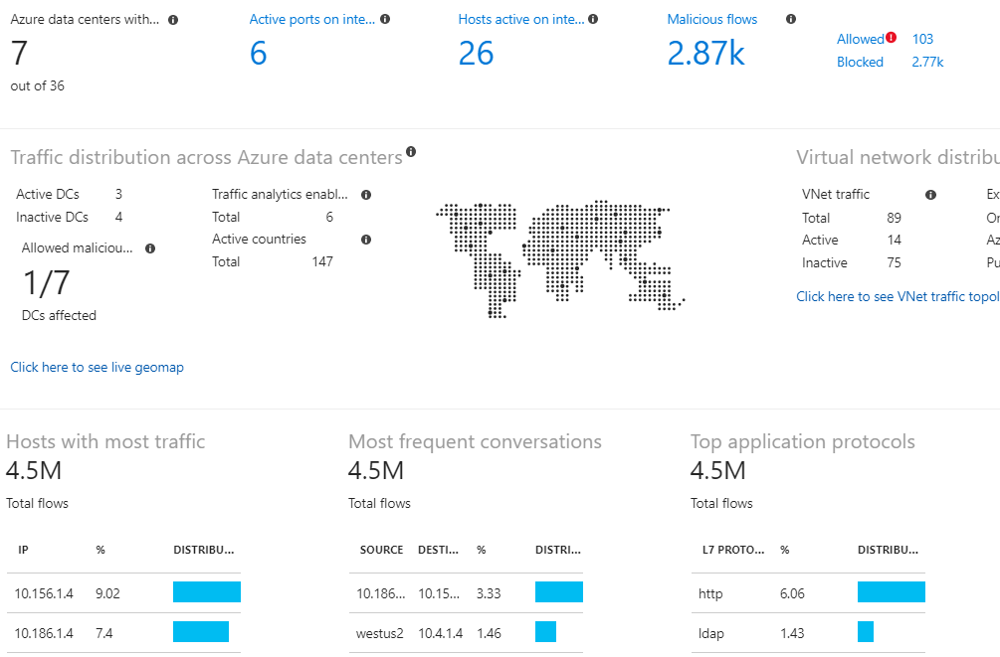

# What is Azure Network Watcher?

Azure Network Watcher provides tools to monitor, diagnose, view metrics, and enable or disable logs for resources in an Azure virtual network. Network Watcher is designed to monitor and repair the network health of IaaS (Infrastructure-as-a-Service) products which includes Virtual Machines, Virtual Networks, Application Gateways, Load balancers, etc. Note: It is not intended for and will not work for PaaS monitoring or Web analytics. 

## Monitoring

### Monitor communication between a virtual machine and an endpoint

Endpoints can be another virtual machine (VM), a fully qualified domain name (FQDN), a uniform resource identifier (URI), or IPv4 address. The *connection monitor* capability monitors communication at a regular interval and informs you of reachability, latency, and network topology changes between the VM and the endpoint. For example, you might have a web server VM that communicates with a database server VM. Someone in your organization may, unknown to you, apply a custom route or network security rule to the web server or database server VM or subnet.

If an endpoint becomes unreachable, connection troubleshoot informs you of the reason. Potential reasons are a DNS name resolution problem, the CPU, memory, or firewall within the operating system of a VM, or the hop type of a custom route, or security rule for the VM or subnet of the outbound connection. Learn more about [security rules](../virtual-network/security-overview.md?toc=%2fazure%2fnetwork-watcher%2ftoc.json#security-rules) and [route hop types](../virtual-network/virtual-networks-udr-overview.md?toc=%2fazure%2fnetwork-watcher%2ftoc.json) in Azure.

Connection monitor also provides the minimum, average, and maximum latency observed over time. After learning the latency for a connection, you may find that you're able to decrease the latency by moving your Azure resources to different Azure regions. Learn more about determining [relative latencies between Azure regions and internet service providers](#determine-relative-latencies-between-azure-regions-and-internet-service-providers) and how to monitor communication between a VM and an endpoint with [connection monitor](connection-monitor.md). If you'd rather test a connection at a point in time, rather than monitor the connection over time, like you do with connection monitor, use the [connection troubleshoot](#connection-troubleshoot) capability.

Network performance monitor is a cloud-based hybrid network monitoring solution that helps you monitor network performance between various points in your network infrastructure. It also helps you monitor network connectivity to service and application endpoints and monitor the performance of Azure ExpressRoute. Network performance monitor detects network issues like traffic blackholing, routing errors, and issues that conventional network monitoring methods aren't able to detect. The solution generates alerts and notifies you when a threshold is breached for a network link. It also ensures timely detection of network performance issues and localizes the source of the problem to a particular network segment or device. Learn more about [network performance monitor](../azure-monitor/insights/network-performance-monitor.md?toc=%2fazure%2fnetwork-watcher%2ftoc.json).

### View resources in a virtual network and their relationships

As resources are added to a virtual network, it can become difficult to understand what resources are in a virtual network and how they relate to each other. The *topology* capability enables you to generate a visual diagram of the resources in a virtual network, and the relationships between the resources. The following picture shows an example topology diagram for a virtual network that has three subnets, two VMs, network interfaces, public IP addresses, network security groups, route tables, and the relationships between the resources:

You can download an editable version of the picture in svg format. Learn more about [topology view](view-network-topology.md).

## Diagnostics

### Diagnose network traffic filtering problems to or from a VM

When you deploy a VM, Azure applies several default security rules to the VM that allow or deny traffic to or from the VM. You might override Azure's default rules, or create additional rules. At some point, a VM may become unable to communicate with other resources, because of a security rule. The *IP flow verify* capability enables you to specify a source and destination IPv4 address, port, protocol (TCP or UDP), and traffic direction (inbound or outbound). IP flow verify then tests the communication and informs you if the connection succeeds or fails. If the connection fails, IP flow verify tells you which security rule allowed or denied the communication, so that you can resolve the problem. Learn more about IP flow verify by completing the [Diagnose a virtual machine network traffic filter problem](diagnose-vm-network-traffic-filtering-problem.md) tutorial.

### Diagnose network routing problems from a VM

When you create a virtual network, Azure creates several default outbound routes for network traffic. The outbound traffic from all resources, such as VMs, deployed in a virtual network, are routed based on Azure's default routes. You might override Azure's default routes, or create additional routes. You may find that a VM can no longer communicate with other resources because of a specific route. The *next hop* capability enables you to specify a source and destination IPv4 address. Next hop then tests the communication and informs you what type of next hop is used to route the traffic. You can then remove, change, or add a route, to resolve a routing problem. Learn more about the [next hop](diagnose-vm-network-routing-problem.md) capability.

### Diagnose outbound connections from a VM

The *connection troubleshoot* capability enables you to test a connection between a VM and another VM, an FQDN, a URI, or an IPv4 address. The test returns similar information returned when using the [connection monitor](#connection-monitor) capability, but tests the connection at a point in time, rather than monitoring it over time, as connection monitor does. Learn more about how to troubleshoot connections using [connection-troubleshoot](network-watcher-connectivity-overview.md).

### Capture packets to and from a VM

Advanced filtering options and fine-tuned controls, such as the ability to set time and size limitations, provide versatility. The capture can be stored in Azure Storage, on the VM's disk, or both. You can then analyze the capture file using several standard network capture analysis tools. Learn more about [packet capture](network-watcher-packet-capture-overview.md).

### Diagnose problems with an Azure Virtual network gateway and connections

Virtual network gateways provide connectivity between on-premises resources and Azure virtual networks. Monitoring gateways and their connections are critical to ensuring communication is not broken. The *VPN diagnostics* capability provides the ability to diagnose gateways and connections. VPN diagnostics diagnoses the health of the gateway, or gateway connection, and informs you whether a gateway and gateway connections, are available. If the gateway or connection is not available, VPN diagnostics tells you why, so you can resolve the problem. Learn more about VPN diagnostics by completing the [Diagnose a communication problem between networks](diagnose-communication-problem-between-networks.md) tutorial.

### Determine relative latencies between Azure regions and internet service providers

You can query Network Watcher for latency information between Azure regions and across internet service providers. When you know latencies between Azure regions and across Internet service providers, you can deploy Azure resources to optimize network response time. Learn more about [relative latencies](view-relative-latencies.md).

### View security rules for a network interface

The effective security rules for a network interface are a combination of all security rules applied to the network interface, and the subnet the network interface is in.  The *security group view* capability shows you all security rules applied to the network interface, the subnet the network interface is in, and the aggregate of both. With an understanding of which rules are applied to a network interface, you can add, remove, or change rules, if they're allowing or denying traffic that you want to change. Learn more about [security group view](network-watcher-security-group-view-overview.md).

## Metrics

There are [limits](../azure-resource-manager/management/azure-subscription-service-limits.md?toc=%2fazure%2fnetwork-watcher%2ftoc.json#azure-resource-manager-virtual-networking-limits) to the number of network resources that you can create within an Azure subscription and region. If you meet the limits, you're unable to create more resources within the subscription or region. The *network subscription limit* capability provides a summary of how many of each network resource you have deployed in a subscription and region, and what the limit is for the resource. The following picture shows the partial output for network resources deployed in the East US region for an example subscription:

The information is helpful when planning future resource deployments.

## Logs

### Analyze traffic to or from a network security group

Network security groups (NSG) allow or deny inbound or outbound traffic to a network interface in a VM. The *NSG flow log* capability allows you to log the source and destination IP address, port, protocol, and whether traffic was allowed or denied by an NSG. You can analyze logs using a variety of tools, such as PowerBI and the *traffic analytics* capability. Traffic analytics provides rich visualizations of data written to NSG flow logs. The following picture shows some of the information and visualizations that traffic analytics presents from NSG flow log data:

Learn more about NSG flow logs by completing the [Log network traffic to and from a virtual machine](network-watcher-nsg-flow-logging-portal.md) tutorial and how to implement [traffic analytics](traffic-analytics.md).

### View diagnostic logs for network resources

You can enable diagnostic logging for Azure networking resources such as network security groups, public IP addresses, load balancers, virtual network gateways, and application gateways. The *Diagnostic logs* capability provides a single interface to enable and disable network resource diagnostic logs for any existing network resource that generates a diagnostic log. You can view diagnostic logs using tools such as Microsoft Power BI and Azure Monitor logs. To learn more about analyzing Azure network diagnostic logs, see [Azure network solutions in Azure Monitor logs](../azure-monitor/insights/azure-networking-analytics.md?toc=%2fazure%2fnetwork-watcher%2ftoc.json).

## Network Watcher automatic enablement
When you create or update a virtual network in your subscription, Network Watcher will be enabled automatically in your Virtual Network's region. There is no impact to your resources or associated charge for automatically enabling Network Watcher. For more information, see [Network Watcher create](network-watcher-create.md).

## Next steps

You now have an overview of Azure Network Watcher. To get started using Network Watcher, diagnose a common communication problem to and from a virtual machine using IP flow verify. To learn how, see the [Diagnose a virtual machine network traffic filter problem](diagnose-vm-network-traffic-filtering-problem.md) quickstart.
