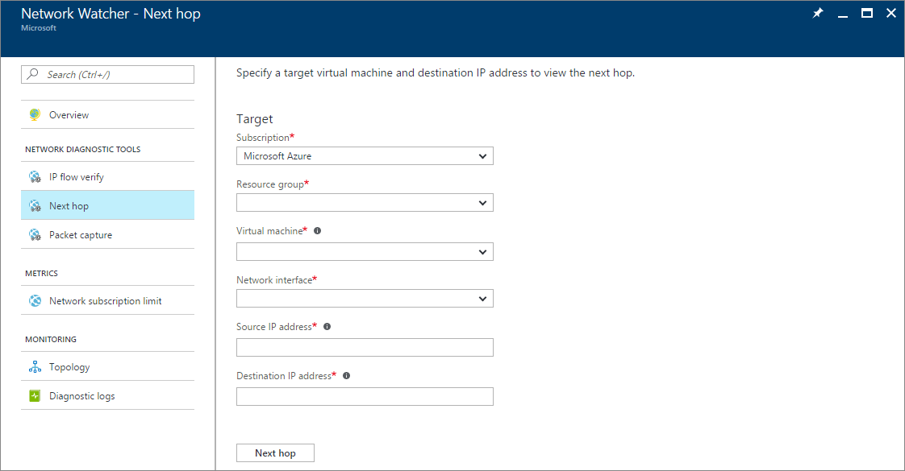

# Use next hop to diagnose virtual machine routing problems

Traffic from a virtual machine (VM) is sent to a destination based on the effective routes associated with a network interface (NIC). Next hop gets the next hop type and IP address of a packet from a specific VM and NIC. Knowing the next hop helps you determine if traffic is being directed to the intended destination, or whether the traffic is being sent nowhere. An improper configuration of routes,  where traffic is directed to an on-premises location, or a virtual appliance, can lead to connectivity issues. Next hop also returns the route table associated with the next hop. If the route is defined as a user-defined route, that route is returned. Otherwise, next hop returns **System Route**.

The next hops that might be returned by the next hop capability are as follows:

* Internet
* VirtualAppliance
* VirtualNetworkGateway
* VirtualNetwork
* VirtualNetworkPeering
* VirtualNetworkServiceEndpoint 
* MicrosoftEdge
* None

To learn more about each next hop type, see [Routing overview](../virtual-network/virtual-networks-udr-overview.md?toc=%2fazure%2fnetwork-watcher%2ftoc.json).

## Next steps

To learn how to use next hop to diagnose VM network routing problems, see Diagnose VM network routing problems using the [Azure portal](diagnose-vm-network-routing-problem.md), [PowerShell](diagnose-vm-network-routing-problem-powershell.md), or the [Azure CLI](diagnose-vm-network-routing-problem-cli.md).
