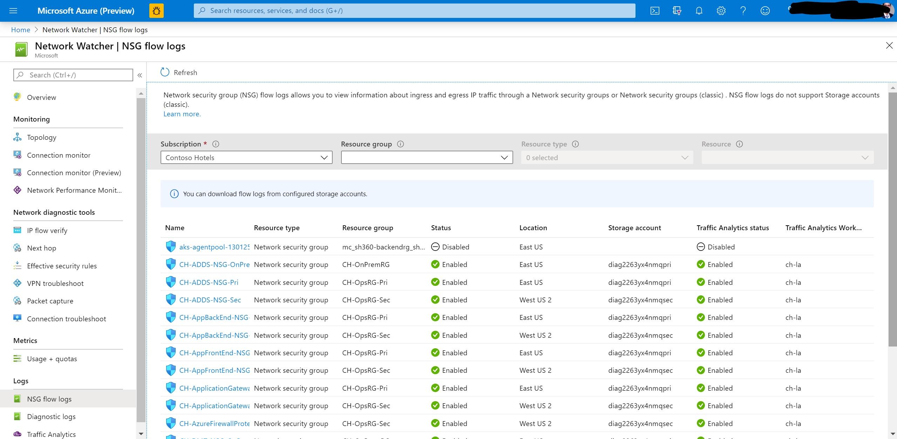
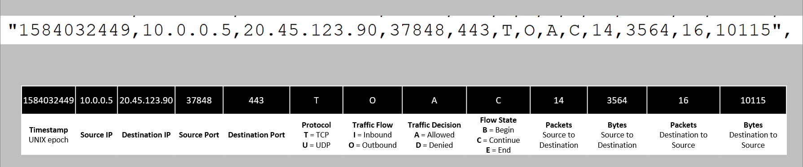

# Introduction to flow logging for network security groups

## Introduction

[Network security group](https://docs.microsoft.com/azure/virtual-network/security-overview#security-rules) (NSG) flow logs is a feature of Azure Network Watcher that allows you to log information about IP traffic flowing through an NSG. Flow data is sent to Azure Storage accounts from where you can access it as well as export it to any visualization tool, SIEM, or IDS of your choice.



## Why use Flow Logs?

It is vital to monitor, manage, and know your own network for uncompromised security, compliance, and performance. Knowing your own environment is of paramount importance to protect and optimize it. You often need to know the current state of the network, who is connecting, where they're connecting from, which ports are open to the internet, expected network behavior, irregular network behavior, and sudden rises in traffic.

Flow logs are the source of truth for all network activity in your cloud environment. Whether you're an upcoming startup trying to optimize resources or large enterprise trying to detect intrusion, Flow logs are your best bet. You can use it for optimizing network flows, monitoring throughput, verifying compliance, detecting intrusions and more.

## Common use cases

**Network Monitoring**: Identify unknown or undesired traffic. Monitor traffic levels and bandwidth consumption. Filter flow logs by IP and port to understand application behavior. Export Flow Logs to analytics and visualization tools of your choice to set up monitoring dashboards.

**Usage monitoring and optimization:** Identify top talkers in your network. Combine with GeoIP data to identify cross-region traffic. Understand traffic growth for capacity forecasting. Use data to remove overtly restrictive traffic rules.

**Compliance**: Use flow data to verify network isolation and compliance with enterprise access rules

**Network forensics & Security analysis**: Analyze network flows from compromised IPs and network interfaces. Export flow logs to any SIEM or IDS tool of your choice.

## How logging works

**Key Properties**

- Flow logs operate at [Layer 4](https://en.wikipedia.org/wiki/OSI_model#Layer_4:_Transport_Layer) and record all IP flows going in and out of an NSG
- Logs are collected through the Azure platform and do not affect customer resources or network performance in any way.
- Logs are written in the JSON format and show outbound and inbound flows on a per NSG rule basis.
- Each log record contains the network interface (NIC) the flow applies to, 5-tuple information, the traffic decision & (Version 2 only) throughput information. See _Log Format_ below for full details.
- Flow Logs have a retention feature that allows automatically deleting the logs up to a year after their creation. **NOTE**: Retention is available only if you use [General purpose v2 Storage accounts (GPv2)](https://docs.microsoft.com/azure/storage/common/storage-account-overview#types-of-storage-accounts). 

**Core concepts**

- Software defined networks are organized around Virtual Networks (VNETs) and subnets. The security of these VNets and subnets can be managed using an NSG.
- A Network security group (NSG) contains a list of _security rules_ that allow or deny network traffic in resources it is connected to. NSGs can be associated with subnets, individual VMs, or individual network interfaces (NIC) attached to VMs (Resource Manager). For more information, see [Network security group overview](https://docs.microsoft.com/azure/virtual-network/security-overview?toc=%2Fazure%2Fnetwork-watcher%2Ftoc.json).
- All traffic flows in your network are evaluated using the rules in the applicable NSG.
- The result of these evaluations is NSG Flow Logs. Flow logs are collected through the Azure platform and don't require any change to the customer resources.
- Note: Rules are of two types - terminating & non-terminating, each with different logging behaviours.
- - NSG Deny rules are terminating. The NSG denying the traffic will log it in Flow logs and processing in this case would stop after any NSG denies traffic. 
- - NSG Allow rules are non-terminating, which means even if one NSG allows it, processing will continue to the next NSG. The last NSG allowing traffic will log the traffic to Flow logs.
- NSG Flow Logs are written to storage accounts from where they can be accessed.
- You can export, process, analyze, and visualize Flow Logs using tools like TA, Splunk, Grafana, Stealthwatch, etc.

## Log format

Flow logs include the following properties:

* **time** - Time when the event was logged
* **systemId** - Network Security Group system ID.
* **category** - The category of the event. The category is always **NetworkSecurityGroupFlowEvent**
* **resourceid** - The resource ID of the NSG
* **operationName** - Always NetworkSecurityGroupFlowEvents
* **properties** - A collection of properties of the flow
	* **Version** - Version number of the Flow Log event schema
	* **flows** - A collection of flows. This property has multiple entries for different rules
		* **rule** - Rule for which the flows are listed
			* **flows** - a collection of flows
				* **mac** - The MAC address of the NIC for the VM where the flow was collected
				* **flowTuples** - A string that contains multiple properties for the flow tuple in comma-separated format
					* **Time Stamp** - This value is the time stamp of when the flow occurred in UNIX epoch format
					* **Source IP** - The source IP
					* **Destination IP** - The destination IP
					* **Source Port** - The source port
					* **Destination Port** - The destination Port
					* **Protocol** - The protocol of the flow. Valid values are **T** for TCP and **U** for UDP
					* **Traffic Flow** - The direction of the traffic flow. Valid values are **I** for inbound and **O** for outbound.
					* **Traffic Decision** - Whether traffic was allowed or denied. Valid values are **A** for allowed and **D** for denied.
                    * **Flow State - Version 2 Only** - Captures the state of the flow. Possible states are **B**: Begin, when a flow is created. Statistics aren't provided. **C**: Continuing for an ongoing flow. Statistics are provided at 5-minute intervals. **E**: End, when a flow is terminated. Statistics are provided.
                    * **Packets - Source to destination - Version 2 Only** The total number of TCP or UDP packets sent from source to destination since last update.
                    * **Bytes sent - Source to destination - Version 2 Only** The total number of TCP or UDP packet bytes sent from source to destination since last update. Packet bytes include the packet header and payload.
                    * **Packets - Destination to source - Version 2 Only** The total number of TCP or UDP packets sent from destination to source since last update.
                    * **Bytes sent - Destination to source - Version 2 Only** The total number of TCP and UDP packet bytes sent from destination to source since last update. Packet bytes include packet header and payload.


**NSG flow logs Version 2 (vs Version 1)** 

Version 2 of the logs introduces the concept of flow state. You can configure which version of flow logs you receive.

Flow state _B_ is recorded when a flow is initiated. Flow state _C_ and flow state _E_ are states that mark the continuation of a flow and flow termination, respectively. Both _C_ and _E_ states contain traffic bandwidth information.

### Sample log records

The text that follows is an example of a flow log. As you can see, there are multiple records that follow the property list described in the preceding section.

> [!NOTE]
> Values in the **flowTuples* property are a comma-separated list.
 
**Version 1 NSG flow log format sample**
```json
{
    "records": [
        {
            "time": "2017-02-16T22:00:32.8950000Z",
            "systemId": "2c002c16-72f3-4dc5-b391-3444c3527434",
            "category": "NetworkSecurityGroupFlowEvent",
            "resourceId": "/SUBSCRIPTIONS/00000000-0000-0000-0000-000000000000/RESOURCEGROUPS/FABRIKAMRG/PROVIDERS/MICROSOFT.NETWORK/NETWORKSECURITYGROUPS/FABRIAKMVM1-NSG",
            "operationName": "NetworkSecurityGroupFlowEvents",
            "properties": {
                "Version": 1,
                "flows": [
                    {
                        "rule": "DefaultRule_DenyAllInBound",
                        "flows": [
                            {
                                "mac": "000D3AF8801A",
                                "flowTuples": [
                                    "1487282421,42.119.146.95,10.1.0.4,51529,5358,T,I,D"
                                ]
                            }
                        ]
                    },
                    {
                        "rule": "UserRule_default-allow-rdp",
                        "flows": [
                            {
                                "mac": "000D3AF8801A",
                                "flowTuples": [
                                    "1487282370,163.28.66.17,10.1.0.4,61771,3389,T,I,A",
                                    "1487282393,5.39.218.34,10.1.0.4,58596,3389,T,I,A",
                                    "1487282393,91.224.160.154,10.1.0.4,61540,3389,T,I,A",
                                    "1487282423,13.76.89.229,10.1.0.4,53163,3389,T,I,A"
                                ]
                            }
                        ]
                    }
                ]
            }
        },
        {
            "time": "2017-02-16T22:01:32.8960000Z",
            "systemId": "2c002c16-72f3-4dc5-b391-3444c3527434",
            "category": "NetworkSecurityGroupFlowEvent",
            "resourceId": "/SUBSCRIPTIONS/00000000-0000-0000-0000-000000000000/RESOURCEGROUPS/FABRIKAMRG/PROVIDERS/MICROSOFT.NETWORK/NETWORKSECURITYGROUPS/FABRIAKMVM1-NSG",
            "operationName": "NetworkSecurityGroupFlowEvents",
            "properties": {
                "Version": 1,
                "flows": [
                    {
                        "rule": "DefaultRule_DenyAllInBound",
                        "flows": [
                            {
                                "mac": "000D3AF8801A",
                                "flowTuples": [
                                    "1487282481,195.78.210.194,10.1.0.4,53,1732,U,I,D"
                                ]
                            }
                        ]
                    },
                    {
                        "rule": "UserRule_default-allow-rdp",
                        "flows": [
                            {
                                "mac": "000D3AF8801A",
                                "flowTuples": [
                                    "1487282435,61.129.251.68,10.1.0.4,57776,3389,T,I,A",
                                    "1487282454,84.25.174.170,10.1.0.4,59085,3389,T,I,A",
                                    "1487282477,77.68.9.50,10.1.0.4,65078,3389,T,I,A"
                                ]
                            }
                        ]
                    }
                ]
            }
        },
	"records":
	[
		
		{
			 "time": "2017-02-16T22:00:32.8950000Z",
			 "systemId": "2c002c16-72f3-4dc5-b391-3444c3527434",
			 "category": "NetworkSecurityGroupFlowEvent",
			 "resourceId": "/SUBSCRIPTIONS/00000000-0000-0000-0000-000000000000/RESOURCEGROUPS/FABRIKAMRG/PROVIDERS/MICROSOFT.NETWORK/NETWORKSECURITYGROUPS/FABRIAKMVM1-NSG",
			 "operationName": "NetworkSecurityGroupFlowEvents",
			 "properties": {"Version":1,"flows":[{"rule":"DefaultRule_DenyAllInBound","flows":[{"mac":"000D3AF8801A","flowTuples":["1487282421,42.119.146.95,10.1.0.4,51529,5358,T,I,D"]}]},{"rule":"UserRule_default-allow-rdp","flows":[{"mac":"000D3AF8801A","flowTuples":["1487282370,163.28.66.17,10.1.0.4,61771,3389,T,I,A","1487282393,5.39.218.34,10.1.0.4,58596,3389,T,I,A","1487282393,91.224.160.154,10.1.0.4,61540,3389,T,I,A","1487282423,13.76.89.229,10.1.0.4,53163,3389,T,I,A"]}]}]}
		}
		,
		{
			 "time": "2017-02-16T22:01:32.8960000Z",
			 "systemId": "2c002c16-72f3-4dc5-b391-3444c3527434",
			 "category": "NetworkSecurityGroupFlowEvent",
			 "resourceId": "/SUBSCRIPTIONS/00000000-0000-0000-0000-000000000000/RESOURCEGROUPS/FABRIKAMRG/PROVIDERS/MICROSOFT.NETWORK/NETWORKSECURITYGROUPS/FABRIAKMVM1-NSG",
			 "operationName": "NetworkSecurityGroupFlowEvents",
			 "properties": {"Version":1,"flows":[{"rule":"DefaultRule_DenyAllInBound","flows":[{"mac":"000D3AF8801A","flowTuples":["1487282481,195.78.210.194,10.1.0.4,53,1732,U,I,D"]}]},{"rule":"UserRule_default-allow-rdp","flows":[{"mac":"000D3AF8801A","flowTuples":["1487282435,61.129.251.68,10.1.0.4,57776,3389,T,I,A","1487282454,84.25.174.170,10.1.0.4,59085,3389,T,I,A","1487282477,77.68.9.50,10.1.0.4,65078,3389,T,I,A"]}]}]}
		}
		,
		{
			 "time": "2017-02-16T22:02:32.9040000Z",
			 "systemId": "2c002c16-72f3-4dc5-b391-3444c3527434",
			 "category": "NetworkSecurityGroupFlowEvent",
			 "resourceId": "/SUBSCRIPTIONS/00000000-0000-0000-0000-000000000000/RESOURCEGROUPS/FABRIKAMRG/PROVIDERS/MICROSOFT.NETWORK/NETWORKSECURITYGROUPS/FABRIAKMVM1-NSG",
			 "operationName": "NetworkSecurityGroupFlowEvents",
			 "properties": {"Version":1,"flows":[{"rule":"DefaultRule_DenyAllInBound","flows":[{"mac":"000D3AF8801A","flowTuples":["1487282492,175.182.69.29,10.1.0.4,28918,5358,T,I,D","1487282505,71.6.216.55,10.1.0.4,8080,8080,T,I,D"]}]},{"rule":"UserRule_default-allow-rdp","flows":[{"mac":"000D3AF8801A","flowTuples":["1487282512,91.224.160.154,10.1.0.4,59046,3389,T,I,A"]}]}]}
		}
		
		
```
**Version 2 NSG flow log format sample**
```json
 {
    "records": [
        {
            "time": "2018-11-13T12:00:35.3899262Z",
            "systemId": "a0fca5ce-022c-47b1-9735-89943b42f2fa",
            "category": "NetworkSecurityGroupFlowEvent",
            "resourceId": "/SUBSCRIPTIONS/00000000-0000-0000-0000-000000000000/RESOURCEGROUPS/FABRIKAMRG/PROVIDERS/MICROSOFT.NETWORK/NETWORKSECURITYGROUPS/FABRIAKMVM1-NSG",
            "operationName": "NetworkSecurityGroupFlowEvents",
            "properties": {
                "Version": 2,
                "flows": [
                    {
                        "rule": "DefaultRule_DenyAllInBound",
                        "flows": [
                            {
                                "mac": "000D3AF87856",
                                "flowTuples": [
                                    "1542110402,94.102.49.190,10.5.16.4,28746,443,U,I,D,B,,,,",
                                    "1542110424,176.119.4.10,10.5.16.4,56509,59336,T,I,D,B,,,,",
                                    "1542110432,167.99.86.8,10.5.16.4,48495,8088,T,I,D,B,,,,"
                                ]
                            }
                        ]
                    },
                    {
                        "rule": "DefaultRule_AllowInternetOutBound",
                        "flows": [
                            {
                                "mac": "000D3AF87856",
                                "flowTuples": [
                                    "1542110377,10.5.16.4,13.67.143.118,59831,443,T,O,A,B,,,,",
                                    "1542110379,10.5.16.4,13.67.143.117,59932,443,T,O,A,E,1,66,1,66",
                                    "1542110379,10.5.16.4,13.67.143.115,44931,443,T,O,A,C,30,16978,24,14008",
                                    "1542110406,10.5.16.4,40.71.12.225,59929,443,T,O,A,E,15,8489,12,7054"
                                ]
                            }
                        ]
                    }
                ]
            }
        },
        {
            "time": "2018-11-13T12:01:35.3918317Z",
            "systemId": "a0fca5ce-022c-47b1-9735-89943b42f2fa",
            "category": "NetworkSecurityGroupFlowEvent",
            "resourceId": "/SUBSCRIPTIONS/00000000-0000-0000-0000-000000000000/RESOURCEGROUPS/FABRIKAMRG/PROVIDERS/MICROSOFT.NETWORK/NETWORKSECURITYGROUPS/FABRIAKMVM1-NSG",
            "operationName": "NetworkSecurityGroupFlowEvents",
            "properties": {
                "Version": 2,
                "flows": [
                    {
                        "rule": "DefaultRule_DenyAllInBound",
                        "flows": [
                            {
                                "mac": "000D3AF87856",
                                "flowTuples": [
                                    "1542110437,125.64.94.197,10.5.16.4,59752,18264,T,I,D,B,,,,",
                                    "1542110475,80.211.72.221,10.5.16.4,37433,8088,T,I,D,B,,,,",
                                    "1542110487,46.101.199.124,10.5.16.4,60577,8088,T,I,D,B,,,,",
                                    "1542110490,176.119.4.30,10.5.16.4,57067,52801,T,I,D,B,,,,"
                                ]
                            }
                        ]
                    }
                ]
            }
        }
        
```
**Log tuple explained**



**Sample bandwidth calculation**

Flow tuples from a TCP conversation between 185.170.185.105:35370 and 10.2.0.4:23:

"1493763938,185.170.185.105,10.2.0.4,35370,23,T,I,A,B,,,,"
"1493695838,185.170.185.105,10.2.0.4,35370,23,T,I,A,C,1021,588096,8005,4610880"
"1493696138,185.170.185.105,10.2.0.4,35370,23,T,I,A,E,52,29952,47,27072"

For continuation _C_ and end _E_ flow states, byte and packet counts are aggregate counts from the time of the previous flow tuple record. Referencing the previous example conversation, the total number of packets transferred is 1021+52+8005+47 = 9125. The total number of bytes transferred is 588096+29952+4610880+27072 = 5256000.


## Enabling NSG Flow Logs

Use the relevant link from below for guides on enabling flow logs.

- [Azure portal](https://docs.microsoft.com/azure/network-watcher/network-watcher-nsg-flow-logging-portal)
- [PowerShell](https://docs.microsoft.com/azure/network-watcher/network-watcher-nsg-flow-logging-powershell)
- [CLI](https://docs.microsoft.com/azure/network-watcher/network-watcher-nsg-flow-logging-cli)
- [REST](https://docs.microsoft.com/azure/network-watcher/network-watcher-nsg-flow-logging-rest)
- [Azure Resource Manager](https://docs.microsoft.com/azure/network-watcher/network-watcher-nsg-flow-logging-azure-resource-manager)

## Updating parameters

**Azure portal**

On the Azure portal, navigate to the NSG Flow Logs section in Network Watcher. Then click the name of the NSG. This will bring up the settings pane for the Flow log. Change the parameters you want and hit **Save** to deploy the changes.

**PS/CLI/REST/ARM**

To update parameters via command-line tools, use the same command used to enable Flow Logs (from above) but with updated parameters that you want to change.

## Working with Flow logs

*Read and Export flow logs*

- [Download &amp; view Flow Logs from the portal](https://docs.microsoft.com/azure/network-watcher/network-watcher-nsg-flow-logging-portal#download-flow-log)
- [Read Flow logs using PowerShell functions](https://docs.microsoft.com/azure/network-watcher/network-watcher-read-nsg-flow-logs)
- [Export NSG Flow Logs to Splunk](https://www.splunk.com/en_us/blog/tips-and-tricks/splunking-microsoft-azure-network-watcher-data.html)

While flow logs target NSGs, they are not displayed the same as the other logs. Flow logs are stored only within a storage account and follow the logging path shown in the following example:

```
https://{storageAccountName}.blob.core.windows.net/insights-logs-networksecuritygroupflowevent/resourceId=/SUBSCRIPTIONS/{subscriptionID}/RESOURCEGROUPS/{resourceGroupName}/PROVIDERS/MICROSOFT.NETWORK/NETWORKSECURITYGROUPS/{nsgName}/y={year}/m={month}/d={day}/h={hour}/m=00/macAddress={macAddress}/PT1H.json
```

*Visualize flow Logs*

- [Azure Traffic analytics](https://docs.microsoft.com/azure/network-watcher/traffic-analytics) is an Azure native service to process flow logs, extracts insights and visualize flow logs. 
- [[Tutorial] Visualize NSG Flow logs with Power BI](https://docs.microsoft.com/azure/network-watcher/network-watcher-visualize-nsg-flow-logs-power-bi)
- [[Tutorial] Visualize NSG Flow logs with Elastic Stack](https://docs.microsoft.com/azure/network-watcher/network-watcher-visualize-nsg-flow-logs-open-source-tools)
- [[Tutorial] Manage and analyze NSG Flow logs using Grafana](https://docs.microsoft.com/azure/network-watcher/network-watcher-nsg-grafana)
- [[Tutorial] Manage and analyze NSG Flow logs using Graylog](https://docs.microsoft.com/azure/network-watcher/network-watcher-analyze-nsg-flow-logs-graylog)


## NSG flow logging considerations

**Storage account considerations**: 

- Location: The storage account used must be in the same region as the NSG.
- Self-manage key rotation: If you change/rotate the access keys to your storage account, NSG Flow Logs will stop working. To fix this issue, you must disable and then re-enable NSG Flow Logs.

**Flow Logging Costs**: NSG flow logging is billed on the volume of logs produced. High traffic volume can result in large flow log volume and the associated costs. NSG Flow log pricing does not include the underlying costs of storage. Using the retention policy feature with NSG Flow Logging means incurring separate storage costs for extended periods of time. If you do not require the retention policy feature, we recommend that you set this value to 0. For more information, see [Network Watcher Pricing](https://azure.microsoft.com/pricing/details/network-watcher/) and [Azure Storage Pricing](https://azure.microsoft.com/pricing/details/storage/) for additional details.

**Incorrect byte and packet counts for Inbound flows**: [Network Security Groups (NSGs)](https://docs.microsoft.com/azure/virtual-network/security-overview) are implemented as a [Stateful firewall](https://en.wikipedia.org/wiki/Stateful_firewall?oldformat=true). However, due to platform limitations, rules that control inbound flows are implemented in a stateless fashion. Because of this bytes and packets counts are not recorded for these flows. Consequently the number of bytes and packets reported in NSG Flow Logs (and Traffic Analytics) could be different from actual numbers. Additionally, the inbound flows are now non-terminating. This limitation is scheduled to be fixed by December 2020.

**Inbound flows logged from internet IPs to VMs without public IPs**: VMs that don't have a public IP address assigned via a public IP address associated with the NIC as an instance-level public IP, or that are part of a basic load balancer back-end pool, use [default SNAT](../load-balancer/load-balancer-outbound-connections.md) and have an IP address assigned by Azure to facilitate outbound connectivity. As a result, you might see flow log entries for flows from internet IP addresses, if the flow is destined to a port in the range of ports assigned for SNAT. While Azure won't allow these flows to the VM, the attempt is logged and appears in Network Watcher's NSG flow log by design. We recommend that unwanted inbound internet traffic be explicitly blocked with NSG.

## Best practices

**Enable on critical VNETs/Subnets**: Flow Logs should be enabled on all critical VNETs/subnets in your subscription as an auditability and security best practice. 

**Enable NSG Flow Logging on all NSGs attached to a resource**: Flow logging in Azure is configured on the NSG resource. A flow will only be associated to one NSG Rule. In scenarios where multiple NSGs are utilized, we recommend enabling NSG flow logs on all NSGs applied a resource's subnet or network interface to ensure that all traffic is recorded. For more information, see [how traffic is evaluated](../virtual-network/security-overview.md#how-traffic-is-evaluated) in Network Security Groups.

**Storage provisioning**: Storage should be provisioned in tune with expected Flow Log volume.

## Troubleshooting common issues

**I could not enable NSG Flow Logs**

- **Microsoft.Insights** resource provider is not registered

If you received an _AuthorizationFailed_ or a _GatewayAuthenticationFailed_ error, you might have not enabled the Microsoft Insights resource provider on your subscription. [Follow the instructions](https://docs.microsoft.com/azure/network-watcher/network-watcher-nsg-flow-logging-portal#register-insights-provider) to enable the Microsoft Insights provider.

**I have enabled NSG Flow Logs but do not see data in my storage account**

- **Setup time**

NSG Flow Logs may take up to 5 minutes to appear in your storage account (if configured correctly). A PT1H.json will appear which can be accessed [as described here](https://docs.microsoft.com/azure/network-watcher/network-watcher-nsg-flow-logging-portal#download-flow-log).

- **No Traffic on your NSGs**

Sometimes you will not see logs because your VMs are not active or there are upstream filters at an App Gateway or other devices that are blocking traffic to your NSGs.

**I want to automate NSG Flow Logs**

Support for automation via ARM templates is currently not available for NSG Flow Logs. Read the [feature announcement](https://azure.microsoft.com/updates/arm-template-support-for-nsg-flow-logs/) for more information.

## FAQ

**What does NSG Flow Logs do?**

Azure network resources can be combined and managed through [Network Security Groups (NSGs)](https://docs.microsoft.com/azure/virtual-network/security-overview). NSG Flow Logs enable you to log 5-tuple flow information about all traffic through your NSGs. The raw flow logs are written to an Azure Storage account from where they can be further processed, analyzed, queried, or exported as needed.

**Does using Flow Logs impact my network latency or performance?**

Flow logs data is collected outside of the path of your network traffic, and therefore does not affect network throughput or latency. You can create or delete flow logs without any risk of impact to network performance.

**How do I use NSG Flow Logs with a Storage account behind a firewall?**

To use a Storage account behind a firewall, you have to provide an exception for Trusted Microsoft Services to access your storage account:

- Navigate to the storage account by typing the storage account's name in the global search on the portal or from the [Storage Accounts page](https://ms.portal.azure.com/#blade/HubsExtension/BrowseResource/resourceType/Microsoft.Storage%2FStorageAccounts)
- Under the  **SETTINGS**  section, select  **Firewalls and virtual networks**
- In **Allow access from**, select  **Selected networks**. Then under  **Exceptions**, tick the box next to  ****Allow trusted Microsoft services to access this storage account****
- If it is already selected, no change is needed.
- Locate your target NSG on the [NSG Flow Logs overview page](https://ms.portal.azure.com/#blade/Microsoft_Azure_Network/NetworkWatcherMenuBlade/flowLogs) and enable NSG Flow Logs with the above storage account selected.

You can check the storage logs after a few minutes, you should see an updated TimeStamp or a new JSON file created.

**How do I use NSG Flow Logs with a Storage account behind a Service Endpoint?**

NSG Flow Logs are compatible with Service Endpoints without requiring any extra configuration. See the [tutorial on enabling Service Endpoints](https://docs.microsoft.com/azure/virtual-network/tutorial-restrict-network-access-to-resources#enable-a-service-endpoint) in your virtual network.

**What is the difference between flow logs versions 1 & 2?**

Flow Logs version 2 introduces the concept of _Flow State_ & stores information about bytes and packets transmitted. [Read more](https://docs.microsoft.com/azure/network-watcher/network-watcher-nsg-flow-logging-overview#log-file)

## Pricing

NSG Flow Logs are charged per GB of logs collected and come with a free tier of 5 GB/month per subscription. For the current pricing in your region, see the [Network Watcher pricing page](https://azure.microsoft.com/pricing/details/network-watcher/).

Storage of logs is charged separately, see [Azure Storage Block blob pricing page](https://azure.microsoft.com/pricing/details/storage/blobs/) for relevant prices.
 
