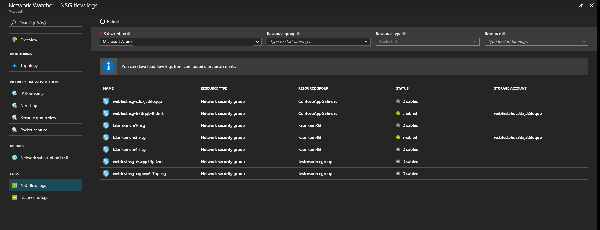

# Introduction to flow logging for network security groups

Network security group (NSG) flow logs are a feature of Network Watcher that allows you to view information about ingress and egress IP traffic through an NSG. Flow logs are written in JSON format, and show outbound and inbound flows on a per rule basis, the network interface (NIC) the flow applies to, 5-tuple information about the flow (Source/destination IP, source/destination port, and protocol), if the traffic was allowed or denied, and in Version 2, throughput information (Bytes and Packets).




While flow logs target NSGs, they are not displayed the same as the other logs. Flow logs are stored only within a storage account and follow the logging path shown in the following example:

```
https://{storageAccountName}.blob.core.windows.net/insights-logs-networksecuritygroupflowevent/resourceId=/SUBSCRIPTIONS/{subscriptionID}/RESOURCEGROUPS/{resourceGroupName}/PROVIDERS/MICROSOFT.NETWORK/NETWORKSECURITYGROUPS/{nsgName}/y={year}/m={month}/d={day}/h={hour}/m=00/macAddress={macAddress}/PT1H.json
```
You can analyze flow logs and gain insights into your network traffic using [traffic analytics](traffic-analytics.md).

The same retention policies seen for other logs apply to flow logs. You can set log retention policy from 1 day to 2147483647 days. If a retention policy is not set, the logs are maintained forever.

> [!NOTE] 
> Using the retention policy feature with NSG Flow Logging may result in a high volume of storage operations and the associated costs. If you do not require the retention policy feature, we recommend that you set this value to 0.


## Log file

Flow logs include the following properties:

* **time** - Time when the event was logged
* **systemId** - Network Security Group resource Id.
* **category** - The category of the event. The category is always **NetworkSecurityGroupFlowEvent**
* **resourceid** - The resource Id of the NSG
* **operationName** - Always NetworkSecurityGroupFlowEvents
* **properties** - A collection of properties of the flow
	* **Version** - Version number of the Flow Log event schema
	* **flows** - A collection of flows. This property has multiple entries for different rules
		* **rule** - Rule for which the flows are listed
			* **flows** - a collection of flows
				* **mac** - The MAC address of the NIC for the VM where the flow was collected
				* **flowTuples** - A string that contains multiple properties for the flow tuple in comma-separated format
					* **Time Stamp** - This value is the time stamp of when the flow occurred in UNIX EPOCH format
					* **Source IP** - The source IP
					* **Destination IP** - The destination IP
					* **Source Port** - The source port
					* **Destination Port** - The destination Port
					* **Protocol** - The protocol of the flow. Valid values are **T** for TCP and **U** for UDP
					* **Traffic Flow** - The direction of the traffic flow. Valid values are **I** for inbound and **O** for outbound.
					* **Traffic Decision** - Whether traffic was allowed or denied. Valid values are **A** for allowed and **D** for denied.
                    * **Flow State - Version 2 Only** - Captures the state of the flow. Possible states are **B**: Begin, when a flow is created. Statistics aren't provided. **C**: Continuing for an ongoing flow. Statistics are provided at 5-minute intervals. **E**: End, when a flow is terminated. Statistics are provided.
                    * **Packets - Source to destination - Version 2 Only** The total number of TCP or UDP packets sent from source to destination since last update.
                    * **Bytes sent - Source to destination - Version 2 Only** The total number of TCP or UDP packet bytes sent from source to destination since last update. Packet bytes include the packet header and payload.
                    * **Packets - Destination to source - Version 2 Only** The total number of TCP or UDP packets sent from destination to source since last update.
                    * **Bytes sent - Destination to source - Version 2 Only** The total number of TCP and UDP packet bytes sent from destination to source since last update. Packet bytes include packet header and payload.

## NSG flow logs version 2

Version 2 of the logs introduces flow state. You can configure which version of flow logs you receive. To learn how to enable flow logs, see [Enabling NSG flow logging](network-watcher-nsg-flow-logging-portal.md).

Flow state *B* is recorded when a flow is initiated. Flow state *C* and flow state *E* are states that mark the continuation of a flow and flow termination, respectively. Both *C* and *E* states contain traffic bandwidth information.

For continuation *C* and end *E* flow states, byte and packet counts are aggregate counts from the time of the previous flow tuple record. Referencing the previous example conversation, the total number of packets transferred is 1021+52+8005+47 = 9125. The total number of bytes transferred is 588096+29952+4610880+27072 = 5256000.

**Example**: Flow tuples from a TCP conversation between 185.170.185.105:35370 and 10.2.0.4:23:

"1493763938,185.170.185.105,10.2.0.4,35370,23,T,I,A,B,,,,"
"1493695838,185.170.185.105,10.2.0.4,35370,23,T,I,A,C,1021,588096,8005,4610880"
"1493696138,185.170.185.105,10.2.0.4,35370,23,T,I,A,E,52,29952,47,27072"

For continuation *C* and end *E* flow states, byte and packet counts are aggregate counts from the time of the previous flow tuple record. Referencing the previous example conversation, the total number of packets transferred is 1021+52+8005+47 = 9125. The total number of bytes transferred is 588096+29952+4610880+27072 = 5256000.

The text that follows is an example of a flow log. As you can see, there are multiple records that follow the property list described in the preceding section.

## NSG Flow Logging Considerations

**Enable NSG Flow Logging on all NSGs attached to a resource**: Flow logging in Azure is configured on the NSG resource. A flow will only be associated to one NSG Rule. In scenarios where multiple NSGs are utilized, we recommend that NSG flow logging is enabled on all NSGs applied a resource's subnet or network interface to ensure that all traffic is recorded. See [how traffic is evaluated](../virtual-network/security-overview.md#how-traffic-is-evaluated) for more information on Network Security Groups. 

**Flow Logging Costs**: NSG flow logging is billed on the volume of logs produced. High traffic volume can result in large flow log volume and the associated costs. NSG Flow log pricing does not include the underlying costs of storage. Using the retention policy feature with NSG Flow Logging may result in a high volume of storage operations and the associated costs. If you do not require the retention policy feature, we recommend that you set this value to 0. See [Network Watcher Pricing](https://azure.microsoft.com/pricing/details/network-watcher/) and [Azure Storage Pricing](https://azure.microsoft.com/pricing/details/storage/) for additional details.

**Inbound flows logged from internet IPs to VMs without public IPs**: VMs that don't have a public IP address assigned via a public IP address associated with the NIC as an instance-level public IP, or that are part of a basic load balancer back-end pool, use [default SNAT](../load-balancer/load-balancer-outbound-connections.md#defaultsnat) and have an IP address assigned by Azure to facilitate outbound connectivity. As a result, you might see flow log entries for flows from internet IP addresses, if the flow is destined to a port in the range of ports assigned for SNAT. While Azure won't allow these flows to the VM, the attempt is logged and appears in Network Watcher's NSG flow log by design. We recommend that unwanted inbound internet traffic be explicitly blocked with NSG.

## Sample log records

The text that follows is an example of a flow log. As you can see, there are multiple records that follow the property list described in the preceding section.


> [!NOTE]
> Values in the **flowTuples* property are a comma-separated list.
 
### Version 1 NSG flow log format sample
```json
{
    "records": [
        {
            "time": "2017-02-16T22:00:32.8950000Z",
            "systemId": "2c002c16-72f3-4dc5-b391-3444c3527434",
            "category": "NetworkSecurityGroupFlowEvent",
            "resourceId": "/SUBSCRIPTIONS/00000000-0000-0000-0000-000000000000/RESOURCEGROUPS/FABRIKAMRG/PROVIDERS/MICROSOFT.NETWORK/NETWORKSECURITYGROUPS/FABRIAKMVM1-NSG",
            "operationName": "NetworkSecurityGroupFlowEvents",
            "properties": {
                "Version": 1,
                "flows": [
                    {
                        "rule": "DefaultRule_DenyAllInBound",
                        "flows": [
                            {
                                "mac": "000D3AF8801A",
                                "flowTuples": [
                                    "1487282421,42.119.146.95,10.1.0.4,51529,5358,T,I,D"
                                ]
                            }
                        ]
                    },
                    {
                        "rule": "UserRule_default-allow-rdp",
                        "flows": [
                            {
                                "mac": "000D3AF8801A",
                                "flowTuples": [
                                    "1487282370,163.28.66.17,10.1.0.4,61771,3389,T,I,A",
                                    "1487282393,5.39.218.34,10.1.0.4,58596,3389,T,I,A",
                                    "1487282393,91.224.160.154,10.1.0.4,61540,3389,T,I,A",
                                    "1487282423,13.76.89.229,10.1.0.4,53163,3389,T,I,A"
                                ]
                            }
                        ]
                    }
                ]
            }
        },
        {
            "time": "2017-02-16T22:01:32.8960000Z",
            "systemId": "2c002c16-72f3-4dc5-b391-3444c3527434",
            "category": "NetworkSecurityGroupFlowEvent",
            "resourceId": "/SUBSCRIPTIONS/00000000-0000-0000-0000-000000000000/RESOURCEGROUPS/FABRIKAMRG/PROVIDERS/MICROSOFT.NETWORK/NETWORKSECURITYGROUPS/FABRIAKMVM1-NSG",
            "operationName": "NetworkSecurityGroupFlowEvents",
            "properties": {
                "Version": 1,
                "flows": [
                    {
                        "rule": "DefaultRule_DenyAllInBound",
                        "flows": [
                            {
                                "mac": "000D3AF8801A",
                                "flowTuples": [
                                    "1487282481,195.78.210.194,10.1.0.4,53,1732,U,I,D"
                                ]
                            }
                        ]
                    },
                    {
                        "rule": "UserRule_default-allow-rdp",
                        "flows": [
                            {
                                "mac": "000D3AF8801A",
                                "flowTuples": [
                                    "1487282435,61.129.251.68,10.1.0.4,57776,3389,T,I,A",
                                    "1487282454,84.25.174.170,10.1.0.4,59085,3389,T,I,A",
                                    "1487282477,77.68.9.50,10.1.0.4,65078,3389,T,I,A"
                                ]
                            }
                        ]
                    }
                ]
            }
        },
	"records":
	[
		
		{
			 "time": "2017-02-16T22:00:32.8950000Z",
			 "systemId": "2c002c16-72f3-4dc5-b391-3444c3527434",
			 "category": "NetworkSecurityGroupFlowEvent",
			 "resourceId": "/SUBSCRIPTIONS/00000000-0000-0000-0000-000000000000/RESOURCEGROUPS/FABRIKAMRG/PROVIDERS/MICROSOFT.NETWORK/NETWORKSECURITYGROUPS/FABRIAKMVM1-NSG",
			 "operationName": "NetworkSecurityGroupFlowEvents",
			 "properties": {"Version":1,"flows":[{"rule":"DefaultRule_DenyAllInBound","flows":[{"mac":"000D3AF8801A","flowTuples":["1487282421,42.119.146.95,10.1.0.4,51529,5358,T,I,D"]}]},{"rule":"UserRule_default-allow-rdp","flows":[{"mac":"000D3AF8801A","flowTuples":["1487282370,163.28.66.17,10.1.0.4,61771,3389,T,I,A","1487282393,5.39.218.34,10.1.0.4,58596,3389,T,I,A","1487282393,91.224.160.154,10.1.0.4,61540,3389,T,I,A","1487282423,13.76.89.229,10.1.0.4,53163,3389,T,I,A"]}]}]}
		}
		,
		{
			 "time": "2017-02-16T22:01:32.8960000Z",
			 "systemId": "2c002c16-72f3-4dc5-b391-3444c3527434",
			 "category": "NetworkSecurityGroupFlowEvent",
			 "resourceId": "/SUBSCRIPTIONS/00000000-0000-0000-0000-000000000000/RESOURCEGROUPS/FABRIKAMRG/PROVIDERS/MICROSOFT.NETWORK/NETWORKSECURITYGROUPS/FABRIAKMVM1-NSG",
			 "operationName": "NetworkSecurityGroupFlowEvents",
			 "properties": {"Version":1,"flows":[{"rule":"DefaultRule_DenyAllInBound","flows":[{"mac":"000D3AF8801A","flowTuples":["1487282481,195.78.210.194,10.1.0.4,53,1732,U,I,D"]}]},{"rule":"UserRule_default-allow-rdp","flows":[{"mac":"000D3AF8801A","flowTuples":["1487282435,61.129.251.68,10.1.0.4,57776,3389,T,I,A","1487282454,84.25.174.170,10.1.0.4,59085,3389,T,I,A","1487282477,77.68.9.50,10.1.0.4,65078,3389,T,I,A"]}]}]}
		}
		,
		{
			 "time": "2017-02-16T22:02:32.9040000Z",
			 "systemId": "2c002c16-72f3-4dc5-b391-3444c3527434",
			 "category": "NetworkSecurityGroupFlowEvent",
			 "resourceId": "/SUBSCRIPTIONS/00000000-0000-0000-0000-000000000000/RESOURCEGROUPS/FABRIKAMRG/PROVIDERS/MICROSOFT.NETWORK/NETWORKSECURITYGROUPS/FABRIAKMVM1-NSG",
			 "operationName": "NetworkSecurityGroupFlowEvents",
			 "properties": {"Version":1,"flows":[{"rule":"DefaultRule_DenyAllInBound","flows":[{"mac":"000D3AF8801A","flowTuples":["1487282492,175.182.69.29,10.1.0.4,28918,5358,T,I,D","1487282505,71.6.216.55,10.1.0.4,8080,8080,T,I,D"]}]},{"rule":"UserRule_default-allow-rdp","flows":[{"mac":"000D3AF8801A","flowTuples":["1487282512,91.224.160.154,10.1.0.4,59046,3389,T,I,A"]}]}]}
		}
		,
		...
```
### Version 2 NSG flow log format sample
```json
 {
    "records": [
        {
            "time": "2018-11-13T12:00:35.3899262Z",
            "systemId": "a0fca5ce-022c-47b1-9735-89943b42f2fa",
            "category": "NetworkSecurityGroupFlowEvent",
            "resourceId": "/SUBSCRIPTIONS/00000000-0000-0000-0000-000000000000/RESOURCEGROUPS/FABRIKAMRG/PROVIDERS/MICROSOFT.NETWORK/NETWORKSECURITYGROUPS/FABRIAKMVM1-NSG",
            "operationName": "NetworkSecurityGroupFlowEvents",
            "properties": {
                "Version": 2,
                "flows": [
                    {
                        "rule": "DefaultRule_DenyAllInBound",
                        "flows": [
                            {
                                "mac": "000D3AF87856",
                                "flowTuples": [
                                    "1542110402,94.102.49.190,10.5.16.4,28746,443,U,I,D,B,,,,",
                                    "1542110424,176.119.4.10,10.5.16.4,56509,59336,T,I,D,B,,,,",
                                    "1542110432,167.99.86.8,10.5.16.4,48495,8088,T,I,D,B,,,,"
                                ]
                            }
                        ]
                    },
                    {
                        "rule": "DefaultRule_AllowInternetOutBound",
                        "flows": [
                            {
                                "mac": "000D3AF87856",
                                "flowTuples": [
                                    "1542110377,10.5.16.4,13.67.143.118,59831,443,T,O,A,B,,,,",
                                    "1542110379,10.5.16.4,13.67.143.117,59932,443,T,O,A,E,1,66,1,66",
                                    "1542110379,10.5.16.4,13.67.143.115,44931,443,T,O,A,C,30,16978,24,14008",
                                    "1542110406,10.5.16.4,40.71.12.225,59929,443,T,O,A,E,15,8489,12,7054"
                                ]
                            }
                        ]
                    }
                ]
            }
        },
        {
            "time": "2018-11-13T12:01:35.3918317Z",
            "systemId": "a0fca5ce-022c-47b1-9735-89943b42f2fa",
            "category": "NetworkSecurityGroupFlowEvent",
            "resourceId": "/SUBSCRIPTIONS/00000000-0000-0000-0000-000000000000/RESOURCEGROUPS/FABRIKAMRG/PROVIDERS/MICROSOFT.NETWORK/NETWORKSECURITYGROUPS/FABRIAKMVM1-NSG",
            "operationName": "NetworkSecurityGroupFlowEvents",
            "properties": {
                "Version": 2,
                "flows": [
                    {
                        "rule": "DefaultRule_DenyAllInBound",
                        "flows": [
                            {
                                "mac": "000D3AF87856",
                                "flowTuples": [
                                    "1542110437,125.64.94.197,10.5.16.4,59752,18264,T,I,D,B,,,,",
                                    "1542110475,80.211.72.221,10.5.16.4,37433,8088,T,I,D,B,,,,",
                                    "1542110487,46.101.199.124,10.5.16.4,60577,8088,T,I,D,B,,,,",
                                    "1542110490,176.119.4.30,10.5.16.4,57067,52801,T,I,D,B,,,,"
                                ]
                            }
                        ]
                    }
                ]
            }
        },
        ...
```

## Next steps

- To learn how to enable flow logs, see [Enabling NSG flow logging](network-watcher-nsg-flow-logging-portal.md).
- To learn how to read the flow logs, see [Read NSG flow logs](network-watcher-read-nsg-flow-logs.md).
- To learn more about NSG logging, see [Azure Monitor logs for network security groups (NSGs)](../virtual-network/virtual-network-nsg-manage-log.md?toc=%2fazure%2fnetwork-watcher%2ftoc.json).
- To determine whether traffic is allowed or denied to or from a VM, see [Diagnose a VM network traffic filter problem](diagnose-vm-network-traffic-filtering-problem.md)
