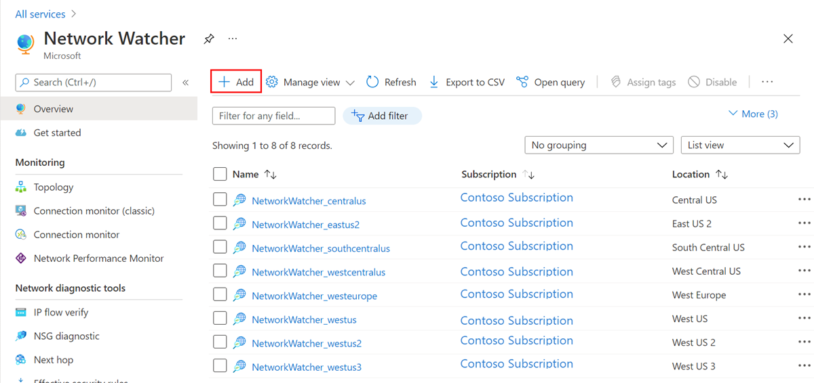
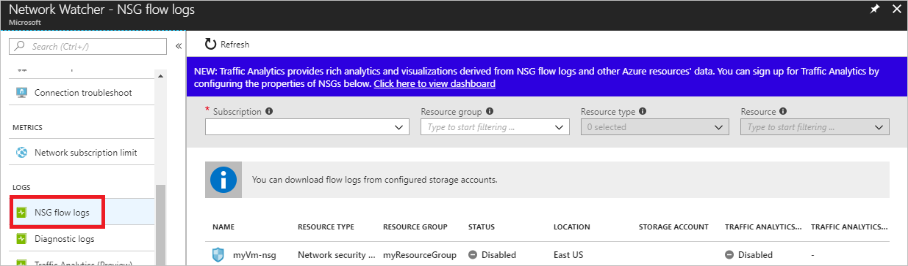
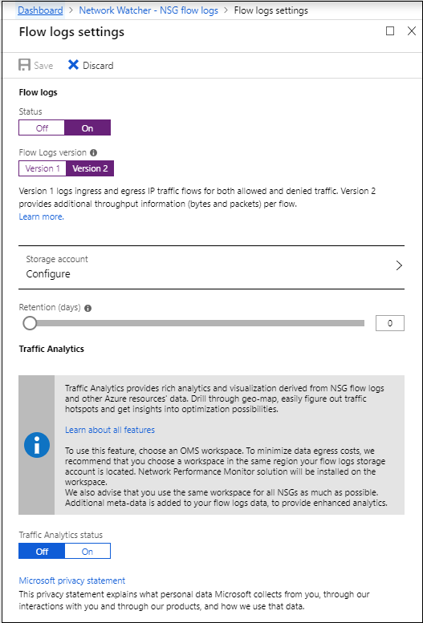
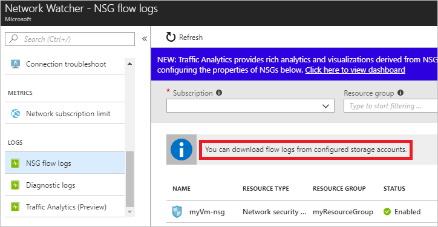
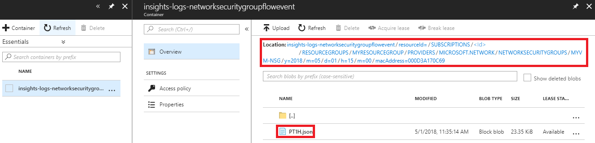

# Tutorial: Log network traffic to and from a virtual machine using the Azure portal

A network security group (NSG) enables you to filter inbound traffic to, and outbound traffic from, a virtual machine (VM). You can log network traffic that flows through an NSG with Network Watcher's NSG flow log capability. In this tutorial, you learn how to:

> [!div class="checklist"]
> * Create a VM with a network security group
> * Enable Network Watcher and register the Microsoft.Insights provider
> * Enable a traffic flow log for an NSG, using Network Watcher's NSG flow log capability
> * Download logged data
> * View logged data

If you don't have an Azure subscription, create a [free account](https://azure.microsoft.com/free/?WT.mc_id=A261C142F) before you begin.

## Create a VM

1. Select **+ Create a resource** found on the upper, left corner of the Azure portal.
2. Select **Compute**, and then select **Windows Server 2016 Datacenter** or a version of **Ubuntu Server**.
3. Enter, or select, the following information, accept the defaults for the remaining settings, and then select **OK**:

    |Setting|Value|
    |---|---|
    |Name|myVm|
    |User name| Enter a user name of your choosing.|
    |Password| Enter a password of your choosing. The password must be at least 12 characters long and meet the [defined complexity requirements](../virtual-machines/windows/faq.md?toc=%2fazure%2fnetwork-watcher%2ftoc.json#what-are-the-password-requirements-when-creating-a-vm).|
    |Subscription| Select your subscription.|
    |Resource group| Select **Create new** and enter **myResourceGroup**.|
    |Location| Select **East US**|

4. Select a size for the VM and then select **Select**.
5. Under **Settings**, accept all the defaults, and select **OK**.
6. Under **Create** of the **Summary**, select **Create** to start VM deployment. The VM takes a few minutes to deploy. Wait for the VM to finish deploying before continuing with the remaining steps.

The VM takes a few minutes to create. Don't continue with remaining steps until the VM has finished creating. While the portal creates the VM, it also creates a network security group with the name **myVm-nsg**, and associates it to the network interface for the VM.

## Enable Network Watcher

If you already have a network watcher enabled in the East US region, skip to [Register Insights provider](#register-insights-provider).

1. In the portal, select **All services**. In the **Filter box**, enter *Network Watcher*. When **Network Watcher** appears in the results, select it.
2. Select **Regions**, to expand it, and then select **...** to the right of **East US**, as shown in the following picture:

    

3. Select **Enable Network Watcher**.

## Register Insights provider

NSG flow logging requires the **Microsoft.Insights** provider. To register the provider, complete the following steps:

1. In the top, left corner of portal, select **All services**. In the Filter box, type *Subscriptions*. When **Subscriptions** appear in the search results, select it.
2. From the list of subscriptions, select the subscription you want to enable the provider for.
3. Select **Resource providers**, under **SETTINGS**.
4. Confirm that the **STATUS** for the **microsoft.insights** provider is **Registered**, as shown in the picture that follows. If the status is **Unregistered**, then select **Register**, to the right of the provider.

    

## Enable NSG flow log

1. NSG flow log data is written to an Azure Storage account. To create an Azure Storage account, select **+ Create a resource** at the top, left corner of the portal.
2. Select **Storage**, then select **Storage account - blob, file, table, queue**.
3. Enter, or select the following information, accept the remaining defaults, and then select **Create**.

    | Setting        | Value                                                        |
    | ---            | ---   |
    | Name           | 3-24 characters in length, can only contain lowercase letters and numbers, and must be unique across all Azure Storage accounts.                                                               |
    | Location       | Select **East US**                                           |
    | Resource group | Select **Use existing**, and then select **myResourceGroup** |

    The storage account may take around minute to create. Don't continue with remaining steps until the storage account is created. If you use an existing storage account instead of creating one, ensure you select a storage account that has **All networks** (default) selected for **Firewalls and virtual networks**, under the **SETTINGS** for the storage account.
    
    > [!NOTE]
    > While Microsoft.Insight and Microsoft.Network providers are currently supported as trusted Microsoft Services for Azure Storage, NSG Flow logs is still not fully onboarded. To enable NSG Flow logging, **All Networks** must still be selected until this feature is fully onboarded. 
4. In the top, left corner of portal, select **All services**. In the **Filter** box, type *Network Watcher*. When **Network Watcher** appears in the search results, select it.
5. Under **LOGS**, select **NSG flow logs**, as shown in the following picture:

    

6. From the list of NSGs, select the NSG named **myVm-nsg**.
7. Under **Flow logs settings**, select **On**.
8. Select the flow logging version. Version 2 contains flow-session statistics (Bytes and Packets)

   

9. Select the storage account that you created in step 3.
10. Set **Retention (days)** to 5, and then select **Save**.

## Download flow log

1. From Network Watcher, in the portal, select **NSG flow logs** under **LOGS**.
2. Select **You can download flow logs from configured storage accounts**, as shown in the following picture:

   

3. Select the storage account that you configured in step 2 of [Enable NSG flow log](#enable-nsg-flow-log).
4. Under **Blob service**, select **Blobs**, and then select the **insights-logs-networksecuritygroupflowevent** container.
5. In the container, navigate the folder hierarchy until you get to a PT1H.json file, as shown in the picture that follows. Log files are written to a folder hierarchy that follows the following naming convention:
   https://{storageAccountName}.blob.core.windows.net/insights-logs-networksecuritygroupflowevent/resourceId=/SUBSCRIPTIONS/{subscriptionID}/RESOURCEGROUPS/{resourceGroupName}/PROVIDERS/MICROSOFT.NETWORK/NETWORKSECURITYGROUPS/{nsgName}/y={year}/m={month}/d={day}/h={hour}/m=00/macAddress={macAddress}/PT1H.json

   

6. Select **...** to the right of the PT1H.json file and select **Download**.

## View flow log

The following json is an example of what you'll see in the PT1H.json file for each flow that data is logged for:

### Version 1 flow log event
```json
{
    "time": "2018-05-01T15:00:02.1713710Z",
    "systemId": "<Id>",
    "category": "NetworkSecurityGroupFlowEvent",
    "resourceId": "/SUBSCRIPTIONS/<Id>/RESOURCEGROUPS/MYRESOURCEGROUP/PROVIDERS/MICROSOFT.NETWORK/NETWORKSECURITYGROUPS/MYVM-NSG",
    "operationName": "NetworkSecurityGroupFlowEvents",
    "properties": {
        "Version": 1,
        "flows": [
            {
                "rule": "UserRule_default-allow-rdp",
                "flows": [
                    {
                        "mac": "000D3A170C69",
                        "flowTuples": [
                            "1525186745,192.168.1.4,10.0.0.4,55960,3389,T,I,A"
                        ]
                    }
                ]
            }
        ]
    }
}
```
### Version 2 flow log event
```json
{
    "time": "2018-11-13T12:00:35.3899262Z",
    "systemId": "a0fca5ce-022c-47b1-9735-89943b42f2fa",
    "category": "NetworkSecurityGroupFlowEvent",
    "resourceId": "/SUBSCRIPTIONS/00000000-0000-0000-0000-000000000000/RESOURCEGROUPS/FABRIKAMRG/PROVIDERS/MICROSOFT.NETWORK/NETWORKSECURITYGROUPS/FABRIAKMVM1-NSG",
    "operationName": "NetworkSecurityGroupFlowEvents",
    "properties": {
        "Version": 2,
        "flows": [
            {
                "rule": "DefaultRule_DenyAllInBound",
                "flows": [
                    {
                        "mac": "000D3AF87856",
                        "flowTuples": [
                            "1542110402,94.102.49.190,10.5.16.4,28746,443,U,I,D,B,,,,",
                            "1542110424,176.119.4.10,10.5.16.4,56509,59336,T,I,D,B,,,,",
                            "1542110432,167.99.86.8,10.5.16.4,48495,8088,T,I,D,B,,,,"
                        ]
                    }
                ]
            },
            {
                "rule": "DefaultRule_AllowInternetOutBound",
                "flows": [
                    {
                        "mac": "000D3AF87856",
                        "flowTuples": [
                            "1542110377,10.5.16.4,13.67.143.118,59831,443,T,O,A,B,,,,",
                            "1542110379,10.5.16.4,13.67.143.117,59932,443,T,O,A,E,1,66,1,66",
                            "1542110379,10.5.16.4,13.67.143.115,44931,443,T,O,A,C,30,16978,24,14008",
                            "1542110406,10.5.16.4,40.71.12.225,59929,443,T,O,A,E,15,8489,12,7054"
                        ]
                    }
                ]
            }
        ]
    }
}
```

The value for **mac** in the previous output is the MAC address of the network interface that was created when the VM was created. The comma-separated information for **flowTuples**, is as follows:

| Example data | What data represents   | Explanation                                                                              |
| ---          | ---                    | ---                                                                                      |
| 1542110377   | Time stamp             | The time stamp of when the flow occurred, in UNIX EPOCH format. In the previous example, the date converts to May 1, 2018 at 2:59:05 PM GMT.                                                                                    |
| 10.0.0.4  | Source IP address      | The source IP address that the flow originated from. 10.0.0.4 is the private IP address of the VM you created in [Create a VM](#create-a-vm).
| 13.67.143.118     | Destination IP address | The destination IP address that the flow was destined to.                                                                                  |
| 44931        | Source port            | The source port that the flow originated from.                                           |
| 443         | Destination port       | The destination port that the flow was destined to. Since the traffic was destined to port 443, the rule named **UserRule_default-allow-rdp**, in the log file processed the flow.                                                |
| T            | Protocol               | Whether the protocol of the flow was TCP (T) or UDP (U).                                  |
| O            | Direction              | Whether the traffic was inbound (I) or outbound (O).                                     |
| A            | Action                 | Whether the traffic was allowed (A) or denied (D).  
| C            | Flow State **Version 2 Only** | Captures the state of the flow. Possible states are **B**: Begin, when a flow is created. Statistics aren't provided. **C**: Continuing for an ongoing flow. Statistics are provided at 5-minute intervals. **E**: End, when a flow is terminated. Statistics are provided. |
| 30 | Packets sent - Source to destination **Version 2 Only** | The total number of TCP or UDP packets sent from source to destination since last update. |
| 16978 | Bytes sent - Source to destination **Version 2 Only** | The total number of TCP or UDP packet bytes sent from source to destination since last update. Packet bytes include the packet header and payload. | 
| 24 | Packets sent - Destination to source **Version 2 Only** | The total number of TCP or UDP packets sent from destination to source since last update. |
| 14008| Bytes sent - Destination to source **Version 2 Only** | The total number of TCP and UDP packet bytes sent from destination to source since last update. Packet bytes include packet header and payload.|

## Next steps

In this tutorial, you learned how to enable NSG flow logging for an NSG. You also learned how to download and view data logged in a file. The raw data in the json file can be difficult to interpret. To visualize the data, you can use Network Watcher [traffic analytics](traffic-analytics.md), Microsoft [PowerBI](network-watcher-visualize-nsg-flow-logs-power-bi.md), and other tools.
