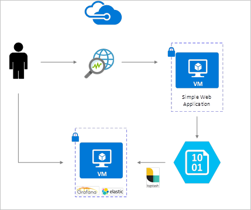
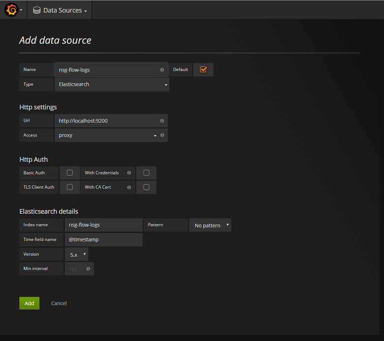
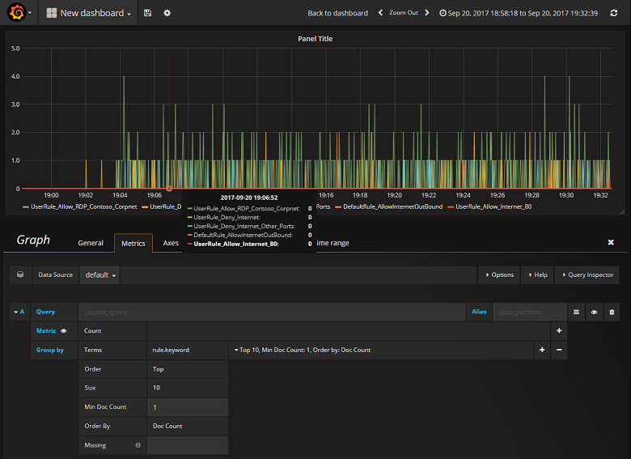
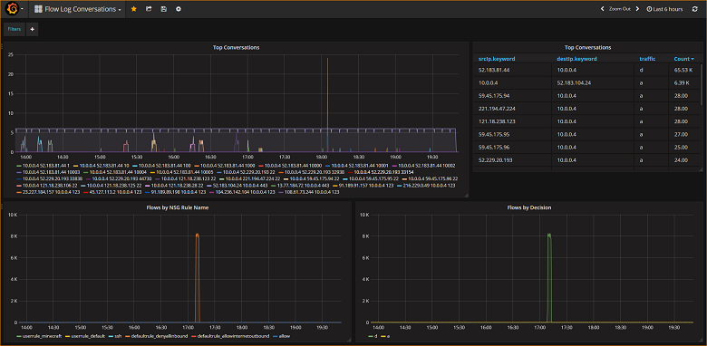

# Manage and analyze Network Security Group flow logs using Network Watcher and Grafana

[Network Security Group (NSG) flow logs](network-watcher-nsg-flow-logging-overview.md) provide information that can be used to understand ingress and egress IP traffic on network interfaces. These flow logs show outbound and inbound flows on a per NSG rule basis, the NIC the flow applies to, 5-tuple information about the flow (Source/Destination IP, Source/Destination Port, Protocol), and if the traffic was allowed or denied.

You can have many NSGs in your network with flow logging enabled. This amount of logging data makes it cumbersome to parse and gain insights from your logs. This article provides a solution to centrally manage these NSG flow logs using Grafana, an open source graphing tool, ElasticSearch, a distributed search and analytics engine, and Logstash, which is an open source server-side data processing pipeline.  

## Scenario

NSG flow logs are enabled using Network Watcher and are stored in Azure blob storage. A Logstash plugin is used to connect and process flow logs from blob storage and send them to ElasticSearch.  Once the flow logs are stored in ElasticSearch, they can be analyzed and visualized into customized dashboards in Grafana.



## Installation steps

### Enable Network Security Group flow logging

For this scenario, you must have Network Security Group Flow Logging enabled on at least one Network Security Group in your account. For instructions on enabling Network Security Flow Logs, refer to the following article [Introduction to flow logging for Network Security Groups](network-watcher-nsg-flow-logging-overview.md).

### Setup considerations

In this example Grafana, ElasticSearch, and Logstash are configured on an Ubuntu 16.04 LTS Server deployed in Azure. This minimal setup is used for running all three components – they are all running on the same VM. This setup should only be used for testing and non-critical workloads. Logstash, Elasticsearch, and Grafana can all be architected to scale independently across many instances. For more information, see the documentation for each of these components.

### Install Logstash

You use Logstash to flatten the JSON formatted flow logs to a flow tuple level.

1. To install Logstash, run the following commands:

    ```bash
    curl -L -O https://artifacts.elastic.co/downloads/logstash/logstash-5.2.0.deb
    sudo dpkg -i logstash-5.2.0.deb
    ```

2. Configure Logstash to parse the flow logs and send them to ElasticSearch. Create a Logstash.conf file using:

    ```bash
    sudo touch /etc/logstash/conf.d/logstash.conf
    ```

3. Add the following content to the file. Change the storage account name and access key to reflect your storage account details:

   ```bash
    input {
      azureblob
      {
        storage_account_name => "mystorageaccount"
        storage_access_key => "VGhpcyBpcyBhIGZha2Uga2V5Lg=="
        container => "insights-logs-networksecuritygroupflowevent"
        codec => "json"
        # Refer https://docs.microsoft.com/azure/network-watcher/network-watcher-read-nsg-flow-logs
        # Typical numbers could be 21/9 or 12/2 depends on the nsg log file types
        file_head_bytes => 12
        file_tail_bytes => 2
        # Enable / tweak these settings when event is too big for codec to handle.
        # break_json_down_policy => "with_head_tail"
        # break_json_batch_count => 2
      }
    }
    filter {
      split { field => "[records]" }
      split { field => "[records][properties][flows]"}
      split { field => "[records][properties][flows][flows]"}
      split { field => "[records][properties][flows][flows][flowTuples]"}

      mutate {
        split => { "[records][resourceId]" => "/"}
        add_field => { "Subscription" => "%{[records][resourceId][2]}"
          "ResourceGroup" => "%{[records][resourceId][4]}"
          "NetworkSecurityGroup" => "%{[records][resourceId][8]}" 
        }
        convert => {"Subscription" => "string"}
        convert => {"ResourceGroup" => "string"}
        convert => {"NetworkSecurityGroup" => "string"}
        split => { "[records][properties][flows][flows][flowTuples]" => "," }
        add_field => {
          "unixtimestamp" => "%{[records][properties][flows][flows][flowTuples][0]}"
          "srcIp" => "%{[records][properties][flows][flows][flowTuples][1]}"
          "destIp" => "%{[records][properties][flows][flows][flowTuples][2]}"
          "srcPort" => "%{[records][properties][flows][flows][flowTuples][3]}"
          "destPort" => "%{[records][properties][flows][flows][flowTuples][4]}"
          "protocol" => "%{[records][properties][flows][flows][flowTuples][5]}"
          "trafficflow" => "%{[records][properties][flows][flows][flowTuples][6]}"
          "traffic" => "%{[records][properties][flows][flows][flowTuples][7]}"
	  "flowstate" => "%{[records][properties][flows][flows][flowTuples][8]}"
	  "packetsSourceToDest" => "%{[records][properties][flows][flows][flowTuples][9]}"
	  "bytesSentSourceToDest" => "%{[records][properties][flows][flows][flowTuples][10]}"
	  "packetsDestToSource" => "%{[records][properties][flows][flows][flowTuples][11]}"
	  "bytesSentDestToSource" => "%{[records][properties][flows][flows][flowTuples][12]}"
        }
        add_field => {
          "time" => "%{[records][time]}"
          "systemId" => "%{[records][systemId]}"
          "category" => "%{[records][category]}"
          "resourceId" => "%{[records][resourceId]}"
          "operationName" => "%{[records][operationName}}"
          "Version" => "%{[records][properties][Version}}"
          "rule" => "%{[records][properties][flows][rule]}"
          "mac" => "%{[records][properties][flows][flows][mac]}"
        }
        convert => {"unixtimestamp" => "integer"}
        convert => {"srcPort" => "integer"}
        convert => {"destPort" => "integer"}
        add_field => { "message" => "%{Message}" }        
      }
 
      date {
        match => ["unixtimestamp" , "UNIX"]
      }
    }
    output {
      stdout { codec => rubydebug }
      elasticsearch {
	    hosts => "localhost"
	    index => "nsg-flow-logs"
      }
    }
   ```

The Logstash config file provided is composed of three parts: the input, filter, and output.
The input section designates the input source of the logs that Logstash will process – in this case we are going to use an “azureblob” input plugin (installed in the next steps) that will allow us to access the NSG flow log JSON files stored in blob storage. 

The filter section then flattens each flow log file so that each individual flow tuple and its associated properties becomes a separate Logstash event.

Finally, the output section forwards each Logstash event to the ElasticSearch server. Feel free to modify the Logstash config file to suit your specific needs.

### Install the Logstash input plugin for Azure Blob storage

This Logstash plugin enables you to directly access the flow logs from their designated blob storage account. To install this plug in, from the default Logstash installation directory (in this case /usr/share/logstash/bin) run the command:

```bash
cd /usr/share/logstash/bin
sudo ./logstash-plugin install logstash-input-azureblob
```

For more information about this plug in, see [Logstash input plugin for Azure Storage Blobs](https://github.com/Azure/azure-diagnostics-tools/tree/master/Logstash/logstash-input-azureblob).

### Install ElasticSearch

You can use the following script to install ElasticSearch. For information about installing ElasticSearch, see [Elastic Stack](https://www.elastic.co/guide/en/elastic-stack/current/index.html).

```bash
apt-get install apt-transport-https openjdk-8-jre-headless uuid-runtime pwgen -y
wget -qO - https://packages.elastic.co/GPG-KEY-elasticsearch | apt-key add -
echo "deb https://packages.elastic.co/elasticsearch/5.x/debian stable main" | tee -a /etc/apt/sources.list.d/elasticsearch-5.x.list
apt-get update && apt-get install elasticsearch
sed -i s/#cluster.name:.*/cluster.name:\ grafana/ /etc/elasticsearch/elasticsearch.yml
systemctl daemon-reload
systemctl enable elasticsearch.service
systemctl start elasticsearch.service
```

### Install Grafana

To install and run Grafana, run the following commands:

```bash
wget https://s3-us-west-2.amazonaws.com/grafana-releases/release/grafana_4.5.1_amd64.deb
sudo apt-get install -y adduser libfontconfig
sudo dpkg -i grafana_4.5.1_amd64.deb
sudo service grafana-server start
```

For additional installation information, see [Installing on Debian / Ubuntu](https://docs.grafana.org/installation/debian/).

#### Add the ElasticSearch server as a data source

Next, you need to add the ElasticSearch index containing flow logs as a data source. You can add a data source by selecting **Add data source** and completing the form with the relevant information. A sample of this configuration can be found in the following screenshot:



#### Create a dashboard

Now that you have successfully configured Grafana to read from the ElasticSearch index containing NSG flow logs, you can create and personalize dashboards. To create a new dashboard, select **Create your first dashboard**. The following sample graph configuration shows flows segmented by NSG rule:



The following screenshot depicts a graph and chart showing the top flows and their frequency. Flows are also shown by NSG rule and flows by decision. Grafana is highly customizable so it's advisable that you create dashboards to suit your specific monitoring needs. The following example shows a typical dashboard:



## Conclusion

By integrating Network Watcher with ElasticSearch and Grafana, you now have a convenient and centralized way to manage and visualize NSG flow logs as well as other data. Grafana has a number of other powerful graphing features that can also be used to further manage flow logs and better understand your network traffic. Now that you have a Grafana instance set up and connected to Azure, feel free to continue to explore the other functionality that it offers.

## Next steps

- Learn more about using [Network Watcher](network-watcher-monitoring-overview.md).

