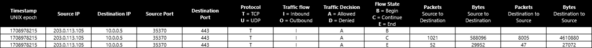

# Flow logging for network security groups

Network security group (NSG) flow logging is a feature of Azure Network Watcher that allows you to log information about IP traffic flowing through a [network security group](../virtual-network/network-security-groups-overview.md). Flow data is sent to Azure Storage from where you can access it and export it to any visualization tool, security information and event management (SIEM) solution, or intrusion detection system (IDS) of your choice.

:::image type="content" source="./media/nsg-flow-logs-overview/nsg-flow-logs-portal.png" alt-text="Screenshot showing Network Watcher NSG flow logs page in the Azure portal.":::

## Why use flow logs?

It's vital to monitor, manage, and know your own network so that you can protect and optimize it. You need to know the current state of the network, who's connecting, and where users are connecting from. You also need to know which ports are open to the internet, what network behavior is expected, what network behavior is irregular, and when sudden rises in traffic happen.

Flow logs are the source of truth for all network activity in your cloud environment. Whether you're in a startup that's trying to optimize resources or a large enterprise that's trying to detect intrusion, flow logs can help. You can use them for optimizing network flows, monitoring throughput, verifying compliance, detecting intrusions, and more.

## Common use cases

#### Network monitoring
- Identify unknown or undesired traffic.
- Monitor traffic levels and bandwidth consumption.
- Filter flow logs by IP and port to understand application behavior.
- Export flow logs to analytics and visualization tools of your choice to set up monitoring dashboards.

#### Usage monitoring and optimization
- Identify top talkers in your network.
- Combine with GeoIP data to identify cross-region traffic.
- Understand traffic growth for capacity forecasting.
- Use data to remove overly restrictive traffic rules.

#### Compliance
- Use flow data to verify network isolation and compliance with enterprise access rules.

#### Network forensics and security analysis
- Analyze network flows from compromised IPs and network interfaces.
- Export flow logs to any SIEM or IDS tool of your choice.

## How NSG flow logs work

Key properties of NSG flow logs include:

- Flow logs operate at Layer 4 of the Open Systems Interconnection (OSI) model and record all IP flows going in and out of a network security group.
- Logs are collected at 1-minute intervals through the Azure platform. They don't affect your Azure resources or network performance in any way.
- Logs are written in JSON format and show outbound and inbound flows per network security group rule.
- Each log record contains the network interface (NIC) that the flow applies to, 5-tuple information, the traffic decision, and (for version 2 only) throughput information.
- NSG flow logs have a retention feature that allows deleting the logs automatically up to a year after their creation.

> [!NOTE]
> Retention is available only if you use [general-purpose v2 storage accounts](../storage/common/storage-account-overview.md#types-of-storage-accounts). 

Core concepts for flow logs include:

- Software-defined networks are organized around virtual networks and subnets. You can manage the security of these virtual networks and subnets by using network security groups.
- A network security group contains *security rules* that allow or deny network traffic to or from the Azure resources that the network security group is connected to. A network security group can be associated with a subnet or a network interface of a virtual machine (VM). For more information, see [Network security group overview](../virtual-network/network-security-groups-overview.md?toc=%2fazure%2fnetwork-watcher%2ftoc.json).
- All traffic flows in your network are evaluated through the rules in the applicable network security group. The result of these evaluations is NSG flow logs. 
- NSG flow logs are collected through the Azure platform and don't require any change to your Azure resources.
- There are two types of network security group rules: terminating and non-terminating. Each has different logging behaviors:
  - *Deny* rules are terminating. The network security group that's denying the traffic logs it in the flow logs. Processing in this case stops after any NSG denies traffic.
  - *Allow* rules are non-terminating. If the network security group allows the traffic, processing continues to the next network security group. The last network security group that allows traffic logs the traffic to the flow logs.
- NSG flow logs are written to storage accounts. You can export, process, analyze, and visualize NSG flow logs by using tools like Network Watcher traffic analytics, Splunk, Grafana, and Stealthwatch.

## Log format

NSG flow logs include the following properties:

* `time`: Time in UTC when the event was logged.
* `systemId`: System ID of the network security group.
* `category`: Category of the event. The category is always `NetworkSecurityGroupFlowEvent`.
* `resourceid`: Resource ID of the network security group.
* `operationName`: Always `NetworkSecurityGroupFlowEvents`.
* `properties`: Collection of properties of the flow:
    * `Version`: Version number of the flow log's event schema.
    * `flows`: Collection of flows. This property has multiple entries for different rules.
        * `rule`: Rule for which the flows are listed.
        * `flows`: Collection of flows.
            * `mac`: MAC address of the NIC for the VM where the flow was collected.
            * `flowTuples`: String that contains multiple properties for the flow tuple in a comma-separated format:
                * `Time stamp`: Time stamp of when the flow occurred in UNIX epoch format.
                * `Source IP`: Source IP address.
                * `Destination IP`: Destination IP address.
                * `Source port`: Source port.
                * `Destination port`: Destination port.
                * `Protocol`: Protocol of the flow. Valid values are `T` for TCP and `U` for UDP.
                * `Traffic flow`: Direction of the traffic flow. Valid values are `I` for inbound and `O` for outbound.
                * `Traffic decision`: Whether traffic was allowed or denied. Valid values are `A` for allowed and `D` for denied.
                * `Flow State - Version 2 Only`: State of the flow. Possible states are:
                    * `B`: Begin, when a flow is created. Statistics aren't provided.
                    * `C`: Continuing for an ongoing flow. Statistics are provided at 5-minute intervals.
                    * `E`: End, when a flow is terminated. Statistics are provided.
                * `Packets sent - Version 2 Only`: Total number of TCP packets sent from source to destination since the last update.
                * `Bytes sent - Version 2 Only`: Total number of TCP packet bytes sent from source to destination since the last update. Packet bytes include the packet header and payload.
                * `Packets received - Version 2 Only`: Total number of TCP packets sent from destination to source since the last update.
                * `Bytes received - Version 2 Only`: Total number of TCP packet bytes sent from destination to source since the last update. Packet bytes include packet header and payload.

Version 2 of NSG flow logs introduces the concept of flow state. You can configure which version of flow logs you receive.

Flow state `B` is recorded when a flow is initiated. Flow state `C` and flow state `E` are states that mark the continuation of a flow and flow termination, respectively. Both `C` and `E` states contain traffic bandwidth information.

### Sample log records

In the following examples of NSG flow log, multiple records follow the property list described earlier.

> [!NOTE]
> Values in the `flowTuples` property are a comma-separated list.

#### Version 1

Here's an example format of a version 1 NSG flow log:

```json
{
    "records": [
        {
            "time": "2017-02-16T22:00:32.8950000Z",
            "systemId": "2c002c16-72f3-4dc5-b391-3444c3527434",
            "category": "NetworkSecurityGroupFlowEvent",
            "resourceId": "/SUBSCRIPTIONS/00000000-0000-0000-0000-000000000000/RESOURCEGROUPS/FABRIKAMRG/PROVIDERS/MICROSOFT.NETWORK/NETWORKSECURITYGROUPS/FABRIAKMVM1-NSG",
            "operationName": "NetworkSecurityGroupFlowEvents",
            "properties": {
                "Version": 1,
                "flows": [
                    {
                        "rule": "DefaultRule_DenyAllInBound",
                        "flows": [
                            {
                                "mac": "000D3AF8801A",
                                "flowTuples": [
                                    "1487282421,42.119.146.95,10.1.0.4,51529,5358,T,I,D"
                                ]
                            }
                        ]
                    },
                    {
                        "rule": "UserRule_default-allow-rdp",
                        "flows": [
                            {
                                "mac": "000D3AF8801A",
                                "flowTuples": [
                                    "1487282370,163.28.66.17,10.1.0.4,61771,3389,T,I,A",
                                    "1487282393,5.39.218.34,10.1.0.4,58596,3389,T,I,A",
                                    "1487282393,91.224.160.154,10.1.0.4,61540,3389,T,I,A",
                                    "1487282423,13.76.89.229,10.1.0.4,53163,3389,T,I,A"
                                ]
                            }
                        ]
                    }
                ]
            }
        },
        {
            "time": "2017-02-16T22:01:32.8960000Z",
            "systemId": "2c002c16-72f3-4dc5-b391-3444c3527434",
            "category": "NetworkSecurityGroupFlowEvent",
            "resourceId": "/SUBSCRIPTIONS/00000000-0000-0000-0000-000000000000/RESOURCEGROUPS/FABRIKAMRG/PROVIDERS/MICROSOFT.NETWORK/NETWORKSECURITYGROUPS/FABRIAKMVM1-NSG",
            "operationName": "NetworkSecurityGroupFlowEvents",
            "properties": {
                "Version": 1,
                "flows": [
                    {
                        "rule": "DefaultRule_DenyAllInBound",
                        "flows": [
                            {
                                "mac": "000D3AF8801A",
                                "flowTuples": [
                                    "1487282481,195.78.210.194,10.1.0.4,53,1732,U,I,D"
                                ]
                            }
                        ]
                    },
                    {
                        "rule": "UserRule_default-allow-rdp",
                        "flows": [
                            {
                                "mac": "000D3AF8801A",
                                "flowTuples": [
                                    "1487282435,61.129.251.68,10.1.0.4,57776,3389,T,I,A",
                                    "1487282454,84.25.174.170,10.1.0.4,59085,3389,T,I,A",
                                    "1487282477,77.68.9.50,10.1.0.4,65078,3389,T,I,A"
                                ]
                            }
                        ]
                    }
                ]
            }
        },
        {
            "records": [
                {
                    "time": "2017-02-16T22:00:32.8950000Z",
                    "systemId": "2c002c16-72f3-4dc5-b391-3444c3527434",
                    "category": "NetworkSecurityGroupFlowEvent",
                    "resourceId": "/SUBSCRIPTIONS/00000000-0000-0000-0000-000000000000/RESOURCEGROUPS/FABRIKAMRG/PROVIDERS/MICROSOFT.NETWORK/NETWORKSECURITYGROUPS/FABRIAKMVM1-NSG",
                    "operationName": "NetworkSecurityGroupFlowEvents",
                    "properties": {
                        "Version": 1,
                        "flows": [
                            {
                                "rule": "DefaultRule_DenyAllInBound",
                                "flows": [
                                    {
                                        "mac": "000D3AF8801A",
                                        "flowTuples": [
                                            "1487282421,42.119.146.95,10.1.0.4,51529,5358,T,I,D"
                                        ]
                                    }
                                ]
                            },
                            {
                                "rule": "UserRule_default-allow-rdp",
                                "flows": [
                                    {
                                        "mac": "000D3AF8801A",
                                        "flowTuples": [
                                            "1487282370,163.28.66.17,10.1.0.4,61771,3389,T,I,A",
                                            "1487282393,5.39.218.34,10.1.0.4,58596,3389,T,I,A",
                                            "1487282393,91.224.160.154,10.1.0.4,61540,3389,T,I,A",
                                            "1487282423,13.76.89.229,10.1.0.4,53163,3389,T,I,A"
                                        ]
                                    }
                                ]
                            }
                        ]
                    }
                },
                {
                    "time": "2017-02-16T22:01:32.8960000Z",
                    "systemId": "2c002c16-72f3-4dc5-b391-3444c3527434",
                    "category": "NetworkSecurityGroupFlowEvent",
                    "resourceId": "/SUBSCRIPTIONS/00000000-0000-0000-0000-000000000000/RESOURCEGROUPS/FABRIKAMRG/PROVIDERS/MICROSOFT.NETWORK/NETWORKSECURITYGROUPS/FABRIAKMVM1-NSG",
                    "operationName": "NetworkSecurityGroupFlowEvents",
                    "properties": {
                        "Version": 1,
                        "flows": [
                            {
                                "rule": "DefaultRule_DenyAllInBound",
                                "flows": [
                                    {
                                        "mac": "000D3AF8801A",
                                        "flowTuples": [
                                            "1487282481,195.78.210.194,10.1.0.4,53,1732,U,I,D"
                                        ]
                                    }
                                ]
                            },
                            {
                                "rule": "UserRule_default-allow-rdp",
                                "flows": [
                                    {
                                        "mac": "000D3AF8801A",
                                        "flowTuples": [
                                            "1487282435,61.129.251.68,10.1.0.4,57776,3389,T,I,A",
                                            "1487282454,84.25.174.170,10.1.0.4,59085,3389,T,I,A",
                                            "1487282477,77.68.9.50,10.1.0.4,65078,3389,T,I,A"
                                        ]
                                    }
                                ]
                            }
                        ]
                    }
                },
                {
                    "time": "2017-02-16T22:02:32.9040000Z",
                    "systemId": "2c002c16-72f3-4dc5-b391-3444c3527434",
                    "category": "NetworkSecurityGroupFlowEvent",
                    "resourceId": "/SUBSCRIPTIONS/00000000-0000-0000-0000-000000000000/RESOURCEGROUPS/FABRIKAMRG/PROVIDERS/MICROSOFT.NETWORK/NETWORKSECURITYGROUPS/FABRIAKMVM1-NSG",
                    "operationName": "NetworkSecurityGroupFlowEvents",
                    "properties": {
                        "Version": 1,
                        "flows": [
                            {
                                "rule": "DefaultRule_DenyAllInBound",
                                "flows": [
                                    {
                                        "mac": "000D3AF8801A",
                                        "flowTuples": [
                                            "1487282492,175.182.69.29,10.1.0.4,28918,5358,T,I,D",
                                            "1487282505,71.6.216.55,10.1.0.4,8080,8080,T,I,D"
                                        ]
                                    }
                                ]
                            },
                            {
                                "rule": "UserRule_default-allow-rdp",
                                "flows": [
                                    {
                                        "mac": "000D3AF8801A",
                                        "flowTuples": [
                                            "1487282512,91.224.160.154,10.1.0.4,59046,3389,T,I,A"
                                        ]
                                    }
                                ]
                            }
                        ]
                    }
                }
            ]
        }
    ]
}
        
        
```

#### Version 2

Here's an example format of a version 2 NSG flow log:

```json
 {
    "records": [
        {
            "time": "2018-11-13T12:00:35.3899262Z",
            "systemId": "a0fca5ce-022c-47b1-9735-89943b42f2fa",
            "category": "NetworkSecurityGroupFlowEvent",
            "resourceId": "/SUBSCRIPTIONS/00000000-0000-0000-0000-000000000000/RESOURCEGROUPS/FABRIKAMRG/PROVIDERS/MICROSOFT.NETWORK/NETWORKSECURITYGROUPS/FABRIAKMVM1-NSG",
            "operationName": "NetworkSecurityGroupFlowEvents",
            "properties": {
                "Version": 2,
                "flows": [
                    {
                        "rule": "DefaultRule_DenyAllInBound",
                        "flows": [
                            {
                                "mac": "000D3AF87856",
                                "flowTuples": [
                                    "1542110402,94.102.49.190,10.5.16.4,28746,443,U,I,D,B,,,,",
                                    "1542110424,176.119.4.10,10.5.16.4,56509,59336,T,I,D,B,,,,",
                                    "1542110432,167.99.86.8,10.5.16.4,48495,8088,T,I,D,B,,,,"
                                ]
                            }
                        ]
                    },
                    {
                        "rule": "DefaultRule_AllowInternetOutBound",
                        "flows": [
                            {
                                "mac": "000D3AF87856",
                                "flowTuples": [
                                    "1542110377,10.5.16.4,13.67.143.118,59831,443,T,O,A,B,,,,",
                                    "1542110379,10.5.16.4,13.67.143.117,59932,443,T,O,A,E,1,66,1,66",
                                    "1542110379,10.5.16.4,13.67.143.115,44931,443,T,O,A,C,30,16978,24,14008",
                                    "1542110406,10.5.16.4,40.71.12.225,59929,443,T,O,A,E,15,8489,12,7054"
                                ]
                            }
                        ]
                    }
                ]
            }
        },
        {
            "time": "2018-11-13T12:01:35.3918317Z",
            "systemId": "a0fca5ce-022c-47b1-9735-89943b42f2fa",
            "category": "NetworkSecurityGroupFlowEvent",
            "resourceId": "/SUBSCRIPTIONS/00000000-0000-0000-0000-000000000000/RESOURCEGROUPS/FABRIKAMRG/PROVIDERS/MICROSOFT.NETWORK/NETWORKSECURITYGROUPS/FABRIAKMVM1-NSG",
            "operationName": "NetworkSecurityGroupFlowEvents",
            "properties": {
                "Version": 2,
                "flows": [
                    {
                        "rule": "DefaultRule_DenyAllInBound",
                        "flows": [
                            {
                                "mac": "000D3AF87856",
                                "flowTuples": [
                                    "1542110437,125.64.94.197,10.5.16.4,59752,18264,T,I,D,B,,,,",
                                    "1542110475,80.211.72.221,10.5.16.4,37433,8088,T,I,D,B,,,,",
                                    "1542110487,46.101.199.124,10.5.16.4,60577,8088,T,I,D,B,,,,",
                                    "1542110490,176.119.4.30,10.5.16.4,57067,52801,T,I,D,B,,,,"
                                ]
                            }
                        ]
                    }
                ]
            }
        }
    ]
}
        
```

### Log tuple and bandwidth calculation



Here's an example bandwidth calculation for flow tuples from a TCP conversation between 185.170.185.105:35370 and 10.2.0.4:23:

`1493763938,185.170.185.105,10.2.0.4,35370,23,T,I,A,B,,,,`
`1493695838,185.170.185.105,10.2.0.4,35370,23,T,I,A,C,1021,588096,8005,4610880`
`1493696138,185.170.185.105,10.2.0.4,35370,23,T,I,A,E,52,29952,47,27072`

For continuation (`C`) and end (`E`) flow states, byte and packet counts are aggregate counts from the time of the previous flow's tuple record. In the example conversation, the total number of packets transferred is 1021+52+8005+47 = 9125. The total number of bytes transferred is 588096+29952+4610880+27072 = 5256000.

## Managing NSG flow logs

To learn how to create, change, disable, or delete NSG flow logs, see one of the following guides:

- [Azure portal](nsg-flow-logs-portal.md)
- [PowerShell](nsg-flow-logs-powershell.md)
- [Azure CLI](nsg-flow-logs-cli.md)
- [REST API](nsg-flow-logs-rest.md)
- [Azure Resource Manager](nsg-flow-logs-azure-resource-manager.md)

## Working with flow logs

### Read and export flow logs

To learn how to read and export NSG flow logs, see one of the following guides:

- [Download and view flow logs from the portal](nsg-flow-logs-portal.md#download-a-flow-log)
- [Read flow logs by using PowerShell functions](network-watcher-read-nsg-flow-logs.md)
- [Export NSG flow logs to Splunk](https://www.splunk.com/en_us/blog/platform/splunking-azure-nsg-flow-logs.html)

NSG flow log files are stored in a storage account at the following path:

```
https://{storageAccountName}.blob.core.windows.net/insights-logs-networksecuritygroupflowevent/resourceId=/SUBSCRIPTIONS/{subscriptionID}/RESOURCEGROUPS/{resourceGroupName}/PROVIDERS/MICROSOFT.NETWORK/NETWORKSECURITYGROUPS/{nsgName}/y={year}/m={month}/d={day}/h={hour}/m=00/macAddress={macAddress}/PT1H.json
```

### Visualize flow logs

To learn how to visualize NSG flow logs, see one of the following guides:

- [Visualize NSG flow logs using Network Watcher traffic analytics](./traffic-analytics.md)
- [Visualize NSG flow logs using Power BI](./network-watcher-visualize-nsg-flow-logs-power-bi.md)
- [Visualize NSG flow logs using Elastic Stack](./network-watcher-visualize-nsg-flow-logs-open-source-tools.md)
- [Manage and analyze NSG flow logs using Grafana](./network-watcher-nsg-grafana.md)
- [Manage and analyze NSG flow logs using Graylog](./network-watcher-analyze-nsg-flow-logs-graylog.md)

## Considerations for NSG flow logs

### Storage account

- **Location**: The storage account must be in the same region as the network security group.
- **Subscription**: The storage account must be in the same subscription of the network security group or in a subscription associated with the same Microsoft Entra tenant of the network security group's subscription.
- **Performance tier**: The storage account must be standard. Premium storage accounts aren't supported.
- **Self-managed key rotation**: If you change or rotate the access keys to your storage account, NSG flow logs stop working. To fix this problem, you must disable and then re-enable NSG flow logs.

### Cost

NSG flow logging is billed on the volume of produced logs. High traffic volume can result in large flow-log volume, which increases the associated costs. 

NSG flow log pricing doesn't include the underlying costs of storage. Retaining NSG flow logs data forever or using the retention policy feature means incurring storage costs for extended periods of time.

### Non-default inbound TCP rules

Network security groups are implemented as a [stateful firewall](https://en.wikipedia.org/wiki/Stateful_firewall?oldformat=true). But because of current platform limitations, network security group non-default security rules that affect inbound TCP flows are implemented in a stateless way.

Flows affected by non-default inbound rules become non-terminating. Additionally, byte and packet counts aren't recorded for these flows. Because of those factors, the number of bytes and packets reported in NSG flow logs (and Network Watcher traffic analytics) could be different from actual numbers.

You can resolve this difference by setting the `FlowTimeoutInMinutes` property on the associated virtual networks to a non-null value. You can achieve default stateful behavior by setting `FlowTimeoutInMinutes` to 4 minutes. For long-running connections where you don't want flows to disconnect from a service or destination, you can set `FlowTimeoutInMinutes` to a value of up to 30 minutes. Use [Set-AzVirtualNetwork](/powershell/module/az.network/set-azvirtualnetwork) to set `FlowTimeoutInMinutes` property:

```azurepowershell-interactive
$virtualNetwork = Get-AzVirtualNetwork -Name 'myVNet' -ResourceGroupName 'myResourceGroup'
$virtualNetwork.FlowTimeoutInMinutes = 4
$virtualNetwork |  Set-AzVirtualNetwork
```

### Inbound flows logged from internet IPs to VMs without public IPs

Virtual machines (VMs) that don't have a public IP address associated with the NIC as an instance-level public IP, or that are part of a basic load balancer back-end pool, use [default SNAT](../load-balancer/load-balancer-outbound-connections.md). Azure assigns an IP address to those VMs to facilitate outbound connectivity. As a result, you might see flow log entries for flows from internet IP addresses, if the flow is destined to a port in the range of ports that are assigned for SNAT.

Although Azure doesn't allow these flows to the VM, the attempt is logged and appears in the Network Watcher NSG flow log by design. We recommend that you explicitly block unwanted inbound internet traffic with a network security group.

### Network security group on an ExpressRoute gateway subnet

We don't recommend that you log flows on an Azure ExpressRoute gateway subnet because traffic can bypass that type of gateway (for example, [FastPath](../expressroute/about-fastpath.md)). If an NSG is linked to an ExpressRoute gateway subnet and NSG flow logs are enabled, then outbound flows to virtual machines might not be captured. Such flows must be captured at the subnet or NIC of the VM.

### Traffic to a private endpoint

Traffic to private endpoints can only be captured at source VM. The traffic is recorded with source IP address of the VM and destination IP address of the private endpoint. Traffic can't be recorded at the private endpoint itself due to platform limitations. 

### Support for network security groups associated to Application Gateway v2 subnet

NSG flow logs for network security groups associated to Azure Application Gateway V2 subnet are currently [not supported](../application-gateway/application-gateway-faq.yml#are-nsg-flow-logs-supported-on-nsgs-associated-to-application-gateway-v2-subnet). NSG flow logs for network security groups associated to Application Gateway V1 subnet are supported.

### Incompatible services

Currently, these Azure services don't support NSG flow logs:

- [Azure Container Instances](../container-instances/container-instances-overview.md)
- [Azure Logic Apps](../logic-apps/logic-apps-overview.md) 
- [Azure Functions](../azure-functions/functions-overview.md)
- [Azure DNS Private Resolver](../dns/dns-private-resolver-overview.md)
- [App Service](../app-service/overview.md)
- [Azure Database for MariaDB](../mariadb/overview.md)
- [Azure Database for MySQL](../mysql/single-server/overview.md)
- [Azure Database for PostgreSQL](../postgresql/single-server/overview.md)

> [!NOTE]
> App services deployed under an Azure App Service plan don't support NSG flow logs. To learn more, see [How virtual network integration works](../app-service/overview-vnet-integration.md#how-regional-virtual-network-integration-works).

## Best practices

- **Enable NSG flow logs on critical subnets**: Flow logs should be enabled on all critical subnets in your subscription as an auditing and security best practice.

- **Enable NSG flow logs on all network security groups attached to a resource**: NSG flow logs are configured on network security groups. A flow is associated with only one network security group rule. In scenarios where you use multiple network security groups, we recommend enabling NSG flow logs on all network security groups applied at the resource's subnet and network interface (NIC) to ensure that all traffic is recorded. For more information, see [How network security groups filter network traffic](../virtual-network/network-security-group-how-it-works.md).

  Here are a few common scenarios:

  - **Multiple NICs at a virtual machine**: If multiple NICs are attached to a virtual machine, you must enable flow logs on all of them.
  - **Network security group at both the NIC and subnet levels**: If a network security group is configured at the NIC level and the subnet level, you must enable flow logs at both network security groups. The exact sequence of rule processing by network security groups at NIC and subnet levels is platform dependent and varies from case to case. Traffic flows are logged against the network security group that's processed last. The platform state changes the processing order. You have to check both of the flow logs.
  - **Azure Kubernetes Service (AKS) cluster subnet**: AKS adds a default network security group at the cluster subnet. You must enable NSG flow logs on this network security group.

- **Storage provisioning**: Provision storage in tune with the expected volume of flow logs.

- **Naming**: The network security group name must be up to 80 characters, and a network security group rule name must be up to 65 characters. If the names exceed their character limits, they might be truncated during logging.

## Troubleshooting common problems

### I can't enable NSG flow logs

You might get an *AuthorizationFailed* or *GatewayAuthenticationFailed* error, if you didn't enable the **Microsoft.Insights** resource provider on your subscription before trying to enable NSG flow logs. For more information, see [Register Insights provider](nsg-flow-logging.md#register-insights-provider).

### I enabled NSG flow logs but don't see data in my storage account

This problem might be related to:

- **Setup time**: NSG flow logs can take up to 5 minutes to appear in your storage account (if they're configured correctly). A *PT1H.json* file appears. For more information, see [Download flow log](./nsg-flow-logging.md#download-a-flow-log).

- **Lack of traffic on your network security groups**: Sometimes you don't see logs because your virtual machines aren't active, or because upstream filters at Application Gateway or other devices are blocking traffic to your network security groups.

## Pricing

NSG flow logs are charged per gigabyte of ***Network flow logs collected*** and come with a free tier of 5 GB/month per subscription.

If traffic analytics is enabled with NSG flow logs, traffic analytics pricing applies at per gigabyte processing rates. Traffic analytics isn't offered with a free tier of pricing. For more information, see [Network Watcher pricing](https://azure.microsoft.com/pricing/details/network-watcher/).

Storage of logs is charged separately. For more information, see [Azure Blob Storage pricing](https://azure.microsoft.com/pricing/details/storage/blobs/).

## Related content

- To learn how to manage NSG flow logs, see [Create, change, disable, or delete NSG flow logs using the Azure portal](nsg-flow-logs-portal.md).
- To find answers to some of the most frequently asked questions about NSG flow logs, see [Flow logs FAQ](frequently-asked-questions.yml#flow-logs).
- To learn about traffic analytics, see [Traffic analytics overview](traffic-analytics.md).
