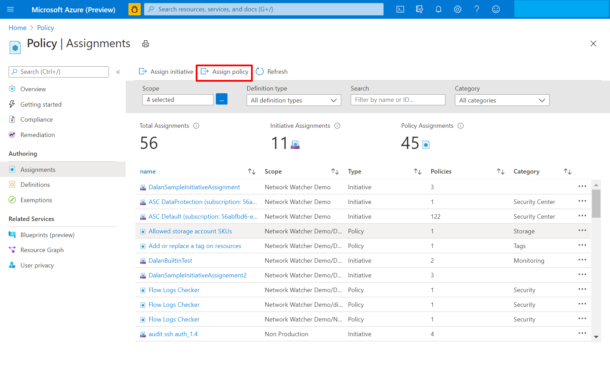
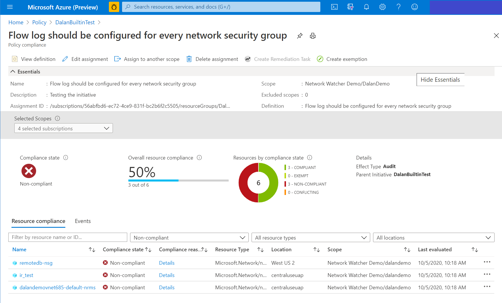
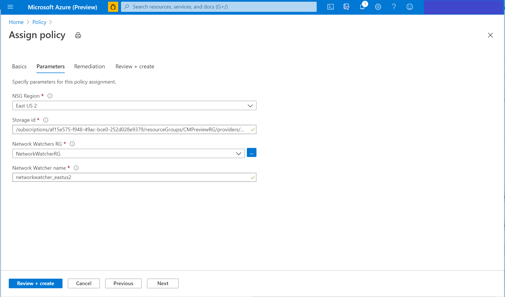
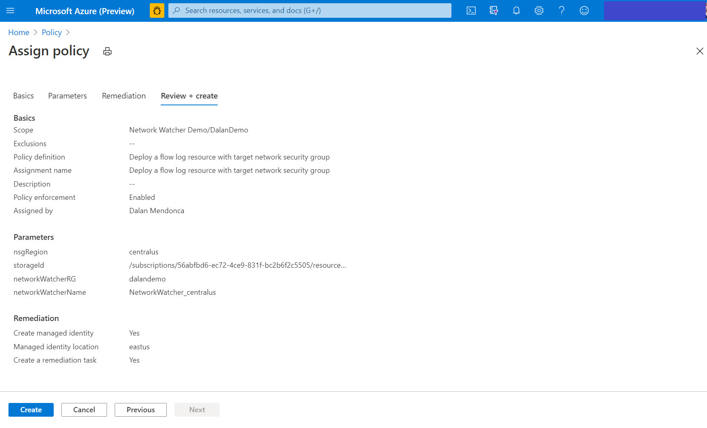

---

title: QuickStart - Deploy and manage NSG Flow Logs using Azure Policy 
titleSuffix: Azure Network Watcher
description: This article explains how to use the built-in policies to manage the deployment of NSG flow logs 
services: network-watcher
documentationcenter: na
author: damendo

ms.service: network-watcher
ms.topic: article
ms.tgt_pltfrm: na
ms.workload:  infrastructure-services
ms.date: 01/07/2021
ms.author: damendo

---

# QuickStart: Deploy and manage NSG Flow Logs using Azure Policy 

## Overview

Azure Policy helps to enforce organizational standards and to assess compliance at scale. Common use cases for Azure Policy include implementing governance for resource consistency, regulatory compliance, security, cost, and management. In this article, we will use two built-in policies available for NSG Flow Logs to manage your flow logs setup. The first policy  flags any NSGs without flow logs enabled. The second policy automatically deploys Flow logs for NSGs without Flow logs enabled. 

If you are creating an Azure Policy definition for the first time, you can read through: 
- [Azure Policy overview](../governance/policy/overview.md) 
- [Tutorial for creating an Azure Policy assignment](../governance/policy/assign-policy-portal.md#create-a-policy-assignment).

## Locate the policies

1. Go to the Azure portal – [portal.azure.com](https://portal.azure.com) 

Navigate to the Azure Policy page by searching for Policy in the top search bar 

2. Head over to the **Assignments** tab from the left pane

3. Click on **Assign Policy** button 

4. Click the three dots menu under "Policy Definitions" to see available policies

5. Use the Type filter and choose "Built-in". Then search for "Flow log"

You should see the two built-in policies for Flow logs

6. Choose the policy you want to assign

- *"Flow log should be configured for every network security group"* is the audit policy that flags non-compliant NSGs, that is NSGs without Flow logging enabled
- *"Deploy a flow log resource with target network security group"* is the policy with a deployment action, it enables Flow logs on all NSGs without Flow logs

There are separate instructions for each policy below.  

## Audit Policy 

### How the policy works

The policy checks all existing ARM objects of type “Microsoft.Network/networkSecurityGroups”, that is it looks at all NSGs in a given scope, and checks for the existence of linked Flow logs via the Flow Logs property of the NSG. If the property does not exist, the NSG is flagged.

If you want to see the full definition of the policy, you can visit the [Definitions tab](https://portal.azure.com/#blade/Microsoft_Azure_Policy/PolicyMenuBlade/Definitions) and search for "Flow logs" to find the policy

### Assignment

1. Fill in your policy details

- Scope: A subscription is a common choice, you can also choose a management group or resource group as relevant to you.  
- Policy Definition: Should be chosen as shown in the "Locate the policies" section.
- AssignmentName: Choose a descriptive name 

2. Click on "Review + Create" to review your assignment

The policy does not require any parameters. As you are assigning an audit policy, you do not need to fill in the details in the "Remediation" tab.  

### Results

To check the results, open the Compliance tab and search for the name of your Assignment.
You should see something similar to the following screenshot once your policy runs. In case your policy hasn't run, wait for some time. 

## Deploy-If-not-exists Policy 

### Policy Structure

The policy checks all existing ARM objects of type “Microsoft.Network/networkSecurityGroups”, that is it looks at all NSGs in a given scope, and checks for the existence of linked Flow logs via the Flow Logs property of the NSG. If the property does not exist, the policy deploys a Flow log. 

If you want to see the full definition of the policy, you can visit the [Definitions tab](https://portal.azure.com/#blade/Microsoft_Azure_Policy/PolicyMenuBlade/Definitions) and search for "Flow logs" to find the policy. 

### Assignment

1. Fill in your policy details

- Scope: A subscription is a common choice, you can also choose a management group or resource group as relevant to you.  
- Policy Definition: Should be chosen as shown in the "Locate the policies" section.
- AssignmentName: Choose a descriptive name 

2. Add policy parameters 

The Network Watcher service is a regional service. These parameters allow the policy action of deploying flow logs to be executed. 
- NSG Region: Azure regions at which the policy is targeted
- Storage ID: Full resource ID of the storage account. Note: This storage account should be in the same region as the NSG. 
- Network Watchers RG: Name of the resource group containing your Network Watcher resource. If you have not renamed it, you can enter `NetworkWatcherRG` which is the default.
- Network Watcher name: Name of the regional network watcher service. Format: NetworkWatcher_RegionName. Example: NetworkWatcher_centralus. See the full list.

3. Add Remediation details

- Check mark on **Create Remediation task** if you want the policy to affect existing resources 
- **Create a Managed Identity** should be already checked
- Select the same location as previous for your Managed Identity 
- You will need Contributor or Owner permission to use this policy. If you have these permissions, you should not see any errors.

 

4. Click on "Review + Create" to review your assignment
You should see something similar to the following screenshot.

 

### Results

To check the results, open the Compliance tab and search for the name of your Assignment.
You should see something like the following screenshot once your policy. In case your policy hasn't run, wait for some time.

  

## Next steps 

-	Learn about [Traffic Analytics Built-in Policies](./traffic-analytics-policy-portal.md)
-	Use this [tutorial](./quickstart-configure-network-security-group-flow-logs-from-arm-template.md) Go deeper by using ARM templates to deploy Flow Logs and Traffic Analytics.
-	Learn more about [Network Watcher](./index.yml)