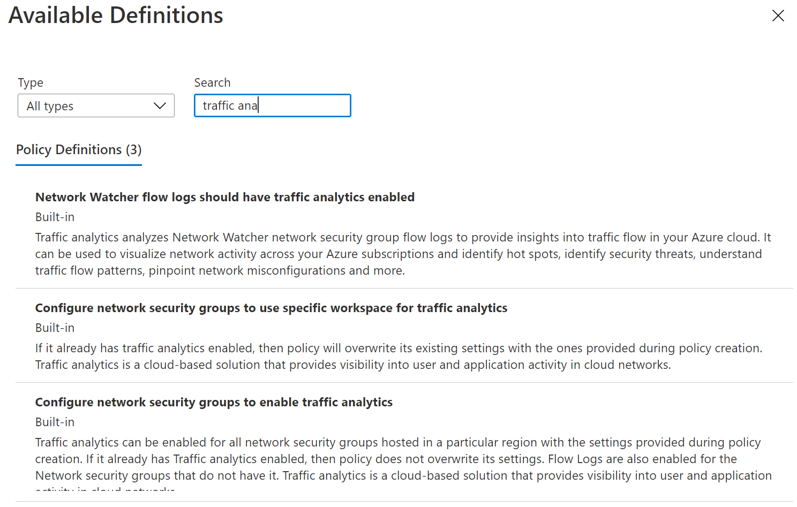
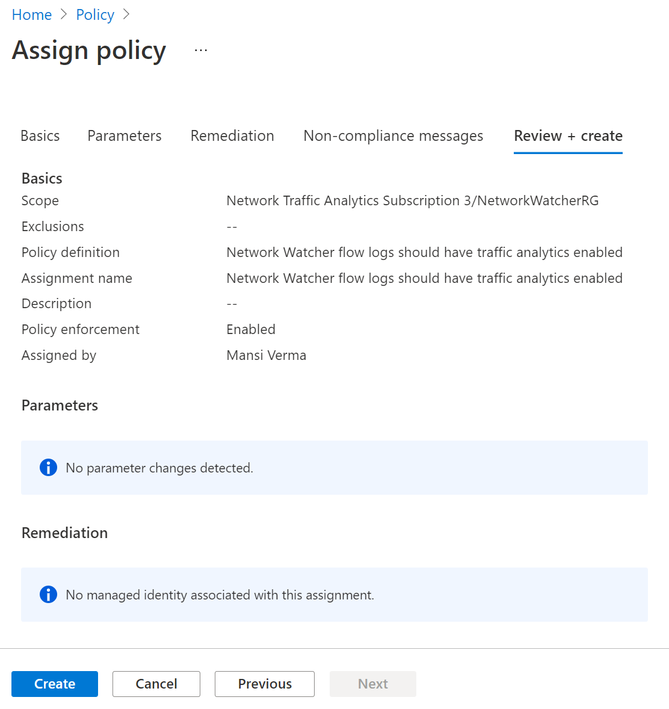
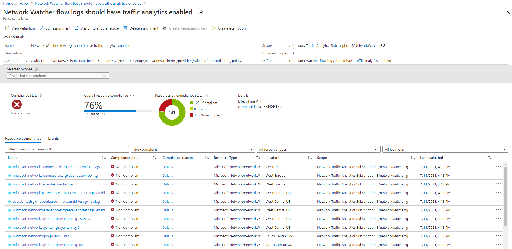
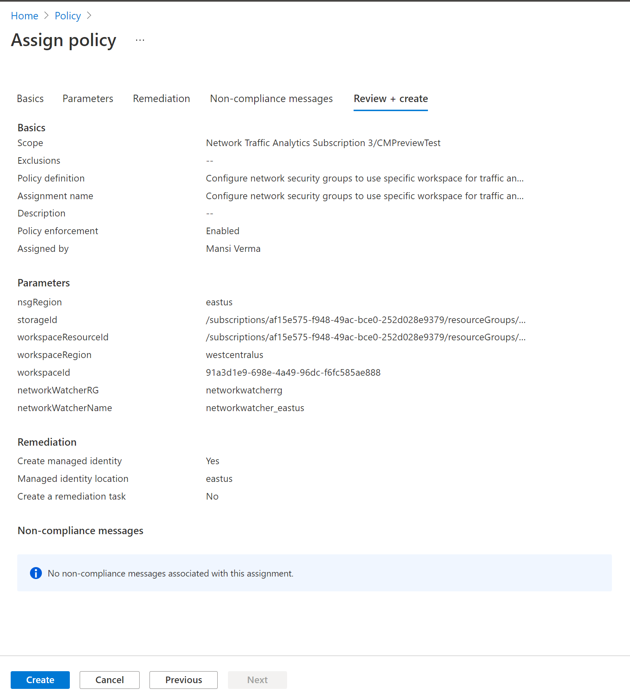
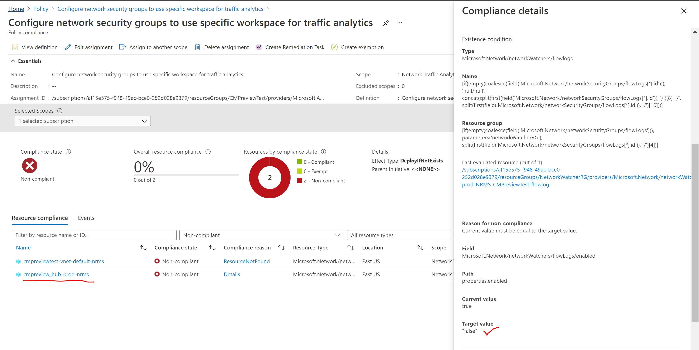

---

title: Deploy and manage Traffic Analytics using Azure Policy 
titleSuffix: Azure Network Watcher
description: This article explains how to use the built-in policies to manage the deployment of Traffic Analytics 
services: network-watcher
documentationcenter: na
author: moagra

ms.service: network-watcher
ms.devlang: na
ms.topic: article
ms.tgt_pltfrm: na
ms.workload:  infrastructure-services
ms.date: 07/11/2021
ms.author: moagra

---

# Deploy and manage Traffic Analytics using Azure Policy 

Azure Policy helps to enforce organizational standards and to assess compliance at-scale. Common use cases for Azure Policy include implementing governance for resource consistency, regulatory compliance, security, cost, and management. In this article, we will cover three built-in policies available for [Traffic Analytics](./traffic-analytics.md) to manage your setup.

If you are creating an Azure policy for the first time, you can read through: 
- [Azure Policy overview](../governance/policy/overview.md) 
- [Tutorial for creating policy](../governance/policy/assign-policy-portal.md#create-a-policy-assignment).

## Locate the policies
1. Go to the Azure portal – [portal.azure.com](https://portal.azure.com) 

Navigate to Azure Policy page by searching for Policy in the top search bar 

2. Head over to the **Assignments** tab from the left pane

3. Click on **Assign Policy** button 

4. Click the three dots menu under "Policy Definitions" to see available policies

5. Use the Type filter and choose "Built-in". Then search for "traffic analytics "

You should see the three built-in policies

6. Choose the policy you want to assign

- *"Network Watcher flow logs should have traffic analytics enabled"* is the audit policy that flags non-compliant flow logs, that is flow logs without traffic analytics enabled
- *"Configure network security groups to use specific workspace for traffic analytics"* and *"Configure network security groups to enable Traffic Analytics"* are the policies with a deployment action. They enable traffic analytics on all the NSGs overwriting/not overwriting already configured settings depending on the policy enabled.

There are separate instructions for each policy below.  

## Audit Policy 

### Network Watcher flow logs should have traffic analytics enabled

The policy audits all existing Azure Resource Manager objects of type "Microsoft.Network/networkWatchers/flowLogs" and checks if Traffic Analytics is enabled via the "networkWatcherFlowAnalyticsConfiguration.enabled" property of the flow logs resource. It flags the flow logs resource which have the property set to false.

If you want to see the full definition of the policy, you can visit the [Definitions tab](https://ms.portal.azure.com/#blade/Microsoft_Azure_Policy/PolicyMenuBlade/Definitions) and search for "traffic analytics" to find the policy

### Assignment

1. Fill in your policy details

- Scope: It can be a subscription or a resource group. In latter case, select resource group that contains flow logs resource (and not network security group)
- Policy Definition: Should be chosen as shown in the "Locate the policies" section.
- AssignmentName: Choose a descriptive name 

2. Click on "Review + Create" to review your assignment

The policy does not require any parameters. As you are assigning an audit policy, you do not need to fill the details in the "Remediation" tab.  

### Results

To check the results, open the Compliance tab and search for the name of your Assignment.
You should see something similar to the following screenshot once your policy runs. In case your policy hasn't run, wait for some time. 

## Deploy-If-not-exists Policy 

### Configure network security groups to use specific workspace for traffic analytics 

It flags the NSG that do not have Traffic Analytics enabled. It means that for the flagged NSG, either the corresponding flow logs resource does not exist or flow logs resource exist but traffic analytics is not enabled on it. You can create Remediation task if you want the policy to affect existing resources.
Network Watcher is a regional service so this policy will apply to NSGs belonging to particular region only in the selected scope. (For a different region, create another policy assignment.)
 
Remediation can be assigned while assigning policy or after policy is assigned and evaluated. Remediation will enable Traffic Analytics on all the flagged resources with the provided parameters. Note that if an NSG already has flow Logs enabled into a particular storage ID but it does not have Traffic Analytics enabled, then remediation will enable Traffic Analytics on this NSG with the provided parameters. If for the flagged NSG, the storage ID provided in the parameters is different from the one already enabled for flow logs, then the latter gets overwritten with the provided storage ID in the remediation task. If you don't want to overwrite, use policy *"Configure network security groups to enable Traffic Analytics"* described below.

If you want to see the full definition of the policy, you can visit the [Definitions tab](https://ms.portal.azure.com/#blade/Microsoft_Azure_Policy/PolicyMenuBlade/Definitions) and search for "Traffic Analytics" to find the policy. 

### Configure network security groups to enable Traffic Analytics

It is same as the above policy except that during remediation, it does not overwrite flow logs settings on the flagged NSGs that have flow logs enabled but Traffic Analytics disabled with the parameter provided in the policy assignment.

### Assignment

1. Fill in your policy details

- Scope: It can be a subscription or a resource group  
- Policy Definition: Should be chosen as shown in the "Locate the policies" section.
- AssignmentName: Choose a descriptive name 

2. Add policy parameters 

- NSG Region: Azure regions at which the policy is targeted
- Storage ID: Full resource ID of the storage account. This storage account should be in the same region as the NSG.
- Network Watchers RG: Name of the resource group containing your Network Watcher resource. If you have not renamed it, you can enter 'NetworkWatcherRG' which is the default.
- Network Watcher name: Name of the regional network watcher service. Format: NetworkWatcher_RegionName. Example: NetworkWatcher_centralus.
- Workspace resource ID: Resource ID of the workspace where Traffic Analytics has to be enabled. Format is "/subscriptions/<SubscriptionID>/resourceGroups/<ResouceGroupName>/providers/Microsoft.Storage/storageAccounts/<StorageAccountName>"
- WorkspaceID: Workspace guid
- WorkspaceRegion: Region of the workspace (note that it need not be same as the region of NSG)
- TimeInterval: Frequency at which processed logs will be pushed into workspace. Currently allowed values are 60 mins and 10 mins. Default value is 60 mins.
- Effect: DeployIfNotExists (already assigned value)

3. Add Remediation details

- Check mark on *"Create Remediation task"* if you want the policy to affect existing resources
- *"Create a Managed Identity"* should be already checked
- Selected the same location as previous for your Managed Identity
- You will need Contributor or Owner permissions to use this policy. If you have these permissions, you should not see any errors.

4. Click on "Review + Create" to review your assignment
You should see something similar to the following screenshot.

 

### Results

To check the results, open the Compliance tab and search for the name of your Assignment.
You should see something like following screenshot once your policy. In case your policy hasn't run, wait for some time.

  

### Remediation

To manually remediate, select *"Create Remediation task"* on the compliance tab shown above

 

## Troubleshooting

### Remediation task fails with "PolicyAuthorizationFailed" error code.

Sample error example "The policy assignment '/subscriptions/123ds-fdf3657-fdjjjskms638/resourceGroups/DummyRG/providers/Microsoft.Authorization/policyAssignments/b67334e8770a4afc92e7a929/' resource identity does not have the necessary permissions to create deployment."

In such scenarios, the assignment's managed identity must be manually granted access. Go to the appropriate subscription/resource group  (containing the resources provided in the policy parameters) and grant contributor access to the managed identity create by the policy. In the above example, "b67334e8770a4afc92e7a929" has to be as the contributor.

## Next steps 

-	Learn about [NSG Flow Logs Built-in Policies](./nsg-flow-logs-policy-portal.md)
-	Learn more about [Traffic Analytics](./traffic-analytics.md)
-	Learn more about [Network Watcher](./index.yml)
