# Traffic Analytics

Traffic Analytics is a cloud-based solution that provides visibility into user and application activity in cloud networks. Traffic analytics analyzes Network Watcher network security group (NSG) flow logs to provide insights into traffic flow in your Azure cloud. With traffic analytics, you can:

- Visualize network activity across your Azure subscriptions and identify hot spots.
- Identify security threats to, and secure your network, with information such as open-ports, applications attempting internet access, and virtual machines (VM) connecting to rogue networks.
- Understand traffic flow patterns across Azure regions and the internet to optimize your network deployment for performance and capacity.
- Pinpoint network misconfigurations leading to failed connections in your network.

> [!NOTE]
> Traffic Analytics now supports collecting NSG Flow Logs data at a higher frequency of 10 mins

[!INCLUDE [updated-for-az](../../includes/updated-for-az.md)]

## Why traffic analytics?

It is vital to monitor, manage, and know your own network for uncompromised security, compliance, and performance. Knowing your own environment is of paramount importance to protect and optimize it. You often need to know the current state of the network, who is connecting, where they're connecting from, which ports are open to the internet, expected network behavior, irregular network behavior, and sudden rises in traffic.

Cloud networks are different than on-premises enterprise networks, where you have netflow or equivalent protocol capable routers and switches, which provide the capability to collect IP network traffic as it enters or exits a network interface. By analyzing traffic flow data, you can build an analysis of network traffic flow and volume.

Azure virtual networks have NSG flow logs, which provide you information about ingress and egress IP traffic through a Network Security Group associated to individual network interfaces, VMs, or subnets. By analyzing raw NSG flow logs, and inserting intelligence of security, topology, and geography, traffic analytics can provide you with insights into traffic flow in your environment. Traffic Analytics provides information such as most communicating hosts, most communicating application protocols, most conversing host pairs, allowed/blocked traffic, inbound/outbound traffic, open internet ports, most blocking rules, traffic distribution per Azure datacenter, virtual network, subnets, or, rogue networks.

## Key components

- **Network security group (NSG)**: Contains a list of security rules that allow or deny network traffic to resources connected to an Azure Virtual Network. NSGs can be associated to subnets, individual VMs (classic), or individual network interfaces (NIC) attached to VMs (Resource Manager). For more information, see [Network security group overview](../virtual-network/network-security-groups-overview.md?toc=%2fazure%2fnetwork-watcher%2ftoc.json).
- **Network security group (NSG) flow logs**: Allow you to view information about ingress and egress IP traffic through a network security group. NSG flow logs are written in json format and show outbound and inbound flows on a per rule basis, the NIC the flow applies to, five-tuple information about the flow (source/destination IP address, source/destination port, and protocol), and if the traffic was allowed or denied. For more information about NSG flow logs, see [NSG flow logs](network-watcher-nsg-flow-logging-overview.md).
- **Log Analytics**: An Azure service that collects monitoring data and stores the data in a central repository. This data can include events, performance data, or custom data provided through the Azure API. Once collected, the data is available for alerting, analysis, and export. Monitoring applications such as network performance monitor and traffic analytics are built using Azure Monitor logs as a foundation. For more information, see [Azure Monitor logs](../azure-monitor/logs/log-query-overview.md?toc=%2fazure%2fnetwork-watcher%2ftoc.json).
- **Log Analytics workspace**: An instance of Azure Monitor logs, where the data pertaining to an Azure account, is stored. For more information about Log Analytics workspaces, see [Create a Log Analytics workspace](../azure-monitor/logs/quick-create-workspace.md?toc=%2fazure%2fnetwork-watcher%2ftoc.json).
- **Network Watcher**: A regional service that enables you to monitor and diagnose conditions at a network scenario level in Azure. You can turn NSG flow logs on and off with Network Watcher. For more information, see [Network Watcher](network-watcher-monitoring-overview.md).

## How traffic analytics works

Traffic analytics examines the raw NSG flow logs and captures reduced logs by aggregating common flows among the same source IP address, destination IP address, destination port, and protocol. For example, Host 1 (IP address: 10.10.10.10) communicating to Host 2 (IP address: 10.10.20.10), 100 times over a period of 1 hour using port (for example, 80) and protocol (for example, http). The reduced log has one entry, that Host 1 & Host 2 communicated 100 times over a period of 1 hour using port *80* and protocol *HTTP*, instead of having 100 entries. Reduced logs are enhanced with geography, security, and topology information, and then stored in a Log Analytics workspace. The following picture shows the data flow:


## Supported regions: NSG 

You can use traffic analytics for NSGs in any of the following supported regions:
:::row:::
   :::column span="":::
      Australia Central  
      Australia East  
      Australia Southeast  
      Brazil South  
      Canada Central  
      Canada East  
      Central India  
      Central US  
      China East 2  
	  China North   
	  China North 2 	  
   :::column-end:::
   :::column span="":::
      East Asia  
	  East US  
      East US 2  
      East US 2 EUAP  
      France Central  
      Germany West Central  
	  Japan East  
      Japan West  
      Korea Central  
      Korea South  
	  North Central US 	  
   :::column-end:::
   :::column span="":::
      North Europe  
	  South Africa North  
      South Central US  
      South India  
      Southeast Asia  
      Switzerland North  
      Switzerland West  
	  UAE North  
	  UK South  
      UK West     
	  USGov Arizona
   :::column-end:::
   :::column span="":::
      USGov Texas  
	  USGov Virginia  
      USNat East  
      USNat West  
      USSec East  
      USSec West  
      West Central US  
      West Europe  
      West US  
      West US 2  
   :::column-end:::
:::row-end:::

## Supported regions: Log Analytics Workspaces

The Log Analytics workspace must exist in the following regions:
:::row:::
   :::column span="":::
      Australia Central  
      Australia East  
      Australia Southeast  
      Brazil South  
	  Brazil Southeast  
      Canada Central  
      Central India  
      Central US  
      China East 2      
      East Asia  
   :::column-end:::
   :::column span="":::
      East US  
	  East US 2  
      East US 2 EUAP  
      France Central  
	  Germany West Central  
	  Japan East  
	  Japan West  
	  Korea Central  
      North Central US  
      North Europe  
   :::column-end:::
   :::column span="":::
      Norway East  
      South Africa North  
      South Central US  
	  Southeast Asia  
      Switzerland North  
      Switzerland West  
      UAE Central  
	  UAE North  
	  UK South  
      UK West      
   :::column-end:::
   :::column span="":::
      USGov Arizona  
      USGov Virginia  
      USNat East  
	  USNat West   
	  USSec East  
      USSec West  
      West Central US  
      West Europe  
      West US  
      West US 2  
   :::column-end:::
:::row-end:::

> [!NOTE]
> If NSGs support a region but the log analytics workspace does not support that region for traffic analytics as per above lists, then you can use log analytics workspace of any other supported region as a workaround.

## Prerequisites

### User access requirements

Your account must be a member of one of the following [Azure built-in roles](../role-based-access-control/built-in-roles.md?toc=%2fazure%2fnetwork-watcher%2ftoc.json):

|Deployment model   | Role                   |
|---------          |---------               |
|Resource Manager   | Owner                  |
|                   | Contributor            |
|                   | Reader                 |
|                   | Network Contributor    |

If your account is not assigned to one of the built-in roles, it must be assigned to a [custom role](../role-based-access-control/custom-roles.md?toc=%2fazure%2fnetwork-watcher%2ftoc.json) that is assigned the following actions, at the subscription level:

- "Microsoft.Network/applicationGateways/read"
- "Microsoft.Network/connections/read"
- "Microsoft.Network/loadBalancers/read"
- "Microsoft.Network/localNetworkGateways/read"
- "Microsoft.Network/networkInterfaces/read"
- "Microsoft.Network/networkSecurityGroups/read"
- "Microsoft.Network/publicIPAddresses/read"
- "Microsoft.Network/routeTables/read"
- "Microsoft.Network/virtualNetworkGateways/read"
- "Microsoft.Network/virtualNetworks/read"
- "Microsoft.Network/expressRouteCircuits/read"

For information on how to check user access permissions, see [Traffic analytics FAQ](traffic-analytics-faq.md).

### Enable Network Watcher

To analyze traffic, you need to have an existing network watcher, or [enable a network watcher](network-watcher-create.md) in each region that you have NSGs that you want to analyze traffic for. Traffic analytics can be enabled for NSGs hosted in any of the [supported regions](#supported-regions-nsg).

### Select a network security group

Before enabling NSG flow logging, you must have a network security group to log flows for. If you don't have a network security group, see [Create a network security group](../virtual-network/manage-network-security-group.md#create-a-network-security-group) to create one.

In Azure portal, go to **Network watcher**, and then select **NSG flow logs**. Select the network security group that you want to enable an NSG flow log for, as shown in the following picture:

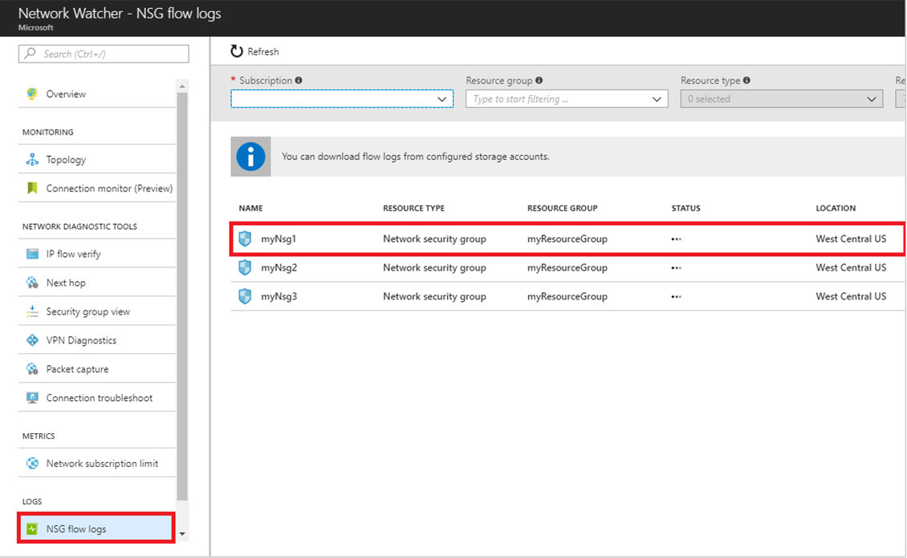

If you try to enable traffic analytics for an NSG that is hosted in any region other than the [supported regions](#supported-regions-nsg), you receive a "Not found" error.

## Enable flow log settings

Before enabling flow log settings, you must complete the following tasks:

Register the Azure Insights provider, if it's not already registered for your subscription:

```azurepowershell-interactive
Register-AzResourceProvider -ProviderNamespace Microsoft.Insights
```

If you don't already have an Azure Storage account to store NSG flow logs in, you must create a storage account. You can create a storage account with the command that follows. Before running the command, replace `<replace-with-your-unique-storage-account-name>` with a name that is unique across all Azure locations, between 3-24 characters in length, using only numbers and lower-case letters. You can also change the resource group name, if necessary.

```azurepowershell-interactive
New-AzStorageAccount `
  -Location westcentralus `
  -Name <replace-with-your-unique-storage-account-name> `
  -ResourceGroupName myResourceGroup `
  -SkuName Standard_LRS `
  -Kind StorageV2
```

Select the following options, as shown in the picture:

1. Select *On* for **Status**
2. Select *Version 2* for **Flow Logs version**. Version 2 contains flow-session statistics (Bytes and Packets)
3. Select an existing storage account to store the flow logs in. Ensure that your storage does not have "Data Lake Storage Gen2 Hierarchical Namespace Enabled" set to true.
4. Set **Retention** to the number of days you want to store data for. If you want to store the data forever, set the value to *0*. You incur Azure Storage fees for the storage account. 
5. Select *On* for **Traffic Analytics Status**.
6. Select processing interval. Based on your choice, flow logs will be collected from storage account and processed by Traffic Analytics. You can choose processing interval of every 1 hour or every 10 mins. 
7. Select an existing Log Analytics (OMS) Workspace, or select **Create New Workspace** to create a new one. A Log Analytics workspace is used by Traffic Analytics  to store the aggregated and indexed data that is then used to generate the analytics. If you select an existing workspace, it must exist in one of the [supported regions](#supported-regions-log-analytics-workspaces) and have been upgraded to the new query language. If you do not wish to upgrade an existing workspace, or do not have a workspace in a supported region, create a new one. For more information about query languages, see [Azure Log Analytics upgrade to new log search](../azure-monitor/logs/log-query-overview.md?toc=%2fazure%2fnetwork-watcher%2ftoc.json).

> [!NOTE]
>The log analytics workspace hosting the traffic analytics solution and the NSGs do not have to be in the same region. For example, you may have traffic analytics in a workspace in the West Europe region, while you may have NSGs in East US and West US. Multiple NSGs can be configured in the same workspace.

8. Select **Save**.

    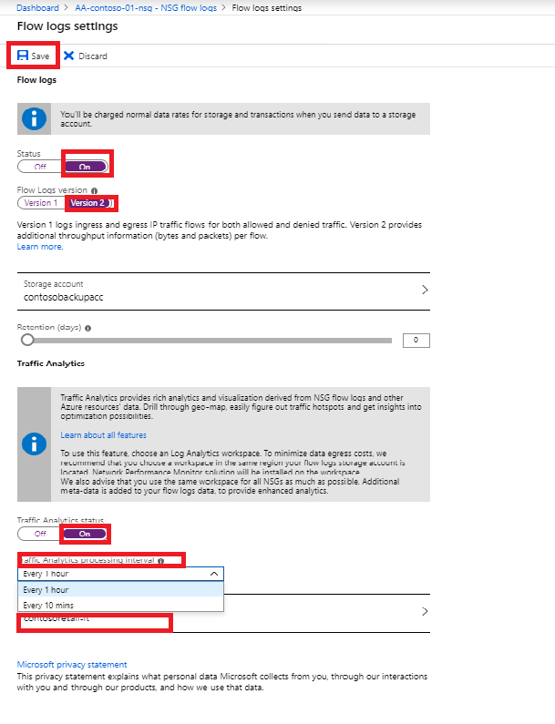

Repeat the previous steps for any other NSGs for which you wish to enable traffic analytics for. Data from flow logs is sent to the workspace, so ensure that the local laws and regulations in your country/region permit data storage in the region where the workspace exists. If you have set different processing intervals for different NSGs, data will be collected at different intervals. For example: You can choose to enable processing interval of 10 mins for critical VNETs and 1 hour for noncritical VNETs.

You can also configure traffic analytics using the [Set-AzNetworkWatcherConfigFlowLog](/powershell/module/az.network/set-aznetworkwatcherconfigflowlog) PowerShell cmdlet in Azure PowerShell. Run `Get-Module -ListAvailable Az` to find your installed version. If you need to upgrade, see [Install Azure PowerShell module](/powershell/azure/install-Az-ps).

## View traffic analytics

To view Traffic Analytics, search for **Network Watcher** in the portal search bar. Once inside Network Watcher, to explore traffic analytics and its capabilities, select **Traffic Analytics** from the left menu. 


The dashboard may take up to 30 minutes to appear the first time because Traffic Analytics must first aggregate enough data for it to derive meaningful insights, before it can generate any reports.

## Usage scenarios

Some of the insights you might want to gain after Traffic Analytics is fully configured, are as follows:

### Find traffic hotspots

**Look for**

- Which hosts, subnets, and virtual networks are sending or receiving the most traffic, traversing maximum malicious traffic and blocking significant flows?
    - Check comparative chart for host, subnet, and virtual network. Understanding which hosts, subnets, and virtual networks are sending or receiving the most traffic can help you identify the hosts that are processing the most traffic, and whether the traffic distribution is done properly.
    - You can evaluate if the volume of traffic is appropriate for a host. Is the volume of traffic normal behavior, or does it merit further investigation?
- How much inbound/outbound traffic is there?
    -   Is the host expected to receive more inbound traffic than outbound, or vice-versa?
- Statistics of blocked traffic.
    - Why is a host blocking a significant volume of benign traffic? This behavior requires further investigation and probably optimization of configuration
- Statistics of malicious allowed/blocked traffic
  - Why is a host receiving malicious traffic and why are flows from malicious sources allowed? This behavior requires further investigation and probably optimization of configuration.

    Select **See all**, under **Host**, as shown in the following picture:

    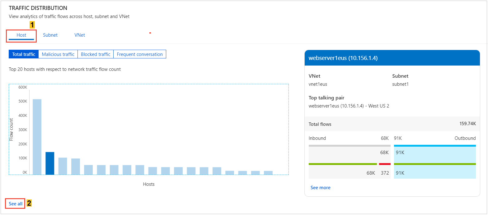

- The following picture shows time trending for the top five talking hosts and the flow-related details (allowed – inbound/outbound and denied - inbound/outbound flows) for a host:

    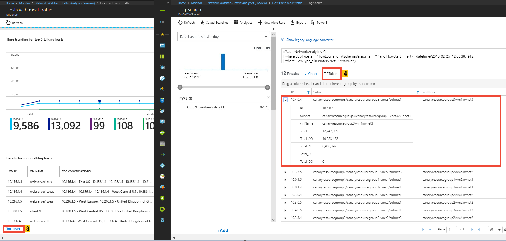

**Look for**

- Which are the most conversing host pairs?
    - Expected behavior like front-end or back-end communication or irregular behavior, like back-end internet traffic.
- Statistics of allowed/blocked traffic
    - Why a host is allowing or blocking significant traffic volume
- Most frequently used application protocol among most conversing host pairs:
    - Are these applications allowed on this network?
    - Are the applications configured properly? Are they using the appropriate protocol for communication? Select **See all** under **Frequent conversation**, as show in the following picture:

        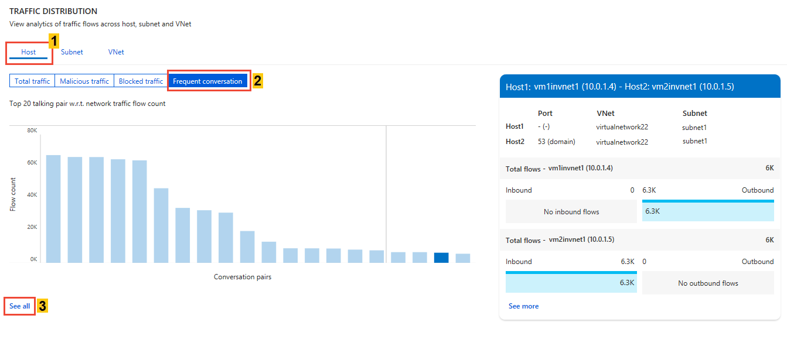

- The following picture shows time trending for the top five conversations and the flow-related details such as allowed and denied inbound and outbound flows for a conversation pair:

    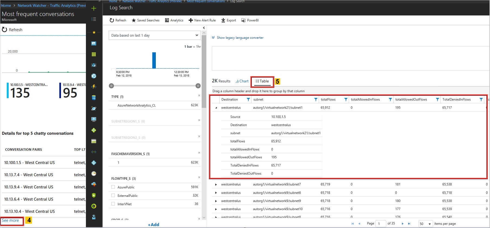

**Look for**

- Which application protocol is most used in your environment, and which conversing host pairs are using the application protocol the most?
    - Are these applications allowed on this network?
    - Are the applications configured properly? Are they using the appropriate protocol for communication? Expected behavior is common ports such as 80 and 443. For standard communication, if any unusual ports are displayed, they might require a configuration change. Select **See all** under **Application port**, in the following picture:

        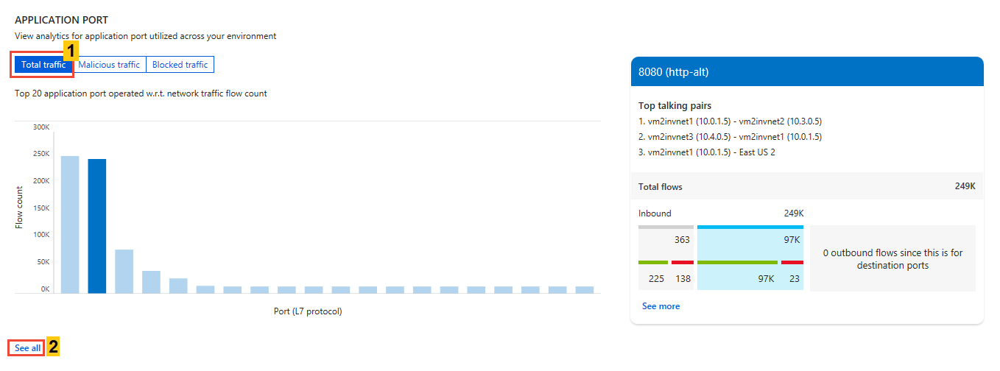

- The following pictures show time trending for the top five L7 protocols and the flow-related details (for example, allowed and denied flows) for an L7 protocol:

    

    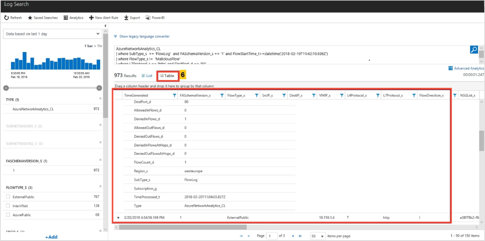

**Look for**

- Capacity utilization trends of a VPN gateway in your environment.
    - Each VPN SKU allows a certain amount of bandwidth. Are the VPN gateways underutilized?
    - Are your gateways reaching capacity? Should you upgrade to the next higher SKU?
- Which are the most conversing hosts, via which VPN gateway, over which port?
    - Is this pattern normal? Select **See all** under **VPN gateway**, as shown in the following picture:

        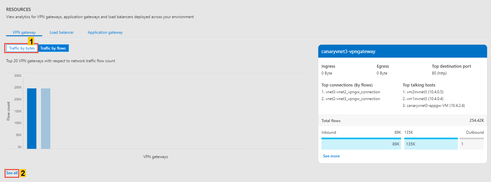

- The following picture shows time trending for capacity utilization of an Azure VPN Gateway and the flow-related details (such as allowed flows and ports):

    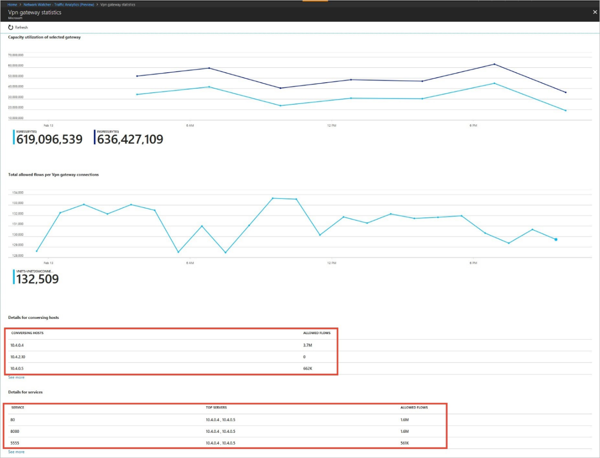

### Visualize traffic distribution by geography

**Look for**

- Traffic distribution per data center such as top sources of traffic to a datacenter, top rogue networks conversing with the data center, and top conversing application protocols.
  - If you observe more load on a data center, you can plan for efficient traffic distribution.
  - If rogue networks are conversing in the data center, then correct NSG rules to block them.

    Select **View map** under **Your environment**, as shown in the following picture:

    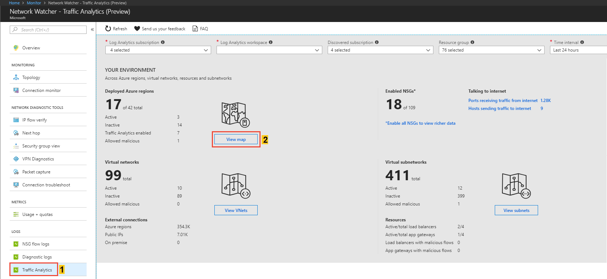

- The geo-map shows the top ribbon for selection of parameters such as data centers (Deployed/No-deployment/Active/Inactive/Traffic Analytics Enabled/Traffic Analytics Not Enabled) and countries/regions contributing Benign/Malicious traffic to the active deployment:

    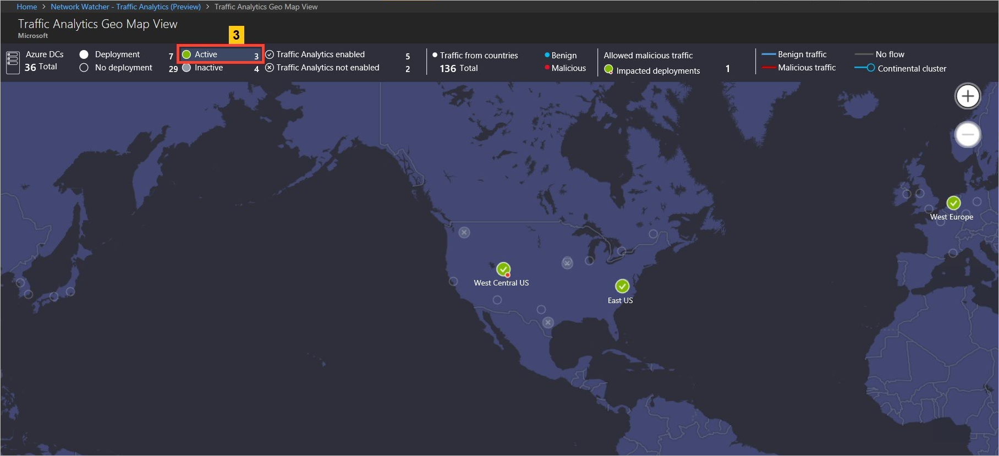

- The geo-map shows the traffic distribution to a data center from countries/regions and continents communicating to it in blue (Benign traffic) and red (malicious traffic) colored lines:

    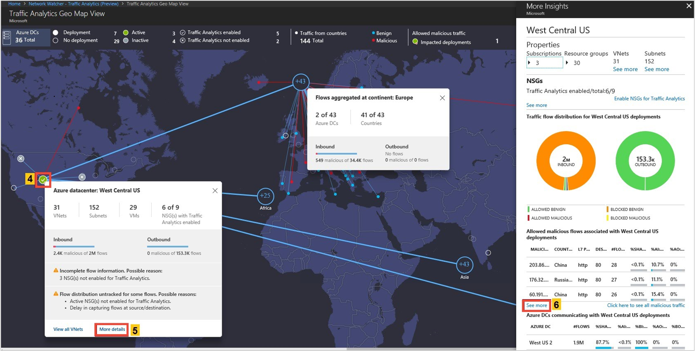

    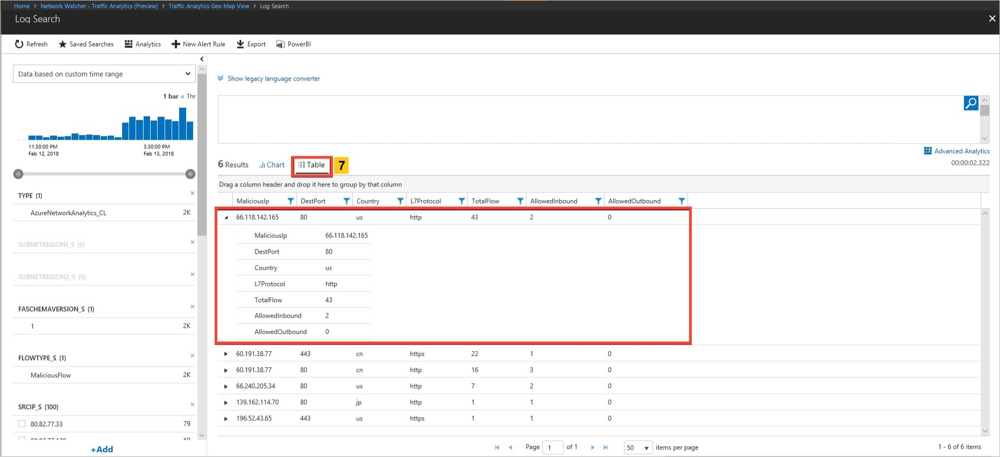

### Visualize traffic distribution by virtual networks

**Look for**

- Traffic distribution per virtual network, topology, top sources of traffic to the virtual network, top rogue networks conversing to the virtual network, and top conversing application protocols.
  - Knowing which virtual network is conversing to which virtual network. If the conversation is not expected, it can be corrected.
  - If rogue networks are conversing with a virtual network, you can correct NSG rules to block the rogue networks.
 
    Select **View VNets** under **Your environment**, as shown in the following picture:

    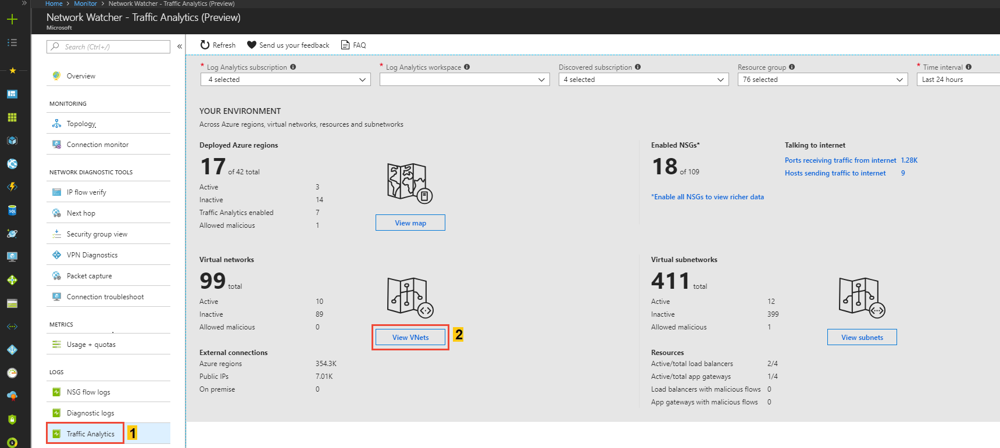

- The Virtual Network Topology shows the top ribbon for selection of parameters like a virtual network's (Inter virtual network Connections/Active/Inactive), External Connections, Active Flows, and Malicious flows of the virtual network.
- You can filter the Virtual Network Topology based on subscriptions, workspaces, resource groups and time interval. Additional filters that help you understand the flow are:
  Flow Type (InterVNet, IntraVNET, and so on), Flow Direction (Inbound, Outbound), Flow Status (Allowed, Blocked), VNETs (Targeted and Connected), Connection Type (Peering or Gateway - P2S and S2S), and NSG. Use these filters to focus on VNets that you want to examine in detail.
- The Virtual Network Topology shows the traffic distribution to a virtual network with regards to flows (Allowed/Blocked/Inbound/Outbound/Benign/Malicious), application protocol, and network security groups, for example:

    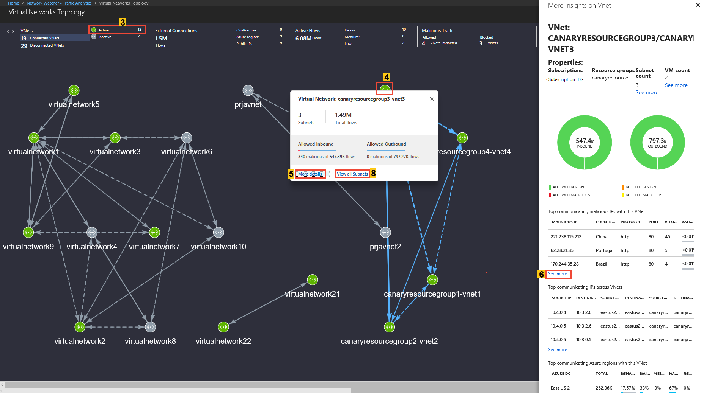
    
    

    

**Look for**

- Traffic distribution per subnet, topology, top sources of traffic to the subnet, top rogue networks conversing to the subnet, and top conversing application protocols.
    - Knowing which subnet is conversing to which subnet. If you see unexpected conversations, you can correct your configuration.
    - If rogue networks are conversing with a subnet, you are able to correct it by configuring NSG rules to block the rogue networks.
- The Subnets Topology shows the top ribbon for selection of parameters such as Active/Inactive subnet, External Connections, Active Flows, and Malicious flows of the subnet.
- The Subnet Topology shows the traffic distribution to a virtual network with regards to flows (Allowed/Blocked/Inbound/Outbound/Benign/Malicious), application protocol, and NSGs, for example:

    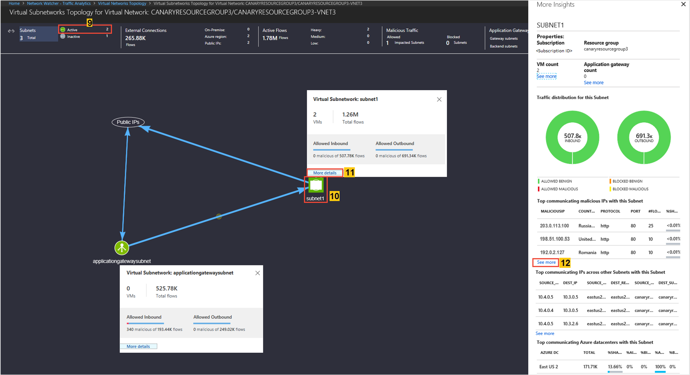

**Look for**

Traffic distribution per Application gateway & Load Balancer, topology, top sources of traffic, top rogue networks conversing to the Application gateway & Load Balancer, and top conversing application protocols. 
    
 - Knowing which subnet is conversing to which Application gateway or Load Balancer. If you observe unexpected conversations, you can correct your configuration.
 - If rogue networks are conversing with an Application gateway or Load Balancer, you are able to correct it by configuring NSG rules to block the rogue networks. 

    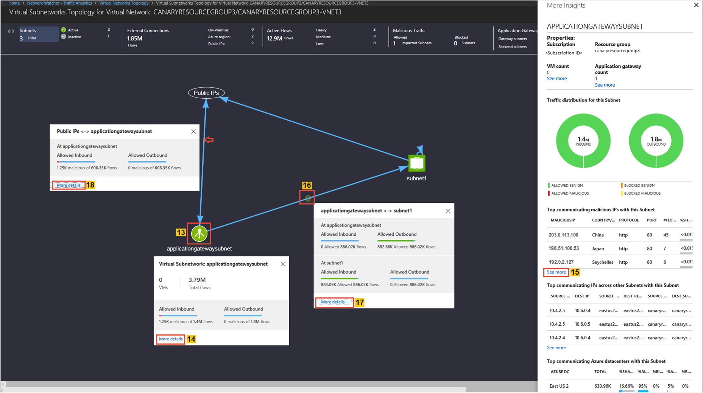

### View ports and virtual machines receiving traffic from the internet

**Look for**

- Which open ports are conversing over the internet?
  - If unexpected ports are found open, you can correct your configuration:

    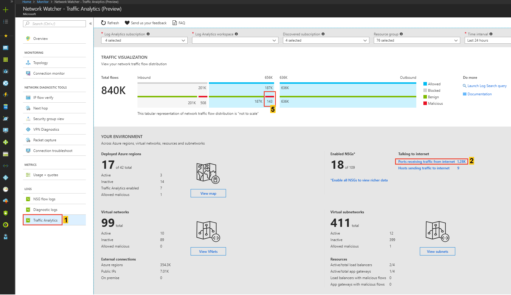

    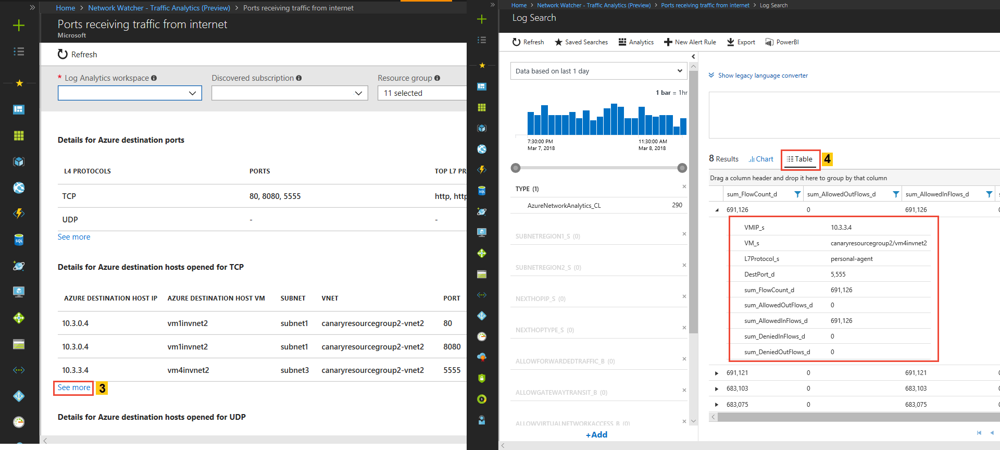

**Look for**

Do you have malicious traffic in your environment? Where is it originating from? Where is it destined to?

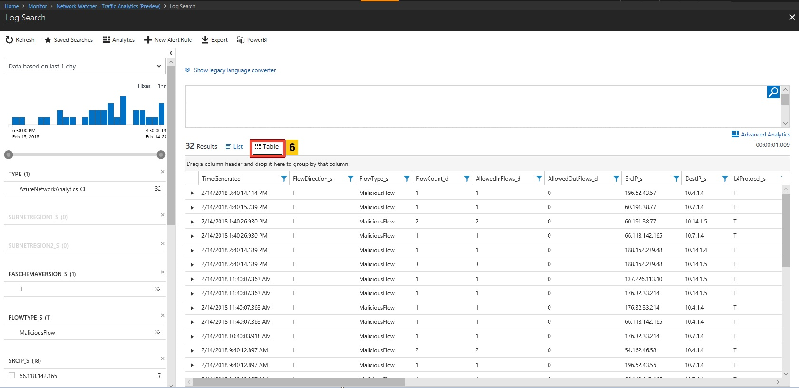


### Visualize the trends in NSG/NSG rules hits

**Look for**

- Which NSG/NSG rules have the most hits in comparative chart with flows distribution?
- What are the top source and destination conversation pairs per NSG/NSG rules?

    

- The following pictures show time trending for hits of NSG rules and source-destination flow details for a network security group:

  - Quickly detect which NSGs and NSG rules are traversing malicious flows and which are the top malicious IP addresses accessing your cloud environment
  - Identify which NSG/NSG rules are allowing/blocking significant network traffic
  - Select top filters for granular inspection of an NSG or NSG rules

    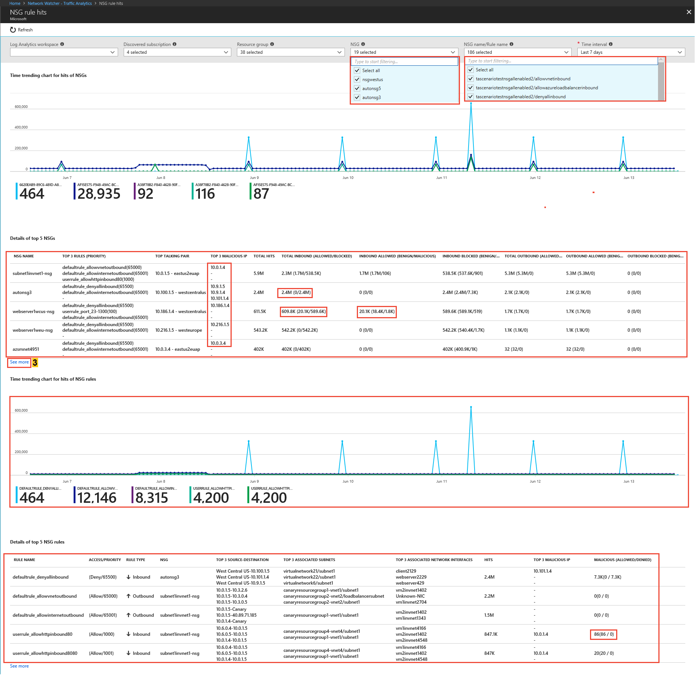

    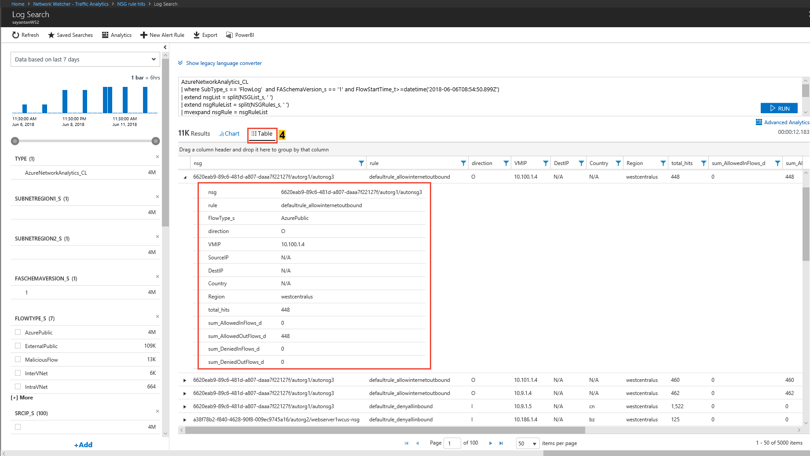

## Frequently asked questions

To get answers to frequently asked questions, see [Traffic analytics FAQ](traffic-analytics-faq.md).

## Next steps

- To learn how to enable flow logs, see [Enabling NSG flow logging](network-watcher-nsg-flow-logging-portal.md).
- To understand the schema and processing details of Traffic Analytics, see [Traffic analytics schema](traffic-analytics-schema.md).
